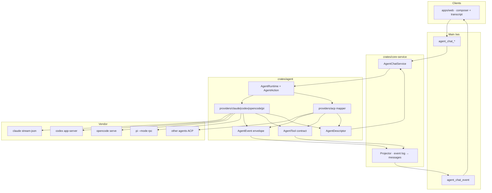

# TECH · APP-068: Agent Chat Architecture Optimize

> Technical Design · HOW. Implements PRD APP-068: Agent Chat Architecture Optimize.

## Scope summary

Tighten the APP-067 host so **descriptor**, **runtime**, **events**, and **tools** are Atmos contracts. Chat’s production path for Claude Code, Codex, OpenCode, and Pi is **native**. ACP remains the adapter for other registry agents. Chat CRUD, file persistence, restore ≠ resume, and `agent_chat_*` actions stay.

Addresses **M1–M16**. N1–N5 deferred. Does not reopen APP-067 M1–M18 product behavior.

**Implementer-depth HOW** is split by slice under [`reference/`](./reference/README.md). This file stays the locked overview. Do not implement a native adapter from this overview alone — use the matching `reference/native-*.md`.

## Decisions locked here

| Fork | Decision |
|------|----------|
| Runtime width | Core: `send`, `cancel`, `close`, `next_event`. Product extras: typed `AgentAction` (`Steer`, `RespondPermission`, `SetConfig`). No method union. |
| Capability encoding | Closed `AgentCapabilities` struct. Not `Vec<String>`. Not ACP `AgentCapabilitiesSnapshot` on the wire. |
| Descriptor | `identity` + `capabilities` + `supported_options` + `current_config`. Catalog fills options before spawn; live session may refresh options/config. |
| Events | Tagged `AgentEvent` (Atmos kinds). Unmapped vendor events are omitted or a single unknown event. No native sidecar on mapped events. |
| Tools | `AgentTool` with `kind` + `params` + `result` only. Mapped tools store Atmos typed fields. Unmapped tools are `other` with vendor params/result as those fields. Never dual-write. `web_search` and `fetch` are first-class. |
| Turn | Host **control epoch** (`turn_id` for send → complete). Persistence SOT is chat files + event log. Messages/parts remain projections. |
| Storage | Keep `~/.atmos/data/agent/chats/` from APP-067. Do not add SQLite chat tables. |
| Action dispatch | `AgentAction` enum. Reject `execute(capability: &str, json)`. |
| Providers this spec | Native adapters for `claude`, `codex`, `opencode`, `pi`. ACP adapter for every other Chat-capable registry agent. Do not wrap TypeScript SDKs. |
| APP-067 wire | Keep `agent_chat_*` action names. Replace tool/meta payloads with descriptor + tool contract. No dual-write of old fields. |
| Old transcripts | **No compatibility.** New jsonl envelope only. No migrator, no remap-on-read, no client fallback for `input`/`output` parts. |
| Crate root leak | Stop re-exporting ACP session types from `crates/agent/src/lib.rs` as the Chat API. |

## Architecture overview

```text
apps/web  composer + tool cards
    │  main /ws  agent_chat_*  (APP-048/049)
    ▼
apps/api  router + DTO map
    ▼
crates/core-service  AgentChatService
    │  persist Atmos events; fold messages
    ▼
crates/agent
    domain/     descriptor, runtime, action, event envelope, tool contract
    catalog/    fills supported_options (unchanged strategies)
    providers/claude/     Claude Code stream-json + control
    providers/codex/      Codex app-server JSON-RPC
    providers/opencode/   OpenCode serve HTTP+SSE
    providers/pi/         Pi --mode rpc JSONL
    providers/acp/        ACP → Atmos (other registry agents)
```

Two *Atmos* transports stay distinct (APP-067):

- **Client ↔ Atmos**: main `/ws`.
- **Atmos ↔ provider**: native vendor wires inside `providers/{claude,codex,opencode,pi}` plus ACP stdio JSON-RPC in `providers/acp`. Never on the web wire.



Rule: **Don't normalize what you don't need.** If Chat has a typed card, persist only those fields. If it does not, persist one `other` tool with vendor params/result and render that. Never store both.

## Reference slices

| Slice | File |
|-------|------|
| Descriptor (M1–M4) | [reference/descriptor.md](./reference/descriptor.md) |
| Runtime + routing (M5) | [reference/runtime.md](./reference/runtime.md) |
| Events (M6) | [reference/events.md](./reference/events.md) |
| Tools (M7–M9, M11) | [reference/tools.md](./reference/tools.md) |
| Persistence (M12) | [reference/persistence.md](./reference/persistence.md) |
| WS DTOs (M14) | [reference/ws-contract.md](./reference/ws-contract.md) |
| Web client (M10) | [reference/web.md](./reference/web.md) |
| ACP adapter | [reference/acp-adapter.md](./reference/acp-adapter.md) |
| Claude Code native | [reference/native-claude.md](./reference/native-claude.md) |
| Codex native | [reference/native-codex.md](./reference/native-codex.md) |
| OpenCode native | [reference/native-opencode.md](./reference/native-opencode.md) |
| Pi native | [reference/native-pi.md](./reference/native-pi.md) |

Index and locked cross-slice rules: [reference/README.md](./reference/README.md).

## Native providers (M15–M16) — overview

Chat must speak each vendor’s **published host protocol from Rust**. The product request’s “Cloud Code” is **Claude Code** (`claude`). Do not embed TypeScript SDKs. Do not route these four through community ACP bridges.

Implementer-depth spawn, framing, method inventories, JSON examples, and fixture pins live in the four `reference/native-*.md` files. Do not implement from this overview alone.

Terminal APP-024 keeps today’s catalog argv. Chat native adapters **override spawn**.

### Provider routing

Canonicalize catalog/ACP aliases **before** the kind match ([acp-adapter.md](./reference/acp-adapter.md)). Exact id after fold — not argv or parser. Custom names like `my-claude` stay ACP.

| Incoming `provider_id` | Chat provider |
|------------------------|---------------|
| `claude`, `claude-code`, `claude_code`, `claude-acp`, `claude-code-acp`, `claude-agent-acp` | `ClaudeNativeProvider` |
| `codex`, `codex-acp` | `CodexNativeProvider` |
| `opencode` | `OpenCodeNativeProvider` |
| `pi`, `pi-acp` | `PiNativeProvider` |
| anything else (`grok`, `gemini`, `cursor`, custom, …) | `AcpAgentProvider` |

`capabilities_for_provider` must use the same canonicalize so pre-spawn `meta.descriptor` steer honesty matches spawn.

`persistence_handle` is the vendor session/thread/session-file id. Atmos `chat_id` stays APP-067’s conversation id. Restore still does not spawn.

### Capability honesty (locked)

<!-- updated: Claude / OpenCode / Grok steer are vendor same-turn inject; Atmos `followup_policy` chooses steer vs `queue.json`. Generic ACP stays Unsupported. -->

| Atmos | Claude Code | Codex | OpenCode | Pi |
|-------|-------------|-------|----------|----|
| send | stdin user NDJSON | `turn/start` | `POST …/prompt_async` | `prompt` |
| cancel | `control_request` `interrupt` | `turn/interrupt` | `POST …/abort` | `abort` |
| steer | stdin user NDJSON (same `running_turn`) | `turn/steer` (`expectedTurnId` = vendor turn id) | `POST …/prompt_async` `delivery:"steer"` | `steer` |
| resume | `session_id` / `--resume` | `thread/resume` | same `ses_…` | `switch_session` |
| permission | `can_use_tool` | `item/*/requestApproval` | `permission.asked` | `extension_ui_request` only |
| configure | `set_model` / thinking tokens | `model/list` + turn settings | `/config/providers` + `variant` | `set_model` / `set_thinking_level` |

Native Grok (APP-069): `action(Steer)` is `_x.ai/interject` during the in-flight `session/prompt`. Do not send a second `session/prompt`. Do not use the host TUI follow-up setting.

Atmos `queue.json` is the queue SOT. Do not also enqueue on Pi `follow_up`, OpenCode's host queue, or Grok's prompt queue.

Protocol fixtures, MUST/MUST NOT inventories, and codec rules: [native-claude.md](./reference/native-claude.md), [native-codex.md](./reference/native-codex.md), [native-opencode.md](./reference/native-opencode.md), [native-pi.md](./reference/native-pi.md).

`crates/agent/src/lib.rs` public Chat API: `domain::*` + catalog + the four native providers + `providers::acp::AcpAgentProvider`. ACP types stay out of the crate root.

## Module-by-module design

Canonical types, mapper steps, and file lists live in `reference/`. This section is the short review summary; implement from the slice docs.

### crates/agent — contract / policy / map

Slice docs: [descriptor.md](./reference/descriptor.md), [runtime.md](./reference/runtime.md), [events.md](./reference/events.md), [tools.md](./reference/tools.md).

Chat host types live under `contract/`. Product honesty and Atmos permission mapping live under `policy/`. Vendor-label classify and JSON extractors live under `map/` (adapter-private, not crate-root API). Catalog probe stays in `catalog/`; applying a ready catalog onto a descriptor is `catalog/apply.rs`.

```text
crates/agent/src/contract/
  descriptor.rs   # AgentDescriptor structs
  provider.rs     # AgentProvider, AgentRuntime, AgentPrompt, handles
  action.rs       # AgentAction, AgentActionResult
  event.rs        # envelope + AgentEvent kinds
  tool.rs         # AgentTool, params, result, AgentToolKind
  options.rs      # AgentModel, AgentMode, AgentThinkingSupport
crates/agent/src/policy/
  aliases.rs      # canonicalize_chat_provider_id
  honesty.rs      # capabilities_for_provider, option_support_for_provider
  permission.rs   # Atmos four-level map
crates/agent/src/map/
  classify.rs     # classify_tool fallback inside adapters
  extract.rs      # generic JSON extractors (path, command, url)
crates/agent/src/catalog/
  types.rs        # AgentOptionsSnapshot
  apply.rs        # catalog → descriptor
```

`map/classify.rs` `classify_tool` remains a **fallback** inside the adapter, not a public Chat API and not duplicated in TypeScript.

#### Descriptor (M1–M4)

```rust
pub struct AgentDescriptor {
    pub identity: AgentIdentity,
    pub capabilities: AgentCapabilities,
    pub supported_options: AgentSupportedOptions,
    pub current_config: AgentCurrentConfig,
}

pub struct AgentIdentity {
    pub id: String,          // provider_id / registry id, e.g. "claude"
    pub name: String,        // display name
    pub version: Option<String>,
}

/// Closed product set. Adding a field is a PRD change.
pub struct AgentCapabilities {
    pub steer: Capability,
    pub resume: Capability,
    pub permission: Capability,
    pub configure: Capability,
}

pub enum Capability {
    Unsupported,
    Supported,
}

pub struct AgentSupportedOptions {
    pub models: Vec<AgentModel>,
    pub thinking: AgentThinkingSupport, // None → omit control
    pub modes: Vec<AgentMode>,
}

pub struct AgentCurrentConfig {
    pub model: Option<String>,
    pub thinking: Option<String>,
    pub mode: Option<String>,
}
```

Send / cancel / subscribe are **not** flags. If a process cannot cancel, that is a provider bug, not `capabilities.cancel = false`.

ACP `AgentCapabilitiesSnapshot` (`session_list`, `load_session`, …) stays inside `acp_client/`. Map `session_resume` → `capabilities.resume`. Do not put the snapshot on `AgentChatMeta`.

`session_config_options` on chat meta is deleted as SOT. Known ACP option ids (`model`, `models`, `thought_level`, `thinking`, `mode`, …) merge into `supported_options` / `current_config`. Unknown option ids stay in adapter native state until a product control needs them.

Catalog (`crates/agent/src/catalog/`) already produces models / thinking / modes. It becomes the pre-spawn `supported_options` builder. `agent_options_get` can remain as the cache/prefetch API; composer prefers `descriptor.supported_options` once a chat exists, and catalog-by-`agent_id` before create.

#### Runtime (M5)

```rust
pub enum AgentAction {
    Steer { input: AgentPrompt },
    RespondPermission { request_id: String, option_id: String },
    SetConfig { update: AgentRuntimeConfigUpdate },
}

#[async_trait]
pub trait AgentRuntimeCommands: Send + Sync {
    async fn send(&self, input: AgentPrompt) -> AgentResult<AgentTurnHandle>;
    async fn cancel(&self) -> AgentResult<()>;
    async fn close(&self) -> AgentResult<()>;
    async fn action(&self, action: AgentAction) -> AgentResult<()>;
}

#[async_trait]
pub trait AgentRuntime: Send {
    fn control(&self) -> AgentRuntimeControl;
    fn persistence_handle(&self) -> Option<AgentPersistenceHandle>;
    fn descriptor(&self) -> AgentDescriptor;
    async fn next_event(&mut self) -> Option<AgentEventEnvelope>;
}

#[async_trait]
pub trait AgentProvider: Send + Sync {
    fn id(&self) -> &str;
    async fn descriptor(&self, ctx: &AgentOptionsContext) -> AgentResult<AgentDescriptor>;
    async fn create_runtime(&self, cfg: AgentRuntimeConfig) -> AgentResult<Box<dyn AgentRuntime>>;
    async fn resume_runtime(
        &self,
        handle: AgentPersistenceHandle,
        cfg: AgentRuntimeConfig,
    ) -> AgentResult<Box<dyn AgentRuntime>>;
}
```

Rename today's `prompt` → `send` in the trait only. Wire stays `agent_chat_send`.

`AgentRuntimeControl` may keep convenience wrappers (`steer`, `respond_permission`, `set_config`) that dispatch `AgentAction` and return `AgentProviderError::Unsupported` when the descriptor says so. Host UI already hid the control (M5).

Do **not** add `Fork` / `Compact` / `Rewind` variants until PRD N4.

`AgentTurnHandle.turn_id` remains the control epoch id. Adapters must not invent Turns as nested ACP objects.

#### Event envelope (M6)

```rust
pub struct AgentEventEnvelope {
    pub event_id: String,
    pub turn_id: Option<String>,
    pub payload: AgentEvent,               // tagged Atmos kind only; no sequence
}
```

Keep the existing `AgentEvent` tagged enum (session / user / assistant / thinking / tool / plan / permission / usage / config / turn complete / title / commands). Do not add vendor-specific variants and do not attach a native sidecar to mapped events.

Unknown vendor session updates: drop them, or emit one `AgentEvent::Unknown { event_type, payload }` whose payload **is** the stored data. Never `ToolCall` + `source.payload` together.

Host sequence numbers stay on the WS envelope (`agent_chat_event.sequence`), as today — do not fork a second sequence in `crates/agent`.

#### Tool contract (M7–M11)

One observation, one store:

```text
Adapter understands it?     Persist                         UI
───────────────────────     ──────                         ──
yes                         typed params + typed result    typed card (execute, fetch, …)
no                          params = vendor input          one generic tool-call card
                            result = vendor output         showing those params + result
```

Never:

```text
params: Execute { command }   AND   native.input: { …same vendor JSON… }
```

That is two copies. Extra vendor keys that the typed card does not show are dropped (Don't normalize what you don't need). If a later card needs them, extend the mapper.

Extend `AgentToolKind` with `WebSearch`. Keep `Fetch` for web fetch. Keep `Search` for workspace grep/glob (not web).

```rust
pub enum AgentToolKind {
    Read,
    Edit,
    Delete,
    Move,
    Search,      // workspace grep / glob
    WebSearch,   // internet search
    Execute,
    Fetch,       // web fetch
    Skill,
    Subagent,
    Other,       // fallback card
}

pub struct AgentTool {
    pub tool_call_id: String,
    pub name: String,                      // vendor name; generic card title fallback
    pub title: Option<String>,
    pub kind: AgentToolKind,
    pub status: AgentToolStatus,           // pending | running | completed | failed
    pub params: AgentToolParams,
    pub result: Option<AgentToolResult>,
}

pub enum AgentToolParams {
    Read { path: String, offset: Option<i64>, limit: Option<i64> },
    Edit { path: String },
    Delete { path: String },
    Move { from: String, to: String },
    Search { query: String, path: Option<String>, glob: Option<String> },
    WebSearch { query: String },
    Execute { command: String, cwd: Option<String>, background: bool, task_id: Option<String> },
    Fetch { url: String },
    Skill { skill: String },
    Subagent { description: String, agent_type: Option<String> },
    Other { value: serde_json::Value },    // vendor input as-is
}

pub struct WebSearchLink {
    pub url: String,
    pub title: String,
    pub snippet: Option<String>,
}

pub enum AgentToolResult {
    Text { text: String },
    FileContent { path: String, text: String },
    DiffStats { path: String, additions: u32, deletions: u32 },
    Execute { output: String, exit_code: Option<i32> },
    WebSearch { query: String, links: Vec<WebSearchLink> },
    WebFetch { url: String, title: Option<String>, markdown: Option<String>, text: Option<String> },
    Other { value: serde_json::Value },    // vendor output as-is
    Error { message: String },
    Empty,
}
```

Thinking / plan: keep today's fold (`ClassifiedTool::Thinking | Plan | Hide`) **in the adapter** before emitting `AgentEvent::Thinking*` / `PlanUpdated`. Those are not `AgentToolKind` values on the wire.

Workspace grep hit lists and file trees stay N1 (`Text` is enough in v1). Web search / web fetch **must** fill structured results when the vendor payload has a query/url; if links/body cannot be parsed, still set `kind` + params (`query` / `url`) and put vendor output in `result: Text` (one result, not Other+typed). Only the whole tool falls through to `other` when the adapter cannot even classify it.

Background execute: `params: Execute { background: true, task_id, command }`. Web dock reads Atmos params. Delete vendor folders under `apps/web/src/features/agent/lib/agent/background-command/` as SOT.

### crates/agent — ACP adapter (other registry agents)

Slice: [acp-adapter.md](./reference/acp-adapter.md). Used when `provider_id` is not `claude` / `codex` / `opencode` / `pi`. Do not keep a parallel ACP path for those four.

Files:

```text
crates/agent/src/providers/acp/
  adapter.rs       # runtime + AgentAction
  event_map.rs     # AcpSessionEvent → AgentEventEnvelope
  tool_map.rs      # ToolCallUpdate → AgentTool
```

`map_tool_call` today copies `raw_input` into `input` and classifies kind by name. Replace with:

1. If ACP `kind` is a known Atmos kind, start from that (`read` / `edit` / `execute` / `search` / `fetch`). Map vendor web-search names (`web_search`, `websearch`, …) to `WebSearch`, not workspace `Search`.
2. Generic extractors in `domain/tool_map.rs` (path / command / url / query / link lists). Vendor overlays for remaining ACP agents (e.g. Grok execute) match on `provider_id`.
3. Else `kind: Other`, `params: Other { value: raw_input }`, `result: Other { value: raw_output }` (or `Empty` while running).

Do not set a native sidecar. `name` / `title` still come from the vendor so the generic card has a heading.

`AgentAction::SetConfig` keeps the current id-alias writes (`model`/`models`, `thought_level`/`thinking`, `mode`). That mapping is adapter-internal.

`crates/agent/src/lib.rs`: public Chat API is `domain::*` + catalog + native providers + `providers::acp::AcpAgentProvider`. `acp_client::{AcpSessionEvent, AgentCapabilitiesSnapshot, …}` must not be the crate's public Chat surface. `core-service` talks to `AgentProvider` only.

### crates/core-service

Slice: [persistence.md](./reference/persistence.md). `crates/core-service/src/service/agent_chat/`:

- `apply_event.rs` — persist `AgentEventEnvelope` (tool contract, not raw ACP). Fold `AgentTool` onto `AgentPart.type = "tool_call"` with `kind` / `params` / `result` only.
- `store.rs` — jsonl lines are the new Atmos envelope. `meta.json` stores a descriptor snapshot. `selected_model` / `selected_thinking` / `selected_mode` become `descriptor.current_config`. Drop `supports_steer` and `session_config_options` from meta. Do not read or rewrite pre-contract jsonl.
- Queue / steer / cancel / permission rules unchanged (APP-067 M10–M14). Steer still requires running `turn_id`. `action(Steer)` only if `descriptor.capabilities.steer == Supported`. Native adapters map Atmos steer to Codex `turn/steer`, Pi `steer`, Claude stdin user NDJSON, OpenCode `prompt_async` `delivery:"steer"`, Grok `_x.ai/interject`. Generic ACP stays `Unsupported`. Atmos `followup_policy` (`steer` \| `queue`) is the product SOT — do not read host TUI follow-up settings.
- Spawn routing: `claude` / `codex` / `opencode` / `pi` use native providers; everyone else ACP.
- Catalog wrapper already in `catalog.rs` — return `AgentDescriptor` (or catalog + capability flags merged) for pre-spawn pickers.

`AgentCapabilities` on the live runtime replaces `meta.supports_steer` as SOT.

### apps/api + packages/api-types

No new `WsAction` for descriptor. Shape changes:

- `AgentChatMeta` gains `descriptor: AgentDescriptor` and drops `supports_steer` and `session_config_options`. `selected_model` / `selected_thinking` / `selected_mode` are `descriptor.current_config` (do not keep a second copy on meta).
- `AgentPart` tool_call is `kind`, `params`, `result`. No `input` / `output` / `content` / `native` on the Atmos part.
- `agent_chat_event` tool payloads use the same `AgentTool`.
- `agent_options_get` stays for prefetch; it is the pre-chat `supported_options` source.

Same PR: Rust DTOs in `apps/api/src/api/ws/message/agent_chat.rs`, extract catalog, `packages/api-types/src/ws/dto/agent-chat.ts`, `contract/agent-chat.ts`. No Atmos REST chat API. OpenCode HTTP is vendor-side only.

`POST /api/agent/upload-attachments` unchanged (multipart).

### apps/web

Slice: [web.md](./reference/web.md).

- Composer: model / thinking / mode from `descriptor.supported_options` + `current_config`. Hide empty option groups. Steer from `descriptor.capabilities.steer`.
- `use-agent-chat-session.ts`: stop treating `session_config_options` as the picker model.
- Tool views: switch on `kind` + `params` / `result`. Path/command/url/web links come from those fields. `kind: other` is one generic tool-call card that pretty-prints `params` and `result`.
- **Delete**: `classifyTool` vendor tables in `agent-tool-kind.ts`, vendor `background-command/adapters/*`, and any live use of part `input`/`output`/`native`.
- Do not import ACP schemas (APP-067 M15).

`parse-tool-result.ts` becomes a renderer for `AgentToolResult` (including `WebSearch` / `WebFetch`). It must not sniff `_toolName`, Claude envelopes, or Grok output banners to decide kind.

### packages/ui

No new primitives required. Existing ai-elements `Tool` / `Reasoning` keep consuming Atmos parts.

## Data model

Persistence layout unchanged:

```text
~/.atmos/data/agent/chats/{chat_id}/
  meta.json
  transcript.jsonl
  queue.json
  attachments/
```

`meta.json` (atomic write). Identity fields stay; configuration lives only under `descriptor`:

```json
{
  "id": "uuid",
  "cwd": "/path",
  "provider_id": "claude",
  "descriptor": {
    "identity": { "id": "claude", "name": "Claude Code", "version": null },
    "capabilities": {
      "steer": "unsupported",
      "resume": "supported",
      "permission": "supported",
      "configure": "supported"
    },
    "supported_options": {
      "models": [{ "id": "opus", "label": "Opus", "is_default": true }],
      "thinking": { "type": "enum", "arg": "--effort", "options": ["low", "high"] },
      "modes": []
    },
    "current_config": { "model": "opus", "thinking": "high", "mode": null }
  }
}
```

jsonl: one Atmos `AgentEventEnvelope` with the tool contract above. Still throttle assistant snapshots (~100ms). Do not store a second vendor copy. Pre-APP-068 lines are not a reader target.

No ER diagram: still no SQL chat schema.

## Transport

Existing actions (no new names for v1):

| Action | Change |
|--------|--------|
| `agent_chat_create` / `get` / `configure` | `meta.descriptor` |
| `agent_chat_send` / `cancel` / `steer` / `permission_respond` | host calls `send` / `cancel` / `AgentAction`; errors `unsupported` when descriptor disagrees |
| `agent_options_get` | still cache-first; maps into `supported_options` |

Event payload (conceptual):

```json
{
  "type": "agent_chat_event",
  "payload": {
    "chat_id": "…",
    "event_id": "…",
    "sequence": 123,
    "payload": {
      "type": "tool_call_started",
      "tool_call": {
        "tool_call_id": "…",
        "name": "bash",
        "kind": "execute",
        "status": "running",
        "params": { "type": "execute", "command": "ls", "background": false },
        "result": null
      }
    }
  }
}
```

No new Atmos REST chat API. OpenCode `serve` HTTP+SSE is the vendor protocol inside `providers/opencode`, bound to `127.0.0.1`.

## Security & permissions

- Same as APP-067: local Computer, path bounds, user-gated permission prompts.
- Native / tool payloads may include file contents and command output — same sensitivity as today's stored parts. Do not log them at info level.
- Catalog CLI argv still from specs, not a user shell string.
- `AgentAction::RespondPermission` remains the only way Chat resolves a prompt; native approval dialects stay in the adapter.
- OpenCode serve binds `127.0.0.1` with a generated basic-auth password. Codex/Claude/Pi stay stdio. Do not expose vendor HTTP on LAN.

## Rollout plan

Implement from `reference/` in this order (each slice is a mergeable cut):

1. [descriptor.md](./reference/descriptor.md) + [runtime.md](./reference/runtime.md) + [events.md](./reference/events.md) + [tools.md](./reference/tools.md) — domain types. No UI.
2. [acp-adapter.md](./reference/acp-adapter.md) + [persistence.md](./reference/persistence.md) — remaining agents + new jsonl/meta.
3. [ws-contract.md](./reference/ws-contract.md) + [web.md](./reference/web.md) — DTO + composer; hide steer/thinking per descriptor.
4. Native adapters **fixtures first, then spawn**, one provider at a time: [native-codex.md](./reference/native-codex.md), [native-claude.md](./reference/native-claude.md), [native-pi.md](./reference/native-pi.md), [native-opencode.md](./reference/native-opencode.md).
5. Delete client vendor classifiers in the same cut as web tool cards consuming `params`/`result`.

Do not land a transitional dual schema. Native adapters may land per-provider if that provider’s fixtures are green.

## Risks & tradeoffs

- **Tradeoff: tagged events vs JsonValue.** Typed kinds keep `apply_event` and the web fold honest. Unknown vendor events are dropped or one `Unknown` event, not a sidecar on every mapped event.
- **Tradeoff: closed capability struct vs string list.** Extending the product requires a spec change. That is the point (M2).
- **Tradeoff: no old-jsonl reader.** Simplest host. Local dogfood chats from before this spec may not paint tools; conversations can be deleted. Matches APP-067's "no users to preserve" stance for ACP history.
- **Tradeoff: drop unused vendor keys on mapped tools.** The card does not show them; storing them again as `native` was the double copy. Extend the mapper when a new card needs a field.
- **Tradeoff: native wire vs ACP for the four mainstream agents.** ACP is lossy for steer, approvals, and item types. Native is more adapter code; protocol fixtures are the regression gate.
- **Tradeoff: Chat spawn vs Terminal catalog argv.** Terminal keeps one-shot parsers. Chat uses long-lived native hosts. Two spawn paths on purpose.
- **If this breaks:** new chats still work; old jsonl is out of scope. Terminal is unchanged.

## Dependencies & compatibility

- Depends on: APP-067 host, APP-004 process/registry, APP-048/049/064 wire discipline. Native adapters depend on the user’s installed `claude` / `codex` / `opencode` / `pi` binaries, not on Node SDKs.
- Does not block: APP-024 (catalog engine stays shared for Terminal), APP-015/022/027, APP-030.
- External binaries: Chat native spawn overrides builtin `params` for the four ids; Terminal still uses `resources/terminal-agents/builtin_agents.json`.
- Minimum Atmos: whatever ships this spec. Pin CLI versions in each adapter’s fixture README, not as a product CLI feature gate.

## Open questions

None remaining for v1. N1 workspace hit lists, N3 additional native providers (Gemini/Cursor/Grok), and N4 extra capabilities wait for a product surface. Claude Code / Codex / OpenCode / Pi native is this spec.
