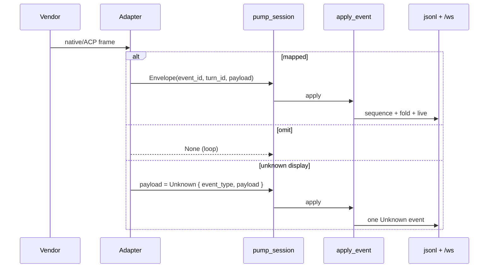

# TECH · APP-068 reference: Events

> Implementer HOW for tagged Atmos events. Addresses PRD **M6**. Parent contract: [../TECH.md](../TECH.md) Event envelope. Sibling: [tools.md](./tools.md) owns `AgentTool`; [persistence.md](./persistence.md) owns jsonl files; [ws-contract.md](./ws-contract.md) owns `agent_chat_*` names.

This slice is **not** ACP `session/update`, not a union of Codex/Pi/Claude/OpenCode native event names, and not the tool-params schema.

## Scope summary

Chat live wire and new transcripts speak one tagged Atmos observation. Adapters map vendor frames into that tag set (or drop them). `apply_event` folds envelopes onto `transcript.jsonl` + `agent_chat_event`. Host-only payloads (queue, session hints) stay off the adapter enum.

## Architecture

```
vendor frame
    → providers/{acp,claude,codex,opencode,pi} mapper
    → AgentEventEnvelope { event_id, turn_id, payload }   // no sequence
    → AgentRuntime::next_event
    → pump_session (service.rs)
    → apply_event.rs
         ├─ stamp sequence via AgentChatStore::next_seq
         ├─ fold payload → TranscriptRecord (throttled snapshots)
         └─ emit AgentChatEvent { chat_id, event_id, sequence, turn_id, payload }
                → /ws agent_chat_event
```

Touched paths:

| Layer | Path |
|-------|------|
| Domain | `crates/agent/src/domain/event.rs`, `session.rs` (`next_event`) |
| ACP map | `crates/agent/src/providers/acp/adapter.rs` → split `event_map.rs` |
| Native maps | `crates/agent/src/providers/<id>/event_map.rs` (see native slices) |
| Fold | `crates/core-service/src/service/agent_chat/apply_event.rs` |
| Pump | `crates/core-service/src/service/agent_chat/service.rs` `pump_session` |
| Wire DTO | `packages/api-types/src/ws/dto/agent-chat.ts` `AgentChatPayload` |
| WS live | `crates/core-service/.../types.rs` `AgentChatEvent` / `AgentChatPayload` |



## MUST / MUST NOT

| MUST | MUST NOT |
|------|----------|
| Persist and emit tagged Atmos kinds only | Store ACP `session/update` or vendor method names as the event `type` |
| Mapped events: Atmos kind fields only | `source` / `native` / raw vendor sidecar on a mapped event |
| Unmapped **events**: omit **or** one `Unknown` whose `payload` **is** the display data | `ToolCall*` plus a parallel vendor copy |
| Unmapped **tools**: `ToolCall*` with `kind: other` ([tools.md](./tools.md)) | Treat an unknown tool as `Unknown` (that hides the card) |
| Thinking / plan as `Thinking*` / `PlanUpdated` (or hide) | `AgentToolKind` for think / todo / plan |
| Host stamps `sequence` in `emit_live` | A second sequence in `crates/agent` |
| Envelope `turn_id` = Atmos control epoch from `send` | Vendor thread/turn ids on the envelope |
| Unknown vendor methods: skip or `Unknown`; session continues | Panic / fail the turn because of an extra frame |
| Keep `ASSISTANT_SNAPSHOT_INTERVAL` = 100ms | Persist every assistant delta |
| Reuse adapter `event_id` on the WS/jsonl envelope | Mint a second id when the adapter already sent one |

## AgentEventEnvelope

Two structs, one observation:

```rust
// crates/agent — adapter → host. No sequence (parent TECH).
pub struct AgentEventEnvelope {
    pub event_id: String,           // UUID; stable per emitted envelope
    pub turn_id: Option<String>,    // Atmos epoch; adapters keep vendor ids private
    pub payload: AgentEvent,        // tagged Atmos kind only
}

// Host observation — jsonl line object and agent_chat_event body (plus chat_id on WS).
pub struct AgentEventEnvelope {     // conceptual; today AgentChatEvent + turn_id
    pub event_id: String,
    pub sequence: u64,              // AgentChatStore::next_seq
    pub turn_id: Option<String>,    // copy from adapter; else RuntimeState.current_turn_id
    pub payload: AgentEvent,        // after host folds (see table below)
}
```

`AgentRuntime::next_event` changes from `Option<AgentEvent>` to `Option<AgentEventEnvelope>`.

**Who fills what**

| Field | Adapter | Host (`apply_event` / `emit_live`) |
|-------|---------|-------------------------------------|
| `event_id` | Required UUID | Reuse; mint only if missing |
| `sequence` | Never | `store.next_seq(chat_id)` |
| `turn_id` | Current Atmos `AgentTurnHandle.turn_id` when known | Fallback `RuntimeState.current_turn_id` |
| `payload` | Mapped kind | May **reshape** (see fold table); never attach sidecar |

`created_at` is a persist/live convenience on records and some WS fields (`turn_started`, `user_message`). It is not a second ordering key. Ordering is `sequence`.

Deltas still increment in-memory seq (`next_seq`) but skip `persist_seq` so `meta.json` is not rewritten per token. Keep `next_seq_does_not_rewrite_meta_per_delta`. After crash, live-only delta seqs may rewind; durable events do not.

## Tagged `AgentEvent`

Keep the existing enum in `crates/agent/src/domain/event.rs`. Serde `#[serde(tag = "type", rename_all = "snake_case")]` already matches `AgentChatPayload`. Do **not** add vendor variants (`session/update`, `item/agentMessage/delta`, `event.todo.updated`, …).

Add one variant:

```rust
Unknown {
    event_type: String,             // short label for the generic card heading
    payload: serde_json::Value,     // IS the stored / displayed body
}
```

Recommended closed set (adapter-emitted):

| `type` | Role |
|--------|------|
| `session_started` | Persistence handle + ready |
| `turn_started` | Adapter may omit; **host** already emits on `send` |
| `user_message` | Adapter must omit for the user's send (host wrote it) |
| `assistant_message_delta` / `assistant_message_completed` | Answer stream |
| `thinking_delta` / `thinking_completed` | Thought stream / think-tool fold |
| `tool_call_started` / `_updated` / `_completed` / `_failed` | Tools only; body is `AgentTool` ([tools.md](./tools.md)) |
| `plan_updated` | Plan part, not a tool |
| `permission_requested` / `permission_resolved` | Permission control |
| `usage_updated` | Raw usage JSON; host parses session vs turn |
| `config_changed` | Advertised options JSON; host folds to `config_updated` |
| `turn_completed` / `turn_failed` / `turn_canceled` | Adapter stop; host emits one `turn_completed` |
| `session_closed` | Runtime ended |
| `session_title_updated` | Title |
| `available_commands_updated` | Slash commands |
| `unknown` | Last-resort display event |

**Host-only** (stay on `AgentChatPayload`, never on adapter `AgentEvent`): `queue_updated`, `session_hint`, `session_config_change`, `session_lifecycle`, and most `runtime_status` transitions that the host already emits (`RunningTurn`, `WaitingPermission`, …).

## Align with `AgentChatPayload`

`packages/api-types/src/ws/dto/agent-chat.ts` already aliases `export type AgentEvent = AgentChatPayload`. That TS name is the **WS payload**, not the Rust adapter enum. Keep the alias. Align tags; do not invent a second union.

| Adapter `AgentEvent` | WS `AgentChatPayload` |
|----------------------|------------------------|
| Same snake_case tag | Same tag, pass through |
| `SessionStarted` | `runtime_status` `{ status: ready, persistence_handle }` |
| `SessionTitleUpdated` | `title_updated` |
| `ConfigChanged { config }` | `config_updated` `{ model, thinking, mode, config_options }` after parse |
| `UsageUpdated { usage }` | `usage_updated` `{ session, turn }` after parse; emit only if either is `Some` |
| `TurnFailed` / `TurnCanceled` / `TurnCompleted { stop }` | `turn_completed` `{ status, worked_ms, thinking_ms, completed_at, usage }` |
| `SessionClosed` | `runtime_status` `{ status: closed }` (today meta-only; emit it) |
| `ThinkingCompleted` | add host `thinking_ms` |
| `Unknown` | add `{ type: "unknown", event_type, payload }` |
| `TurnStarted` / `UserMessage` | **no-op in `apply_event`** — `service.rs` already persisted + emitted on send/steer |

`tool_call.*` wire fields become `kind` / `params` / `result` in the tools slice. This slice only forbids `input`+`native` dual-write.

## Unknown frames vs omit

Default for unrecognized vendor methods/notifications: **omit** (`None` from the mapper). Session must not crash (TEST S22).

Emit `Unknown` only when the frame is **user-visible** and is **not** a tool call: e.g. a vendor “notice” with text that would otherwise vanish. Then `payload` is that text object (or the vendor JSON **as the card body**). The generic UI renders `payload`; it does not look for a sidecar.

Never:

```text
ToolCallStarted { tool_call, source: vendor_json }
Unknown { payload } next to a mapped AssistantMessageDelta
```

Replay/load noise (`AcpSessionEvent::LoadCompleted`, ACP replay while `replaying`, heartbeats) stays omitted, as `should_drop_replay` does today.

## Thinking and plan are not tools

Move `ClassifiedTool::Thinking | Plan | Hide` **out of** `persist_tool` in `apply_event.rs` and into each adapter `event_map` (ACP already maps `Stream { kind: thinking }`; native slices map vendor think/todo items). After the move, `apply_event` must not call `classify_tool` to decide thinking.

| Vendor observation | Emit |
|--------------------|------|
| Thought chunk / thinking stream | `ThinkingDelta` / `ThinkingCompleted` |
| Todo / plan item | `PlanUpdated { plan }` |
| Hide (e.g. mode-switch chrome) | omit |
| Real tool | `ToolCall*` |

`flush_open_thinking` **stays in the host**. ACP thought chunks often never send `done`; without a flush, a later tool collapses the turn into one thinking snapshot. Adapters should still emit `ThinkingCompleted` when the vendor marks done.

## How adapters emit

Each provider owns a mapper. ACP: extract `AcpMappedSession::map_event` → `crates/agent/src/providers/acp/event_map.rs`. Native codecs live under `providers/<id>/` (not this file).

Rules:

1. Parse the vendor frame. Unknown method → omit or `Unknown`. Never `unwrap` on extra fields.
2. If it is a tool, map to `AgentTool` then `ToolCall*`. If thinking/plan classified from a **tool name**, emit thinking/plan events instead — do not also emit `ToolCall*`.
3. Allocate `event_id` (UUID). Set `turn_id` from the Atmos handle stored on the runtime (`AcpCommands.running_turn` today), not from vendor ids.
4. Stream identity is `message_id` inside the payload (assistant/thinking), not `event_id`. Each delta is a new envelope.
5. Close open thinking/assistant streams before a different kind (today `complete_stream_before`). Keep that in the adapter so the host sees explicit `*Completed`.
6. Return `None` to skip; `pump_session` loops `next_event`.

Fake runtime: `crates/agent/src/testing.rs` yields envelopes, not bare `AgentEvent`.

## Throttle (~100ms assistant snapshots)

Keep `ASSISTANT_SNAPSHOT_INTERVAL` in `apply_event.rs` (`Duration::from_millis(100)`).

| Observation | Live `/ws` | jsonl |
|-------------|------------|-------|
| `assistant_message_delta` | every delta | `AssistantSnapshot` at most every 100ms **and** on completed / turn end |
| `thinking_delta` | every delta | `ThinkingSnapshot` on completed / `flush_open_thinking` / turn end — **not** 100ms |
| everything else durable | every event | matching `TranscriptRecord` |

`emit_live` already skips `persist_seq` for assistant and thinking deltas. Do not persist delta text as its own jsonl type. Overlay unread buffers via `overlay_live_state` on `agent_chat_get`.

Do not throttle in the adapter. The adapter may emit a delta per vendor token; the host coalesces snapshots.

## How `apply_event` folds

`pump_session` calls `apply_event(chat_id, envelope, …)`. Match on `payload` (today: bare `AgentEvent`).

| Incoming | Transcript | Live payload |
|----------|------------|--------------|
| `SessionStarted` | `meta.persistence_handle` + Ready | `runtime_status` |
| `AssistantMessageDelta` | flush thinking; buffer text; snapshot if ≥100ms | delta (always) |
| `AssistantMessageCompleted` | final `AssistantSnapshot`; drop buffer | completed |
| `ThinkingDelta` | buffer; `mark_thinking` | delta |
| `ThinkingCompleted` | `ThinkingSnapshot` + duration | completed + `thinking_ms` |
| `ToolCall*` | `TranscriptRecord::ToolCall` with **one** `AgentTool`; flush thinking unless this *was* thinking (it must not be) | same tag |
| `PlanUpdated` | `TranscriptRecord::Plan`; flush thinking | `plan_updated` |
| `PermissionRequested` | `Permission` + WaitingPermission | `permission_requested` |
| `PermissionResolved` | `Permission` resolved; clear pending | `permission_resolved` |
| Turn stop variants | `finish_turn` → `TurnCompleted` + leftover snapshots | `turn_completed` |
| `UsageUpdated` | optional `Usage` if turn parse hits | `usage_updated` if session or turn |
| `ConfigChanged` | meta `current_config` / advertised options (descriptor slice) | `config_updated` or skip if empty |
| `SessionTitleUpdated` | `meta.title` | `title_updated` |
| `AvailableCommandsUpdated` | `meta.available_commands` | same |
| `SessionClosed` | `RuntimeStatus::Closed`; clear permission | `runtime_status` closed |
| `Unknown` | one jsonl envelope / part the UI can render | `unknown` |
| `TurnStarted` / `UserMessage` | **ignore** (host already wrote them) | none |

`finish_turn` remains the single closer: timing, leftover assistant/thinking buffers, usage, `RuntimeStatus::Ready`.

Do not fold vendor JSON in `store.rs`. The projector (`folded_turns`) reads Atmos records only.

## Transport

No new `WsAction`. Existing `agent_chat_event`:

```json
{
  "type": "agent_chat_event",
  "payload": {
    "chat_id": "…",
    "event_id": "…",
    "sequence": 123,
    "turn_id": "…",
    "payload": { "type": "assistant_message_delta", "message_id": "…", "delta": "…" }
  }
}
```

Add optional `turn_id` on the WS envelope (copy from `AgentEventEnvelope.turn_id`) so clients do not infer it from nested fields. Do not add REST.

TS: extend `AgentChatEvent` with `turn_id?: string | null` and `AgentChatPayload` with `unknown`. Keep action name `agent_chat_event`.

## Fixture strategy

Record vendor frames in `crates/agent/src/providers/<id>/testdata/`. Mapper tests assert:

- Mapped tool → `ToolCall*` Atmos kind, **no** `source` (TEST S8).
- Think/todo → `Thinking*` / `PlanUpdated`, not `kind: other` (TEST S11).
- Extra unknown method → remaining events still apply; skip or one `Unknown`; no panic (TEST S22).

Host tests in `apply_event.rs`: 100ms snapshot coalescing; `flush_open_thinking` still splits ACP-style thought-then-tool; `TurnStarted`/`UserMessage` from adapters do not duplicate host rows.

## Rollout

1. Add `AgentEventEnvelope` + `Unknown`; change `next_event` / fake provider. `apply_event` unwraps `.payload` (behavior unchanged).
2. Stamp `turn_id` + reuse `event_id` in `emit_live`; add WS `turn_id` + `unknown`.
3. Move think/plan/hide out of `persist_tool` into ACP `event_map` (native slices follow).
4. Emit `runtime_status` on `SessionClosed`. Stop classifying tools as thinking in the host.

Merge with parent step 1 (domain types). No dual schema.

## Risks & tradeoffs

- **Tagged enum vs `JsonValue` + sidecar.** Typed match keeps the fold honest. Sidecar on every mapped event was the double copy M6 forbids.
- **Omit vs `Unknown`.** Omit is the default so heartbeats do not spam history. `Unknown` is only for visible leftovers. Tools use `kind: other`, not `Unknown`.
- **Host still flushes thinking.** Adapter-complete is insufficient for ACP. That is transcript segmentation, not a vendor kind.
- **Sequence only on the host.** Adapters cannot mint comparable numbers across resume.
- **If this breaks:** new chats still stream; pre-APP-068 jsonl is out of scope ([persistence.md](./persistence.md)). Rollback is revert the domain type + mapper; Terminal is untouched.

## Open questions

None for v1. N1 workspace hit lists are result shapes ([tools.md](./tools.md)), not event kinds.
