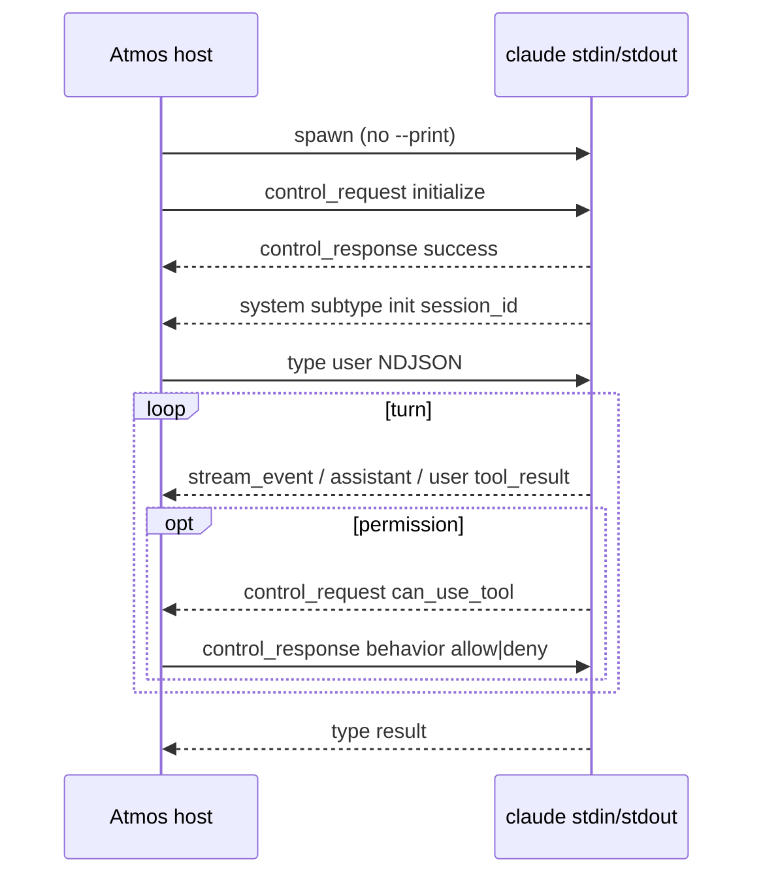

# TECH · APP-068 slice: Native Claude Code (stream-json + control)

> Implementer HOW for Chat `provider_id = "claude"`. Parent: [../TECH.md](../TECH.md) Native provider protocols. Routing: [runtime.md](./runtime.md). Events/tools: [events.md](./events.md), [tools.md](./tools.md). Addresses **M15–M16**. Do not implement production code from this file. Do not edit Terminal `builtin_agents.json`.

## Scope

Speak Claude Code’s **published host protocol from Rust**: one long-lived `claude` subprocess, NDJSON both directions, `control_request` / `control_response` mixed on the same streams. The Agent SDK (TS/Python) is a wrapper around this CLI; Atmos copies that **wire**, not the Node package.

Addresses M15–M16 for Claude only. N4 extras (`rewind_files`, plugins, MCP-in-process) stay out.

**Terminal vs Chat (locked).** Catalog id `claude` in `resources/terminal-agents/builtin_agents.json` stays:

```text
cmd: claude
params: --print --output-format stream-json --verbose --include-partial-messages
```

Chat **overrides** spawn. Do not add `--print`. Do not change Terminal `params` to ship this slice.

## Architecture

```text
AgentChatService.ensure_runtime
    → ClaudeNativeProvider::create_runtime | resume_runtime
        spawn.rs     argv/env/cwd; one Child per live chat_id
        codec.rs     NDJSON split on \n; demux type
        rpc.rs       host→CLI user + control_request; CLI→host control_response wait
        event_map.rs vendor frame → AgentEventEnvelope
        tool_map.rs  Bash/Read/… → AgentTool
        testdata/    recorded frames; PINNED_CLI in README
```



`crates/agent/src/lib.rs` Chat API stays `domain::*`. No `@anthropic-ai/claude-agent-sdk` in Atmos Server. No `@agentclientprotocol/claude-agent-acp`.

## How other hosts parse (copy this, not ACP)

| Host | What it does | Take for Atmos |
|------|----------------|----------------|
| [Agent SDK TS](https://code.claude.com/docs/en/agent-sdk/typescript) / [Python `query.py`](https://github.com/anthropics/claude-agent-sdk-python/blob/main/src/claude_agent_sdk/_internal/query.py) | Spawns `claude` with `--output-format stream-json --verbose --input-format stream-json`; optional `--include-partial-messages`; `--permission-prompt-tool stdio` when `canUseTool` is set. **No `--print`.** Writes NDJSON; demuxes `control_request` vs messages. | Canonical spawn + envelope. Pin `control_response` to this schema. |
| [Python `subprocess_cli.py`](https://github.com/anthropics/claude-agent-sdk-python/blob/main/src/claude_agent_sdk/_internal/transport/subprocess_cli.py) `_build_command` | `--resume=` equals-form; `--effort`; thinking flags; stdin kept open. | Resume argv. Do not pass `--resume` as two tokens. |
| [joshrotenberg/claude-wrapper #561 DuplexSession](https://github.com/joshrotenberg/claude-wrapper/issues/561) | One child for the conversation. Turn boundary = `type: result`. Inbound `can_use_tool` must answer on stdin. Outbound `interrupt` uses `request_id` → oneshot. | Chat process model. |
| [humanlayer/claudecode-go](https://github.com/humanlayer/humanlayer/tree/main/claudecode-go) | `bufio.Scanner` on stream-json; `--verbose` required with stream-json; large-line buffer. | Line reader: no tiny scan cap. |
| [dn00/clarp](https://github.com/dn00/clarp) | PTY + local API proxy so **interactive** Claude emits print-like stream-json. | Event catalog reference only. Not Chat spawn. |
| [`@agentclientprotocol/claude-agent-acp`](https://www.npmjs.com/package/@agentclientprotocol/claude-agent-acp) | ACP façade over the Agent SDK. | **MUST NOT** Chat path. |

**ACP status.** Anthropic did not ship native ACP on `claude`. [Issue #6686](https://github.com/anthropics/claude-code/issues/6686) asked for it; the working solution in the wild is Zed’s SDK adapter, not a first-party `claude acp` binary. Network ACP (`claude serve`) was separately [closed as not planned](https://github.com/anthropics/claude-code/issues/24365). Chat stays on stream-json.

## Spawn (`spawn.rs`)

Executable: catalog `cmd` (`claude`) via PATH / provisioned binary. Ignore `params` / `yoloParams` / ACP `launch_spec.args`.

**Create (one process per live Chat):**

```text
claude \
  --output-format stream-json \
  --verbose \
  --input-format stream-json \
  --include-partial-messages \
  --permission-prompt-tool stdio
```

Add when `current_config` has them:

- `--model <id>`
- `--effort <low|medium|high|xhigh|max>` — matches builtin `reasoningSupport.arg`
- `--permission-mode <mode>` only if Chat actually selected a Claude permission mode (usually omit; host owns prompts via `can_use_tool`)

**Resume:** same argv plus `--resume=<session_id>` (equals form). `session_id` is `AgentPersistenceHandle`, not Atmos `chat_id`.

**MUST NOT on Chat argv:** `--print` / `-p`, `--dangerously-skip-permissions`, prompt as a trailing arg.

**Env / stdio:** inherit env (keep `PATH`, Anthropic auth). `cwd` = chat cwd. stdin/stdout piped. stderr log at debug, never info (may contain snippets). `kill_on_drop(true)` like `crates/agent/src/acp_client/process.rs`. Close stdin on `close()`, then SIGTERM if still alive.

**Handshake:** after spawn, send `initialize`, wait up to 60s for matching `control_response`. Non-control lines that arrive first (e.g. `system/init`) still parse. Capture `session_id` from `system`/`init` into `persistence_handle`. v1 initialize body is `{ "subtype": "initialize" }` (hooks/agents omitted). Do not advertise SDK MCP servers we will not serve.

**YOLO:** Chat permission UI is the SOT. Do not copy Terminal `yoloParams` (`--dangerously-skip-permissions`). If a future Chat mode is truly bypass, that is `set_permission_mode` / spawn `--permission-mode bypassPermissions` plus the SDK’s `allowDangerouslySkipPermissions` equivalent — not a silent argv copy from Terminal.

## Framing (`codec.rs`) — S23

Both directions: **one JSON object per `\n`**. Write `serde_json::to_vec` + `\n` and flush. Read: split on `\n` only (not Node `readline`). Tool results can be multi-megabyte; use `BufReader` without a 64KiB scan cap.

Classify stdout `type`:

| `type` | Role |
|--------|------|
| `system` | `subtype: init` → session meta; other subtypes may omit or `Unknown` |
| `assistant` | complete message (text, thinking, `tool_use`) |
| `user` | often `tool_result` blocks |
| `stream_event` | partial API events when `--include-partial-messages` |
| `result` | **turn complete** (success or error subtype) |
| `control_request` | CLI → host; must answer if it is a request that blocks |
| `control_response` | CLI → host; complete a pending host `control_request` |
| `rate_limit_event` / `tool_progress` / `keep_alive` | omit or status; never panic |
| unknown | omit or one `Unknown`; session continues (S22) |

Control frames **interleave** with assistant/stream/result on the same stdout. Do not assume “all messages then control”.

## Control envelopes (pin to Agent SDK — do not guess)

Sources: Python `SDKControlResponse` in [types.py](https://github.com/anthropics/claude-agent-sdk-python/blob/main/src/claude_agent_sdk/types.py); TS [PermissionResult](https://code.claude.com/docs/en/agent-sdk/typescript); CLI `controlSchemas.ts` (`SDKControlRequestSchema` / `SDKControlResponseSchema`).

**Host → CLI `control_request`:** `request_id` is **top-level**. Inner `request.subtype` is the method.

```json
{"type":"control_request","request_id":"req_1","request":{"subtype":"initialize"}}
{"type":"control_request","request_id":"req_2","request":{"subtype":"interrupt"}}
{"type":"control_request","request_id":"req_3","request":{"subtype":"set_model","model":"opus"}}
{"type":"control_request","request_id":"req_4","request":{"subtype":"set_max_thinking_tokens","max_thinking_tokens":8000}}
{"type":"control_request","request_id":"req_5","request":{"subtype":"set_permission_mode","mode":"default"}}
```

`set_model.model` may be omitted/null to reset (Python SDK). `set_max_thinking_tokens` is `number | null` on the CLI schema. TS `setMaxThinkingTokens()` is **deprecated** in favor of spawn `thinking` / `--effort`; Chat still implements the control for live numeric budgets. Catalog thinking remains **effort strings** → spawn `--effort` and live `apply_flag_settings` `{ "effortLevel": "high" }` when SetConfig carries an effort id. Do not invent a token count from `"high"`.

**CLI → host `control_response` (and host → CLI when answering):** `request_id` lives **inside** `response`, not on the outer object.

```json
{"type":"control_response","response":{"subtype":"success","request_id":"req_1","response":{"commands":[],"models":[],"agents":[],"account":null}}}
{"type":"control_response","response":{"subtype":"error","request_id":"req_1","error":"invalid request format"}}
```

**Permission inner payload is `behavior`, not `allowed`.** Python `query.py` writes:

```json
{"type":"control_response","response":{"subtype":"success","request_id":"req_p","response":{"behavior":"allow","updatedInput":{"command":"ls"}}}}
{"type":"control_response","response":{"subtype":"success","request_id":"req_p","response":{"behavior":"deny","message":"User denied"}}}
```

Always echo the CLI’s `input` as `updatedInput` on allow (empty `{}` wipes args — [SDK issue #320](https://github.com/anthropics/claude-agent-sdk-python/issues/320)). Official docs: before Claude Code v2.1.207, omit `updatedInput` and the CLI treated allow as deny.

**Reject in fixtures (S21):** `{ "allowed": true }`, `{ "approved": true }`, outer `{ "type":"control_response","request_id":"…" }` without nested `response.request_id`. Those appear in unofficial blogs; they are not the Agent SDK schema.

**CLI → host `can_use_tool`:**

```json
{"type":"control_request","request_id":"req_p","request":{"subtype":"can_use_tool","tool_name":"Bash","input":{"command":"ls"},"tool_use_id":"tu_1"}}
```

Optional: `permission_suggestions`, `blocked_path`, `agent_id`, `title`, `display_name`, `description`, `decision_reason`.

Unmapped inbound subtypes (`hook_callback`, `mcp_message`, `elicitation`, …): log debug and send `control_response` `subtype: error` so the CLI does not block. Do not implement MCP/hook routing in v1.

## Host → CLI user message

SDK `SDKUserMessage` ([TS](https://code.claude.com/docs/en/agent-sdk/typescript)):

```json
{"type":"user","parent_tool_use_id":null,"session_id":"ses_abc","message":{"role":"user","content":[{"type":"text","text":"list files"}]}}
```

Attachments: content blocks the CLI already accepts. Image example (short):

```json
{"type":"image","source":{"type":"base64","media_type":"image/png","data":"<b64>"}}
```

`session_id` optional after init. `shouldQuery: false` is out of v1 (do not use for Atmos queue). `uuid` on the user message is optional; if set, later `user_message_uuid` on assistant/result may echo it — adapter-private, not Atmos `turn_id`.

`send()` writes one user line. Do not close stdin between turns. Overlapping send while a turn has no `result` yet: host queue (`queue.json`) — adapter may reject a second stdin user with TurnInFlight; service must not double-send.

## Runtime verbs

| Atmos | Claude wire |
|-------|-------------|
| `send` | user NDJSON |
| `cancel` | `control_request` `interrupt`; ignore receipt extras (`still_queued`) in v1 |
| `close` | close stdin; wait; kill |
| `Steer` | Second stdin user NDJSON on the running turn. Not a new `turn_id`. Overlapping `send` stays `turn in flight`. |
| `RespondPermission` | nested `control_response` above |
| `SetConfig` | `set_model` / effort via spawn+`apply_flag_settings` / `set_max_thinking_tokens` if numeric / `set_permission_mode` |

Capabilities: `steer: Supported`, `resume: Supported`, `permission: Supported`, `configure: Supported`.

`AskUserQuestion` also arrives as `can_use_tool`. Map to Atmos `PermissionRequested` with options from `input`; answering still uses `behavior` + `updatedInput` (see [user-input](https://code.claude.com/docs/en/agent-sdk/user-input)). Do not drop the turn.

Atmos `option_id` → dialect (adapter-private):

| `option_id` kind | Inner `response` |
|------------------|------------------|
| `allow_once` | `behavior: allow`, `updatedInput` = request `input` |
| `allow_always` | same + `updatedPermissions` from `permission_suggestions` when present |
| `reject_once` / `reject_always` | `behavior: deny`, `message` non-empty |

## Event map (`event_map.rs`) — S18

Envelope `turn_id` = Atmos epoch from `send`. Do not put vendor ids on the envelope.

| Vendor | Atmos |
|--------|--------|
| `system`/`init` | session/config; persist `session_id` |
| `stream_event` `content_block_delta` `text_delta` | assistant snapshot (host 100ms throttle) |
| `stream_event` thinking deltas | `Thinking*` |
| `assistant` `content[]` `text` | assistant (authoritative vs partials) |
| `assistant` `tool_use` | `ToolCallStarted` / `Updated` |
| `user` `tool_result` | `ToolCallCompleted` / `Failed` |
| `result` `subtype: success` | `TurnCompleted`; fold `total_cost_usd` / `usage` into Atmos usage if the host already has that event |
| `result` `is_error` / error subtype | `TurnCompleted` failed/cancelled; interrupt often looks like error — still end the Atmos turn |
| `can_use_tool` | `PermissionRequested` (`request_id` = outer `request_id`) |
| thinking / `TodoWrite` | fold `Thinking*` / `PlanUpdated` — **not** tool kinds |

`PermissionRequested.options` are Atmos ids (`allow_once`, …), not vendor strings. `tool` / `description` come from `tool_name` + a one-line summary of `input` (command/path/url). Do not put the full vendor request on a sidecar.

Partial `stream_event` never dual-stores a native sidecar. Complete `assistant` replaces streamed text for the same block.

## Tool map (`tool_map.rs`)

Vendor `name` stays on `AgentTool.name`. Kind from exact Claude names (then `classify_tool` fallback inside the adapter only):

| Claude `name` | Atmos `kind` | Params (drop unused keys) |
|---------------|--------------|---------------------------|
| `Bash` | `execute` | `command`, `cwd` if present, `background` from `run_in_background` |
| `Read` | `read` | `file_path` → `path`, `offset`, `limit` |
| `Edit` / `Write` / `NotebookEdit` | `edit` | `file_path` → `path` |
| `Grep` / `Glob` | `search` | pattern/glob/path — **not** `web_search` |
| `WebSearch` | `web_search` | `query`; links from result if parseable else `result: text` |
| `WebFetch` | `fetch` | `url` |
| `Skill` | `skill` | skill id/name |
| `Task` / `Agent` | `subagent` | description / agent type |
| `BashOutput` / `TaskOutput` | **Hide** | merge output onto parent execute by adapter |
| other | `other` | params/result **are** vendor JSON once |

`tool_call_id` = `tool_use.id`. Result: `tool_result.content` → execute output / text / error. Exit code from structured result when present.

## MUST / MUST NOT

| MUST | MUST NOT |
|------|----------|
| Duplex, no `--print`; override catalog `params` | One-shot `--print` as Chat |
| Nested SDK `control_response` + `behavior` | Guess `allowed` / top-level `request_id` / `approved` |
| `--permission-prompt-tool stdio` + answer every `can_use_tool` | Leave stdin unanswered (turn stalls) |
| `action(Steer)` = second stdin user NDJSON on `running_turn` | Fake steer via queue, interrupt+resend, or a new `turn_id` |
| Resume via `session_id` / `--resume=` | Treat `get` as spawn |
| Unknown frames skip or `Unknown` | Panic the session |
| Fixtures from a pinned CLI | Embed TS SDK; spawn `claude-agent-acp` |
| | `rewind_files`, MCP hook routing, plugin reload as Chat actions |

## Module files

```text
crates/agent/src/providers/claude/
  mod.rs
  spawn.rs
  codec.rs
  rpc.rs
  event_map.rs
  tool_map.rs
  testdata/
    README.md              # claude --version + SDK pin
    init.jsonl
    turn_bash_web.jsonl    # S18
    can_use_tool.json      # S21 request
    permission_allow.stdin.json
    mixed_control.jsonl    # S23
```

`rpc.rs` owns: request_id generator (`req_{n}_{hex}`), pending host-control map, inbound `can_use_tool` → oneshot the Chat permission prompt, timeout (60s initialize; permission waits until user/cancel). Cancel outstanding permission with `control_response` deny if the host `cancel`/`close` wins the race.

## Tests

Record under `crates/agent/src/providers/claude/testdata/`. `testdata/README.md` lists `claude --version` and Agent SDK git/npm id used to generate files.

| Id | Files (suggested) | Assert |
|----|-------------------|--------|
| **S18** | `init.jsonl`, `turn_bash_web.jsonl` (init, assistant `tool_use` Bash/Read/WebSearch/WebFetch, `tool_result`, `can_use_tool`, `result`) | kinds match table; permission event; `capabilities.steer == Supported`; Steer writes a second stdin user line without a new turn |
| **S21** | `can_use_tool.json` + golden stdin | `RespondPermission` writes nested `{behavior, updatedInput}` — not `allowed` |
| **S23** | `mixed_control.jsonl` | `control_request` between `stream_event` and `assistant`; parse succeeds; `\n` split only |

Also: overlapping control + result; error `control_response`; unknown `type` does not abort (S22).

No live `claude` on CI. Manual spawn is TEST.md, not this gate.

## Pin CLI / SDK

1. Fixtures pin **exact** `claude --version` (record 2.1.x family that matches `tool_use_id` on `can_use_tool` and nested `control_response`).
2. Cross-check envelopes against Agent SDK types in the same window (Python `SDKControlResponse`, TS `PermissionResult`).
3. Bump fixtures in the same PR as adapter parse changes. Do not silently accept both `allowed` and `behavior`.
4. At spawn, if `--help` lacks `--input-format`, fail create_runtime with a clear “Claude Code too old” error — **do not** fall back to ACP or `--print`.
5. Product does not gate on Hub CLI version; this is the user’s `claude` binary.

## Rollout

1. `codec.rs` + testdata S23/S18 parse only.
2. `rpc.rs` initialize + permission golden S21.
3. `spawn.rs` + factory arm `claude` → native (S24).
4. `event_map` / `tool_map` wired to `next_event`. Steer writes a second user line; overlapping `send` still fails.

## Risks

- **Docs vs wire:** Headless pages show `claude -p --output-format stream-json`. That is Terminal/one-shot. Chat follows SDK `_build_command` (no `-p`).
- **Permission schema drift:** community samples use `allowed`. One wrong field stalls tools. Golden stdin is the gate.
- **`--print` leftover:** if factory still uses builtin `params`, duplex never works. S24 compares argv.
- **Rollback:** Chat `claude` can stay ACP until this adapter is green; Terminal unchanged.

## Sources

- [Agent SDK TypeScript](https://code.claude.com/docs/en/agent-sdk/typescript) — `SDKUserMessage`, `PermissionResult`, `setMaxThinkingTokens`, `includePartialMessages`
- [Handle approvals](https://code.claude.com/docs/en/agent-sdk/user-input) — `behavior: allow|deny`, `updatedInput`
- [Streaming / partials](https://code.claude.com/docs/en/agent-sdk/streaming) — `stream_event`
- [Headless](https://code.claude.com/docs/en/headless) — `--output-format stream-json --verbose --include-partial-messages` (print-mode examples; Chat omits `-p`)
- [Python `query.py`](https://github.com/anthropics/claude-agent-sdk-python/blob/main/src/claude_agent_sdk/_internal/query.py) — initialize, `can_use_tool` → nested `control_response`, interrupt, `set_model`
- [Python `types.py`](https://github.com/anthropics/claude-agent-sdk-python/blob/main/src/claude_agent_sdk/types.py) — `SDKControlRequest` / `SDKControlResponse`
- [Python `subprocess_cli.py`](https://github.com/anthropics/claude-agent-sdk-python/blob/main/src/claude_agent_sdk/_internal/transport/subprocess_cli.py) — argv, `--resume=`, `--permission-prompt-tool stdio`
- [controlSchemas.ts](https://github.com/claude-code-best/claude-code/blob/632f3e19/src/entrypoints/sdk/controlSchemas.ts) — `set_max_thinking_tokens`, nested `SDKControlResponseSchema`
- [claude-wrapper DuplexSession](https://github.com/joshrotenberg/claude-wrapper/issues/561)
- [claudecode-go](https://github.com/humanlayer/humanlayer/tree/main/claudecode-go)
- [clarp](https://github.com/dn00/clarp)
- [ACP feature #6686](https://github.com/anthropics/claude-code/issues/6686), [network ACP not planned #24365](https://github.com/anthropics/claude-code/issues/24365)
- [claude-agent-acp npm](https://www.npmjs.com/package/@agentclientprotocol/claude-agent-acp) — do not use
- [Python permission `updatedInput` bug #320](https://github.com/anthropics/claude-agent-sdk-python/issues/320)
