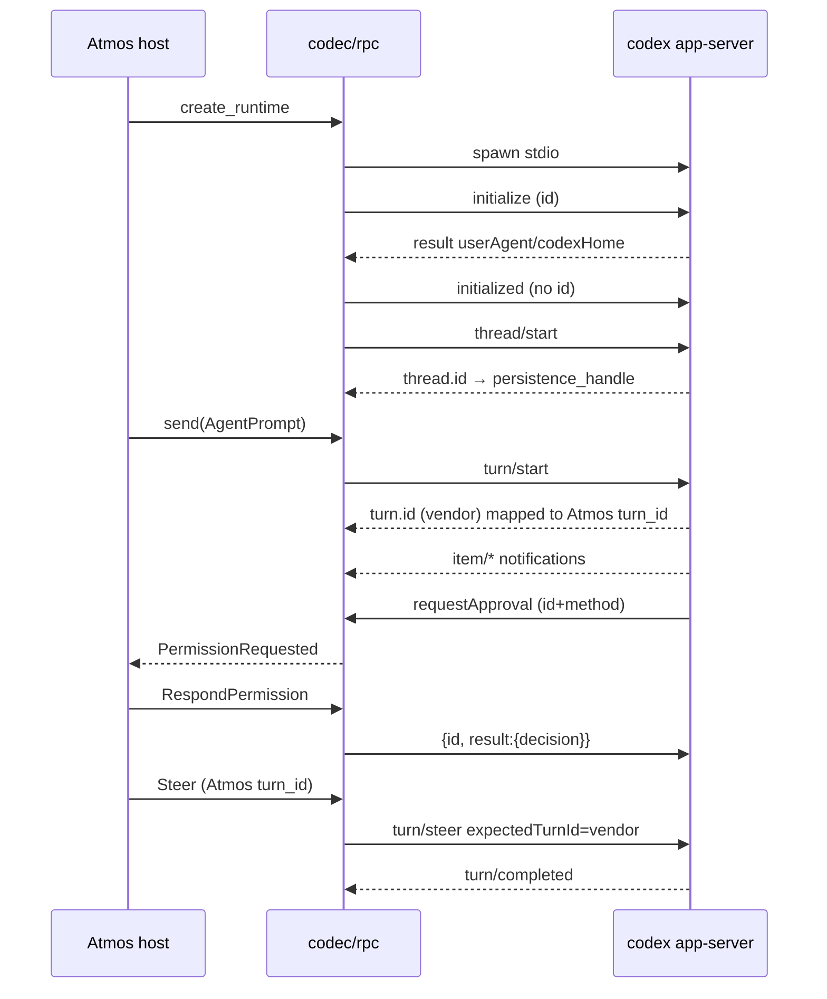

# TECH · APP-068 slice: Native Codex (`app-server`)

> Implementer HOW for Chat `provider_id = "codex"`. Parent: [../TECH.md](../TECH.md) § Codex + capability honesty. Routing: [runtime.md](./runtime.md). Events: [events.md](./events.md). Tools: [tools.md](./tools.md). Addresses **M15–M16**. Do not implement production code from this file.

## Scope

Speak Codex **app-server** JSON-RPC from Rust. One long-lived `codex app-server` child per live Chat. Map vendor items/approvals onto Atmos events/tools/permission. Terminal APP-024 stays `codex exec --json`.

**Not this slice:** ACP, TypeScript `@openai/codex-sdk`, `codex mcp-server`, experimental `--listen ws://` as Chat transport, web classifiers, jsonl schema, `agent_chat_*` names.

Research pin (fetched 2026-09-01):

- Official protocol: [learn.chatgpt.com/docs/app-server.md](https://learn.chatgpt.com/docs/app-server.md)
- Open-source README: [openai/codex `codex-rs/app-server/README.md`](https://github.com/openai/codex/blob/main/codex-rs/app-server/README.md)
- Design (VS Code origin, JSON-RPC lite): [Unlocking the Codex harness](https://openai.com/index/unlocking-the-codex-harness/)
- Hosts: VS Code extension (`openai.chatgpt`, `clientInfo.name = "codex_vscode"`); [Promptfoo `openai:codex-app-server`](https://www.promptfoo.dev/docs/providers/openai-codex-app-server/) (stdio child, **not** WebSocket)
- Approvals are **server-initiated requests**, not a client `approval/*` RPC ([openai/codex#14192](https://github.com/openai/codex/issues/14192))
- Auto-reviewer swallows prompts unless `approvalsReviewer` is the user ([openai/codex#21982](https://github.com/openai/codex/issues/21982))

Record fixtures against a pinned `codex --version` in `testdata/README.md`. Schema dump: `codex app-server generate-json-schema`.

## Spawn OVERRIDE vs Terminal

| Surface | Argv | Parser |
|---------|------|--------|
| Terminal APP-024 | `codex exec --json` (`resources/terminal-agents/builtin_agents.json` `id: "codex"`) | `codex_jsonl` — **do not change** |
| Chat native | `codex app-server` (default **stdio JSONL**, no `--listen`) | this adapter |

Resolve the binary the same way as today (`cmd` / PATH / provisioned). Ignore catalog `params`. Cwd = chat cwd. `kill_on_drop(true)` like `crates/agent/src/acp_client/process.rs`. Stderr is tracing (`RUST_LOG`); never parse it as protocol.

**Do not** spawn `codex app-server --listen ws://…` / `unix://` for Chat. OpenAI marks WebSocket listen experimental; Promptfoo also uses stdio only.

```text
AgentChatService.ensure_runtime
  → CodexNativeProvider::create_runtime | resume_runtime
      spawn: [codex, "app-server", "-c", "openai_base_url=\"\""]  cwd=chat.cwd
      handshake: initialize → initialized
      thread/start | thread/resume(persistence_handle)
      loop stdout JSONL until drop
```

Auth is the user’s existing Codex home / ChatGPT login / `OPENAI_API_KEY`. Chat spawn injects session-only `-c openai_base_url=""` so a user `config.toml` gateway (for example opencodex) is not inherited. v1 does **not** implement `account/login/*`. Unauthorized → `TurnFailed` / spawn error string.



## MUST / MUST NOT

| MUST | MUST NOT (v1) |
|------|----------------|
| Stdio JSONL; omit `"jsonrpc":"2.0"` on **writes** | Treat `codex exec --json` as Chat; wrap Node SDK; `codex mcp-server` |
| Classify frames structurally (below) | Require `jsonrpc` on reads; treat `id`+`method` as a notification |
| Answer every **server request** or the turn stalls | Ignore `item/*/requestApproval` |
| `turn/steer.expectedTurnId` = **vendor** turn id | Send Atmos `turn_id` UUID as `expectedTurnId` |
| `persistence_handle` = Codex `thread.id` | Equal Atmos `chat_id`; hydrate history via `thread/read` into jsonl (duplicate) |
| Ask always: `approvalsReviewer: "user"` so Chat sees prompts. Auto ("Approve for me"): `auto_review` | Send `auto_review` for Ask always (prompts never arrive) |
| `experimentalApi: true` so `collaborationMode/list` and `turn/start.collaborationMode` work (APP-069). Still do **not** call `process/spawn`, queue, plugins, marketplace | Advertise experimental methods we will not implement |
| Unknown **notification** → omit or one `Unknown` | Panic / fail the session (S22) |
| Unknown **server request** → JSON-RPC error `-32601` | Leave it unanswered |

**v1 MUST NOT call:** `thread/fork`, `plugin/*`, `marketplace/*`, `process/spawn` (needs experimentalApi), `review/start`, `thread/queue/*`, `thread/compact/start` as Chat actions, `thread/realtime/*`. Compact `contextCompaction` items: omit or one status — **not** a composer button.

## Codec (S23)

JSON-RPC 2.0 **shape**, `"jsonrpc":"2.0"` **omitted on the wire** ([docs](https://learn.chatgpt.com/docs/app-server.md) § Protocol; OpenAI: “JSON-RPC lite”). Frame = one JSON object + `\n`. Field names **camelCase**.

Classify **structurally** (do not look for `jsonrpc`):

| Shape | Kind | Action |
|-------|------|--------|
| `id` + `result` or `error` | Response to **our** request | Complete pending client RPC |
| `id` + `method` | **Server request** | Answer with `{id, result}` or `{id, error}` |
| `method`, no `id` | Notification | `event_map` / `tool_map`; never reply |
| anything else | Malformed | log debug; do not kill the session |

Inbound extra `jsonrpc` is ignored. Encoder must never emit it. Ids are number or string; stringify for Atmos `request_id`.

```json
{"method":"initialize","id":0,"params":{"clientInfo":{"name":"atmos","title":"Atmos Chat","version":"0.0.0"}}}
{"method":"initialized","params":{}}
{"id":0,"result":{"userAgent":"atmos/…","codexHome":"/Users/me/.codex","platformFamily":"unix","platformOs":"macos"}}
{"method":"turn/started","params":{"turn":{"id":"turn_456","status":"inProgress"}}}
{"method":"item/commandExecution/requestApproval","id":61,"params":{"threadId":"thr_123","turnId":"turn_456","itemId":"call_1"}}
{"id":61,"result":{"decision":"accept"}}
```

Pending maps on the runtime: `client_rpc: HashMap<Id, oneshot>` and `server_rpc: HashMap<Id, PendingServerReq { method, params }>`.

## Handshake + thread

After pipes are up, **before any other method**:

1. Client request `initialize` with `clientInfo` (`name: "atmos"` — not `codex_vscode`) and `capabilities.experimentalApi: true` (required for `collaborationMode/list`). Do **not** set `requestAttestation` or MCP form extensions.
2. Wait for `initialize` result (`Not initialized` / `Already initialized` are fatal for this process).
3. Notification `initialized` (`method` only).
4. Optional `model/list` `{limit, includeHidden:false}` → `ConfigChanged` (models + `supportedReasoningEfforts` as thinking).
5. `collaborationMode/list` → overlay modes (Default / Plan). Stamp if empty or method missing.
6. `create_runtime`: `thread/start` (no mode field). `resume_runtime`: `thread/resume` `{threadId}` from `meta.persistence_handle`. Restore/`get` still does **not** spawn ([persistence.md](./persistence.md)). Selected mode is sticky on each `turn/start.collaborationMode`. 0.153 `settings.model` is required; also send sticky `reasoning_effort` when set. `developer_instructions: null` keeps built-in Plan/Default instructions.

```json
{"method":"thread/start","id":1,"params":{
  "cwd":"/abs/project","model":"gpt-5.6-sol",
  "approvalPolicy":"onRequest","approvalsReviewer":"user",
  "sandbox":"workspaceWrite"
}}
{"id":1,"result":{"thread":{"id":"thr_123"}}}
```

`thread.id` → `AgentPersistenceHandle` + `SessionStarted`. `thread/read` is optional existence check only; **do not** replay turns into Atmos jsonl.

Do not combine `sandbox` with experimental `permissions` profile ids. v1 uses the legacy `sandbox` string (`workspaceWrite` when Chat cwd is a writable project; `readOnly` only if product later adds a mode — default **workspaceWrite** so execute/edit cards can appear). `approvalPolicy: "onRequest"` is what surfaces `requestApproval`; `"never"` would make `permission: Supported` a lie.

If `thread/start` or `thread/resume` fails (missing thread, required MCP down), fail spawn — do not fall through to ACP.

## Turns, ids, steer (LOCKED)

Atmos `turn_id` is the host control epoch from `send` ([events.md](./events.md)). Adapter stores:

```text
atmos_turn_id  →  vendor_turn_id   (from turn/start result and/or turn/started)
thread_id      →  persistence_handle
```

| Atmos | Codex | Notes |
|-------|-------|--------|
| `send` | `turn/start` `{threadId, input, model?, effort?, collaborationMode?}` | `input: [{type:"text", text}]` + `localImage`/`image` from Chat attachments. `collaborationMode.settings.model` is required on 0.153 when the object is present. |
| `cancel` | `turn/interrupt` `{threadId, turnId}` | `turnId` = **vendor** id; success `{}`; `turn/completed` `status: "interrupted"` |
| `Steer` | `turn/steer` | `expectedTurnId` **required**; must equal the **active vendor** turn |
| close | drop stdin + kill child | no v1 `thread/unsubscribe` requirement |

```json
{"method":"turn/start","id":30,"params":{
  "threadId":"thr_123","input":[{"type":"text","text":"Run tests"}]
}}
{"id":30,"result":{"turn":{"id":"turn_456","status":"inProgress"}}}

{"method":"turn/steer","id":32,"params":{
  "threadId":"thr_123",
  "input":[{"type":"text","text":"Focus on failures."}],
  "expectedTurnId":"turn_456"
}}
{"id":32,"result":{"turnId":"turn_456"}}
```

`turn/steer` does **not** emit `turn/started` and rejects review/compaction turns. Host already gated `capabilities.steer` and `state.current_turn_id == expected_turn_id` (Atmos UUID). Adapter looks up vendor id; missing map → `SteerTurnMismatch`. **Never** put the Atmos UUID on the wire as `expectedTurnId`.

`AgentPrompt` → `input[]`: one `{type:"text", text}` from `prompt.text`. Each image attachment that is a local file → `{type:"localImage", path}` (absolute). Remote URL → `{type:"image", url}`. Skip undocumented attachment kinds. Do not send `skill` / `mention` input items in v1 (N4).

Adapter **omits** vendor `userMessage` items (host already persisted send/steer). Do not emit a second Atmos `TurnStarted`.

`turn/completed`: `completed` → `TurnCompleted`; `interrupted` → `TurnCanceled`; `failed` → `TurnFailed`. Notification `error` `{error:{message, …}}` then failed turn: same `TurnFailed` message; do not emit a duplicate `Unknown`. Clear the atmos↔vendor turn map when the vendor turn ends so a later steer cannot target a dead id.

`send` while a vendor turn is in-flight: host queues (APP-067). Adapter `send` is only called when idle; do not also call Codex experimental `thread/queue/add`.

## Capability matrix (`codex`)

From [descriptor.md](./descriptor.md) `capabilities_for_provider("codex")`:

| Capability | Value | Wire |
|------------|-------|------|
| steer | Supported | `turn/steer` + vendor `expectedTurnId` |
| resume | Supported | `thread/resume` |
| permission | Supported | server `item/*/requestApproval` |
| configure | Supported | `model/list` + next `turn/start` `model`/`effort` |

Send/cancel are core, not flags. `SetConfig` is **sticky for the next `turn/start`**. Do not call experimental `thread/settings/update` / `turn/settings/update`. Thinking ids = Codex `effort` values advertised by `model/list` (`none`…`max`). Empty pickers stay omitted (M3). Catalog `codex debug models` remains the **pre-spawn** probe; live `model/list` may overlay.

## Item / tool map (S17)

Lifecycle: `item/started` → optional deltas → `item/completed` (authoritative). Envelope `turn_id` stays Atmos. `tool_call_id` = item `id` (fileChange: `{id}:{path}` when multiple `changes`).

| Codex item / notify | Atmos |
|---------------------|--------|
| `agentMessage` + `item/agentMessage/delta` | `AssistantMessageDelta` / `Completed` (`message_id` = item id) |
| `reasoning` + `item/reasoning/summaryTextDelta` / `textDelta` / `summaryPartAdded` | `ThinkingDelta` / `ThinkingCompleted` (not a tool) |
| `plan` + `item/plan/delta` + `turn/plan/updated` | `PlanUpdated` (not a tool). `turn/plan/updated.plan[]` = `{step, status}` |
| `commandExecution` + `outputDelta` | `execute` `{command, cwd, background:false}` → result `{output: aggregatedOutput, exit_code}` |
| `fileChange` `{changes:[{path,kind,diff}]}` | `kind` add/update → `edit`; `kind` delete → `delete`. One tool per path. `turn/diff/updated` **folds** `DiffStats` onto those edits — do **not** dual-store the aggregated diff as another tool |
| `webSearch` `action.type=search` | `web_search` `{query}` (`query` / `action.query` / `action.queries[0]`) |
| `webSearch` `openPage` / `findInPage` | `fetch` `{url}`; `findInPage` pattern → result `text` if no body |
| `imageView` `{path}` | `read` `{path}` |
| `collabToolCall` / subagent-ish | `subagent` if prompt/description present, else `other` |
| `mcpToolCall`, `dynamicToolCall`, unknown `item.type` | `other`; params/result **are** the vendor object once |
| `contextCompaction`, `enteredReviewMode`, `exitedReviewMode` | omit |
| `thread/tokenUsage/updated` | `UsageUpdated` (raw JSON; host parses) |
| `thread/name/updated` | `SessionTitleUpdated` |

Partial map: typed params + `result: {type:"text", text}` if links/body missing ([tools.md](./tools.md)). Never `web_search` ↔ workspace `search`. Status: `inProgress` → running; `completed`/`failed`/`declined` → completed/failed (`declined` = failed + error text).

## Approvals (S21)

Server **pauses the turn** until the client replies to the **same JSON-RPC `id`**. VS Code and Promptfoo do this; Promptfoo’s `server_request_policy` is eval-only — Chat must emit Atmos permission chrome.

```text
item/started (commandExecution|fileChange)
  → ToolCallStarted (running)
item/…/requestApproval   {id: 61, method, params}     // SERVER REQUEST
  → PermissionRequested { request_id: "61", … }
user agent_chat_permission_respond
  → AgentAction::RespondPermission { request_id, option_id }
  → write {id:61, result: <dialect>}
serverRequest/resolved (notify) → omit or PermissionResolved
item/completed → ToolCallCompleted | Failed
```

### Command / file → Atmos options

Show four options (names sentence case). `option_id` **is** the Codex decision string so the adapter does not invent a second table:

| `option_id` | `kind` | Wire `result` |
|-------------|--------|----------------|
| `accept` | `allow_once` | `{"decision":"accept"}` |
| `acceptForSession` | `allow_always` | `{"decision":"acceptForSession"}` |
| `decline` | `reject_once` | `{"decision":"decline"}` |
| `cancel` | `reject_once` | `{"decision":"cancel"}` |

`tool` / `description` from `command` or first `changes[].path` + optional `reason`. `content_markdown` = command or unified diff when small; omit if huge. Do not implement `acceptWithExecpolicyAmendment` as a Chat button (N4). If `availableDecisions` is present, hide options not listed.

### `item/permissions/requestApproval`

Result is a **grant subset**, not `decision` ([docs](https://learn.chatgpt.com/docs/app-server.md) § Permission requests):

| `option_id` | Wire |
|-------------|------|
| `accept` | `{ "scope":"turn", "permissions": <requested> }` |
| `acceptForSession` | `{ "scope":"session", "permissions": <requested> }` |
| `decline` / `cancel` | `{ "permissions": {} }` (omit = deny) |

v1 does not offer per-path checkboxes; allow grants the requested profile as a whole.

### Other server requests

`item/tool/requestUserInput`, `mcpServer/elicitation/request`, `item/tool/call`, `attestation/generate`: **must answer**. v1: `-32601` or vendor `decline` / empty grant so the turn continues; optional one `Unknown` if user-visible. Do not hang.

`cancel`/`close` on the Atmos runtime must fail outstanding server requests (`cancel` / empty grant / `-32601`) so Codex does not wait on a dead client.

## Events (non-tool)

Keep reading after `turn/start` until `turn/completed`: `item/*`, `turn/plan/updated`, `turn/diff/updated`, `error`. Unknown methods: omit. Do not throttle in the adapter (host 100ms snapshots).

## Module layout

```text
crates/agent/src/providers/codex/
  mod.rs           # CodexNativeProvider, re-exports
  spawn.rs         # argv, env, kill_on_drop, stderr
  codec.rs         # JSONL encode (no jsonrpc); structural classify; pending ids
  rpc.rs           # initialize, thread/*, turn/*, model/list; write helpers
  ids.rs           # thread_id, atmos↔vendor turn map, persistence_handle
  event_map.rs     # notify → Option<AgentEventEnvelope>
  tool_map.rs      # item → AgentTool
  permission.rs    # server-request → PermissionRequested; option_id → result JSON
  testdata/        # recorded JSONL + README (CLI version)
    handshake.jsonl
    turn-tools.jsonl      # S17
    request-approval.jsonl
    steer.jsonl
    framing-no-jsonrpc.jsonl  # S23
```

`providers/mod.rs`: `chat_provider_kind("codex") → NativeCodex`. Factory constructs `CodexNativeProvider`, not ACP. Public crate Chat API stays `domain::*` + this provider type — **no** Codex DTO at crate root.

## Fixtures (no live CLI on CI)

| TEST | File / assertion |
|------|------------------|
| **S17** | Handshake + `turn/start` + `commandExecution` / `fileChange` / `webSearch` search+openPage + `requestApproval` + `turn/steer`. Maps execute/edit/`web_search`/`fetch`. Writes omit `jsonrpc`. Steer JSON contains `"expectedTurnId":"turn_456"` **not** an Atmos UUID. `id`+`method` classified as server request. `capabilities.steer = Supported`. |
| **S21** | Fixture `item/commandExecution/requestApproval` with `id: 61`. `RespondPermission { request_id: "61", option_id: "accept" }` writes `{"id":61,"result":{"decision":"accept"}}` (no `jsonrpc`). Turn does not stall (no unanswered pending). File + permissions dialects: one golden each. |
| **S23** | Bytes without `jsonrpc` parse. Notification vs server-request vs response split. Encoder snapshot has no `"jsonrpc"` key. A frame with `jsonrpc` still classifies (tolerant read). |

Also: S22 unknown notify; S24 Chat argv is `app-server` not `exec --json`. Cover `SetConfig` → next `turn/start` model/effort. Pin CLI version in `testdata/README.md`.

## How other hosts parse (copy this, not ACP)

| Host | Behavior Atmos copies |
|------|------------------------|
| **VS Code** (`codex_vscode`) | Child `codex app-server`, stdio, `initialize` then `initialized`, approvals = reply to server request id ([blog](https://openai.com/index/unlocking-the-codex-harness/)) |
| **Promptfoo** | Same stdio protocol; `experimental_api` default true **for evals** — Atmos stays false; WebSocket transport **off** |
| **Origin / third-party REPL** | Structural classify; `respond(id, {decision})` |

Do **not** copy community ACP bridges.

## Risks

- **Protocol drift.** Mitigation: fixtures + `generate-json-schema` on the pinned CLI; unknown frames must not crash.
- **Wrong `expectedTurnId`.** Sending Atmos UUID fails `invalid request` and looks like “steer broken”. Unit-test the map (S17).
- **Unanswered server request.** Turn hangs until timeout. Codec must treat `id`+`method` as blocking; close path must reply.
- **Auto-reviewer.** Ask always must send `approvalsReviewer: "user"` or Chat never sees permission (upstream #21982). Auto ("Approve for me") is the `auto_review` path.
- **Tradeoff: experimentalApi only for collaboration modes.** Still do not call `process/spawn`, dynamic tools, or queue RPCs.
- **Rollback:** Chat `codex` can temporarily route ACP only if product accepts capability loss; Terminal `exec --json` stays untouched.

## Rollout

1. `codec.rs` + fixture classify/encode (S23) — no spawn.
2. `event_map` / `tool_map` / `permission.rs` against recorded JSONL (S17, S21).
3. `spawn.rs` + handshake + `thread/start|resume` + `turn/*`; factory routing `codex` → native (S24).
4. Steer map + `SetConfig` sticky model/effort; capability tests.
5. Manual: one live `codex app-server` turn (execute + approval + steer). CI stays fixtures.
