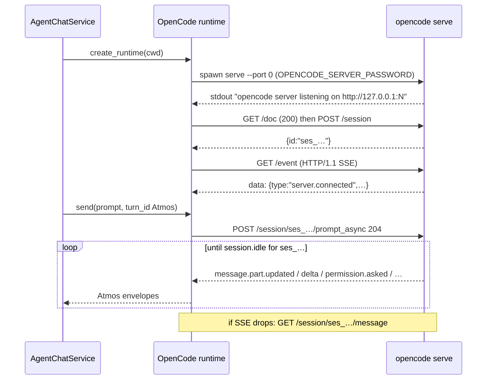

# TECH · APP-068 reference: Native OpenCode

> Implementer HOW for Chat’s OpenCode host. Addresses PRD **M15–M16**. Parent lock: [../TECH.md](../TECH.md) § OpenCode. Siblings: [runtime.md](./runtime.md), [events.md](./events.md), [tools.md](./tools.md), [descriptor.md](./descriptor.md). Do not implement production code from this file.

This slice is the **OpenCode `serve` HTTP+SSE adapter**. Vendor HTTP stays inside `crates/agent/src/providers/opencode/`. It is **not** an Atmos REST chat API ([ws-contract.md](./ws-contract.md)). Terminal APP-024 keeps `resources/terminal-agents/builtin_agents.json` `id: opencode` → `params: "run --format json"`. Chat **overrides** spawn to `opencode serve`. Steer is a second `prompt_async` with `delivery: "steer"` on the running turn — not queue, not abort+resend, and not OpenCode's own TUI follow-up.

## Scope

| In | Out |
|----|-----|
| One `serve` process per live Chat; HTTP/1.1 client; SSE bus → Atmos events/tools | `@opencode-ai/sdk` in Atmos Server |
| `send` / `cancel` / `close` / `next_event` + `RespondPermission` + `SetConfig` + `Steer` (`delivery:"steer"`) | OpenCode TUI follow-up / vendor queue as Atmos queue |
| Permission + `question.asked` mapping; model/`variant` on prompt | Fork / summarize / share / revert / TUI `/tui/*` (N4) |
| Fixtures S20 / S21 / S23 | Attaching to the user’s interactive TUI server |
| Kill **this** Chat’s `serve` on `close` | Sharing one `serve` across Chats (Orca does; Atmos must not) |

## MUST / MUST NOT

| MUST | MUST NOT |
|------|----------|
| Spawn `opencode serve --hostname 127.0.0.1 --port 0` with generated `OPENCODE_SERVER_PASSWORD` | Use Terminal argv `opencode run --format json` for Chat |
| Parse the listening URL from stdout; health-check `GET /doc` = 200 | Assume port `4096`; bind `0.0.0.0`; enable `--mdns` |
| Force **HTTP/1.1** on every request including SSE | Allow HTTP/2 / h2c (POST with a body hangs) |
| Open `GET /event` **before** `POST …/prompt_async`; filter by `sessionID` | Drive turns with blocking `POST …/message` as the live path |
| Treat `session.idle` (this `sessionID`) as vendor turn complete | Dual-write Atmos `queue.json` onto OpenCode's own queue |
| Permission: `POST /session/:id/permissions/:permissionID` `{response, remember?}` | Older `/permission/:id/reply` unless live `/doc` still lists only that |
| SSE best-effort: on drop/reconnect, reconcile `GET /session/:id/message` | Fail the Atmos turn solely because SSE ended early |
| Unknown bus `type` → skip or one `Unknown`; session continues (M16) | Route Chat through `opencode acp` |
| `kill_on_drop(true)` on **this** child; `close` kills this `serve` | Attach to / hijack a TUI that the user already started |

## Sources (pin, then record)

| What | URL |
|------|-----|
| Official server (spawn flags, basic auth, OpenAPI `/doc`, session/message/event tables) | https://opencode.ai/docs/server/ |
| Official SDK (same OpenAPI; `session.prompt` body `model: {providerID, modelID}`; `event.subscribe`) | https://opencode.ai/docs/sdk/ |
| Official ACP (editor stdio bridge — **not** Chat) | https://opencode.ai/docs/acp/ |
| Permission outcomes `once` / `always` / `reject` | https://opencode.ai/docs/permissions/ |
| Models `provider/model` + **variant** (thinking / reasoning effort) | https://opencode.ai/docs/models/ |
| Native host that already speaks this wire (HTTP/1.1, SSE-before-prompt, idle = result, reconcile) | https://github.com/VirtusLab/orca/blob/master/adr/0014-opencode-server-driver.md |
| Serve stdout line (parse this; do not guess the port) | https://github.com/anomalyco/opencode/blob/dev/packages/opencode/src/cli/cmd/serve.ts |
| Official JS spawn + URL regex | https://github.com/anomalyco/opencode/blob/dev/packages/sdk/js/src/server.ts |

Pin the **CLI version** used for fixtures in `testdata/README.md`. Re-record when `/doc` paths or event names move. Do not codegen a Rust SDK from `/doc` at runtime.

OpenAPI: `GET http://<host>:<port>/doc` is the published spec (OpenAPI 3.1). Official table currently labels it “HTML”; live servers have also returned JSON (`application/json`). Health = **HTTP 200**, then inspect `paths` for `/session` and `/event`. Prefer `GET /global/health` `{healthy, version}` as a second probe. Snapshot `/doc` JSON into `testdata/openapi-doc.json` when recording.

## Architecture

```text
AgentChatService.ensure_runtime
    └─ OpenCodeNativeProvider
           create_runtime / resume_runtime
               spawn.rs     serve child + parse URL + basic auth
               http.rs      HTTP/1.1 reqwest (http1_only)
               codec.rs     SSE `data:` framing
               rpc.rs       session / prompt_async / abort / permissions / providers
               event_map.rs bus envelope → AgentEventEnvelope
               tool_map.rs  part.type + tool name → AgentTool
               testdata/    recorded SSE + /doc shapes  (S20, S21, S23)
```



Client ↔ Atmos remains `/ws` `agent_chat_*`. No new `WsAction`. No Computer REST wrapper.

## Isolation (locked — do not copy Orca’s shared server)

Orca ADR 0014 shares **one** `serve` for a whole run. Atmos Chat is the opposite:

- **One `serve` process per live `chat_id`.** Cwd = chat workspace. Second Chat → second process, second port, second password.
- Bind **`127.0.0.1` only**. Never `--hostname 0.0.0.0`.
- Generate `OPENCODE_SERVER_PASSWORD` (cryptographic random). Username default `opencode` ([server auth](https://opencode.ai/docs/server/)). Pass both to the child env. HTTP client sends matching Basic auth. Do not log the password.
- **Do not attach** to a user TUI. Official docs: the TUI **is** a client of an in-process server; `opencode serve` starts a **new** server. Chat always starts its own. `/tui/*` is for IDE plugins driving a TUI — unused here.
- Do not pass `--pure` (drops configured providers). Inherit the user’s `opencode` auth/config (`~/.config/opencode`, `ANTHROPIC_API_KEY`, …) like any CLI.
- `x-opencode-directory: <chat cwd>` on every request (including SSE). Serve loads the instance from that header ([serve.ts](https://github.com/anomalyco/opencode/blob/dev/packages/opencode/src/cli/cmd/serve.ts)).

`opencode acp` ([ACP docs](https://opencode.ai/docs/acp/)) is the editor JSON-RPC façade. Parent TECH: it is lossy versus the TUI/`serve` path (parts, permission dialect, `question.asked`, SSE). Chat MUST NOT spawn `opencode acp`.

## Spawn (`spawn.rs`)

```text
cmd:   <catalog cmd, usually "opencode">
args:  serve --hostname 127.0.0.1 --port 0
cwd:   chat workspace
stdio: piped stdout/stderr; stdin unused
env:   OPENCODE_SERVER_PASSWORD=<generated>
       OPENCODE_SERVER_USERNAME=opencode   # optional; default is already this
kill_on_drop: true   # same pattern as crates/agent/src/acp_client/process.rs
```

**Port 0 is not “use 4096”.** Current listen code tries **4096 first**, then a random free port if that fails. The only stable address is stdout:

```text
opencode server listening on http://127.0.0.1:<port>
```

Parse like the official SDK: line starts with `opencode server listening`, then `on\s+(https?:\/\/[^\s]+)`. Timeout (suggest 15s, longer than SDK’s 5s). Also drain stderr into the same buffer (SDK does). If the process exits, fail spawn with combined output.

Then:

1. `GET /doc` until 200 (Orca: `/` may 404; `/doc` is the health that worked).
2. `POST /session` `{ title? }` → `{ id: "ses_…" }` = `AgentPersistenceHandle`. Atmos `chat_id` is never this string.
3. Open SSE (below). Wait for `server.connected`.
4. Optional: `GET /config/providers` → `ConfigChanged` so live pickers match the serve process.

**`resume_runtime`:** spawn a **new** `serve` (new port, new password). `GET /session/:id`; if 200, reuse that `ses_…` on later `prompt_async`. If 404, return `NotFound` — do not silently `POST /session` and orphan the handle. Restore-without-spawn stays a host rule (`get` never calls this).

**`close`:** `POST /session/:id/abort` if a turn is live; close the SSE body; `POST /instance/dispose` best-effort; then drop the child (SIGTERM via `kill_on_drop`). Never leave a stray `serve` on a random port.

## HTTP/1.1 client (`http.rs`)

`crates/agent/Cargo.toml` already has `reqwest` 0.12 (`rustls-tls`, `json`). Add **`stream`**. Build one client per runtime:

```rust
reqwest::Client::builder()
    .http1_only()          // REQUIRED
    .timeout(/* RPC */)    // SSE: no short timeout; dedicated client or `timeout(None)`
    .build()
```

ADR 0014: OpenCode’s h2c upgrade **hangs `POST` with a body** (first `POST /session` never returns if the client speaks HTTP/2). Atmos will hit this with tokio/reqwest the same way the JDK did. Unit-test the builder (`http1_only` set) — S20 spawn helper signal.

Every call: Basic auth, `Accept: application/json` (SSE: `text/event-stream`), `x-opencode-directory`. JSON bodies for RPC. `prompt_async` expects **204** empty body — do not deserialize it as JSON.

Do not use `GET /global/event` for Chat. Directory-scoped `GET /event` is the bus. Query `directory` may be sent; **session filter is client-side** (`properties.sessionID`). ADR 0014 confirmed `/event` has no session query param.

## Chat loop (`rpc.rs` + `codec.rs`)

Live turn (after SSE is up):

```http
POST /session/{ses_…}/prompt_async
Content-Type: application/json

{
  "parts": [{ "type": "text", "text": "<user>" }],
  "model": { "providerID": "anthropic", "modelID": "claude-sonnet-4-5" },
  "variant": "high"
}
```

- `parts`: Chat text; file/image parts only if `/doc` `Part` union includes them and Chat attachments exist. Do not invent MCP parts.
- `model`: split catalog id on the **first** `/` (model ids may contain more slashes: `lmstudio/google/gemma-3n-e4b` — [models](https://opencode.ai/docs/models/)).
- `variant`: thinking / reasoning overlay from `current_config.thinking` when the selected model advertises that variant ([models variants](https://opencode.ai/docs/models/)). Omit if none. Unknown variant fails OpenCode model resolution — do not send a guessed `low`/`high`.
- Do **not** send `format` JSON-schema (Orca needs it; Chat does not).
- Do **not** set `tools: { question: false }` unless we explicitly decide Chat never asks — v1 leaves `question` enabled and maps `question.asked`.

`send` returns Atmos `turn_id` unchanged. Store `ses_…` (and last assistant `messageID` if present) privately. Envelope `turn_id` is always the Atmos epoch.

**Cancel:** `POST /session/:id/abort` → `true`. Then wait for `session.idle` or treat abort as `TurnCanceled` if the bus goes quiet.

**Do not** use `POST /session/:id/shell` for execute cards. Shell/bash **tool parts** on the SSE bus are the execute observation. `POST /session/:id/command` is slash-command, not Chat send.

## SSE codec (`codec.rs`)

Wire is SSE, not NDJSON. S23: split on `\n`, ignore comments (`:`), ignore `event:` / `id:` unless needed, parse **`data:`** JSON. Concatenate multi-line `data:` per SSE spec. Blank line ends the event.

Envelope (ADR 0014 spike): `{ id, type, properties }`. First event: `type: "server.connected"` (properties often empty). Keepalives: `server.heartbeat` — **ignore**.

Filter:

- No `properties.sessionID` → only handle `server.connected` / `server.heartbeat`. Drop the rest or `Unknown`.
- `properties.sessionID !=` this Chat’s `ses_…` → drop (even though isolation means one session, the bus is directory-wide).

**Turn complete = `session.idle` for this `sessionID`.** Emit Atmos `TurnCompleted` (host `finish_turn` still stamps timing). Mirror of Codex `turn/completed`. Do not wait for `prompt_async` (it already returned 204).

**`session.error`** (or `message.updated` `info.error`): `TurnFailed`. Still idle after some errors — idle wins as the closer if both fire; do not emit two host turn-ends.

SSE is **best-effort**. Reconnect on drop. On `server.connected` after reconnect, **immediately** `GET /session/:id/message` and fold any parts not yet mapped (same `tool_map` / text accrual). If idle already happened while disconnected, synthesize `TurnCompleted` from the last assistant `info`. Do not block forever on a dead stream.

## Event map (`event_map.rs`)

| OpenCode `type` | Atmos |
|-----------------|-------|
| `server.connected` | internal (SSE ready); not a Chat event |
| `server.heartbeat` | omit |
| `message.part.delta` `{field:"text", delta}` | `AssistantMessageDelta` |
| `message.part.delta` `{field:"reasoning", delta}` | `ThinkingDelta` |
| `message.part.updated` `part.type == "text"` | snapshot text; prefer delta when present |
| `message.part.updated` `part.type == "tool"` `state.status == running` | `ToolCallStarted` / `Updated` |
| `message.part.updated` tool `completed` / `error` | `ToolCallCompleted` / `Failed` — **authoritative result** |
| `message.part.removed` | omit or fail that tool if in-flight |
| `message.updated` assistant | capture `info.tokens` / `cost` / `error` → `UsageUpdated`; do not dual-store raw `info` on mapped text |
| `permission.asked` | `PermissionRequested` (`request_id` = `properties.id` `per_…`) |
| `permission.replied` | `PermissionResolved` |
| `question.asked` | see below |
| `session.idle` | `TurnCompleted` |
| `session.error` | `TurnFailed` |
| `session.status` / `session.updated` / `session.diff` / `session.next.*` | omit |
| anything else | omit **or** one `Unknown { event_type, payload: properties }` — never panic |

Do not emit adapter `TurnStarted` / `UserMessage` for the user’s send (host already did). Tool `id` / `callID` → `AgentTool.tool_call_id`. Thinking/plan/todo fold here, not as tool kinds ([tools.md](./tools.md)).

## Tools (`tool_map.rs`)

Parent tool table, OpenCode column:

| Atmos kind | OpenCode part / tool name (typical build agent) |
|------------|--------------------------------------------------|
| `execute` | `bash` / shell — `params.command` from `state.input`; `result.Execute.output` + exit if present |
| `read` | `read` — path |
| `edit` | `edit` / `write` / `patch` — path; diff stats if the part has them |
| `search` | `grep` / `glob` / find — **workspace** search, not `web_search` |
| `web_search` | `websearch` / `web-search` |
| `fetch` | `webfetch` |
| `skill` | `skill` |
| `subagent` | `task` / child session |
| fold | `reasoning` / plan / `todowrite` → thinking/plan events |
| `other` | unknown `part.tool` / `part.type` — params/result **are** vendor `input`/`output` once |

Map by vendor **tool name** first, then generic extractors in `domain/tool_map.rs`. Never `web_search` → workspace `search`.

## Permission (S21)

Official: `POST /session/:id/permissions/:permissionID` body `{ response, remember? }` ([server](https://opencode.ai/docs/server/)). `response` values match the ask UI: `once` | `always` | `reject` ([permissions](https://opencode.ai/docs/permissions/)).

`permission.asked` properties (ADR 0014 live spike): `{ id: "per_…", sessionID, permission, patterns, always, metadata, tool: { messageID, callID } }`.

Emit `PermissionRequested` with Atmos options whose `option_id` the adapter understands:

| Atmos `option_id` | HTTP body |
|-------------------|-----------|
| `once` / `allow_once` | `{ "response": "once" }` |
| `always` / `allow_always` | `{ "response": "always" }` (`remember: true` if `/doc` documents it as a separate flag — pin from recorded spec; do not send both if they duplicate) |
| `reject` / `reject_once` | `{ "response": "reject" }` |

`AgentAction::RespondPermission { request_id, option_id }`: `request_id` is `per_…`. Unknown `option_id` → `NotFound`, do not guess `once`. Missing pending id → `NotFound`. `close`/`cancel` must not leave the vendor Deferred hanging: abort the session (abort rejects in-flight work) rather than invent a reply.

Prefer this **session-scoped** path over ADR 0014’s older `POST /permission/{id}/reply` `{reply: once|always|reject}`. If fixture `/doc` lacks `/session/{id}/permissions/{permissionID}`, fall back to whatever `/doc` lists — record that choice in `testdata/README.md`. Golden HTTP body is the S21 signal.

TUI-started permissions cannot be answered on a different process ([issue 36835](https://github.com/anomalyco/opencode/issues/36835)). Another reason Chat never attaches to the user TUI.

## `question.asked`

Not the same pending store as permissions. Event: `question.asked` with `QuestionRequest { id: "que_…", sessionID, questions: [{question, header, options:[{label,description}], multiple?, custom?}], tool? }` (ADR 0014).

**Mapping (decisive):**

- If `questions` has answerable `options`, emit `PermissionRequested` (reuse Chat permission chrome) with `request_id = que_…` and `option_id` = selected **label**(s). Adapter remembers this id is a **question**, not `per_…`.
- `RespondPermission` then `POST` the question reply, **not** the permission route.
- Reply path: pin from live `/doc`. Historical: `POST /question/{requestID}/reply` `{"answers":[["Label"]]}` (one inner array per question). Newer HttpApi: `POST /session/{sessionID}/question/{requestID}/reply` (204). Reject: `…/reject`.
- Multi-select (`multiple: true`): if Chat chrome is single-option only, emit `Unknown { event_type: "question.asked", payload }` **and** keep the pending id; if the user never answers, `cancel`/`close` must `reject` so the turn cannot wedge.
- Empty / unanswerable payload: `Unknown` + auto `reject`. Do **not** drop the vendor wait without reject — that stalls `session.idle`.

Do not disable the `question` tool on Chat turns.

## Models / configure

`GET /config/providers` → `{ providers: Provider[], default: { [providerID]: modelID } }` ([server](https://opencode.ai/docs/server/)). Map into `supported_options.models` as `providerID/modelID` strings. Variants for the selected model become thinking options when catalog/serve expose them; omit the thinking control when the model has none (M3).

`SetConfig`: store `providerID`/`modelID`/`variant` on the runtime; **next** `prompt_async` sends them. OpenCode has no separate set-model RPC. Do not `PATCH /config` for a Chat model switch (that mutates the user’s global OpenCode config).

`capabilities_for_provider("opencode")`: steer **Supported**, resume/permission/configure **Supported** ([descriptor.md](./descriptor.md)). `action(Steer)` while a turn is running → second `POST /session/{id}/prompt_async` with `delivery: "steer"`. Do not replace `running_turn`. Idle still closes the original Atmos `turn_id`. Atmos `queue.json` is the queue SOT — do not omit `delivery` (that would use OpenCode's own follow-up).

## Files

```text
crates/agent/src/providers/opencode/
  mod.rs           OpenCodeNativeProvider
  spawn.rs         argv, env, URL parse, kill
  http.rs          HTTP/1.1 + basic auth + directory header
  codec.rs         SSE data: parser
  rpc.rs           POST/GET helpers; prompt_async 204
  event_map.rs
  tool_map.rs
  testdata/README.md          CLI version + /doc date
  testdata/openapi-doc.json   recorded GET /doc
  testdata/sse-turn.sse       S20 + S23
  testdata/permission-asked.json
  testdata/permission-respond.body.json   S21
  testdata/question-asked.json
crates/agent/src/providers/mod.rs         chat_provider_kind "opencode"
crates/core-service/.../acp_factory.rs    NativeOpenCode arm
```

Reuse `reqwest`; do not add a Node SDK. Public crate API: `providers::opencode::OpenCodeNativeProvider` only.

## Fixtures (S20 / S21 / S23)

Record from a real `opencode serve` (version in README). Canned `data:` lines, no live CLI on CI.

**S20 — map + spawn contract**

- Given: `sse-turn.sse` containing `server.connected`, `message.part.updated` (text + tool running/completed), `permission.asked`, `session.idle`; plus `/doc` prompt_async + permission path.
- Then: text → assistant deltas; tool → Atmos `execute`/`other` as mapped; `session.idle` → turn complete; `action(Steer)` sends `delivery:"steer"`; spawn helper documents HTTP/1.1 + `127.0.0.1` + password env.
- Signal: fixture equality; client builder test asserts HTTP/1.1.

**S21 — permission dialect**

- Given: `permission.asked` fixture + `RespondPermission { request_id: "per_…", option_id: "once" }`.
- Then: HTTP is `POST /session/ses_x/permissions/per_…` with body matching recorded `{response:"once"}` (or `/doc` equivalent). Question fixture uses the question URL, not this one.
- Signal: golden request path + JSON.

**S23 — framing**

- Given: raw bytes with `data: {…}\n\n`, comment lines, split JSON across two `data:` lines if recorded.
- Then: `codec` yields one envelope per event; does not JSON-parse the `data:` prefix; ignores heartbeats.
- Signal: unit tests on raw bytes (no reqwest).

Also cover S22: inject an unknown `type` in the middle of a valid turn — remaining events still map.

## Rollout

1. `providers/opencode` codec + maps + fixtures green (no spawn). Steer body includes `delivery:"steer"`.
2. `http.rs` HTTP/1.1 + spawn URL parser tests (fake stdout).
3. Wire `chat_provider_kind("opencode")` → this provider in `acp_factory.rs` (S24). Terminal `builtin_agents.json` `params` **unchanged**.
4. Manual live: one Chat, confirm a unique `serve` on `127.0.0.1`, password required, close kills it.

## Risks

- **h2c hang:** first POST never returns. Mitigation: `http1_only()` on the only client.
- **Port 0 → 4096 collision:** two Chats, or a user TUI, can occupy 4096; parse stdout or Chat 2 wedges.
- **Process leak:** shared-server designs (Orca) are easier; Atmos close **must** kill this child (runtime.md risk).
- **SSE gap:** idle missed → turn looks stuck. Reconcile `GET /session/:id/message` + `/session/status`.
- **`/doc` drift:** permission field `response` vs old `reply`. Fixtures + README pin; prefer live `/doc` over this file if they disagree.
- **If this breaks:** route `opencode` back to ACP only as an emergency host flag — never by editing Terminal `run --format json`. Rollback is adapter routing, not catalog argv.

## Dependencies

- Parent TECH OpenCode subsection (locked). APP-067 spawn gate / restore ≠ spawn.
- Domain slices (descriptor, runtime, events, tools) land first.
- External binary: `opencode` on PATH / provisioned `cmd`. Auth is the user’s OpenCode login, not Atmos.
