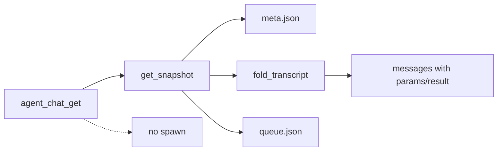

# Persistence · APP-068 (M12)

> Sibling HOW for chat files. Parent contract: [../TECH.md](../TECH.md) (Data model). Product: [../PRD.md](../PRD.md) M12. APP-067: [../../APP-067_atmos_agent_abs/TECH.md](../../APP-067_atmos_agent_abs/TECH.md) — file SOT, restore ≠ resume/spawn.

Addresses **M12** (and M13 persistence gates). Event/tool *types* live in [descriptor.md](./descriptor.md) / [events.md](./events.md) / [tools.md](./tools.md). This slice owns how they hit disk and how `agent_chat_get` paints them without a process.

## Scope

Replace the APP-067 jsonl payload and `meta.json` chrome SOT. Keep the directory, append-only log, atomic JSON, per-chat mutex, queue, attachments, and restore-without-spawn.

Out of this file: native/ACP spawn, WS action names, web classifiers.

## Locked layout

Canonical root: `~/.atmos/data/agent/chats/` via `default_chats_dir()` in `crates/core-service/src/service/agent_chat/mod.rs`. Override: `ATMOS_AGENT_DATA_DIR` (that dir **is** `…/agent`; chats are `{that}/chats`). Never nest under Desktop `ATMOS_DATA_DIR`. Never write chat rows into `~/.atmos/data/db/atmos.db`.

[`agents/references/runtime/atmos-home-layout.md`](../../../../agents/references/runtime/atmos-home-layout.md) still shows `data/agent/sessions/`. Chat SOT is **`data/agent/chats/`** (APP-067). Layout doc should list `agent/chats/` when that reference is next edited. Do not revive `agent/sessions/` as Chat storage.

```text
~/.atmos/data/agent/chats/
  index.json
  {chat_id}/                          # UUID; cwd is not in the path
    meta.json
    transcript.jsonl
    queue.json
    attachments/
```

`cwd` lives only in `meta.json`. `chat_id` must never equal `persistence_handle` (vendor session/thread id, filled on spawn, unused on get).

## MUST / MUST NOT

| MUST | MUST NOT |
|------|----------|
| Append one Atmos envelope per durable observation | SQLite `agent_sessions` / `agent_events` / any chat table |
| Store tools as `kind` + `params` + `result` only | Persist `input` / `output` / `content` / `native` on a tool |
| Snapshot `descriptor` on `meta.json` | Keep `supports_steer`, `session_config_options`, `selected_model`, `selected_thinking`, `selected_mode` |
| `get` / fold from files only | Spawn, `create_runtime`, or `resume_runtime` on open/history |
| Throttle assistant/thinking snapshots (~100ms) | Append every token delta |
| Skip a jsonl line that is not the new envelope | Migrator, remap-on-read, rewrite old lines, client fallback |

## Architecture

```text
agent_chat_get  →  AgentChatStore::get_snapshot  →  meta + fold jsonl + queue
agent_chat_send →  AgentChatService (may spawn)  →  apply_event.rs appends jsonl
```

Writer: `apply_event.rs` (and `queue.rs` for the user/turn lines it already writes). Reader: `store.rs` `fold_transcript`. One process; `AgentChatStore` per-`chat_id` mutex. `apps/api` constructs the store with `default_chats_dir()` (`apps/api/src/api/ws/router/mod.rs`).



## `meta.json` (atomic)

Identity / runtime fields stay. Configuration chrome is **only** `descriptor`.

Keep: `id`, `created_at`, `updated_at`, `deleted`, `title`, `cwd`, `workspace_id`, `project_id`, `space_id`, `origin`, `provider_id`, `last_message_at`, `last_event_seq`, `persistence_handle`, `runtime_status`, `available_commands`, `session_usage`.

Keep host bookkeeping (not picker SOT): `applied_model` / `applied_thinking` / `applied_mode` — last values actually given to a live runtime, used for session-config-change parts. They are not duplicates of `selected_*`.

Drop from the struct and from new writes: `supports_steer`, `session_config_options`, `selected_model`, `selected_thinking`, `selected_mode`. Steer SOT is `descriptor.capabilities.steer`. Picker SOT is `descriptor.supported_options` + `descriptor.current_config`.

```json
{
  "id": "uuid",
  "cwd": "/path",
  "provider_id": "claude",
  "persistence_handle": null,
  "runtime_status": "detached",
  "last_event_seq": 0,
  "descriptor": {
    "identity": { "id": "claude", "name": "Claude Code", "version": null },
    "capabilities": {
      "steer": "unsupported",
      "resume": "supported",
      "permission": "supported",
      "configure": "supported"
    },
    "supported_options": {
      "models": [{ "id": "opus", "label": "Opus", "is_default": true }],
      "thinking": { "type": "enum", "arg": "--effort", "options": ["low", "high"] },
      "modes": []
    },
    "current_config": { "model": "opus", "thinking": "high", "mode": null }
  }
}
```

`create` (`store.rs`): write a descriptor from catalog (or identity-from-`provider_id` + empty options if catalog is cold) and `current_config` from the create request (`model` / `thinking` / `mode`). Live runtime: `update_meta` from `AgentRuntime::descriptor()`. `configure` (`service.rs`): mutate `descriptor.current_config` only — today’s writes to `selected_model` / `selected_thinking` / `selected_mode` go away.

Call sites that still read `selected_*` must switch in the same cut:

- `pending_session_config_change` / `keep_pending_session_selection` in `types.rs` — compare `applied_*` to `descriptor.current_config`, not `selected_*`.
- Composer/WS meta mapping — [ws-contract.md](./ws-contract.md); no parallel selected fields on the DTO.

Old `meta.json` without `descriptor`: deserialize with a default stub (`identity.id = provider_id`, capabilities unsupported/unknown defaults, empty options, `current_config` all null). **Do not** copy leftover `selected_*` into `current_config` (that is a migrator). Next atomic write persists the new shape and omits dropped keys.

## `transcript.jsonl`

One JSON object per line = `AgentEventEnvelope` (`crates/agent` domain; parent TECH Event envelope):

```json
{
  "event_id": "uuid",
  "turn_id": "uuid",
  "timestamp": "2026-09-01T00:00:00Z",
  "event": { "type": "tool_call", "tool": { } }
}
```

`event` is a tagged Atmos kind (`type` snake_case). Host WS `sequence` is **not** on the line; it stays `meta.last_event_seq` + `agent_chat_event.sequence`.

Serde: internally tagged `event` (`#[serde(tag = "type", rename_all = "snake_case")]`). Do not `flatten` leftover vendor keys onto `AgentTool`. Unknown fields on `AgentTool` must not revive `input`/`output`.

Replace `TranscriptRecord` in `crates/core-service/src/service/agent_chat/types.rs`. Do not keep a parallel log format. `queue.rs` and `apply_event.rs` construct envelopes, not the old record enum.

**Append (durable):** `turn_started`, `user_message` (including `kind: steer`), coalesced `assistant_snapshot` / `thinking_snapshot`, tool upserts, `plan`, `permission` (requested/resolved), `turn_completed` / `turn_failed` / `turn_canceled` (include today’s `worked_ms` / `thinking_ms` / `usage` / `error` on the completed record), `usage`, host chrome (`session_lifecycle`, `session_config_change`, `session_hint`).

**Never append:** `assistant_message_delta`, `thinking_delta`. WS still streams those. Disk snapshot cadence remains `ASSISTANT_SNAPSHOT_INTERVAL` (100ms) in `apply_event.rs`.

Tool upsert line — `event.type` may be `tool_call` (one observation; status distinguishes started/updated/completed/failed). Payload is `AgentTool`, not `AgentToolCall`:

```json
{
  "event_id": "…",
  "turn_id": "…",
  "timestamp": "…",
  "event": {
    "type": "tool_call",
    "tool": {
      "tool_call_id": "tool-1",
      "name": "bash",
      "title": "ls",
      "kind": "execute",
      "status": "completed",
      "params": { "type": "execute", "command": "ls", "background": false },
      "result": { "type": "execute", "output": "a.txt\n", "exit_code": 0 }
    }
  }
}
```

No second vendor copy. Thinking/plan are adapter-folded **before** persist (`events.md` / `tools.md`); jsonl must not store a think-tool as `kind: other` for the host to reclassify.

`append_record`: serde line + `\n` + `sync_all` on the jsonl fd (today’s `store.rs`). Create still touches an empty `transcript.jsonl`.

## Atomic JSON writes

`atomic_write_json` in `store.rs`: `{name}.tmp` → write → `sync_all` → `rename` onto `meta.json`, `queue.json`, `index.json`. Never rewrite jsonl except append.

`next_seq` is in-memory (overlay via `apply_live_seq`). `persist_seq` fsyncs `last_event_seq` on **non-delta** emits only (`emit_live` already skips deltas). Do not fsync meta per token (APP-067 REV-012 / REV-035).

## Fold projector

`fold_transcript` / `apply_record` in `store.rs` project envelopes → `FoldedTurn` → `flatten_messages` → snapshot `messages`.

Rules (keep APP-067 fold bugs fixed):

- Same `message_id` / `tool_call_id`: later line wins; merge tool so a later line with `result` and omitted `params` **keeps** prior `params` (today’s `merge_tool_call_part`, but `params`/`result` not `input`/`output`).
- Assistant snapshot updates the text part only; it must not drop tool/plan/thinking parts (REV-020).
- Process parts stay above the final answer (`order_assistant_parts`).
- `last_pending_permission` still scans permission envelopes; pending is the last `status == pending`.
- **Do not** call `agent::classify_tool` (or think/plan-from-tool-name) in the store. Classification already happened in the adapter. Fold trusts `kind` / `params` / `result`.

`MessagePart::ToolCall` in `types.rs` (and WS DTO in the ws-contract slice) becomes `kind` + `params` + `result`. Delete `input` / `output` / `content`.

## Restore ≠ spawn (APP-067 M5)

`AgentChatService::get` (`service.rs`) calls `store.get_snapshot` then overlays in-memory `RuntimeState` **only if** that `chat_id` is already in the live runtime map and `alive`. It must not call `ensure_runtime` / `spawn_runtime` / `create_runtime` / `resume_runtime`.

Continue (send / queue dispatch / steer) is the only spawn/resume path, using `meta.persistence_handle` when present. Opening history with a handle still does not resume.

After process restart, `runtime_status` on disk may be stale; get still does not spawn. Treat transcript `Running` as busy chrome without starting a provider (APP-067 pump-end rules unchanged).

## Pre-APP-068 jsonl (not a reader target)

**Pick: empty tools, not fail-get.** Parent: no compatibility reader; dogfood chats may not paint tools.

`fold_transcript` already skips a line when `serde_json::from_str` fails. Keep that. A pre-envelope line (`{"type":"tool_call","tool_call":{"input":…}}` without the envelope wrapper / `AgentTool`) does not deserialize → **drop the line**. User text that still matches a new variant may paint; tools typically vanish.

Do **not**: remap `input`→`params`, rewrite the file, detect “old format” and error `agent_chat_get`, or add a `format_version` migrator. No tests that assert old tools round-trip (TEST: no old-jsonl reader tests). Users may delete the conversation.

Corrupt UTF-8 / IO on the file: fail `get` (existing `io_err`). That is not an old-format path.

## `queue.json` / `attachments/` / `index.json`

Unchanged APP-067:

- `queue.json`: atomic array `{ id, seq, status, prompt, display_prompt, attachments }`. Atmos queue SOT; do not also enqueue on Pi `follow_up`.
- `attachments/`: `save_attachment` timestamp-prefix + sanitize; `path_within_root` / `path_or_existing_parent_within_root`. Upload REST `POST /api/agent/upload-attachments` stays.
- `index.json`: list summaries; rebuild by scanning `*/meta.json`. No descriptor required on the index row.

Soft-delete: `meta.deleted = true`; directory remains.

## Files to change

| Path | Change |
|------|--------|
| `crates/core-service/src/service/agent_chat/types.rs` | `AgentChatMeta.descriptor`; drop listed fields; `MessagePart::ToolCall` params/result; replace `TranscriptRecord` with envelope |
| `crates/core-service/src/service/agent_chat/store.rs` | create/update meta; fold without `classify_tool`; skip unknown lines |
| `crates/core-service/src/service/agent_chat/apply_event.rs` | persist envelope + `AgentTool`; stop classifying on ingest once adapters emit Atmos tools |
| `crates/core-service/src/service/agent_chat/queue.rs` | write envelope turn/user lines |
| `crates/agent/src/domain/event.rs` | `AgentTool` on tool events (see tools slice) |
| `apps/api` + `packages/api-types` | snapshot/meta DTO — [ws-contract.md](./ws-contract.md) |

No infra migration. No new `WsAction`.

## Rollout (persistence cut)

1. Domain `AgentEventEnvelope` + `AgentTool` compile in `crates/agent`.
2. `types.rs` + `store.rs` write/read the new meta/jsonl; unit fold tests with `params`/`result`.
3. `apply_event.rs` / `queue.rs` append envelopes only (no dual-write of old `TranscriptRecord`).
4. Wire/web consume snapshot fields (other slices). Do not land a transitional schema.

## Tests (TEST S13 / S14)

- `cargo test -p core-service --lib agent_chat`: `get` on a fixture jsonl with `params`/`result` → snapshot tool part has those fields, no `input`/`output`/`native`; fake provider `create_count()==0` (extend `s4_get_does_not_spawn_provider`).
- Keep APP-067 store tests: identity ≠ handle, list/rename/delete, snapshot does not clobber tools, merge keeps params, `next_seq` does not rewrite meta per bump.
- Do not add a “load old jsonl and show Read cards” test.

## Risks

- **Empty tools on old files** (locked): simplest host; matches APP-067 “no users to preserve.” Rollback is revert this cut; there is no forward migrator.
- **Fold without `classify_tool`:** thinking/plan must be events before persist. If an adapter still emits raw think-tools, history shows `other` instead of reasoning — fix the adapter, not the store.
- **If this breaks:** new chats still work; old jsonl is out of scope; Terminal APP-024 is unchanged.
