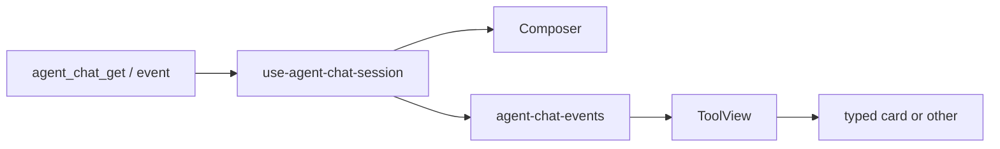

# TECH · APP-068 slice: Web composer + tool cards

> Implementer HOW for `apps/web` Agent Chat. Parent contract: [../PRD.md](../PRD.md) **M10** (also composer honesty **M1–M4**, **M11** `other` card, **M13** APP-067 product). Sibling DTOs: [descriptor.md](./descriptor.md), [tools.md](./tools.md), [ws-contract.md](./ws-contract.md). Do not implement production code in this pass.

## Scope summary

Web **reads** Atmos `AgentDescriptor` and `AgentTool` (`kind` + `params` + `result`). It does **not** map vendors. Delete live-path classifiers. Keep APP-067 chrome (center Chat, queue vs steer vs stop, permission card, restore ≠ spawn). No new `/ws` actions. No ACP schema imports (APP-067 M15). N1 workspace hit-lists stay deferred: `search` with `result: Text` renders text.

Addresses **M10**. Composer visibility is **M1–M4**. Generic card is **M11**. History paint is **M12** (consume stored contract; no remap-on-read).

## Architecture

```text
descriptor + AgentTool   (main /ws agent_chat_*)
        │
        ▼
use-agent-chat-session.ts     composer options + steer gate
        │
        ├─ AgentPromptComposer     model / thinking / mode / steer
        ├─ agent-chat-events.ts    fold kind/params/result as-is
        └─ ToolView                switch(part.kind)
              ├ execute  → TerminalBlock
              ├ web_search / fetch / read / edit / … → typed bodies
              └ other    → one generic card (params + result)
```

Vendor HTTP (OpenCode) and native stdio stay server-side. Web never opens those sockets.



## Locked decisions

| Fork | Decision |
|------|----------|
| Kind SOT | Wire `part.kind`. Never `classifyTool(name, input, output)`. |
| Background SOT | `params.execute.background` (+ `task_id`, `command`). Never `background-command/adapters/*`. |
| Result SOT | `part.result` is `AgentToolResult`. `parse-tool-result.ts` **presents** it; it does not sniff vendor envelopes to pick kind. |
| Composer SOT | `meta.descriptor`. Catalog (`agent_model_catalog_get`) only before a chat exists. |
| Deleted meta | `supports_steer`, `session_config_options`, `selected_model` / `selected_thinking` / `selected_mode` as parallel fields. Selection is `descriptor.current_config`. |
| Dual fields | No live read of `input` / `output` / `content` / `native`. No client fallback for pre-APP-068 jsonl. |
| Thinking/plan | Already Atmos parts/events. Client must not re-fold `think` / `TodoWrite` tool names. |
| Poll/hide | Adapter omits poll tools. Web does **not** hide `TaskOutput` by name. If it arrives, it is `other` (one card). |
| Subagent | `kind === "subagent"` only. Nested children are Atmos tool_calls. Delete vendor `lib/agent/subagent/adapters/*` from the Chat live path. |
| ACP | Chat live modules must not import `agent-client-protocol`, `acp_session_id`, or `/ws/agent`. Move `AgentConfigOption` / `AgentPlan` off `use-agent-session.ts`. |

## MUST / MUST NOT

| MUST | MUST NOT |
|------|----------|
| Switch cards on `kind` + typed `params`/`result` | Alias tables: `bash`/`WebSearch`/`run_script`/`_toolName` |
| Hide thinking when `supported_options.thinking` is `none` | Fake a thinking slider from ACP `thought_level` bags |
| Hide mode when `modes` is empty | Render leftover advertised option ids via `extraConfigOptions` |
| Offer steer only if `capabilities.steer === "supported"` | Call `agent_chat_steer` when unsupported (queue instead) |
| Generic `other` card always visible | Dual-store or hide unknown tools |
| Keep `agent_chat_*` + multipart upload | New Chat REST, ACP socket, TypeScript vendor SDKs |

## Files

### Delete (live SOT)

```text
apps/web/src/features/agent/lib/agent/background-command/adapters/claude.ts
apps/web/src/features/agent/lib/agent/background-command/adapters/grok.ts
apps/web/src/features/agent/lib/agent/background-command/adapters/fallback.ts
apps/web/src/features/agent/lib/agent/subagent/adapters/claude-code.ts
apps/web/src/features/agent/lib/agent/subagent/adapters/cursor.ts
apps/web/src/features/agent/lib/agent/subagent/adapters/opencode.ts
apps/web/src/features/agent/lib/agent/subagent/adapters/fallback.ts
```

Delete `classifyTool`, `thinkingText`, `planFromToolInput` (adapter-owned), `EXECUTE_LABELS`, web-search/fetch name heuristics, and `unwrapVendorToolEnvelope` as a kind/path classifier.

### Rewrite

| Path | Change |
|------|--------|
| `lib/agent-tool-kind.ts` | Keep `AgentToolCallPart`, `isActiveToolStatus`, `isGenericToolLabel`. Drop vendor classify. Background helpers read Execute params. |
| `lib/agent/background-command/index.ts` | `isLiveBackgroundToolCall(part)` = `kind === "execute" && params.background && status active`. Display = `params.command`. No `resolveAgentVendor`. |
| `lib/agent-chat-events.ts` | Copy `kind`/`params`/`result` from the event. Stop calling `classifyTool` / `applyBackgroundPollTool`. |
| `lib/chat-helpers.ts` | Activity label from `part.kind` only (add `web_search`). `runningBackgroundTools` uses Execute params. Delete `resolvedActivityKind` classify fallback. |
| `lib/tool-results/parse-tool-result.ts` | Entry: `presentAgentTool(part) → ParsedToolResult`. Keep `languageFromPath`, `hostFromUrl`, path display, favicon host. |
| `lib/tool-results/diff-stats.ts`, `turn-file-changes.ts` | Read `result.diff_stats` / edit params `path`. Do not parse vendor `input`. |
| `hooks/use-agent-chat-session.ts` | Descriptor is picker + steer SOT. Drop `sessionConfigOptions` / `meta.supports_steer`. Drop synthetic ACP `capabilities` (`session_list`, `load_session`, …). |
| `lib/agent-chat-thread.ts` | `descriptorToConfigOptions(descriptor)` replaces `advertisedOptionsToConfigOptions` on the live path. Pre-chat: `catalogToConfigOptions` mapped as `supported_options`. |
| `lib/followup-policy.ts` | Keep `supportsSteer === false → queue`. Source is descriptor. |
| `components/AgentPromptComposer.tsx` | Options from descriptor-backed `configOptions`. Empty groups omitted. No leftover `extraConfigOptions` from unknown ACP ids. |
| `components/ToolView.tsx` | `switch (part.kind)`. Stop classifying child tools. |
| `components/tool-results/AgentToolResultBlock.tsx` | Call `presentAgentTool(part)`. |
| `components/TerminalBlock.tsx`, `BackgroundCommandsDock.tsx` | Command/output from Execute params/result only. |
| `lib/__tests__/no-acp-schema.test.ts` | Chat live tree not on `ALLOW_ACP_ADAPTER`. Ban `classifyTool(` and `background-command/adapters`. |

### Keep (product chrome)

`AgentChatPanel.tsx`, queue dock, permission card, attachments, cwd picker, slash/at popovers, standalone window. Types from `@atmos/api-types/ws/dto/agent-chat` (`AgentDescriptor`, `AgentToolKind` including `web_search`, `params`, `result`). `packages/ui` `AgentsPromptInput` stays; see composer rule for thinking length.

Move `AgentConfigOption` / `AgentPlan` to a Chat-local types module so composer does not import `use-agent-session.ts`.

## Types web consumes

Wire types live in `@atmos/api-types/ws/dto/agent-chat` (ws-contract slice). Chat copies them; it does not invent a parallel shape.

```ts
type AgentToolCallPart = {
  type: "tool_call";
  tool_call_id: string;
  name: string;
  title?: string | null;
  kind: AgentToolKind; // includes "web_search"
  status?: string | null;
  params: AgentToolParams;
  result?: AgentToolResult | null;
};

type ComposerDescriptor = {
  capabilities: { steer: "supported" | "unsupported"; /* resume, permission, configure unused by chrome */ };
  supported_options: {
    models: { id: string; label: string }[];
    thinking: { type: "enum"; options: string[] } | "none";
    modes: { id: string; label: string }[];
  };
  current_config: { model?: string | null; thinking?: string | null; mode?: string | null };
};
```

`descriptorToConfigOptions` emits today's `AgentConfigOption[]` (id `model` / thinking alias / `mode`, `type: "select"`, `options`, `currentValue`) so `AgentPromptComposer` keep splitting with `configKindMatches`. Thinking `none` or empty option lists → omit that option entirely.

## Composer rules

`AgentPromptComposer` already splits model / thinking / mode via `configKindMatches` / `isThinkingConfigId`. Change the **source**, not the chrome.

| Control | Show when | Value | Hide when |
|---------|-----------|-------|-----------|
| Model | `supported_options.models.length > 0` | `current_config.model` | empty models |
| Thinking | thinking is not `none` and options exist | `current_config.thinking` | `none` / missing |
| Mode | `modes.length > 0` | `current_config.mode` | empty modes |
| Steer | `capabilities.steer === "supported"` **and** running `turn_id` | `agent_chat_steer` | unsupported → queue/stop only |
| Extra selects | never in v1 | — | unknown ACP option ids |

**New Chat (no `chat_id`):** `agent_model_catalog_get` → local `supported_options`. Do not wait for `session_config_options`.

**Existing chat:** prefer `snapshot.meta.descriptor`. Catalog may prefetch; it must not override `current_config`.

**Thinking length:** `packages/ui/.../prompt-input.tsx` today uses `thinkingLevels.length > 1`. Change to `length > 0` so a real one-option enum is visible (M3). Empty array omits the control.

**Steer:** `routeBusySubmit` already falls back to queue. `setSupportsSteer` must read descriptor, not `meta.supports_steer`. Settings `followup_policy` may still prefer steer; an unsupported agent must not send steer.

**Configure:** `setConfigOption` still patches local model/thinking/mode then `agent_chat_configure`. Server writes `descriptor.current_config`.

Do not pass `configOptions` that include ACP ids (`thought_level`, raw `configOptions` rows) as a second picker model.

## Session + events

`use-agent-chat-session.ts`:

- On `agent_chat_get` / configure / events that carry meta: `descriptor → configOptions`, `supportsSteer`, `current_config`.
- `persistConfig` payload stays model/thinking/mode fields the WS DTO already accepts (ws-contract slice); UI state is descriptor-shaped.
- `backgroundTools = runningBackgroundTools(messages)` after the helper reads Execute params.

`agent-chat-events.ts` tool fold:

```ts
kind: tool.kind            // required; default "other" only if missing
params: tool.params
result: tool.result
name / title / status / tool_call_id as today
```

`mergeToolPart` must not keep `input`/`output`. Thinking/plan events stay their own part types (APP-067). Client must not convert a tool_call into thinking because the name is `think`.

## Tool card switch

`ToolView` (`components/ToolView.tsx`):

| `kind` | Component | Fields rendered |
|--------|-----------|-----------------|
| `execute` | `TerminalBlock` | `params.command`, `params.cwd`, `result.output`, `result.exit_code` |
| `read` | `AgentToolResultBlock` | `params.path`, `result` file text → code body |
| `edit` | same | `params.path`, `result.diff_stats` or patch/diff body |
| `delete` / `move` | same | path / from-to from params |
| `search` | same | `params.query` (+ path/glob). Hits only if result carries them (N1 else `Text`) |
| `web_search` | web-search body | `params.query` + `result.links` |
| `fetch` | web-fetch body | `params.url` + title/markdown/text |
| `skill` | existing skill chrome | `params.skill` |
| `subagent` | `SubAgentBlockView` | `params.description`; children via Atmos parts + recursive `ToolView` |
| `other` | generic card | `name`/`title` heading; pretty-print `params` + `result` once |

`web_search` ≠ `search`. Do not send web links through the workspace grep body.

Failed status: prefer `result.error.message` when present; otherwise existing failed tone on the typed card.

`AgentToolCard` / bodies in `components/tool-results/` stay. `AgentToolResultBlock` stops calling `parseToolResult({ raw_input, raw_output, content })`.

## Generic `other` card

One `AgentToolCard` per tool_call:

- Title: `part.title \|\| part.name` (vendor name is the heading fallback; M7).
- Body: JSON pretty-print of `params` (object/`other.value`) then `result` (object/text/error/empty). Reuse `AgentToolJsonBody` / `AgentToolTextBody`.
- Never collapse to empty because the name is unknown. Never a second hidden native bag.

## `parse-tool-result` as renderer

New (or renamed) entry:

```ts
presentAgentTool(part: AgentToolCallPart): ParsedToolResult
```

Switch on `part.kind` + `part.result` discriminant (`text`, `file_content`, `diff_stats`, `execute`, `web_search`, `web_fetch`, `other`, `error`, `empty`). Map onto existing `ToolPresentation` so bodies stay.

Allowed helpers: `languageFromPath`, `hostFromUrl`, `displayToolPath`, line-range from Atmos read params (`offset`/`limit`), pretty JSON for `other`.

| kind + result | `ToolPresentation` |
|---------------|-------------------|
| execute + Execute | command stays on the terminal card; body is `text` from `output` |
| read + FileContent | `code` (language from path) |
| edit + DiffStats / patch text | `diff` / `patch` |
| web_search + WebSearch | `web_search` `{ query, links }` |
| fetch + WebFetch | `web_fetch` `{ url, title, markdown, text }` |
| search + Text | `text` (N1 hits later) |
| other + Other/Text | `json` or `text` |
| any + Error | `error` |
| empty / pending | `empty` |

Forbidden on the live path: `unwrapVendorToolEnvelope`, Grok `content_concise` / `URL Content from:` / `Web Search Results for:` / `Loaded N tool(s)`, `_toolName`, `isReadTool(name)` / `isSearchTool(name)` tables, `parseLoadedToolNames` as kind.

Keep `ToolPresentation` as view-only. Do not add vendor envelope types.

## Bun tests

| TEST.md | File (new or rewrite) | Assert |
|---------|----------------------|--------|
| S2 | `components/__tests__/agent-prompt-composer.test.ts` plus a small options helper test in `lib/__tests__/agent-chat-thread.test.ts` | Descriptor A enum thinking → thinking control; B `thinking: none` + empty modes → no thinking, no mode. No fake defaults. |
| S6 | session/thread test | Picker reads `current_config`, not `session_config_options`. |
| S9 | `components/__tests__/agent-tool-other-card.test.ts` (or part-view) | Fixture `kind: "other"` + vendor JSON params/result → one card, both shown, no `native`. |
| S12 | extend `lib/__tests__/no-acp-schema.test.ts` | Walk `apps/web/src/features/agent` live path (exclude `__tests__`): no `agent-client-protocol`, no `acp_session_id`, no `classifyTool(`, no `background-command/adapters`. Fixture part with only `params`/`result` still renders. |
| S16 | `lib/tool-results/__tests__/parse-tool-result.test.ts` rewrite | `web_search` links and `fetch` url/body from **Atmos result**, not vendor banners. Workspace grep stays `search`. |
| activity | `lib/__tests__/derive-agent-activity.test.ts` | Labels from `kind`; `web_search` → searching; background execute ignored when `params.background`. |
| events | `lib/__tests__/agent-chat-events.test.ts` | Fold copies `params`/`result`; does not call classify. |
| follow-up | `lib/__tests__/followup-policy.test.ts` | `supportsSteer: false` → queue (unchanged rule, new source). |
| background | rewrite `lib/agent/background-command/__tests__/background-command.test.ts` | Execute `{ background: true, command }` is live; no Grok/Claude probes. |

Delete classifyTool cases in `lib/__tests__/agent-tool-kind.test.ts`. Delete Grok envelope cases in `parse-tool-result.test.ts` that unwrap `type: ReadFile` / Bash bytes to decide kind.

Commands:

```bash
cd apps/web && bun test src/features/agent/lib/__tests__/no-acp-schema.test.ts \
  src/features/agent/lib/__tests__/agent-tool-kind.test.ts \
  src/features/agent/lib/__tests__/agent-chat-events.test.ts \
  src/features/agent/lib/__tests__/derive-agent-activity.test.ts \
  src/features/agent/lib/__tests__/agent-chat-thread.test.ts \
  src/features/agent/lib/__tests__/followup-policy.test.ts \
  src/features/agent/components/__tests__/agent-prompt-composer.test.ts \
  src/features/agent/lib/tool-results/__tests__/parse-tool-result.test.ts
```

agent-browser (TEST.md): empty-option composer; one `other` card. Not a substitute for S12.

## Rollout (this slice)

Lands after domain types + WS DTOs (parent steps 1–3). Mergeable with DTO PR if types exist.

1. Descriptor → composer + steer gate. Stop reading `session_config_options` / `supports_steer`. S2/S6 tests green.
2. Same cut: tool fold + `presentAgentTool` + `ToolView` switch + generic `other`. Delete classifiers/adapters listed above. S9/S12/S16 green.
3. Do not ship step 1 still classifying tools, and do not ship cards that still read `input`/`output`.

No feature flag. No dual schema.

## Risks

- **Cards look different** while meaning stays — accepted (PRD).
- **History:** pre-contract jsonl will not paint tools (parent: no compatibility).
- **Subagent chrome:** nested tree may be flatter until adapters emit child Atmos tools — still one parent `subagent` card.
- **Rollback:** revert the web PR; server contract is owned by ws-contract/persistence slices.

## Dependencies

- Depends on: descriptor + tool contract + `agent_chat_*` DTO evolution. APP-067 host.
- Does not own: native/ACP mappers, jsonl writer, Terminal APP-024.
- `POST /api/agent/upload-attachments` unchanged.
