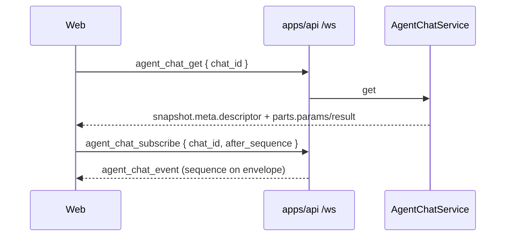

# TECH · APP-068 slice: WS contract

> Implementer HOW for **M14**. Parent [TECH.md](../TECH.md) is the architecture lock. Domain shapes live in [descriptor.md](./descriptor.md) and [tools.md](./tools.md). Do not invent a second PRD.

## Scope summary

Keep every APP-067 Chat **action name**. Evolve **payload shapes** so descriptor + tool contract ride existing get / snapshot / event JSON. No new `WsAction`, no dedicated ACP socket, no Atmos REST conversation API. OpenCode `serve` HTTP+SSE stays adapter-private on `127.0.0.1`.

Addresses **M14** (and the wire half of M1, M7–M9, M12). M13 product verbs unchanged. Native codecs are other slices.

## Architecture overview

```text
apps/web  agentChatApi  wsRequest("agent_chat_*")
    │  main /ws   APP-048 / APP-049 / APP-064
    ▼
apps/api  WsAction match in router/mod.rs
          handlers in router/agent_chat.rs
          request DTOs in message/agent_chat.rs
    ▼
crates/core-service  AgentChatService  (serde JSON is the wire SOT)
    ▼
crates/agent  AgentDescriptor + AgentTool   (never on a second socket)
```

Two Atmos transports stay distinct:

| Path | Protocol | This slice |
|------|----------|------------|
| Client ↔ Atmos | main `/ws` `agent_chat_*` + `agent_chat_event` | **yes** — DTO evolution |
| Atmos ↔ OpenCode | vendor HTTP+SSE inside `providers/opencode` | **no** — not an Atmos REST chat API |
| Atmos ↔ Claude/Codex/Pi | vendor stdio | **no** |
| Atmos ↔ other agents | ACP stdio in `providers/acp` | **no** — not a browser ACP socket |



## Frozen action catalog (MUST NOT rename)

`apps/api/src/api/ws/message.rs` `WsAction` variants `AgentChatCreate` … `AgentChatPrefsSet` plus `AgentOptionsGet`. Wire names (serde snake_case) already listed in `packages/api-types/src/ws/actions.ts` and `contract/agent-chat.ts`:

`agent_chat_create` `list` `get` `messages` `rename` `configure` `delete` `subscribe` `unsubscribe` `send` `steer` `queue_add` `queue_update` `queue_reorder` `queue_delete` `cancel` `permission_respond` `prefs_get` `prefs_set` and `agent_options_get`.

Events stay `agent_chat_event` and `agent_options_updated` (`message.rs` `WsEvent`, `event-contract.ts`).

Do **not** add `agent_chat_descriptor_get`, `agent_chat_tool_*`, or an ACP/session REST twin. Trait rename `prompt` → `send` in `crates/agent` does **not** rename `agent_chat_send`.

Request structs in `apps/api/src/api/ws/message/agent_chat.rs` stay. Create / configure still take `provider_id` / `model` / `thinking` / `mode` as **inputs** that seed `descriptor.current_config`. Those keys on the **request** are not dual-write of meta fields.

Handlers in `apps/api/src/api/ws/router/agent_chat.rs` stay thin: parse request → `AgentChatService` → `serde_json::to_value`. After this cut, that JSON **must** match the TS DTOs below. If persist meta still has host-only `applied_*` (`types.rs` today), map to a wire struct or strip before serialize. Do not leak `applied_*` as a second config source.

## Field replacements

### `AgentChatMeta` (`dto/agent-chat.ts` ↔ `core-service` `AgentChatMeta`)

Returned by `agent_chat_create` / `rename` / `configure`; nested in `agent_chat_get` snapshot.

| Today (remove from wire) | Replacement | Notes |
|--------------------------|-------------|-------|
| `supports_steer: boolean` | `descriptor.capabilities.steer` (`"supported"` \| `"unsupported"`) | Closed capability struct. Send/cancel are **not** flags. |
| `session_config_options` (`SessionAdvertisedOption[]`) | `descriptor.supported_options` | ACP option bags stay adapter-internal. Delete the public TS type if unused. |
| `selected_model` `selected_thinking` `selected_mode` | `descriptor.current_config.{model,thinking,mode}` | One copy. Live refresh via `config_updated`. |
| *(never ship)* `native` sidecar | — | Forbidden next to mapped descriptor. |
| *(not in TS today, still serde-leaked)* `applied_model` `applied_thinking` `applied_mode` | persist-only | Strip from WS JSON. |

**Keep:** `id` `created_at` `updated_at` `deleted` `title` `cwd` `workspace_id` `project_id` `space_id` `origin` `provider_id` `last_message_at` `last_event_seq` `persistence_handle` `runtime_status` `available_commands` `session_usage`.

**Add:** `descriptor: AgentDescriptor` (identity + capabilities + supported_options + current_config). Invariant: `descriptor.identity.id === provider_id`.

`agent_chat_list` stays `AgentChatIndexEntry` (**no** descriptor). Pre-create picker uses `agent_options_get`; post-create chrome uses `meta.descriptor`.

Wire sketch (create/get/configure output):

```json
{
  "id": "uuid",
  "provider_id": "claude",
  "runtime_status": "detached",
  "descriptor": {
    "identity": { "id": "claude", "name": "Claude Code", "version": null },
    "capabilities": {
      "steer": "unsupported",
      "resume": "supported",
      "permission": "supported",
      "configure": "supported"
    },
    "supported_options": {
      "models": [{ "id": "opus", "label": "Opus", "is_default": true }],
      "thinking": { "type": "enum", "arg": "--effort", "options": ["low", "high"] },
      "modes": []
    },
    "current_config": { "model": "opus", "thinking": "high", "mode": null }
  }
}
```

Thinking control: reuse catalog `AgentThinkingSupport` (`#[serde(tag = "type")]`). Hide UI when `type === "none"`. Do not add `has_thinking: boolean`.

Copy these into `packages/api-types/src/ws/dto/agent-chat.ts` (snake_case = serde). Canonical Rust lives in `crates/agent` domain (descriptor.md / tools.md); the DTO must match JSON, not a parallel camelCase.

```ts
export type Capability = "supported" | "unsupported";

export type AgentDescriptor = {
  identity: { id: string; name: string; version?: string | null };
  capabilities: {
    steer: Capability;
    resume: Capability;
    permission: Capability;
    configure: Capability;
  };
  supported_options: {
    models: Array<{
      id: string;
      label: string;
      group?: string | null;
      is_default?: boolean;
      thinking?: unknown;
    }>;
    thinking: unknown; // AgentThinkingSupport tagged union
    modes: Array<{ id: string; label: string; is_default?: boolean }>;
  };
  current_config: {
    model?: string | null;
    thinking?: string | null;
    mode?: string | null;
  };
};

export type AgentToolKind =
  | "read" | "edit" | "delete" | "move" | "search"
  | "web_search" | "execute" | "fetch" | "skill" | "subagent" | "other";

export type AgentToolStatus = "pending" | "running" | "completed" | "failed";

/** Internally tagged `{ type: kind, … }`. `other.value` is vendor JSON as-is. */
export type AgentToolParams =
  | { type: "read"; path: string; offset?: number | null; limit?: number | null }
  | { type: "edit"; path: string }
  | { type: "delete"; path: string }
  | { type: "move"; from: string; to: string }
  | { type: "search"; query: string; path?: string | null; glob?: string | null }
  | { type: "web_search"; query: string }
  | { type: "execute"; command: string; cwd?: string | null; background: boolean; task_id?: string | null }
  | { type: "fetch"; url: string }
  | { type: "skill"; skill: string }
  | { type: "subagent"; description: string; agent_type?: string | null }
  | { type: "other"; value: unknown };

export type AgentToolResult =
  | { type: "text"; text: string }
  | { type: "file_content"; path: string; text: string }
  | { type: "diff_stats"; path: string; additions: number; deletions: number }
  | { type: "execute"; output: string; exit_code?: number | null }
  | { type: "web_search"; query: string; links: Array<{ url: string; title: string; snippet?: string | null }> }
  | { type: "web_fetch"; url: string; title?: string | null; markdown?: string | null; text?: string | null }
  | { type: "other"; value: unknown }
  | { type: "error"; message: string }
  | { type: "empty" };

export type AgentTool = {
  tool_call_id: string;
  name: string;
  title?: string | null;
  kind: AgentToolKind;
  status: AgentToolStatus;
  params: AgentToolParams;
  result?: AgentToolResult | null;
};
```

`AgentChatMeta.descriptor: AgentDescriptor`. Tool part = `{ type: "tool_call" } & AgentTool`. Live event `tool_call` field = `AgentTool` (not a looser `{ input?, output?, content? }`). `agent_chat_messages` output `{ messages: AgentMessage[] }` inherits the same parts.

### `AgentPart` tool_call + live `tool_call` on events

Folded part (`MessagePart::ToolCall` in `types.rs`) and `AgentToolCall` / `AgentTool` on `tool_call_started|updated|completed|failed` **share one shape**.

| Today | After | Dual-write? |
|-------|-------|-------------|
| `input` | `params` (`AgentToolParams`, tagged `type`) | **No.** Drop `input`. |
| `output` | `result` (`AgentToolResult` \| `null` while running) | **No.** Drop `output`. |
| `content` | gone | ACP leftover. Drop. |
| `native` | gone | Never add. |

**Keep on the part:** `type: "tool_call"` plus `AgentTool` fields (`status` required).

`kind` enum adds `web_search` (workspace grep stays `search`; fetch stays `fetch`). Serde: `#[serde(tag = "type", rename_all = "snake_case")]` for params and result, matching parent TECH.

```json
{
  "type": "tool_call",
  "tool_call_id": "…",
  "name": "bash",
  "kind": "execute",
  "status": "running",
  "params": { "type": "execute", "command": "ls", "background": false },
  "result": null
}
```

Mapped example result: `{ "type": "execute", "output": "…", "exit_code": 0 }`. Unmapped: `kind: "other"`, `params: { "type": "other", "value": <vendor input> }`, `result: { "type": "other", "value": <vendor output> }` (or `null` / `{ "type": "empty" }` when done with nothing). Never `params: Execute {…}` **and** `native` / `input`.

Non-tool parts (`text` `thinking` `plan` `attachment` `error` `session_*`) unchanged. Thinking/plan stay parts, not tool kinds.

### `config_updated` event

Today: `model` `thinking` `mode` `config_options`. Replace with **one** `descriptor` object (full struct, so the client does not merge old `session_config_options`). Do not also send the four old keys.

Envelope: `{ chat_id, event_id, sequence, turn_id?, payload }` — host sequence stays here, not a second seq in `crates/agent`. `turn_id` is the Atmos control epoch when known (same field as [events.md](./events.md)).

If domain emits `AgentEvent::Unknown`, add `{ type: "unknown", event_type, payload }` **inside** `AgentChatPayload`. That is not a new `WsEvent`.

### Actions that fail closed (names unchanged)

`agent_chat_steer` / `configure` / `permission_respond` stay. Host already returns `ServiceError::Validation` (`"steer is not supported by this agent"`). Gate on `descriptor.capabilities.*` instead of `meta.supports_steer`. UI hides the control first (M5); the error is the backstop. Do not invent `WsError.code = unsupported` unless an existing API error envelope already has it — keep Validation.

`agent_options_get` unchanged (`AgentOptionsSnapshot`). It remains the **pre-chat** `supported_options` source. After create, composer reads `descriptor`, not catalog as a parallel SOT.

`AgentChatContract` row map (keys frozen; only nested DTO fields change):

| Action | input | output |
|--------|-------|--------|
| create / rename / configure | existing requests | `AgentChatMeta` **with** `descriptor` |
| get | `{ chat_id }` | `AgentChatSnapshot` (meta + new parts) |
| messages | `{ chat_id, limit? }` | `{ messages }` with new tool parts |
| send / steer | existing | `{ turn_id }` |
| subscribe | `{ chat_id, after_sequence? }` | `{ last_event_seq }` + fanout `agent_chat_event` |
| cancel / delete / unsubscribe / permission_respond / queue_delete | existing | `WsOk` |
| queue_* else | existing | unchanged queue JSON |
| prefs_* / `agent_options_get` | existing | unchanged |

Queue item JSON is out of this slice. Do not tighten `Record<string, unknown>` here.

## Extract catalog (same PR as Rust serde)

Shape change, **no new action names**. Still run the APP-048/064 recipe so `UnmappedWsAction` stays `never`. From `packages/api-types/AGENTS.md`:

1. Rust serde of snapshot / meta / parts / `AgentChatPayload` / `AgentTool` is the wire. Prefer server JSON when TS disagrees.
2. `bun run --filter @atmos/api-types extract-actions` → commit `fixtures/actions.server.json` **only if it changed** (it should not). Never hand-edit the fixture.
3. Confirm `src/ws/actions.ts` still has the same `agent_chat_*` + `agent_options_get` list. **Do not add names.**
4. Evolve DTOs in `packages/api-types/src/ws/dto/agent-chat.ts` (snake_case, serde nullability). Empty bodies stay `WsEmpty`.
5. Keep `{ input, output }` **rows** in `src/ws/contract/agent-chat.ts`. Types behind those rows change (`AgentChatMeta`, `AgentChatSnapshot`, `AgentMessage`). Do not add contract keys.
6. `extract-events` / `check-events`: `agent_chat_event` payload type stays `AgentChatEvent`; inner `payload` union fields change. No new event name.
7. App wrapper `apps/web/src/api/ws/agent-chat-api.ts`: still `wsRequest("agent_chat_get", { chat_id })` with **no** `<T>`. Re-export DTO names from `@atmos/api-types/ws/dto/agent-chat`. CamelCase stays in the wrapper only.
8. `bun run --filter @atmos/api-types test` + `check-actions` + `check-events`. Typecheck web (mobile has no Chat consumer; N5).

Do not add oRPC/tRPC. Do not put Chat DTOs on `@atmos/api-client`.

## REST (explicit non-goals)

| Route | Status |
|-------|--------|
| `POST /api/agent/upload-attachments` | **Keep** — multipart (existing REST exception). |
| `POST /api/agent/logout` | **Keep** — registry auth, not conversation CRUD. |
| Any `/api/agent/session*` or conversation REST | **Forbidden.** APP-067 already removed session CRUD (`apps/api/src/api/agent/mod.rs` test). |
| OpenCode `127.0.0.1` HTTP+SSE | **Vendor-only** inside `providers/opencode`. Not Computer REST, not `WsContract`. |

`apps/web/src/api/rest-api.ts` already throws if someone calls REST session create. Leave that guard.

## MUST implement vs MUST NOT

| MUST | MUST NOT |
|------|----------|
| Same `WsAction` / `WsEvent` names | Rename send, add descriptor RPC, ACP websocket |
| `meta.descriptor` on create/get/configure/rename | Dual-write `supports_steer` or `selected_*` |
| Tool `kind` + `params` + `result` on parts **and** live events | Dual-write `input` / `output` / `content` / `native` |
| `web_search` kind distinct from `search` | Classify web search as workspace `search` on the wire |
| Hard cut: new jsonl only (M12) | Client fallback that reads `input` if `params` missing |
| Run extract + check in the same PR | Hand-edit `fixtures/*.server.json` |
| OpenCode HTTP behind the adapter | Atmos REST chat API wrapping OpenCode |

## Security & permissions

Same Computer path bounds and permission prompts as APP-067. Tool `params`/`result` may hold file text and command output — do not log at info. OpenCode bind stays `127.0.0.1` with generated basic-auth; never expose vendor HTTP as an Atmos route.

## Rollout

Land with parent step 3 (after domain types + persistence envelope). One PR is fine:

1. Serde on `AgentChatMeta` / `MessagePart` / `AgentTool` / `ConfigUpdated` — **no** old keys.
2. Router still `to_value`; add a wire map only if persist fields would leak.
3. api-types DTO + extract/check (catalog names unchanged).
4. Web wrapper re-exports; composer/cards are [web.md](./web.md).

No feature flag. No dual schema. Old clients break; that is the cut.

## Risks & tradeoffs

- **Hard cut vs dual-write:** chosen so web cannot keep `classifyTool` on `input`. Rollback = revert the PR. Pre-APP-068 jsonl is out of scope (M12).
- **Full `descriptor` on `config_updated` vs patch fields:** full object avoids merge bugs with deleted `session_config_options`.
- **List without descriptor:** keeps index small; New Chat uses catalog. Acceptable because create returns descriptor immediately.
- **If this breaks:** new chats still CRUD on the same actions; Terminal / APP-024 catalog argv unchanged.

## Dependencies

Depends on descriptor + tool domain types and persistence envelope. Blocks [web.md](./web.md). Relies on APP-048/064 extract gates. Does not block native adapters (they must emit the same `AgentTool` the projector already serializes).

## Open questions

None for v1. N5 (mobile/CLI Chat) consumes this DTO later without new action names.
