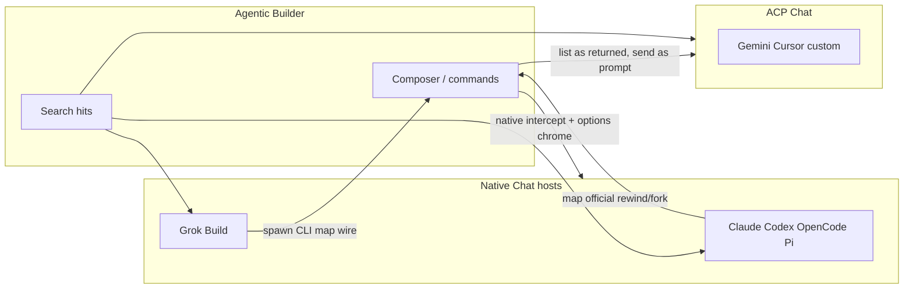

# PRD · APP-069: Agent Chat hits, Grok, fork/rewind

> Product Requirements · WHAT and WHY. Settled direction for typed workspace search hits, a native Grok Build Chat host (spawn + protocol map, not crate embed), native composer probing (models / thinking / mode / permission) like ACP, and native `/fork` `/rewind` with permission-like option chrome.

## Context

- **Problem**: APP-068 made Chat honest about steer, tools, and the four native hosts, but workspace grep is still a text blob, Grok Chat is still generic ACP, native composer pickers (model / thinking / mode / permission) often only fill via a generic ACP probe, and native session surgery (`/fork`, `/rewind`) has no Atmos mapping. Vendors differ: some rewind conversation only, some also restore files, and several need an option step before they run. If Atmos truncates history before the agent succeeds, or also rewrites files the agent already restored, Chat and disk diverge.
- **Why now**: APP-068 Must Have is implemented. HUMAN promoted APP-068 N1, Grok-from-N3, and N4 (fork + rewind only) into this spec. Compact stays deferred.
- **Related specs**:
  - **Builds on** [APP-068](../APP-068_agent_chat_arch_optimize/PRD.md) — descriptor, small runtime, tool/event contract, native Claude / Codex / OpenCode / Pi, ACP for everyone else. Does not reopen APP-068 Must Haves.
  - **Builds on** [APP-067](../APP-067_atmos_agent_abs/PRD.md) — Atmos `chat_id` ≠ provider handle; restore ≠ spawn; slash commands already exist as composer `/` from `available_commands`.
  - **Does not replace** [APP-036](../APP-036_grok-build-cli-support/PRD.md) — Terminal Grok Build (`grok-build` / `grok`). This spec is Agent Chat only.
  - **Does not replace** APP-024 Terminal argv / catalog. Chat spawn still overrides; Terminal params stay frozen.

BRAINSTORM forks resolved here (see [BRAINSTORM.md](./BRAINSTORM.md)):

| Fork | Decision |
|------|----------|
| Grok hosting | Spawn `grok` and map its published host protocol. **Do not** Cargo-depend on `xai-grok-*`. Use the open repo as protocol/fixture source. |
| Rewind meaning | One Atmos slash `/rewind`. **Options come from that native** (conversation only vs conversation + files, pick a turn, confirm). Atmos never invents a union of every vendor’s rewind. |
| Fork meaning | `/fork` always creates a **new Atmos conversation** (`chat_id`) because the agent also starts a new vendor session. Map vendor fork extras (including Grok worktree) **only when that native protocol has them**. |
| Scope | One spec. Gemini / Cursor native still out. |
| Compact | Out of v1. |
| Surface | **Slash commands**, not standing Fork/Rewind buttons. Native option/confirm chrome sits **above the prompt**, like permission. ACP slash list is **unchanged** (`available_commands` as returned); no extra filter. |

## Goals

1. **Primary** — Workspace search hits are Atmos-owned (path / line / snippet) when the adapter can extract them.
2. **Primary** — Grok Build Chat is a fifth native host, same class as Claude / Codex / OpenCode / Pi: spawn the CLI, map the wire, no in-process Grok crates.
3. **Primary** — Native Chat hosts prefetch composer options the same way ACP does: model list, thinking depth, agent mode (build / plan / …), and permission-mode buttons. Probe via that native’s CLI or RPC when those exist; cache. `descriptor.support` says which of those pickers this host can probe. Grok thinking for the two current models is a pinned table, not a live guess.
4. **Primary** — On natives that have them, `/fork` and `/rewind` complete the vendor’s official flow (including options). Options appear above the prompt, like a permission request. The user types `/`, not a dedicated Fork/Rewind button.
5. **Primary** — After a **successful** agent rewind, Atmos **view** of the conversation matches the agent. Transcript is not hard-deleted (redo must still be possible, e.g. OpenCode). Atmos **does not** restore files; the agent owns the working tree.

Non-goals below, not here.

## Users & Scenarios

- **Primary persona**: Agentic Builder in Web / Desktop Agent Chat, using Claude Code, Codex, OpenCode, Pi, or Grok Build.
- **Secondary persona**: The same user on an ACP-only registry agent (Gemini, Cursor, custom). Composer `/` still lists whatever that agent returns in `available_commands`. Those names are forwarded as prompt text, as today. Atmos does not intercept them as session ops.

### Key scenarios

1. **Typed grep**: The agent greps the workspace. The transcript shows a search card with clickable file hits (path, line when known, snippet), not only a dump of stdout. If hits cannot be extracted, the card still shows text (APP-068 fallback).
2. **Grok as a first-class Chat agent**: The user picks Grok Build in Chat. First send spawns `grok` through the Chat native host (not generic ACP, not Terminal `--print` flags). Tools and session commands follow Atmos observation + this spec’s slash mapping.
3. **Native composer probe**: Before or while opening Chat on Claude / Codex / OpenCode / Pi / Grok, Atmos prefetches that host’s model list, thinking levels, agent modes, and permission-mode buttons via CLI or native RPC (Grok 4.5/4.6 thinking is a pinned table). The composer shows only pickers `descriptor.support` allows. A native host is not filled by spawning generic ACP `session/new` in `catalog-probe/`.
4. **Rewind on a native that has it**: The user types `/rewind`. If that agent needs a choice (conversation only vs conversation + files, which turn, confirm), those options appear **above the prompt**, the same place as a permission request. The user picks; Atmos tells the agent. **Only after the agent reports success** does Atmos change how this chat is shown (later turns hidden from the live view, not wiped from disk). If the agent also restores files, Atmos does nothing to the working tree.
5. **Fork on a native that has it**: The user types `/fork`. If that fork has options (e.g. Grok worktree), they use the same above-prompt chrome. Atmos opens a **new** conversation with a new `chat_id`. The vendor session is a new session too.
6. **ACP slash list**: Chat keeps listing ACP `available_commands` as returned, including `/rewind` if the agent sent it. Atmos does not strip or special-case those names. Picking them still sends the slash as a prompt, as today.

## User Stories

- As an Agentic Builder, I want workspace search to list files and lines I can open, so that grep is usable in Chat the way web search already lists links.
- As an Agentic Builder, I want Grok Build in Chat to keep its real host behavior, so that I am not stuck on a lossy ACP wrapper.
- As an Agentic Builder, I want native Chat composers to show model, thinking, mode, and permission controls after a prefetch probe (CLI or native RPC), the same habit as ACP agents, without spawning a generic ACP session for a native host.
- As an Agentic Builder, I want `/fork` and `/rewind` on natives that actually support them, so that I use the same `/` habit as in the vendor TUI, without a new row of buttons.
- As an Agentic Builder, I want rewind options above the prompt, so that choosing conversation-only vs conversation+files (or a turn) feels like answering a permission, not a hidden modal.
- As an Agentic Builder, I want the Chat transcript to follow a successful agent rewind without Atmos deleting history, so that redo (e.g. OpenCode) can still bring later turns back.
- As an Agentic Builder, I want Atmos to leave files alone on rewind, so the working tree is restored once by the agent, not twice.
- As an Agentic Builder, I want fork to become a **new Atmos chat**, so that conversation identity stays aligned with the agent’s new session.
- As an Agentic Builder on ACP-only agents, I want the `/` list to stay whatever that agent advertised, so that Atmos does not second-guess ACP commands.

## Functional Requirements

### Must Have

- **M1 — Workspace search hits**: When an adapter can extract workspace grep/glob matches, the stored `search` result includes Atmos-owned hits: path, optional line, optional snippet. The search card renders those hits. When extraction fails, keep today’s text result. `web_search` stays web links (APP-068); do not mix the two kinds.
- **M2 — Grok is a native Chat host**: Chat production path for Grok Build (`grok` / catalog aliases locked in TECH) is a **native adapter**: spawn the `grok` CLI and map its **published host protocol**. It is not the generic ACP fallback used for other registry ids. It is not a Cargo dependency on `xai-grok-shell` or sibling crates. Terminal APP-036 launch flags stay unchanged.
- **M3 — No vendor SDK / crate embed**: Same APP-068 rule, now including Grok: Atmos speaks the wire from Rust. The public grok-build tree is a reference and fixture source, not an in-process agent loop.
- **M14 — Native composer probe**: For each native Chat host, prefetch **model list**, **thinking depth**, **agent mode** (build / plan / …), and **permission-mode buttons** before the user needs them, same product surface as ACP catalog probe, then cache. `descriptor.support` declares which of those four can be probed. Prefer that host’s **CLI or native RPC**. Do **not** use generic ACP `session/new` in `catalog-probe/` to fill a native host. Grok thinking is **pinned by model family**: Grok 4.5 = Low / Medium / High; Grok 4.6 = Low / Medium / High / Extra high. Other Grok ids from CLI do not get invented thinking lists.
- **M4 — Session commands are slash, not buttons**: Fork and rewind are **composer `/` commands**. Do not add standing Fork / Rewind composer buttons. Steer, permission-request cards, and probed model/thinking/mode/permission pickers stay as APP-068 chrome.
- **M5 — Native intercept vs ACP list**: Atmos **handles** `/fork` `/rewind` (options, confirm, vendor mapping) only on **native** hosts that have those operations. Generic ACP does not get a parallel Atmos session-op implementation. **Do not filter or rewrite** ACP `available_commands`: the `/` picker still uses the list the agent returned. On ACP, choosing those names remains “send as prompt,” as today.
- **M6 — Rewind options are vendor-true**: When a native rewind has choices (conversation only, conversation + files, pick a turn, confirm), Atmos shows **those** options. Placement: **above the prompt input**, same pattern as a permission request. Do not invent options the protocol does not have. Do not collapse every vendor into one Atmos rewind meaning.
- **M7 — Sync conversation view only after agent success**: Atmos changes the visible transcript for this chat **only after** the agent rewind succeeds. If the agent fails or is cancelled, Atmos history is unchanged. Replay/get must not show a truncated view of a rewind that never committed on the vendor side.
- **M8 — Do not hard-delete transcript**: Rewind is not a durable wipe of jsonl/history. Later turns stay stored so **redo** can restore them when that agent supports redo (OpenCode is the named example). The live Chat view follows the current rewind point; it does not erase the underlying records.
- **M9 — Atmos never restores files**: File rewind is the agent’s job. Atmos must not check out, copy, or rewrite workspace files to “help.” The user has one working tree; a second restore is not idempotent.
- **M10 — Fork creates a new Atmos conversation**: A successful `/fork` yields a new Atmos `chat_id`. The vendor side is a new session / thread as that protocol defines. Opening the parent chat still restores the parent.
- **M11 — Map vendor fork extras when they exist**: If a native’s official fork includes optional isolation (Grok worktree), those choices use the same above-prompt option chrome. Agents without that extra do not get a worktree control.
- **M12 — APP-068 product stays**: Descriptor SOT, small runtime, one tool observation, web does not classify vendors, restore ≠ spawn, main `/ws` `agent_chat_*` names, no REST chat API.
- **M13 — Protocol-correct mapping**: Native fork/rewind (and Grok host frames) follow published vendor docs/fixtures, not “send `/rewind` as a user prompt and hope” on natives we intercept. Unknown frames must not kill the session (APP-068 M16).

### Nice to Have

- **N1 — Glob / file-tree search results**: First-class tree-shaped workspace results beyond grep line hits. v1 grep hits are M1; trees may wait if extraction is unreliable.
- **N2 — Compact / summarize** as an Atmos `/compact` on natives that have it.
- **N3 — Native Gemini / Cursor** (remainder of APP-068 N3).
- **N4 — ACP-handled session ops** if a future host method can complete rewind/fork with options the way natives do. v1 does not intercept ACP `/rewind` `/fork`; it also does not hide them from the list.
- **N5 — Mobile / CLI** consuming the same slash session ops (APP-025 / APP-065).

## Out of Scope

- **Embedding Grok crates** (`xai-grok-shell`, tools, workspace, TUI) inside Atmos Server — rejected; spawn + map only.
- **Composer Fork / Rewind buttons** — slash + above-prompt options only.
- **Filtering ACP `available_commands`** — rejected; use the list the agent returned.
- **Atmos-handled rewind/fork on generic ACP** — v1 intercept is native only; ACP names still send as prompt.
- **Unifying rewind semantics across vendors** — options and effects are per native.
- **Hard-deleting transcript lines on rewind** — rejected; hide from live view, keep records for redo.
- **Atmos restoring workspace files on rewind** — rejected; agent-only, one working tree.
- **Atmos-only fork** that copies transcript without a vendor new session — rejected; identities must stay aligned (M10).
- **Compact / summarize** as a v1 Chat command.
- **Native Gemini, Cursor, and other N3 agents** besides Grok.
- **Changing Terminal Grok / Claude / Codex argv** in `builtin_agents.json` for Chat.
- **Pixel clone of vendor rewind pickers** — complete the official choices in Atmos option chrome; do not restyle the vendor TUI.
- **APP-067 list chrome** (pin, archive, search over chats) — unchanged.

## Success Metrics

- **Leading**: A native grep with extractable hits shows path (and line when present) in the search card; a grep that cannot be parsed still shows text.
- **Leading**: Chat `grok` is not routed through the generic ACP provider used for custom/`gemini` ids.
- **Leading**: A native Chat composer shows probed model / thinking / mode / permission pickers from CLI or native RPC (and Grok 4.5 vs 4.6 thinking tables) without an ACP catalog-probe session for that native.
- **Leading**: `/rewind` on a supporting native shows vendor options above the prompt, applies the view change only after agent success, and does not delete stored turns. Files on disk are not rewritten by Atmos.
- **Leading**: `/fork` on a supporting native produces a second Atmos conversation with its own `chat_id`; the parent conversation is unchanged.
- **Leading**: An ACP chat still lists `/rewind` if the agent sent it in `available_commands`; Atmos does not strip that row.
- **Qualitative**: Users describe rewind options as “like permission, above the box,” not as new composer buttons.

## Risks & Open Questions

- **Risk**: Users assume `/rewind` always restores files. Mitigation: M6 shows only that native’s options; M9 Atmos never touches files.
- **Risk**: Grok’s documented editor embed is ACP-shaped. Native Grok is still a dedicated adapter, not “leave it on generic ACP.” TECH names the wire.
- **Risk**: On ACP, `/rewind` in the list still only sends prompt text. Users may think Atmos will run the native option chrome. Acceptable in v1; do not filter the list to hide that gap.
- **Open (TECH)**: Exact native matrix (fork vs rewind vs worktree vs redo). PRD requires per-protocol options, not a fake union.
- **Open (TECH)**: How live view vs kept jsonl encodes rewind point and redo (not a product wipe).
- **Open (TECH)**: Native slash intercept vs ACP “send as prompt” on the same `/` picker.

## Milestones

- Phase 1 — M1 search hits (extract where reliable).
- Phase 2 — M2–M3 Grok native Chat host (fixtures then spawn), still without session ops if needed to land routing first.
- Phase 2b — M14 native composer probe (CLI / RPC / Grok thinking table; `descriptor.support`; no ACP probe for natives).
- Phase 3 — M4–M11 `/fork` `/rewind` on natives (options chrome, success-gated view sync, no file restore, no hard delete). ACP list unchanged.
