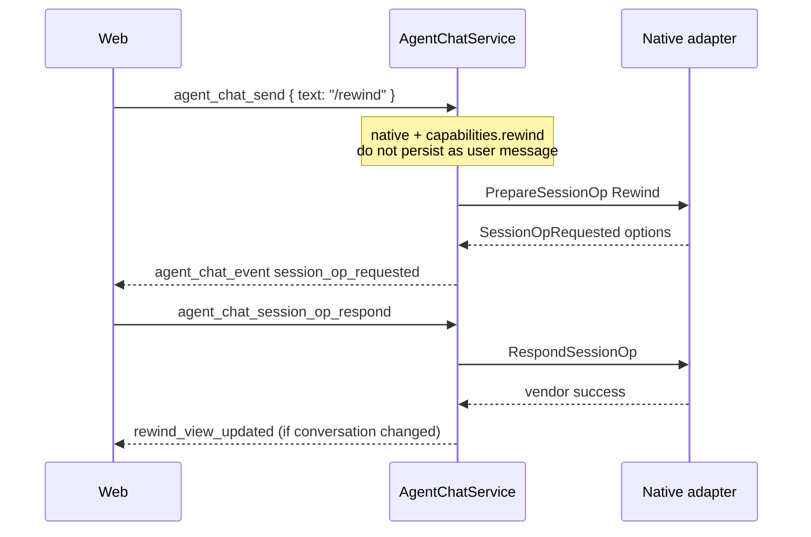

# TECH · APP-069: Agent Chat hits, Grok, fork/rewind

> Technical Design · HOW. Implements PRD APP-069: Agent Chat hits, Grok, fork/rewind.

## Scope summary

Extend APP-068 Chat with typed workspace **search hits**, a fifth native host **Grok Build** (spawn + map, no crate embed), **native composer probe** (models / thinking / modes / permission_modes via CLI or native RPC, `descriptor.support`, Grok thinking table), and native **`/fork` `/rewind`** with permission-like option chrome. ACP `available_commands` stay unfiltered; ACP slash is still send-as-prompt.

Addresses **M1–M14**. N1 (glob trees), N2 compact, N3 Gemini/Cursor, N4 ACP-handled session ops, N5 Mobile/CLI: deferred. Does not reopen APP-068 Must Haves. Does not change Terminal argv in `resources/terminal-agents/builtin_agents.json`.

## Architecture overview

```text
apps/web  composer `/` + AgentSessionOpCard (above prompt) + search hits
    │  main /ws  agent_chat_*   (no REST chat API)
    ▼
apps/api  WsAction + DTO  (message.rs, router/agent_chat.rs, message/agent_chat.rs)
    ▼
crates/core-service  AgentChatService
    │  intercept native /fork|/rewind on send
    │  rewind_view fold; fork new chat_id
    │  never git checkout / copy workspace files
    ▼
crates/agent
    contract/   AgentProvider, AgentEvent, AgentAction, descriptor
    policy/     honesty tables, Atmos permission map
    map/        classify_tool + JSON extractors
    catalog/    Cli + Native probe; catalog → descriptor apply
    providers/claude|codex|opencode|pi   + session-op RPC
    providers/grok/                      NEW native (ACP stdio + x.ai/*)
    catalog/                             Cli + Native probe; no ACP session/new for natives
    providers/acp/                       everyone else (unchanged intercept; ACP probe stays)
```

No `crates/infra` chat tables. No `crates/core-engine` file rewind. OpenCode HTTP and Grok `x.ai/*` stay adapter-private.



## Decisions locked here

| Topic | Decision |
|-------|----------|
| Grok host | Dedicated `providers/grok/`. Spawn `grok agent stdio`. Not generic `AcpAgentProvider`. Not `xai-grok-*` Cargo deps. Not Terminal `--output-format streaming-json -p`. |
| Grok aliases | Spawn: only exact `grok` is NativeGrok. ACP registry `grok-build` / `grok-acp` stay ACP. Chat picker hides those ACP rows when Native Grok is enabled. |
| Slash intercept | **Service `send`**, not a web-only branch. Native + matching capability + leading `/fork` or `/rewind` (`/undo` = rewind). Else existing send (ACP included). |
| Option chrome | New event/action pair (not permission). **Vendor-true, possibly two-phase** (pick turn, then restore kind). Do not flatten Claude into files-only. |
| Rewind storage | `meta.rewind_view.until_turn_id`. Append-only jsonl. Fold hides later turns. Redo clears the view. Code-only restore does not set this. |
| Files | Adapters may call vendor file-rewind APIs. Atmos never `git checkout`, copy, or write workspace files for rewind. |
| Fork identity | Vendor new session **first**. Then new Atmos `chat_id` + `parent_chat_id`. Parent runtime stays parent. Child spawns on first send (`get` still does not spawn). |
| Injected `/` rows | Native only, merge into `available_commands` when capability is supported. Never strip ACP rows. |
| Capability flags | Closed struct grows `fork` and `rewind`. Honesty table below. No `execute(name, json)`. |
| Claude summarize | TUI `/rewind` includes “Summarize from/up to here”. **Out of v1** — no `control_request` subtype; PRD N2 compact stays deferred. Do not fake it with a `/compact` user prompt. |
| Native probe | Reuse `OptionsProbeEngine` + cache. Chat natives: Config → Cli → **Native**. **Never** `AcpOptionsProbe` for folded native ids. Generic ACP ids keep Cli + Acp. |
| `descriptor.support` | Four `Capability` flags: `models`, `thinking`, `modes`, `permission_modes`. Declares what **can** be probed/shown. Missing serde → `Unsupported`. |
| Grok thinking | Not live RPC. After CLI `grok models`, stamp per-model thinking: id contains `4.6` → `low\|medium\|high\|xhigh`; contains `4.5` → `low\|medium\|high`. Other Grok ids: no thinking list. Labels: Low, Medium, High, Extra high. |

### Capability honesty (v1)

TUI product and host protocol can differ. Chat maps the **host protocol**. Chrome shows that native’s real choices (PRD M6), not a fake union.

| Agent | Fork | Rewind conversation | Rewind files | Host verbs |
|-------|------|---------------------|--------------|------------|
| **Claude** | Supported | Supported | Supported (checkpointed Edit/Write/NotebookEdit only; not bash/manual/subagent) | Live: `rewind_conversation` + `rewind_files`. New session: `--fork-session` / TUI `/branch`. |
| **Codex** | Supported | Supported | **Unsupported** (OpenAI: client/git owns files; Esc rewind is conversation-only) | `thread/fork`; conversation cut: `thread/revert` `{beforeTurnId}` (paginated) or deprecated `thread/rollback` `{numTurns}`. |
| **OpenCode** | Supported | Supported | Supported when the agent’s snapshot/git path works (TUI `/undo`+`/redo`) | `POST /session/{id}/fork`; `POST …/revert` `{messageID}` + `…/unrevert`. One API: conversation **and** files together. No conversation-only flag. |
| **Pi** | Supported | **Unsupported as `/rewind`** | **Unsupported** (file rewind is a community extension, not RPC) | `clone` / `fork` `{entryId}` / `get_fork_messages` / `get_tree`. `/tree` is branch navigation, not Claude-style restore-code. |
| **Grok** | Supported (+ worktree extra) | Supported | Supported (`files_only` / `all`) | Wire `_x.ai/session/fork`; `_x.ai/rewind/points` + `_x.ai/rewind/execute` `{ mode }`. Logical names (docs) are `x.ai/*`. |
| ACP / other | Unsupported | Unsupported | Unsupported | List as returned; send as prompt. |

**Claude TUI (official [checkpointing](https://code.claude.com/docs/en/checkpointing), CLI 2.1.250 screenshots):** pick a user prompt → then Restore code and conversation / Restore conversation / Restore code (code rows only if that checkpoint has tracked file changes) / Summarize from here / Summarize up to here / Never mind. Copy: “The conversation will be forked. The code will be unchanged|restored.” Atmos chrome must match **restore kinds**, not summarize.

**Claude host (leaked CLI control handler + measured 2.1.235):** two **separate** stdin `control_request`s — never a single `subtype: "rewind"` (that string is rejected). Conversation restore does **not** create a new Claude `session_id` (in-place transcript splice; GitHub #55347). Atmos `/fork` is the new-session path (`--fork-session`), not rewind.

**Grok native host is `grok agent stdio`**, not a second protocol. Official [agent-mode](https://github.com/xai-org/grok-build/blob/main/crates/codegen/xai-grok-pager/docs/user-guide/15-agent-mode.md) is ACP JSON-RPC plus vendor extensions in the `x.ai/*` namespace. **ACP requires extension JSON-RPC methods to start with `_`.** `agent-client-protocol` 2.0 only routes unknown methods into `ExtMethod` when the wire name has that underscore; `x.ai/rewind/execute` (no `_`) is `-32601` before Grok’s handler runs. Atmos therefore **sends and matches `_x.ai/...` on the wire**. Docs’ `x.ai/*` is the logical name after the ACP marker (same pattern as `_zed.dev/...`). Inbound notifications also arrive as `_x.ai/...`; classify after stripping at most one leading `_`. Atmos “native” means a dedicated mapper for those extensions via `acp_client`, not generic `AcpAgentProvider`. There is no Claude-style stream-json control channel. The three rewind modes live on that stdio host (`_x.ai/rewind/execute`). The TUI is one client of the same host and hard-codes `mode: "conversation_only"` ([`REWIND_MODE_WIRE`](https://github.com/xai-org/grok-build/blob/main/crates/codegen/xai-grok-pager/src/app/effects/mod.rs)).

### Composer probe honesty (M14)

ACP already prefetches via `OptionsProbeEngine`: CLI when `builtin_agents.json` `modelList.command` exists, else `StdioAcpOptionsProbe` (`session/new` in `catalog-probe/`, drain `config_options`, cache). Native Chat must use the **same prefetch + cache**, not a second catalog.

`descriptor.support` is the picker honesty (what the composer may show). `supported_options` / `current_config` are the last successful probe (or live session update). Empty lists hide the control (existing composer behavior). Do not invent a fifth picker.

<!-- updated 2026-09-03: Codex collaborationMode/list + turn/start.collaborationMode; Grok spawn uses selected --permission-mode -->

| Agent | models | thinking | modes (build/plan) | permission_modes | Probe path |
|-------|--------|----------|--------------------|------------------|------------|
| **Claude** | Supported | Supported | **Supported** (Default + Plan). Plan is a Mode, not a Permission. When Mode is Plan, spawn/set_config send vendor `--permission-mode plan` and do not stack an Atmos permission. | **Supported** Atmos ids `yolo` / `accept_edits` / `auto` / `ask_always` (maps to `bypassPermissions` / `acceptEdits` / `auto` / `default`; `dontAsk`/`manual` are aliases, not extra picker rows) | Short-lived Chat spawn (no `--print`): `initialize` control, then close. Not ACP `--acp`. |
| **Codex** | Supported | as CLI/catalog says | **Supported** (`collaborationMode/list`; stamp Default / Plan if list empty). Mode is sticky on `turn/start.collaborationMode` `{ mode, settings: { model, developer_instructions: null, reasoning_effort? } }`. 0.153 requires `settings.model` (serde fails with `missing field 'model'` otherwise). `thread/start` has no mode field. Initialize sends `capabilities.experimentalApi: true` (list requires it). | **Supported** Atmos subset `yolo` / `auto` / `ask_always` (maps to `approvalPolicy` `never` / `on-request`+`approvalsReviewer: auto_review` / `on-request`+`user`). Auto is official Codex "Approve for me". No Accept edits. `untrusted` / `granular` stay hidden. Sticky on `thread/start`; `/permissions` slash remains. | CLI `codex debug models` first; native RPC `collaborationMode/list` for the mode picker. Old CLIs that reject the field: stamp the list and omit `collaborationMode` on retry. 0.152.1 `thread/start` and `turn/start` require top-level `model`; handshake fills sticky `model` (and first listed effort) from `model/list` when spawn `cfg.model` is empty. Composer create/send must send the displayed catalog default, not an empty `modelId`. |
| **OpenCode** | Supported | as probe says | **Supported** (stamp Build / Plan when `/doc` scan is empty) | **Supported** Atmos ids `auto` / `ask_always` only (OpenCode CLI `--auto` = Auto, not Yolo; no distinct Yolo lock on `serve`). Stamp when probe empty; fold probe `ask`/`allow` but picker shows stamped subset. Auto locks at session create: spawn spec includes `--auto` (omitted from `serve` argv until CLI accepts it); adapter auto-replies `once` on `permission.asked`. Ask always omits `--auto`. | CLI `opencode models`; HTTP for modes/permission if listed. `POST /session` and prompt body send selected Build/Plan as `agent`. |
| **Pi** | Supported | as RPC says | **Unsupported** (0.84.2 `get_state` has no mode list and no `set_mode`; do not show a picker we cannot apply) | **Unsupported** (no built-in permission chrome) | `--mode rpc` short session / documented list methods; not ACP. |
| **Grok** | Supported | Supported for 4.5/4.6 ids only | **Supported** (Default + Plan). Plan still rides `--permission-mode plan` because Grok has no second mode flag. | **Supported** Atmos ids `yolo` / `accept_edits` / `auto` / `ask_always` (maps to `bypassPermissions` / `acceptEdits` / `auto` / `default`). Stamp the four-id list; do not put `plan` in Permission. | CLI `grok models` (`GrokLineList`, 20s timeout — live list exceeds the default 8s CLI band). Thinking **Config overlay** (table below), not RPC. Native probe reads `session/new` `configOptions`. Chat spawn `grok --permission-mode <vendor\|default> agent stdio`. Live picker uses `set_config_option` `permissionMode` with vendor ids. Never `--always-approve` / `--yolo`. |
| ACP / other | as today | as today | **Supported**; empty list hides. Probe `session/new` `configOptions` **and** ACP `modes` (`SessionModeState`); do **not** stamp lists. `plan` in a permission option is classified as Mode. | **Supported**; empty list hides. Heuristically fold `permission` / `permissionMode` / `permission_mode` / `approval` into the Atmos subset (bypass/yolo/never → `yolo`, acceptEdits → `accept_edits`, exact `auto` → `auto`, default/ask/on-request/manual → `ask_always`). Unrecognized ids are dropped. Apply via `set_config_option` with **vendor** ids. | `AcpOptionsProbe` + live `ConfigOptionsUpdate`. Create/later apply via `set_config_option` (legacy `session/set_mode` when only `SessionModeState` advertised). |

Composer pickers live on `descriptor.support` + non-empty lists, **not** `AgentCapabilities`. `capabilities.permission` is tool-approval chrome / `permission_requested` cards. Mode is `support.modes`. Permission picker is `support.permission_modes`.

Claude and Grok expose two independent composer buttons: Mode (Default / Plan) and Permission (Atmos four-id subset). Plan is never a Permission row. Codex Mode stays Default / Plan; Permission is Yolo / Auto / Ask always (no Accept edits). Pi hides both. An empty mapped Permission list hides that button.

Grok thinking overlay (after CLI models, `OptionsProbeStrategy::Config` fragment or post-merge stamp):

| Model id | Wire `thinking` options | UI labels |
|----------|-------------------------|-----------|
| contains `4.6` | `low`, `medium`, `high`, `xhigh` | Low, Medium, High, Extra high |
| contains `4.5` | `low`, `medium`, `high` | Low, Medium, High |
| anything else from `grok models` | none | no thinking picker |

`OptionsProbeStrategy` grows `Native`. `OptionsProbeEngine` runs it after Cli. `NativeOptionsProbe` is a crate trait; Claude/Codex/OpenCode/Pi/Grok implement it under `providers/*/catalog.rs`. Grok native probe is slash-only (`grok agent stdio` initialize `_meta` + `available_commands_update`); models stay on the `grok models` CLI. Timeout same order as ACP probe (~15s). Always close the probe process.

`options_probe_spec_for` after native-only canonicalize to a Chat native: `acp: false`, drop `OptionsProbeStrategy::Acp`, add `Native`. Exact hosts `claude` / `codex` / `opencode` / `pi` / `grok` (plus `claude-code` synonyms) follow the native spec. ACP registry ids `claude-acp` / `codex-acp` / `pi-acp` / `grok-build` / `grok-acp` stay ACP. Gemini stays ACP.

## Module-by-module design

### crates/agent — contract / policy / map

`crates/agent/src/contract/descriptor.rs`

- `AgentCapabilities` adds `fork: Capability`, `rewind: Capability`.
- New sibling struct on the descriptor (PRD M14), **not** folded into `capabilities`:

```rust
struct AgentOptionSupport {
    models: Capability,
    thinking: Capability,
    modes: Capability,              // build / plan / ...
    permission_modes: Capability,   // ask / acceptEdits / bypass / ...
}
struct AgentDescriptor {
    identity,
    capabilities,
    support: AgentOptionSupport,    // serde default = all Unsupported
    supported_options,
    current_config,
}
```

- `supported_options` grows `permission_modes: Vec<AgentMode>` (empty omit). `current_config` grows `permission_mode: Option<String>` and persists **Atmos ids** (`yolo` / `accept_edits` / `auto` / `ask_always`). `AgentRuntimeConfigUpdate` grows `permission_mode` / `previous_permission_mode`. Incoming Claude `mode` is still accepted as a permission-mode alias for old clients **except** `plan`, which stays a Mode.
- `option_support_for_provider` + `capabilities_for_provider` implement the honesty tables (`grok` after alias fold).
- Default serde for missing capability/support fields: `Unsupported` so APP-068 jsonl/meta still load.

`crates/agent/src/contract/action.rs`

```rust
AgentAction::PrepareSessionOp { kind: SessionOpKind, rest: String }
AgentAction::RespondSessionOp { request_id: String, option_id: String }
enum SessionOpKind { Fork, Rewind }
```

`AgentActionKind` grows the same two variants. Generic ACP `dispatch_acp_action` returns `Unsupported` for both.

`crates/agent/src/contract/event.rs`

```rust
AgentEvent::SessionOpRequested { request: AgentSessionOpRequest }
AgentEvent::SessionOpResolved { request_id, option_id, outcome: SessionOpOutcome }

struct AgentSessionOpRequest {
    request_id: String,
    kind: SessionOpKind,           // "fork" | "rewind"
    title: String,                 // short chrome title
    description: Option<String>,
    options: Vec<AgentPermissionOption>, // reuse option_id/name/kind
}
enum SessionOpOutcome { Applied, Canceled, Failed { message: String } }
```

Reuse `AgentPermissionOption` (`option_id`, `name`, `kind`). Reserve `option_id = "cancel"` for dismiss (no vendor call).

`crates/agent/src/contract/tool.rs`

```rust
struct SearchHit { path: String, line: Option<u32>, snippet: Option<String> }
AgentToolResult::SearchHits { query: String, hits: Vec<SearchHit> }
```

`crates/agent/src/map/extract.rs`: add `extract_search_hits(&Value) -> Vec<SearchHit>`. Parse ripgrep/grep lines `path:line:snippet` (and `path:line:`). Path-only glob lines become hits with `line: None`. If zero hits, callers keep `Text`. Never treat `web_search` output as workspace hits.

Export `SearchHit` from `crates/agent/src/lib.rs`.

### crates/agent — Grok native (`M2`, `M3`, `M13`)

<!-- updated 2026-09-02: Chat spawn env isolates Cursor/Claude MCP ingestion without rewriting ~/.grok/config.toml -->

New tree `crates/agent/src/providers/grok/` mirroring other natives: `mod.rs`, `spawn.rs`, `rpc.rs`, `event_map.rs`, `tool_map.rs`, `testdata/README.md`.

**Spawn (Chat override):** `grok --permission-mode <selected|default> agent stdio`. `--permission-mode` is a parent flag (the CLI rejects `grok agent --permission-mode`). Optional `--model <id>` **before** `stdio` ([agent-mode docs](https://github.com/xai-org/grok-build/blob/main/crates/codegen/xai-grok-pager/docs/user-guide/15-agent-mode.md)). Cwd = chat cwd. `kill_on_drop(true)`. Pass the composer-selected permission id (`default` / `plan` / `auto` / `bypassPermissions`). Do **not** pass `--always-approve` / `--yolo` (Always approve is `--permission-mode bypassPermissions`). Do **not** write `~/.grok/config.toml`. Do **not** add Grok `session/new` `yoloMode` to the generic ACP mapper. Do **not** use `grok -p`, `streaming-json`, or `grok agent serve`. Session env overlay (catalog probe too): `GROK_CURSOR_MCPS_ENABLED=0` and `GROK_CLAUDE_MCPS_ENABLED=0` so Chat does not ingest Cursor `mcp.json` / Claude MCP (`compat.*.mcps` default on). Empty `session/new` `mcpServers` does not stop that scan. After spawn, live picker writes `set_config_option` `permissionMode`.

Resume: ACP `session/load` with `persistence_handle` = Grok `sessionId`. First create: `session/new` `{ cwd, mcpServers: [] }`.

Framing: JSON-RPC 2.0 over stdio via existing `crates/agent/src/acp_client` process helpers. Grok mapper owns `_x.ai/*` extension **requests** (outbound `ExtMethod` on `AcpSessionControl`, not the inbound `AtmosAcpClient::ext_method` stub). Unmapped methods/notifications skip or one `Unknown` (APP-068 M16). Do not write raw stdin JSON that bypasses the ACP connection.

Move Grok-specific branches out of `providers/acp/tool_map.rs` (`is_grok`, task-output fold) into `providers/grok/tool_map.rs`. Generic ACP must not special-case `grok` ids after routing changes.

**Rewind:** `_x.ai/rewind/points` `{ sessionId }` → pick `prompt_index` (preview + `has_file_changes`). Then `_x.ai/rewind/execute` `{ sessionId, targetPromptIndex, force, mode }`.

`force: false` is a **dry run** (`success: false`, no mutations, may fill `conflicts` / `clean_files`). Commit requires `force: true`. TUI always sends force on execute.

Wire `mode` ([`RewindMode`](https://github.com/xai-org/grok-build/blob/main/crates/codegen/xai-grok-shell/src/session/acp_types.rs), `serde(rename_all = "snake_case")`): `"conversation_only"` | `"files_only"` (alias `"code_only"`) | `"all"`. Handler: `_x.ai/rewind/execute` → `handle_rewind`. **Omitting `mode` defaults to `all`** (files restored) — always send an explicit string. Pin testdata to those snake_case strings, not PascalCase. Pin outbound fixture `method` to `_x.ai/...`.

Chrome (two-phase, like Claude): pick turn, then restore conversation / restore files (if `has_file_changes`) / restore both. TUI `/rewind` only truncates conversation ([sessions.md](https://github.com/xai-org/grok-build/blob/main/crates/codegen/xai-grok-pager/docs/user-guide/17-sessions.md)); Chat still offers file modes because **this same stdio host** has them. Atmos does not write the working tree.

**Fork + worktree (`M10`, `M11`):**

- Options: `no_worktree` | `worktree` (TUI `/fork [--worktree|--no-worktree]`).
- `_x.ai/session/fork` body is `ForkSessionRequest` (camelCase): `sourceSessionId`, `sourceCwd`, `newCwd`, optional `sessionKind`, `newSessionId`.
- No-worktree: `newCwd = sourceCwd`, omit `sessionKind` (defaults `"fork"`).
- Worktree: `_x.ai/git/worktree/create` `{ sessionId, sourcePath }` (`sourcePath` = chat cwd; optional `label` omit unless we have a user-facing name). Parse the worktree path from `worktreePath` | `newCwd` | `path`. If the RPC returns `status: "creating"` without a path, wait for `_x.ai/git/worktree/status` (timeout then Failed). Then `_x.ai/session/fork` with `newCwd` = that path and `sessionKind: "worktree"`. Atmos does not run `git worktree`.
- Response `newSessionId` → child `persistence_handle`. Child `cwd` = `newCwd`.

Record `grok --version` in `testdata/README.md`. Fixture source: public grok-build tree, not in-process crates.

Grok composer probe (M14): `grok models` via existing `GrokLineList`. Then stamp 4.5/4.6 thinking as in the overlay table. Do not spawn `grok agent stdio` solely to learn thinking. Do not use Terminal `--reasoning-effort` manual placeholder as Chat thinking options.

### crates/agent — catalog engine (`M14`)

`crates/agent/src/catalog/engine.rs` + `spec.rs` + `crates/core-service/src/service/agent_chat/catalog.rs`.

- `OptionsProbeStrategy::Native`.
- `options_probe_spec_for` on Chat natives: Config + Cli (if `modelList.command`) + Native; `acp: false`.
- Generic ACP ids: unchanged (may still Acp).
- `probe_result_from_config_options` also maps `permission` / `permission_mode` / `approval` into `permission_modes` (ACP drop-bug fix).
- Prefetch worker, TTL cache, `agent_options_updated`: unchanged, except an `ok` native cache that still has empty **stamped** composer lists (`claude`/`grok` modes or permission_modes, `codex` modes or permission_modes, `opencode` modes) is not fresh and does not skip re-probe — same idea as empty slash `commands`. ACP empty lists stay valid.

### crates/agent — other natives (`M6`, `M9`, `M13`)

**Claude** (`providers/claude/`). Chat spawn already duplex stream-json (no `--print`). Set `CLAUDE_CODE_ENABLE_SDK_FILE_CHECKPOINTING=1` so `rewind_files` actually checkpoints (interactive TUI does this by default; `--print`/SDK does not). Persist each user turn’s transcript `uuid` as `checkpoint_id` (jsonl `"type":"user"` top-level `uuid`, not `message.id`).

Two-phase `/rewind` chrome (matches CLI 2.1.250):

1. List user prompts (hide “(current)” as a no-op). Optional: `rewind_files` `{ dry_run: true }` to label “No code changes” vs file stats.
2. Confirm actions, only those the checkpoint supports:
   - **Restore conversation** → `rewind_conversation`
   - **Restore code** → `rewind_files` `{ dry_run: false }` (omit if dry_run has no `filesChanged`)
   - **Restore code and conversation** → files then conversation (omit if no file changes)
   - **Never mind** → `cancel`
   - Do **not** offer Summarize from/up to here in v1

```json
{ "type": "control_request", "request_id": "…",
  "request": { "subtype": "rewind_files", "user_message_id": "<uuid>", "dry_run": false } }

{ "type": "control_request", "request_id": "…",
  "request": { "subtype": "rewind_conversation", "target_message_uuid": "<uuid>",
               "interrupt_if_running": false } }
```

`rewind_conversation` success payload uses **`rewound`** (envelope `ok` is not enough). Idle-only unless `interrupt_if_running`. Host protocol rejects a target that still has **later user messages** (`stale target`) — adapter walks **last user → target**, one `rewind_conversation` per step. After conversation success: set `rewind_view` (`M7`). Code-only: do **not** change `rewind_view`. Files are restored by Claude, not Atmos (`M9`).

`/fork`: not a live control subtype. After vendor success, spawn a **new** Claude child with `--resume=<parent persistence_handle> --fork-session` (SDK `forkSession`). New `session_id` → child `persistence_handle`. Parent process stays on the original session.

**Codex** (`providers/codex/`). Fork: `thread/fork` `{ threadId, ephemeral: false }` (never default ephemeral). Optional chrome: `lastTurnId` to copy history only through that turn. Filter parent mapper by thread id.

Rewind = **conversation only**. Prefer `thread/revert` `{ beforeTurnId }` if `/doc`/initialize advertises it (paginated threads). Else `thread/rollback` `{ numTurns }` (deprecated; skip if the thread is paginated). Do **not** restore files (Codex maintainers: Esc rewind is not an FS undo; file `/rewind` is still an open issue). After conversation success: `rewind_view`.

**OpenCode** (`providers/opencode/rpc.rs`). Probe `/doc`; re-record `testdata/openapi-doc.json`. Expected:

- `POST /session/{id}/fork` `{ messageID? }` → new `ses_…`
- `POST /session/{id}/revert` `{ messageID }` (optional `partID`) — TUI `/undo` (last user) is this API with the last user id; Chat `/rewind` may pick any user message
- `POST /session/{id}/unrevert` — TUI `/redo`; clear Atmos `rewind_view`

Revert applies conversation hide **and** agent-side file snapshots (git repo required for files). No conversation-only option — do not invent one. Atmos still does not touch the tree. One serve per chat: child new `serve` + `GET /session/{forkedId}`.

**Pi** (`providers/pi/rpc.rs`). Remove `fork` / `clone` from `is_forbidden_chat_command` only for session-op dispatch. Keep `compact` forbidden. `/fork` chrome: `get_fork_messages` + `clone` (“fork here”) + `fork` `{entryId}`. After success, `get_state` for `sessionPath`; detach parent if the live process switched. Do **not** implement `/rewind` (no RPC). Do not ship `pi-rewind` / hook extensions as Atmos.

Unknown vendor frames: skip / `Unknown`, do not kill the session.

### crates/core-service (`M4`–`M12`)

`AgentChatService.send` (`service/agent_chat/service.rs`):

1. If runtime missing, existing ensure_runtime.
2. If a turn is running → existing queue/steer path. Session ops are **idle-only** (validation error if `/fork`/`/rewind` while running).
3. If `chat_provider_kind` is native **and** the matching capability is Supported **and** the trimmed text is `/fork`, `/rewind`, or `/undo` (optional rest after space) → `PrepareSessionOp`; **do not** append a user message; return `{ ok: true }` without a new turn. If Prepare yields a single implicit option, auto-respond. **Two-phase** natives (Claude, Grok rewind) emit a second `SessionOpRequested` after the turn pick.
4. Else existing send.

OpenCode `/redo`: intercept only when `rewind_view` is set (or vendor `session.revert` is set) and capability rewind is Supported; maps to `unrevert`. Do not inject `/redo` on agents without redo.

`permission_respond` stays permission-only. New `session_op_respond(chat_id, request_id, option_id)`:

- `cancel` → `SessionOpOutcome::Canceled`; no vendor call; no view change.
- Else `RespondSessionOp`. On `Applied`: fork vs rewind below. On `Failed`: leave jsonl and `rewind_view` unchanged (`M7`).

**Rewind view (`M7`, `M8`):** `AgentChatMeta.rewind_view: Option<RewindView>` with `until_turn_id: String`. Set only when the vendor truncated **conversation**. Snapshot/get fold walks transcript order and omits turns after that id. jsonl is never truncated or rewritten. OpenCode unrevert / Grok cannot “undelete” Atmos lines because they were never deleted — clearing `rewind_view` restores the live view (`M8`).

**Fork (`M10`):** After vendor success, `store.create` a sibling chat: copy `cwd` (or Grok worktree `newCwd`), provider, descriptor config, copy `transcript.jsonl` + current `rewind_view`, set `parent_chat_id`, set child `persistence_handle` to the new vendor id. Do not copy `queue.json`. Emit `session_forked`. Parent `persistence_handle` and live runtime stay parent. `get` still does not spawn.

Inject `/fork` and/or `/rewind` into `meta.available_commands` on native SessionStarted / `AvailableCommandsUpdated` when the flag is Supported and the name is not already present. Description strings are product copy (i18n on the web). ACP updates replace the list as today (no inject, no filter) (`M5`).

`AgentChatSnapshot` adds `pending_session_op` (same shape as `AgentSessionOpRequest`) for reconnect.

### apps/api + packages/api-types (`M12`)

`WsAction` in `apps/api/src/api/ws/message.rs` — **one** new action:

- `AgentChatSessionOpRespond` → wire `agent_chat_session_op_respond`

Request: `{ chat_id, request_id, option_id }` in `message/agent_chat.rs`. Handler in `router/agent_chat.rs` → service. Same-PR: `extract-actions`, `src/ws/actions.ts`, DTO, `WsContract` row in `packages/api-types/src/ws/contract/agent-chat.ts`. Output `{ ok: true }` (`WsOk`).

DTO also grows descriptor `support`, `permission_modes`, `current_config.permission_mode`, `AgentChatConfigureRequest.permission_mode`, `AgentToolResult` `search_hits`. Closed `AgentCapabilities` test adds `fork` | `rewind`. Closed descriptor keys add `support`.

Events ride existing `agent_chat_event` payload union (`packages/api-types/src/ws/dto/agent-chat.ts`):

- `session_op_requested` `{ request }`
- `session_op_resolved` `{ request_id, option_id, outcome }`
- `session_forked` `{ parent_chat_id, chat_id }`
- `rewind_view_updated` `{ until_turn_id: string | null }`
- `search_hits` is **not** an event; it is `AgentToolResult` `type: "search_hits"`

No new REST. No second socket.

### apps/web + packages/ui (`M1`, `M4`, `M6`)

Web still submits slash via `agentChatApi.send` (`apps/web/src/api/ws/agent-chat-api.ts`). Do **not** special-case `/fork` `/rewind` in the composer (`M5`).

New `AgentSessionOpCard` beside `AgentPermissionCard` in `apps/web/src/features/agent/components/`. Mount in `AgentChatPanel.tsx` in the **same above-prompt slot** (~983–993). Reuse `@workspace/ui` `Confirmation` / `ConfirmationRequest` / `ConfirmationActions`. Mutually exclusive with permission: if both exist, permission wins until resolved.

`session_forked` → navigate to the new `chat_id` (existing create/open helper). `rewind_view_updated` → trust snapshot/get; do not client-delete messages.

`presentAgentTool` (`apps/web/src/features/agent/lib/tool-results/parse-tool-result.ts`): if `result.type === "search_hits"`, render `AgentToolSearchBody` from `hits`. Else keep today’s text sniff fallback. `web_search` stays links. Locales: `apps/web/messages/en.json` and `zh.json` (sentence case, not ALL CAPS).

`descriptorToConfigOptions` (`agent-chat-thread.ts`): emit permission-mode select when `support.permission_modes` is supported and `permission_modes` is non-empty (`id: "permission_mode"`). Leading vs trailing: permission-mode and agent mode stay leading; model/thinking stay trailing. Hide a picker when the matching `support.*` is Unsupported or the list is empty. Configure WS may send `permission_mode`.

## Data model

```rust
// AgentChatMeta (types.rs) — additive
pub parent_chat_id: Option<String>,
pub rewind_view: Option<RewindView>, // { until_turn_id: String }

// FoldedMessage — additive, Claude rewind picker
pub checkpoint_id: Option<String>,
```

Storage remains `~/.atmos/data/agent/chats/{id}/meta.json` + `transcript.jsonl`. No SQLite. No migrator for missing fields.

```ts
// api-types AgentToolResult
| { type: "search_hits"; query: string; hits: Array<{
    path: string; line?: number | null; snippet?: string | null
  }> }
```

## Transport

```ts
// request — only new client action
{ action: "agent_chat_session_op_respond",
  payload: { chat_id, request_id, option_id } }
// response
{ ok: true }

// events on agent_chat_event.payload
{ type: "session_op_requested", request: { request_id, kind, title, options } }
{ type: "session_op_resolved", request_id, option_id, outcome: "applied"|"canceled"|"failed" }
{ type: "session_forked", parent_chat_id, chat_id }
{ type: "rewind_view_updated", until_turn_id: string | null }
```

Invariants: intercept must not persist `/rewind` as a user turn. Failed/canceled rewind must not change `rewind_view`. Fork must not yield a child `chat_id` if the vendor call failed.

## Security & permissions

- Same Chat workspace root / `allow_file_access` as APP-068. Grok worktree cwd must still pass path-boundary checks used on create.
- Session-op options are Atmos-generated ids, not raw vendor JSON on the web wire.
- Do not log full grep snippets at debug in a way that dumps secrets beyond existing tool-result persistence.

## Rollout plan

1. **Domain contract** — `descriptor.support`, `permission_modes`, `capabilities.fork|rewind`, `SearchHits`, `OptionsProbeStrategy::Native` (engine arm may return empty until probe slices). Compile `agent` + existing descriptor tests.
2. **M14 catalog** — skip ACP probe for natives; CLI + Native probes; Grok thinking overlay; ACP permission_mode mapping; web `descriptorToConfigOptions` fourth picker.
3. **M1 hits** — `SearchHits` + `extract_search_hits` in claude/codex/opencode/pi/acp(+later grok) `result_for_kind(Search)`; api-types DTO; `presentAgentTool`.
4. **Grok routing** — `ChatProviderKind::NativeGrok`, alias fold, `providers/grok` spawn `grok agent stdio`, session/new+load, move grok tool-map out of ACP. Capabilities still without fork/rewind if needed to land spawn first.
5. **Grok fixtures** — recorded initialize / tool turn / unknown `x.ai/*` (S22-style). Pin CLI version.
6. **Session-op kernel** — domain action/event, `rewind_view` fold, WS `agent_chat_session_op_respond`, web chrome, send intercept, command inject. Adapters may still return `Unsupported`.
7. **Native verbs** — Claude `rewind_conversation` + `rewind_files` + `--fork-session`; Codex `thread/fork` + revert/rollback; OpenCode fork/revert/unrevert; Pi clone/fork; Grok points/execute (explicit `mode`) + fork/worktree. Fixtures from vendor trees / leaked control frames, not guesswork.

No feature flag. Rollback = git revert of the slice; jsonl stays readable (additive fields).

## Risks & tradeoffs

- **Risk — treating SDK `rewind_files` as all of Claude `/rewind`.** That was the previous TECH error. TUI restores conversation and/or code. Mitigation: two control subtypes + two-phase chrome; fixtures from leaked `rewind_conversation` handler (CLI 2.1.x).
- **Risk — `rewind_conversation` `stale target`.** One request can only drop the current last user message. Mitigation: walk last→target in the adapter; user still picks one checkpoint.
- **Risk — Grok omitting `mode` applies All (files).** Always send explicit `conversation_only` / `files_only` / `all`.
- **Risk — native probe via ACP session/new.** Spawns the wrong binary flags and misses Grok thinking tables. Mitigation: `acp: false` on folded natives; Native/Cli only.
- **Risk — two Claude pickers colliding.** Mode and Permission are independent. Plan still uses the vendor `--permission-mode plan` flag, so Plan mode overlays Atmos permission on the wire until the user leaves Plan.
- **Risk — offering Grok file restore when TUI `/rewind` does not.** Host protocol has the modes; chrome labels them so it is not a surprise. Default highlight = conversation only.
- **Risk — Claude TUI summarize missing in Chat.** Accepted v1 gap (no control subtype; N2). Do not send `/compact` as rewind.
- **Risk — Codex file rewind expected because Claude has it.** Codex app-server does not restore files. Chrome must not show Restore code.
- **Risk — ACP `/rewind` in the picker still only sends text.** Accepted (`M5`).
- **Risk — Pi clone has no session id in the RPC response.** `get_state` + detach if the process switched.
- **Risk — OpenCode `/doc` snapshot lacks fork/revert.** Re-probe; fail Prepare visibly.
- **Tradeoff — intercept on `send` vs a new start action.** Intercept keeps one submit path.
- **If this breaks in production:** revert the slice. `rewind_view: null` restores full fold. Parent chats remain valid if a fork child is abandoned.

## Dependencies & compatibility

- Depends on APP-068 (descriptor, small runtime, natives, `agent_chat_*`).
- Depends on APP-036 only as Terminal Grok freeze — do not edit that argv.
- External binaries: `grok` (Chat), existing `claude` / `codex` / `opencode` / `pi`.
- Protocol pins:
  - Claude TUI: [checkpointing](https://code.claude.com/docs/en/checkpointing), [sessions `/branch`](https://code.claude.com/docs/en/sessions); host: `rewind_files` + `rewind_conversation` (leaked `boot_002242.ts` / measured 2.1.235); spawn fork: `--fork-session`
  - Codex: [app-server README](https://github.com/openai/codex/blob/main/codex-rs/app-server/README.md) `thread/fork`, `thread/revert`, `thread/rollback` (deprecated); files not restored ([#27188](https://github.com/openai/codex/issues/27188))
  - OpenCode: TUI `/undo` `/redo` → HTTP `revert` / `unrevert`; `POST /session/{id}/fork`
  - Pi: [rpc.md](https://pi.dev/docs/latest/rpc) `fork` / `clone` / `get_fork_messages` / `get_tree` — no rewind
  - Grok: wire `_x.ai/rewind/points|execute` + `RewindMode`; `_x.ai/session/fork`; `_x.ai/git/worktree/create`; TUI `/rewind` conversation-only

## Open questions

None. PRD opens are closed in **Decisions locked here** and the honesty table.
