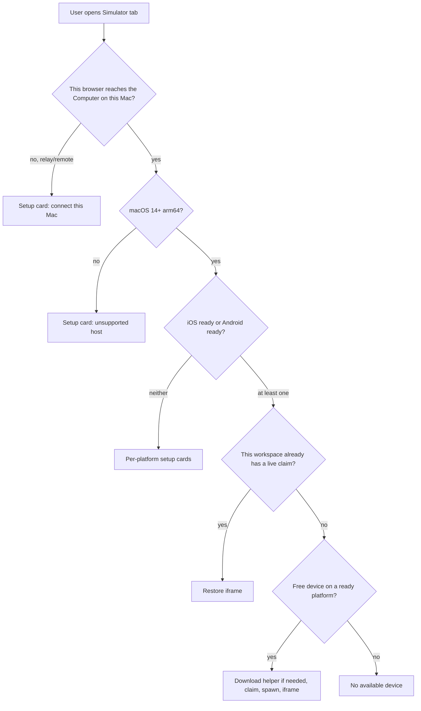

# PRD · APP-070: Simulator optimize + Android

> Product Requirements · WHAT and WHY. Settled direction for a Computer-level Device Preview that covers iOS Simulator and Android Emulator, with Workspace device claims, without replacing APP-060’s vendored-helper + iframe model.

## Context

- **Problem**: The Simulator tab is iOS-only. Probe fails the whole tab when Xcode is missing even if an Android emulator could work. Claims are workspace-keyed in code but the product still behaves like a single global preview. Android has no path. The architecture dump wanted a full app lifecycle (Metro / build / install) and a native Atmos canvas — that is more than users need to get a second platform on screen.
- **Why now**: APP-060 proved vendor → GitHub Release → `~/.atmos/runtime` → local Server spawn → iframe. Expo’s Android sibling (`expo/serve-emu`) is Apache-2.0 and fits the same install model. Multi-workspace Computers are already real; two previews must not steal one device.
- **Related specs**:
  - **Builds on** [APP-060](../APP-060_vendor-serve-sim/PRD.md) — vendor, pin, checksum, loopback spawn, iframe, setup cards, hide Simulator.app, no `npx`.
  - **Does not replace** APP-060’s security boundary (loopback + helper auth). Do not re-open “delete `/exec`” as a product goal.
  - **Does not own** Terminal / Local Run / Expo start. App build and Metro stay where they are today.

BRAINSTORM forks resolved here (see [BRAINSTORM.md](./BRAINSTORM.md)):

| Fork | Decision |
|------|----------|
| Scope | Device Preview + Workspace claim only |
| Android helper | Vendor `expo/serve-emu` (not `serve-avd`) |
| Preview UI | Iframe; serve-emu chrome matches vendored serve-sim |
| Claim | Auto-claim free device; never steal; restore on workspace return |
| Hosts | macOS arm64 Computer; Desktop **and** Web (loopback) |
| Physical devices | Out |

## Goals

1. **Primary** — From a workspace on an Apple Silicon Mac (Atmos Desktop **or** the web app talking to that Mac's Atmos Server), the user opens the existing Simulator tab and can preview either an iOS Simulator or an Android Emulator, using the same download / start / iframe habit as APP-060.
2. **Primary** — Devices belong to the Computer. A Workspace holds at most one exclusive claim. A second workspace gets a different free device, or a clear “no available device” state — never a silent steal.
3. **Secondary** — Android preview looks and behaves like the current serve-sim preview (device picker, actions under the device, tools on the right). Missing Xcode must not block Android, and missing Android SDK must not block iOS.

## Users & Scenarios

- **Primary persona**: Agentic Builder on a Mac, iterating on an Expo / RN / native mobile app inside an Atmos workspace.
- **Key scenarios**:
  1. iOS-only Mac (Xcode, no Android SDK): Simulator tab still starts an iOS preview. Android setup is a card, not a hard fail of the whole tab.
  2. Android-only Mac (SDK + AVD, no Xcode): Simulator tab can still start an Android preview.
  3. Two workspaces: A claims iPhone 16, B claims a Pixel AVD (or a second iPhone). Both iframes stay live when switching workspaces.
  4. One remaining device, already claimed: B sees “No available device” with a next step (start/create another, or wait). A’s preview is untouched.
  5. Return to workspace A: the previous claim and preview URL come back without re-downloading the helper.

## User Stories

- As a Desktop or Web user on this Mac, I want iOS and Android previews in the same Simulator tab so I do not leave Atmos for Simulator.app or Android Emulator.
- As a Desktop or Web user on this Mac, I want a missing Xcode install to leave Android preview possible, and a missing Android SDK to leave iOS preview possible.
- As a user with two workspaces, I want each workspace to keep its own device so switching workspaces does not hijack the other preview.
- As a user with only one free device, I want the product to take it for me, and to tell me clearly when none are left.
- As a first-time Android user, I want the same in-panel helper download as iOS, never `npx`.
- As a web user, I want the same iframe preview: the page is already a webpage, and the Atmos Server on this Mac starts the real simulator. I do not need the Electron shell. A remote Computer over relay still cannot show another machine's `127.0.0.1`.

## Functional Requirements

### Must Have

- **M1**: The existing center-stage Simulator tab (`simulator`, one per workspace) is the only entry. It covers iOS Simulator and Android Emulator. No second Android tab.
- **M2**: Probe is **per platform**. iOS readiness (Xcode / `simctl` / iOS runtime / device / serve-sim helper) is independent of Android readiness (Android SDK / `adb` / emulator / AVD / serve-emu helper). The tab can start if **either** platform is ready.
- **M3**: Android uses a vendored, version-pinned `expo/serve-emu` helper: compile/pack, GitHub Release, sha256, on-demand install under `~/.atmos/runtime/serve-emu/<version>/`, spawn from the local Atmos Server. No `npx`, no runtime npm, no Intel binary in v1.
- **M4**: A device is Computer-owned. A Workspace holds at most one exclusive **claim**. Start without a stored claim auto-claims a free device on a ready platform (prefer the workspace’s last platform/udid when still free). Starting never steals another workspace’s claim.
- **M5**: Switching back to a workspace restores that workspace’s live claim and preview URL when the helper is still up. Closing the tab / Disconnect stops **that** workspace’s helper and releases **that** claim only.
- **M6**: Two workspaces may run previews at the same time on two different devices (iOS+Android or two simulators). APP-060 “second start replaces the first claim” is overturned.
- **M7**: When no free device exists, show an in-panel empty/setup state (not a blank iframe): no available device. Offer a real next step when the host can create/boot another simulator or AVD. Do not auto-preempt.
- **M8**: Preview stays an iframe. The Server resolves `preview_url`; the client does not guess ports. Loopback only. Device picker, Home/rotate (or Android Back/Home/Recents equivalents), screenshot, and the right-hand tools panel live in the helper page.
- **M9**: Vendored serve-emu preview chrome matches current vendored serve-sim: device identity control that opens the device list; action controls under the device; tools in a right collapsible panel. Android keeps Android-capable actions (do not fake iOS-only tools).
- **M10**: Errors are typed and mapped to setup/retry copy: environment vs helper/runtime vs device (including already claimed). Never a single “Simulator failed” for Xcode-missing, checksum mismatch, and claim conflict.
- **M11**: Helper download progress stays in-panel. No success toast. English sentence case. `en.json` and `zh.json`. No `npx` in copy.
- **M12**: Web and Desktop both start against the connected Computer when this browser can reach that Computer's loopback (`127.0.0.1`). Hosted `app.atmos.land` with a **local** Computer is in. Relay / remote Computer cannot iframe the helper; show an in-panel “needs this Mac” card and do not start. Not a Desktop-app-only CTA.
- **M13**: Keep APP-060 hide-Simulator.app behavior for iOS boot. Android emulator window hide is best-effort, not a ship blocker if the OS does not allow it.
- **M14**: Disconnect / stop never runs `serve-sim --kill` / equivalent global kill that would tear down another workspace’s helper.

### Nice to Have

- **N1**: Native Atmos Device Screen consuming helper stream/HID/AX (no iframe).
- **N2**: Remember last UDID in UI chrome outside the iframe (M4 already persists last claim for restore).
- **N3**: `--panes` / embed mode that hides helper tools; open preview in an external browser.
- **N4**: Hide/minimize Android Emulator / qemu window as reliably as Simulator.app.

## Out of Scope

- **Metro / bundler / xcodebuild / gradle / install / launch** — not owned by Simulator today; a later spec.
- **Agent device automation** (`tap`, `swipe`, `screenshot` as Chat tools) — reserve the claim/preview lifecycle first.
- **Physical devices** (USB / wireless adb, physical iPhones) — emulators and simulators only.
- **Linux / Windows Android preview** — macOS arm64 only in this spec.
- **Cloud / remote Computer iframe** — `127.0.0.1` on another machine is not this spec. Hosted Web **with a Computer on this Mac** is in (M12). Do not proxy helper HTTP through relay in v1.
- **`npx serve-sim` / `npx serve-emu` / `npx serve-avd`** — same as APP-060.
- **Plugin framework / extra platforms** (watchOS, tvOS, Wear) — iOS + Android only.
- **Deprecated Tauri `apps/desktop`**.
- **Intel Macs** — setup card, no helper binary.
- **Renaming the tab id** away from `simulator` — keep the id; user-facing label may stay “Simulator”.

## Success Metrics

- Leading: on a ready Mac with Xcode, iOS preview still reaches an iframe without leaving Atmos.
- Leading: on a ready Mac with Android SDK + one AVD and no Xcode, Android preview reaches an iframe.
- Leading: two workspaces can show two live previews at once without swapping claims.
- Qualitative: Android helper page is recognizable as the same preview as iOS (picker, below-device actions, right tools).

## Risks & Open Questions

- **Risk**: Android emulators are RAM-heavy. Auto-claiming a second shutdown AVD can hitch the machine. Mitigate by only auto-claiming an **existing** free device, never silently creating a new AVD.
- **Risk**: Helper UI can switch devices inside the iframe and bypass Atmos claims. Product rule: a switch must not land on another workspace’s device; Atmos claim stays source of truth (TECH).
- **Risk**: `expo/serve-emu` has not shipped an official compiled single binary. Pack may need an Atmos `bun --compile` (same as serve-sim). If pack fails, this spec cannot ship Android.
- **Open (TECH)**: exact serve-emu commit, archive layout, scrcpy payload, Android window-hide strategy.

## Milestones

- Phase 1 — M1–M14: per-platform probe, claim policy, serve-emu vendor/pack, iframe Android, chrome parity, iOS regression.
- Phase 2 — N1, N3, N4, Agent tools, Metro lifecycle (separate specs as needed).
