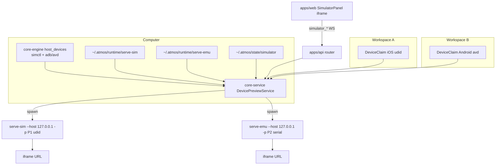

# TECH · APP-070: Simulator optimize + Android

<!-- updated 2026-09-07: Web (local or hosted) starts against a loopback Computer; relay stays blocked. Device picker posts atmos:simulator-device. -->

> Technical Design · HOW. Implements PRD APP-070: Simulator optimize + Android.

## Scope summary

Addresses **M1–M14**. N1–N4 deferred. Moves Device Preview domain out of `apps/api/src/simulator.rs` into `core-service`, splits probe by platform, vendors `expo/serve-emu` with the APP-060 install model, and keeps the web panel as an iframe. Does not spawn Metro, does not add Agent HID tools, does not draw an Atmos phone canvas.

## Frozen decisions

| Decision | Rule |
|----------|------|
| Android helper | Vendor [expo/serve-emu](https://github.com/expo/serve-emu) (package currently branded `serve-emul`). **Not** `serve-avd`. |
| Install | Same as APP-060: pin JSON, GitHub Release, sha256, `~/.atmos/runtime/serve-emu/<version>/`, spawn from local Server. |
| Product UI | Iframe helper preview. Patch serve-emu chrome to match vendored serve-sim. |
| Claims | Exclusive per device. Auto-claim free (including shutdown-but-available). Never steal. Persist last `{platform, udid}` per workspace. |
| Helper topology | One helper **process per claimed device**. Do not wait on upstream multi-device routing. |
| Layers | Inventory in `core-engine`. Claims + helper lifecycle in `core-service`. Paths only in `runtime-manager`. Thin WS in `apps/api`. |
| Wire names | Keep `simulator_*`. Add `platform` on start/status/claim. Do not add a parallel `device_preview_*` catalog in v1. |
| `/exec` | Unchanged from APP-060 TECH: keep serve-sim `/exec` + `/exec-ws`; bind `127.0.0.1`. |
| Hosts | `macos` + `aarch64` only. Linux/Windows → `unsupported_platform` / `unsupported_arch` for the whole host, even if Android SDK exists. |
| Physical adb | Filter out; only emulator serials / AVDs. |
| Creating AVDs | User-initiated “start another device” may boot an **existing** shutdown AVD/sim. Do not `avdmanager create` in v1 unless the helper already exposes a one-click create that we can gate. |

## Architecture overview



Target vs current:

| Piece | Keep | Move | Add | Delete |
|-------|------|------|-----|--------|
| `vendor/serve-sim` + pack + pin | yes | — | — | — |
| `apps/api/src/simulator.rs` | tests as migration source | domain → `core-service` | Android runtime | fat API module |
| WS `simulator_*` | names | payloads | `platform`, per-platform probe, `claimed_by` | all-or-nothing `reason` as the only signal |
| Web `features/simulator` | iframe panel, tab id | setup cards | Android reasons, dual-ready start | custom Device Screen |
| `runtime-manager` layout | serve-sim paths | — | `serve_emu_runtime_dir` | DevicePreviewManager here |
| Metro / gradle | — | — | — | out of spec |

Do not invent a plugin framework. Platforms are an enum: `Ios | Android`.

## Module-by-module design

### `crates/core-engine`

Add `crates/core-engine/src/host_devices/` (name may be `ios_simctl` + `android_sdk` if a single module grows too large).

Capabilities, no Workspace concept:

- iOS: `xcrun simctl list devices -j` → id, name, runtime, boot state, `isAvailable`. iOS runtimes only (keep APP-060 watchOS filter).
- Android: resolve SDK (`ANDROID_HOME` / `ANDROID_SDK_ROOT`), `adb`, `emulator`, list AVDs (`emulator -list-avds` or `avdmanager list avd`). Map running emulators via `adb devices` + `adb emu avd name` / emulator console. Ignore USB physical devices (`usb:` / unauthorized / no matching AVD).
- Boot/shutdown: **prefer the helper**. Engine may expose `simctl boot` / `emulator -avd` only if start must run before the helper; default is “pass id to helper and let it boot”.

### `crates/core-service`

Add `crates/core-service/src/service/device_preview/`:

- `DevicePreviewService` — probe, ensure helper, start, stop, status, claim/release.
- `pins/serve-sim-requirement.json` and `pins/serve-emu-requirement.json` (move the existing API pin here so one crate owns versions).
- Download/extract/spawn copied from `apps/api/src/simulator.rs`, parameterized by helper kind. Shared: loopback port reserve, sha256, tar extract, SIGTERM our pid only, log file under `$TMPDIR`.
- Claims file stays `~/.atmos/state/simulator/claims.json` (avoid a second state dir). Extend records with `platform`.
- Prefs: `~/.atmos/state/simulator/prefs.json` `{ "<workspace_id>": { "platform", "udid" } }` for last successful claim.

`apps/api` must not keep a parallel `SimulatorRuntime` after the move. Router constructs/holds `Arc<DevicePreviewService>` the same way it holds other services.

### `crates/runtime-manager`

- `serve_emu_runtime_dir()` → `~/.atmos/runtime/serve-emu`
- Document cache `~/.atmos/cache/serve-emu/` in `agents/references/runtime/atmos-home-layout.md`
- No spawn, no claims, no business rules.

### `apps/api`

- `api/ws/router/simulator.rs` maps existing actions onto the service.
- Broadcast `simulator_download_progress` with `workspace_id` **and** `helper` (`serve_sim` \| `serve_emu`).
- Keep `WsAction` names. Extend request/response structs in `message` / DTO modules; extract `@atmos/api-types` in the same PR.

### `vendor/serve-emu/`

- Copy tagged upstream. Strip `.git`. `UPSTREAM.md` + `ATMOS-PATCHES.md` + LICENSE.
- Required patches:
  1. Bind loopback only (same as serve-sim).
  2. Preview chrome parity with vendored serve-sim (M9): device identity control that toggles the device list; action toolbar **below** the device (Back / Home / Recents / rotate / screenshot as applicable); tools in a **right** collapsible panel. Do not restyle iOS serve-sim unless a tiny shared token is required for parity.
  3. Device switch: do not select a UDID/serial that Atmos marked claimed by another workspace. When the user switches to another listed device, the helper posts `atmos:simulator-device` `{ udid, platform }` to the parent; Atmos runs `simulator_start` with that id. On `device_already_claimed` the parent keeps the previous iframe. `?device=` still locks Stop / this helper's own stream to the claimed device.
- NOTICE entry for vendor source **and** redistributed binary (and scrcpy server bits if shipped). Apache-2.0 only; no GPL.

### Pack / Release

Mirror `scripts/serve-sim/pack.sh`:

- `just pack-serve-emu` / `just pack-serve-emu --install`
- CI workflow on tag `serve-emu-*`, `macos-26` arm64
- Asset: `serve-emu-<version>-darwin-arm64.tar.gz` + `manifest.json`
- GitHub Releases only. No R2. No `npx`.

Upstream README still lists compiled single binary as Planned. Atmos adds or reuses a `bun build --compile` (or equivalent) at pack time. If the CLI cannot compile, **stop and change this TECH** — do not fall back to shipping `node_modules`.

Pin file fields match serve-sim: `version`, `minos`, `arch`, `release_tag`, `asset`, `sha256`, `download_url`, `upstream_commit`.

### `apps/web`

<!-- updated 2026-09-07: not Desktop-shell-only; gate on loopback Computer vs relay -->

- Keep `features/simulator/` and tab value `simulator` (M1).
- `simulator_probe` drives setup: if one platform is ready, enable Start; if both ready, Start uses last prefs or iOS first then Android.
- Setup cards: existing iOS reasons plus `android_sdk_missing`, `adb_missing`, `emulator_missing`, `no_avd`, `device_already_claimed`.
- Iframe `src` still `iframeSrc(url, udid)` with loopback + `device` query.
- Listen for helper `postMessage` `atmos:simulator-device` → `simulator_start` with the new udid; on `device_already_claimed` keep the previous iframe target.
- Do **not** block hosted origin (`app.atmos.land`) or `!isDesktopRuntime`. Local Web and hosted Web start when `connectionMode !== "relay"` (browser can hit this Mac's `127.0.0.1` helper). Relay / remote Computer → `not_desktop` setup card (needs this Mac), no start.
- i18n `features.simulator.*` — Android strings in en + zh.

Do not add Electron IPC. Desktop is a `/ws` client, same as Web.

## Data model

Orthogonal fields. Do **not** put `claimed` in the same enum as `booting`.

```rust
enum DevicePlatform { Ios, Android }

enum BootState { Booted, Shutdown, Booting, ShuttingDown, Unavailable }

struct Device {
    id: String,            // iOS UDID or emulator serial / AVD name (stable id documented in service)
    platform: DevicePlatform,
    name: String,
    runtime: String,       // iOS runtime identifier or system image / API level
    boot: BootState,
    available: bool,       // simctl isAvailable / AVD exists
    claimed_by_workspace: Option<String>,
}

struct DeviceClaim {
    workspace_id: String,
    platform: DevicePlatform,
    device_id: String,     // stable inventory id (iOS UDID / AVD name)
    argv_id: String,       // helper argv token (`-s serial` when booted, else device_id)
    pid: u32,
    port: u16,
    url: String,
    helper: HelperKind,    // ServeSim | ServeEmu
    version: String,
}

enum HelperKind { ServeSim, ServeEmu }

struct PlatformProbe {
    ready: bool,
    reason: SimulatorReason,
    helper_installed: bool,
    helper_version: String,
    devices: Vec<Device>,
}

struct SimulatorProbe {
    platform: String,      // host OS
    arch: String,
    macos_version: Option<String>,
    ios: PlatformProbe,
    android: PlatformProbe,
}
```

`SimulatorReason` keeps existing iOS values and adds Android / claim values. A workspace-level `ready` for Start is `ios.ready || android.ready` after host checks (`unsupported_platform`, `macos_too_old`, …).

`preview_url` is a **projection of a live claim**, not a field on an unclaimed Device.

No SQLite. Claims + prefs are JSON under `~/.atmos/state/simulator/`.

### Start algorithm (M4–M7)

1. Probe. If host unsupported → return host reason, no spawn.
2. If this workspace has a live helper (pid + port open) and requested id is None or same → reuse.
3. Resolve target:
   - explicit `udid` + optional `platform`
   - else prefs last pair if that device exists, is available, and not claimed by someone else
   - else first free **booted** device on a ready platform (iOS preferred if both)
   - else first free available (may be shutdown) on a ready platform
4. If none → `no_device` (or `device_already_claimed` if the only match is owned). Do not evict.
5. Ensure helper binary for that platform (download + progress).
6. Spawn helper on a fresh loopback port, wait until listening (existing 150s budget is OK for emulator boot; keep it).
7. Persist claim + prefs. Return `{ ready, url, udid, platform }`.

Stop: remove that workspace’s claim, SIGTERM our child, do not `--kill` all helpers.

## Transport

Keep WebSocket-only. No REST.

| Action | Input | Output |
|--------|--------|--------|
| `simulator_probe` | `{}` | `SimulatorProbe` (ios + android) |
| `simulator_start` | `{ workspace_id, platform?, udid? }` | `{ ready, reason?, url?, udid?, platform? }` + probe flatten **or** nested platforms — pick nested `ios`/`android` and stop flattening the old single `reason` as the only field. Keep a convenience `reason` = blocking reason for this start attempt. |
| `simulator_stop` | `{ workspace_id }` | `{ stopped: true }` |
| `simulator_status` | `{ workspace_id }` | `DeviceClaim \| null` including `platform` |

Event: `simulator_download_progress` `{ workspace_id?, helper?, downloaded, total }`.

Do **not** add `simulator_run_app` / Agent tap/swipe in this spec.

`@atmos/api-types`: update `dto/simulator.ts`, `contract/simulator.ts`, extract fixtures in the same PR. Web wrappers in `apps/web/src/api/ws/simulator-api.ts`. Duplicate local types in `features/simulator/types.ts` should **re-export** the api-types DTO instead of drifting (today they duplicate).

## Security & permissions

- Helpers bind `127.0.0.1` only.
- Checksum pin on both archives.
- Stop/kill only the pid we spawned (re-attach to leftover helpers only when the pid/udid matches **this** claim, same as today’s `live_helper` — do not adopt a random user’s `npx serve-emu`).
- Do not log preview tokens.
- Device switch in the iframe cannot claim another workspace’s device.

## Rollout plan

1. Types + per-platform probe (Android inventory, no spawn). iOS probe behavior preserved for existing reasons.
2. Claim policy tests: two workspaces, no steal, auto-claim free, restore. Overturn APP-060 S7.
3. Move `simulator.rs` into `core-service` + thin API router. iOS iframe still works.
4. Vendor serve-emu + patches (loopback, chrome parity, claim-safe picker) + `just pack-serve-emu` + release workflow + NOTICE.
5. Android ensure/start/stop + pin JSON + download progress `helper` field.
6. Web setup cards + start with `platform` + i18n.
7. Manual Mac pass: iOS regression, Android first download, two-workspace.

Each step should be mergeable; Android spawn must not land without checksum pin filled (local `--install` for dogfood).

## Risks & tradeoffs

- **Tradeoff**: keep iframe instead of native canvas. APP-060 already paid for helper UI; Android work is chrome parity in the vendor, not a second HID stack.
- **Tradeoff**: one process per device, not one computer-level multiplexer. serve-emu multi-device is Planned; claiming isolation is simpler per process.
- **Tradeoff**: keep `simulator_*` wire names. Renaming is cosmetic and breaks extract/clients for no user value.
- **Tradeoff**: domain in `core-service`, not `runtime-manager`. Runtime Manager must not grow device business rules.
- **Risk**: serve-emu pack (scrcpy, bun compile) is the Android ship gate.
- **Risk**: second AVD boot is slow and RAM-heavy. Auto-claim only existing devices.
- **Risk**: iframe device grid vs claims. Mitigate with disable-foreign + optional postMessage.
- **If this breaks**: hide Android start (iOS-only probe path); leftover helpers die with Server/`kill_on_drop`.

## Dependencies & compatibility

- Depends on APP-060 helper install + iframe panel.
- macOS 14+ arm64, Xcode **or** Android SDK (per platform).
- bun at pack time only.
- GitHub Releases for both archives.
- License: Apache-2.0 vendor trees; NOTICE for binaries.

## Open questions

- [x] Exact `expo/serve-emu` commit and whether the compiled binary is named `serve-emu` or `serve-emul` → commit `def2e0d87a60857ba5a303750bcb7de9f5fc7185` (branch `expo`); compiled binary name `serve-emu`. Recorded in pin + `vendor/serve-emu/UPSTREAM.md`.
- [ ] Whether Android window hide is feasible without Accessibility permission → implement best-effort; do not block M13 iOS hide.
- [x] `serve-avd` → **no**, use serve-emu.
- [x] Native canvas this spec → **no**.
