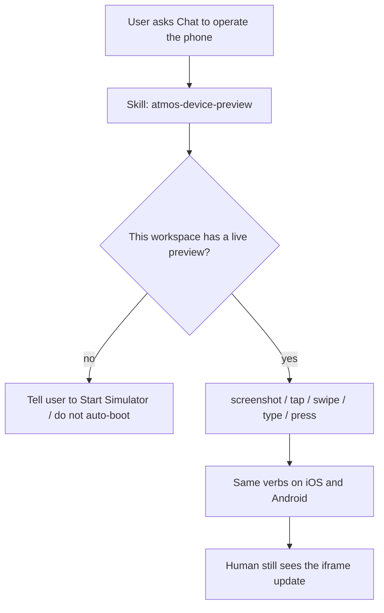

# PRD · APP-071: Device Preview agent control

> Product Requirements · WHAT and WHY. Settled direction for driving the **already-running** iOS Simulator / Android Emulator preview from Agent Chat and the `atmos` CLI, without teaching two helper dialects or injecting per-host Chat tools.

## Context

- **Problem**: The Simulator tab (APP-060 / APP-070) already starts a loopback helper and shows a live phone in an iframe. Both helpers can tap, type, swipe, and screenshot. Atmos Agent cannot use that surface: Chat has Bash / Desktop Use / Browser Use, but nothing that means “this workspace’s claimed device.” Agents that improvise curl `serve-emu` or `serve-sim tap` guess ports, leak tokens, and pick the wrong platform.
- **Why now**: APP-070 reserved Agent device automation until claims and dual-platform preview existed. That lifecycle is in. Builders iterating on Expo / RN / native apps now need “screenshot this screen, tap Login, type the code” inside the same workspace.
- **Related specs**:
  - **Builds on** [APP-070](../APP-070_simulator-optimize-add-android/PRD.md) — exclusive workspace claim, iOS + Android iframe, `simulator_*` lifecycle. This spec **promotes** APP-070 Phase 2 “Agent tools.”
  - **Builds on** [APP-060](../APP-060_vendor-serve-sim/PRD.md) — vendored helper, loopback, reuse claim. APP-060 TECH M10 deferred “teach agents the helper CLI”; this spec is that follow-up, but **through Atmos**, not raw helper APIs.
  - **Builds on** [APP-063](../APP-063_agent-first-product-cli/PRD.md) — JSON envelope, `POST /api/cli/invoke`, sticky workspace context, system skills. Same delivery as Desktop Use / Browser Use: **CLI + skill, no MCP**.
  - **Does not replace** APP-070 preview UI. The iframe stays the human surface. Agent HID does not redraw a native Atmos phone canvas (APP-070 N1).
  - **Does not own** Metro, install, or launch. Those stay out, same as APP-070.

BRAINSTORM forks resolved here (see [BRAINSTORM.md](./BRAINSTORM.md)):

| Fork | Decision |
|------|----------|
| Delivery | System skill `atmos-device-preview` + `atmos simulator …` CLI. Not injected Chat tools. Not MCP. |
| Start vs claim | v1 **requires a live claim**. Do not auto-boot an emulator from Chat. |
| Platforms | Same verb set for iOS and Android. Platform-only keys return a typed error, not a silent no-op. |
| Accessibility / install | Out of v1. Screenshot + pointer + type + hardware keys only. |
| Device identity | Reuse claim **`udid`** as the public handle. Do not mint a second `device_id` / `claim_id`. `platform` is a filter, not a unique key. |
| Missing id | Skill **must not guess**. List live claims (with project / workspace) and ask, or wait for `/device-preview` / Copy Agent prompt. |
| Composer entry | Atmos slash command `/device-preview` (Welcome, Terminal, Agent Chat) inserts a chip; **on send** it expands to the same prompt text as Copy. |

## Goals

1. **Primary** — From Agent Chat in a workspace that already has Device Preview running, the agent can screenshot, tap, swipe, type, and press Home (and Android Back / Recents) on **that workspace’s claimed device**, without the user leaving Atmos or tapping the iframe.
2. **Primary** — The agent speaks **one** verb set. It never chooses between serve-sim CLI and serve-emu REST, never sees helper ports or auth tokens in skill text.
3. **Secondary** — The same verbs work from any Bash-capable coding agent via `atmos` (sticky workspace context), matching how Desktop Use is delivered.

## Users & Scenarios

- **Primary persona**: Agentic Builder on a Mac, iterating on a mobile app in an Atmos workspace, with the Simulator tab already showing iOS or Android.
- **Key scenarios**:
  1. Preview is live (user started iOS or Android). User asks Chat to “tap Sign in.” Agent screenshots, reads the PNG, taps normalized coordinates, screenshots again.
  2. Android preview: agent presses Back, then Home. iOS preview: Back is refused with a clear “unsupported on this platform” message and a next step (use Home, or swipe from the edge if the app handles it).
  3. No Simulator tab running: agent does **not** boot an emulator. It tells the user to Start preview (or use existing `simulator_start` only when the user explicitly asked to start), then retry.
  4. Two workspaces, two live previews (iPhone + Pixel): Chat in A drives A’s device. The agent first reads `status` (gets `udid` / name / platform), then passes that `udid` on every tap so it cannot silently hit B’s phone.
  5. User says “tap the Android one” while this workspace’s claim is iOS: fail with a platform/device mismatch and the live `udid`s — do not retarget B’s Pixel.
  6. User is using Desktop Use for the Mac screen. Device Preview skill does not steal those clicks; phone UI is this skill only.
  7. User never mentions a `udid`. Agent lists every live preview (name, platform, project, workspace) and asks which one — it does not pick the other workspace’s Pixel.
  8. User clicks **Agent** on the Simulator tab: clipboard gets a prompt with this device’s handle + ownership. Paste into Chat becomes a chip; sending expands to that text.
  9. User types `/device-preview` in Terminal or Agent Chat: composer shows a chip (device name). Sending the message expands it to the same prompt as Copy.

## User Stories

- As a builder in Chat, I want the agent to tap and type on the phone I already opened in Simulator so I do not click the iframe myself.
- As a builder, I want one set of commands whether the tab is iOS or Android so I do not care which helper is running.
- As a builder, I want a missing preview to fail clearly (“start Device Preview first”) instead of the agent silently launching a second emulator and eating RAM.
- As a builder with two workspaces, I want Chat in this workspace to touch only this workspace’s device, and I want that device named by a stable id (`udid`) so “the Android one” is not ambiguous.
- As a builder who also uses Desktop Use, I want phone control and Mac-desktop control to stay distinct skills so the agent does not click my laptop chrome when I meant the simulator.
- As a builder who forgot the device id, I want the agent to list live phones with project and workspace names and ask me, not silently pick one.
- As a builder watching the Simulator tab, I want an Agent button that copies a ready-made prompt for this device so I can paste it into Chat.
- As a builder in Terminal or Agent Chat, I want `/device-preview` as an Atmos command that looks like a chip while I edit, and becomes the full device prompt when I send.

## Functional Requirements

### Must Have

- **M1**: Agent device control is a **first-class Atmos product surface**: system skill `atmos-device-preview` plus typed CLI `atmos simulator <verb>`. Chat does not inject a fake native tool per host (Claude / Codex / ACP). v1 does not add MCP.
- **M2**: Control always targets the **current workspace’s live Device Preview claim**. No claim → typed error (`no_claim`) with a fix (“Start the Simulator tab, then retry”). Do not auto-call start/boot as a hidden side effect of tap/screenshot.
- **M3**: One verb set for both platforms:

  | Verb | Meaning |
  |------|---------|
  | `screenshot` | Capture the device screen to a file; return path + pixel size |
  | `tap` | Tap at normalized coordinates |
  | `swipe` | Swipe between two normalized points |
  | `type` | Type text into the focused field |
  | `press` | Hardware key: `home`, `back`, `recents` |

- **M4**: Coordinates are **normalized 0..1** of the device screen (origin top-left), matching both helpers. Skill teaches: read PNG pixels → divide by returned width/height. Do not use Desktop Use PNG-pixel clicks on the phone.
- **M5**: `press back` and `press recents` are Android-only. On iOS they return `unsupported_on_platform` with a next step. `press home` works on both. v1 does not expose Power as an agent verb (stopping preview stays a user / `simulator_stop` action).
- **M6**: Screenshot returns a **file path** (plus width/height/platform/udid), not a huge base64 payload on the wire. Same habit as `atmos desktop-use` capture.
- **M7**: Helper ports, loopback URLs, and any helper auth tokens **never** appear in skill copy or in agent-facing CLI flags. The CLI talks to Atmos Server; Server talks to the claimed helper on loopback.
- **M8**: Workspace isolation: control in workspace A cannot drive workspace B’s claim. Selecting another workspace’s `udid` is rejected (`claimed_by_other_workspace`), not silently retargeted.
- **M9**: Errors are typed and agent-recoverable: `no_claim`, `device_unknown`, `claimed_by_other_workspace`, `platform_mismatch`, `ambiguous_device`, `unsupported_on_platform`, `invalid_coords`, `helper_unreachable`, plus existing lifecycle reasons when the user **explicitly** starts via existing `simulator_start`. Envelope follows APP-063 (`ok`, `error.code`, `fix`, `next_actions`).
- **M10**: Skill is a synced **system** skill (same family as `atmos-desktop-use` / `atmos-browser-use`): decision tree, coordinate rule, “do not use Desktop Use for the phone,” “do not curl the helper.” English sentence case in product CLI help. `en` / `zh` only if the web UI gains copy in this spec (v1 skill itself is English, like Desktop Use).
- **M11**: Existing Simulator tab / iframe / claim lifecycle from APP-070 is unchanged. Agent actions must be visible in the live preview (the human watching the iframe sees taps). Do not add a second capture stack or a native Atmos canvas.
- **M12**: Every live preview has a **public device handle**: the claim `udid` (iOS Simulator UDID, Android AVD id — same field `start` already uses). `platform` is not unique (two Pixels). Do not invent a parallel `claim_id`. `status` / `list` / screenshot / every control ack return `{ udid, name, platform }`. Control verbs accept `udid` (recommended on every call) and optional `platform` as a filter. If `udid` is omitted **on the CLI/WS call** and this workspace has exactly one claim, v1 may default to it. If the **user** never named a device and there is no Copy/`/device-preview` chip in the thread, the **skill** must not silently rely on that default when more than one live claim exists on the Computer — see M13.
- **M13**: Skill discovery when the user did not provide a device id (no `--udid`, no Device Preview chip, no “the Pixel in workspace X”):
  1. Call `atmos simulator list` (Computer-wide live claims).
  2. Show each row as **name · platform · project · workspace** (mark “this workspace” when it matches Chat/CLI context).
  3. **Ask the user which device** (or tell them to Start preview / click Agent / run `/device-preview`). Do not guess. Do not drive another workspace’s `udid`.
  4. Zero live claims → ask the user to start Device Preview; still do not auto-boot.
- **M14**: The Simulator tab (Device Preview) has an Atmos-owned **Agent** control (overlay on `SimulatorPanel`, **not** inside vendored serve-sim / serve-emu chrome). When the preview is live, click copies the Agent prompt for **this tab’s claim** (udid, name, platform, project name, workspace name/id). Clipboard uses the existing AI-context protocol so paste into an Atmos composer becomes a chip. Button shows inline **Copied** (no success toast). English sentence case. `en.json` + `zh.json`. Prompt never includes helper `url` / `port` / tokens.
- **M15**: `/device-preview` is an **Atmos slash command** (same family as `/desktop-use` / `/view-run-logs`), available in **Welcome/project composer, Terminal agent overlay, and Agent Chat**. It inserts a composer **chip** (label = device name, or “Device preview” if listing). **On send**, the chip expands to the **same prompt text** as M14 Copy (not `/device-preview`, not a skill-path token). If this composer’s workspace has a live claim, bind that device. If not, the expanded text lists live claims with project/workspace and tells the agent to ask. Do not insert a second native Chat tool.

### Nice to Have

- **N1**: Chat auto-start: if the user explicitly says “open the Android preview and tap…”, the agent may call existing `simulator_start` (still user-intent, still claim policy). Not a hidden default of `tap`.
- **N2**: Accessibility dump / AX tap (serve-emu `/api/accessibility`) as a structured alternative to screenshot-click.
- **N3**: Dedicated Chat **tool** chip in the transcript (classify `atmos simulator` like a first-class tool). Composer Device Preview chip (M15) is Must Have and is not this item.
- **N4**: Install / launch / deep-link the app under test (Metro remains a different spec).
- **N5**: Rotate, volume, permission prompts, clipboard, as extra verbs.

## Out of Scope

- **Auto-boot from Chat** as the default path for tap/screenshot (M2).
- **MCP server** wrapping the helper.
- **Injected native tools** into Claude / Codex / OpenCode / ACP session setup.
- **Teaching the agent raw serve-sim CLI or serve-emu REST** (ports, `/api/tap`, `/exec`).
- **Metro / xcodebuild / gradle / install / launch** — APP-070 out of scope; still out.
- **Native Atmos Device Screen** (APP-070 N1).
- **Physical USB / wireless devices**.
- **Relay / remote Computer** — same loopback rule as APP-070: control only when this Computer can reach `127.0.0.1` helpers.
- **Renaming `simulator_*` wire prefix** to `device_preview_*` — APP-070 freeze stands; new actions stay `simulator_*`.
- **Deprecated Tauri `apps/desktop`**.
- **Driving Simulator.app / Android Emulator chrome** via Desktop Use as the product path (skill forbids it).

## Success Metrics

- Leading: with a live iOS claim, `atmos simulator screenshot` then `tap` lands on the device and the iframe updates, without the agent knowing the helper port.
- Leading: same commands on a live Android claim.
- Leading: with two live previews, passing B’s `udid` from workspace A fails `claimed_by_other_workspace` and does not move B’s device.
- Leading: `/device-preview` in Agent Chat sends expanded prompt text (udid + project/workspace), not a leftover chip token.
- Qualitative: agents stop mixing Desktop Use clicks with the phone; skill decision tree is the reason. When the user omits an id, the agent lists and asks.

## Risks & Open Questions

- **Risk**: Agents confuse Desktop Use (Mac screen, PNG pixels) with Device Preview (phone, 0..1). Mitigate in skill frontmatter and with mutually exclusive “do not use” lines in both skills.
- **Risk**: Screenshot-then-tap loops miss moving UI. v1 accepts that; N2 accessibility is the follow-up.
- **Risk**: iOS `type` is US-keyboard ASCII in serve-sim. Non-ASCII should fail with a typed error and a fix (paste via other means is N, not a silent drop).
- **Open (TECH)**: none remaining for v1 addressing (`udid` is the handle). PNG dir and lifecycle CLI wrappers are locked in TECH.

## Milestones

- Phase 1 — M1–M15: control service + adapters, `udid` addressing, list-with-ownership, CLI verbs, system skill (ask/list), Simulator Agent copy button, `/device-preview` chip in Terminal + Agent Chat.
- Phase 2 — N1–N5 in later specs (accessibility, Chat chip, install/launch, extra keys).
