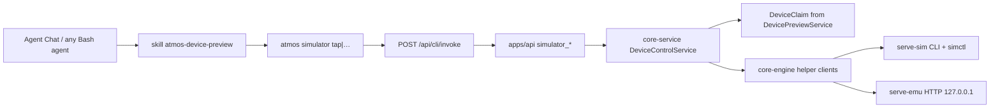

# TECH · APP-071: Device Preview agent control

> Technical Design · HOW. Implements PRD APP-071: Device Preview agent control.

## Scope summary

Addresses **M1–M15**. N1–N5 deferred (N3 = transcript tool chip only; composer chip is M15). Adds a **workspace-authorized, `udid`-addressed Device Control** façade on top of APP-070 claims, plus list-with-ownership, Copy Agent prompt, and `/device-preview` composer chips. Delivery is CLI + system skill (APP-063), not MCP and not per-host Chat tool injection. Does not auto-boot a claim from tap. Does not change iframe preview, wire prefix, or Metro.

## Frozen decisions

| Decision | Rule |
|----------|------|
| Delivery | System skill `atmos-device-preview` + `atmos simulator <verb>`. Skill is **not** folded into `atmos-cli`. No MCP. No injected native Chat tools in v1. |
| Claim | Live `DeviceClaim` required. `screenshot`/`tap`/`swipe`/`type`/`press` never call `DevicePreviewService::start`. |
| Wire names | New actions stay `simulator_*` (APP-070 freeze). **Per-verb** actions, not one tagged `simulator_control`, so CLI maps 1:1 and `@atmos/api-types` `WsContract` stays obvious. |
| Coordinates | Normalized **0..1**, top-left origin. Reject outside range (`invalid_coords`). Skill: `x = px / width`. |
| Screenshot | Write PNG to disk; WS/CLI return `{ path, width, height, … }`. Never put image bytes on `/ws` or `/api/cli/invoke`. |
| iOS screenshot | `xcrun simctl io <udid> screenshot <path>` via `core-engine`. Do not pull PNG through serve-sim `/exec`. |
| iOS HID | Talk to the **already-running** helper: spawn the vendored `serve-sim` binary (`tap` / `gesture` / `type` / `button`) with `-d <udid>`. Do not reimplement HID WS frames in v1. |
| Android HID + screenshot | Loopback HTTP to the claimed port: `POST /api/tap\|swipe\|text\|key`, `GET /api/screenshot`. Atmos spawn is loopback **without** `--token` (APP-070 argv); do not add tokens to skill text. |
| Layers | Helper I/O in `core-engine` (no workspace). Claim resolve + verb policy in `core-service`. Thin WS in `apps/api`. CLI is invoke-only (no helper HTTP in `apps/cli`). |
| Keys | Product `press`: `home` \| `back` \| `recents`. iOS: `home` → `serve-sim button home`; `back`/`recents` → `unsupported_on_platform`. Android: `POST /api/key` `{ key }`. No `power` in v1. |
| Lifecycle CLI | Same `atmos simulator` group also wraps existing `probe` / `start` / `stop` / `status` so the skill never teaches `atmos call simulator_*`. Start remains **explicit**, never a side effect of tap. |
| Device handle | Public id = existing `DeviceClaim.udid` (iOS UDID / Android AVD id). Matching also accepts `argv_id` (Android `emulator-5554`). Do **not** mint `claim_id`. `platform` is a filter only. `workspace_id` authorizes; `udid` selects. |
| Missing user id | Skill lists Computer-wide live claims with project/workspace names and **asks**. Never guess across workspaces. |
| Copy + slash | Shared English prompt builder. Clipboard = AI-context protocol (`atmos://context/device-preview`). Composer chip `[#ctx:device-preview:…]` expands to that body on send. Overlay button lives on Atmos `SimulatorPanel`, not vendor helper chrome. |

## Architecture overview



Target vs current:

| Piece | Keep | Add | Do not |
|-------|------|-----|--------|
| `DevicePreviewService` claims/start/stop | yes | lookup used by control | auto-start from HID |
| `simulator_probe/start/stop/status` | yes | CLI wrappers; **list** | rename prefix |
| Helper spawn argv (loopback, no token) | yes | — | put token in skill |
| Chat hosts / ACP | unchanged | Atmos `/device-preview` in Agent Chat slash (today Agent Chat only lists provider commands) | extra native tools |
| Iframe `SimulatorPanel` | yes | Agent copy overlay | patch serve-emu/serve-sim for the button |
| `atmos-desktop-use` | yes | cross-link “not the phone” | drive Simulator.app |

## Module-by-module design

### `crates/core-engine`

New module `crates/core-engine/src/device_control/` (keep `host_devices/` inventory-only). **No** `workspace_id`.

```text
device_control/
  coords.rs          # validate 0..=1
  screenshot.rs      # write PNG, read dimensions
  serve_sim.rs       # run packed serve-sim: tap, gesture, type, button
  simctl_io.rs       # simctl io <udid> screenshot
  serve_emu.rs       # reqwest to http://127.0.0.1:{port}/api/*
```

Capabilities:

| Fn | Behavior |
|----|----------|
| `simctl_screenshot(udid, dest)` | `xcrun simctl io <udid> screenshot <dest>`; then read PNG size. |
| `serve_sim_tap(bin, udid, x, y)` | `{bin} tap {x} {y} -d {udid}` (coords already validated). |
| `serve_sim_swipe(...)` | `{bin} gesture` with begin/move/end JSON (same 0..1 space as `tap`). |
| `serve_sim_type(bin, udid, text)` | `{bin} type -- {text}`. Map non-ASCII helper failure → typed engine error. |
| `serve_sim_button(bin, udid, home)` | `{bin} button home -d {udid}`. |
| `serve_emu_tap(port, x, y)` | `POST /api/tap` `{x,y}`. |
| `serve_emu_swipe(port, x1,y1,x2,y2, duration_ms?)` | `POST /api/swipe`. |
| `serve_emu_text(port, text)` | `POST /api/text` `{text}`. |
| `serve_emu_key(port, key)` | `POST /api/key` `{key: "home"|"back"|"recents"}`. |
| `serve_emu_screenshot(port, dest)` | `GET /api/screenshot` (binary PNG); write `dest`. |

Helper binary path is **not** invented here: caller passes the installed serve-sim path from `DevicePreviewPaths` / pin version (same `~/.atmos/runtime/serve-sim/<version>/serve-sim` APP-060 already uses).

HTTP client: loopback only. Timeouts short (a few seconds). Do not follow redirects off `127.0.0.1`.

### `crates/core-service`

Add `crates/core-service/src/service/device_preview/control.rs` as `DeviceControlService` (or methods on a wrapper that holds `Arc<DevicePreviewService>`). Do **not** put HID inside `start()`/`stop()`.

Flow for every verb:

1. Resolve `workspace_id` (required for authorization).
2. Resolve **target claim** with `resolve_target(workspace_id, udid, platform)` (below). Fail before any helper I/O.
3. Validate coords / key / non-empty type text.
4. Branch on `claim.helper`:
   - `ServeSim` → iOS adapter (simctl screenshot **or** serve-sim CLI using **this claim’s udid** and the Computer’s serve-sim binary).
   - `ServeEmu` → Android adapter (`claim.port`).
5. Map helper/OS failures to `HelperUnreachable` (or `UnsupportedOnPlatform` before any I/O).

#### `resolve_target`

Two keys, different jobs:

| Key | Job | Unique? |
|-----|-----|---------|
| `workspace_id` | Who may drive (APP-070: one live claim per workspace) | Unique **slot**, not unique hardware on the Computer |
| `udid` | Which simulator/AVD | Unique among live claims. Also match `argv_id` |

```text
live = all DeviceClaims on this Computer

if udid given:
  claim = live.find(c.udid == udid || c.argv_id == udid)
  if none → DeviceUnknown
  if claim.workspace_id != workspace_id → ClaimedByOtherWorkspace
  if platform given && claim.platform != platform → PlatformMismatch
  return claim

if platform given:
  mine = status(workspace_id)
  if mine is None → NoClaim
  if mine.platform != platform → PlatformMismatch
  return mine

mine = status(workspace_id)
if mine is None → NoClaim
return mine   # v1: one claim per workspace, so default is unique
```

Do **not** pick “any Android on the Computer” when `platform=android` and this workspace holds iOS. Do **not** drive another workspace’s Pixel because the user said “android”.

Persist `name` on `DeviceClaim` at `start` (copy `SimulatorDevice.name`). Old claims without name: fill from current probe inventory by udid, else empty. Agent-facing status/ack always include `name`.

CLI `status` envelope for agents: `{ udid, name, platform, helper, workspace_id }`. Skill must not tell the model to use `url` / `port` even if the WS DTO still has them for the iframe.

PNG dest (when CLI/WS omit `--out`):

```text
~/.atmos/tmp/device-preview/<workspace_id>/screenshot-<unix_ms>.png
```

Create the directory. Do not write into the project worktree unless `--out` says so.

`DevicePreviewPaths` already knows `~/.atmos`; extend it with `device_preview_tmp(workspace_id)` rather than scattering home-dir joins.

Serve-sim binary: `DevicePreviewPaths` + current serve-sim pin version (already loaded by `DevicePreviewService`). If the binary is missing, that is `HelperUnreachable` / helper-missing — the claim should not be live in a healthy Computer; still fail typed, do not download from a tap.

### `apps/api`

Extend `apps/api/src/api/ws/message.rs` `WsAction` and `apps/api/src/api/ws/router/simulator.rs`.

New actions (snake_case wire names):

| Action | Input (plus `workspace_id` where noted) | Output |
|--------|-----------------------------|--------|
| `simulator_list` | `workspace_id?: string` (marks `current`) | `SimulatorClaimList` |
| `simulator_screenshot` | `workspace_id`, `udid?: string`, `platform?: ios\|android`, `out?: string` | `SimulatorScreenshotResult` |
| `simulator_tap` | `udid?`, `platform?`, `x, y` (`f64`) | `SimulatorControlAck` |
| `simulator_swipe` | `udid?`, `platform?`, `x1,y1,x2,y2`, `duration_ms?: u32` | ack |
| `simulator_type` | `udid?`, `platform?`, `text: string` | ack |
| `simulator_press` | `udid?`, `platform?`, `key: "home"\|"back"\|"recents"` | ack |

Same-PR `@atmos/api-types` recipe ([packages/api-types/AGENTS.md](../../../packages/api-types/AGENTS.md)): Rust enum → `extract-actions` → `src/ws/actions.ts` → DTO in `src/ws/dto/simulator.ts` → rows in `src/ws/contract/simulator.ts`.

`POST /api/cli/invoke` already dispatches any `WsAction` (`apps/api/src/api/cli/invoke.rs`). No new REST product API.

Error mapping: domain errors → APP-063 invoke envelope `error.code` (uppercase snake, e.g. `NO_CLAIM`) so the CLI skill can branch. Do not return helper stderr as the only message; always a `fix`.

### `apps/cli`

Thin client. **No** `reqwest` to `:port/api/tap`. Pattern: `server_invoke::invoke` like L1 in `apps/cli/src/commands/product.rs`.

New clap group `atmos simulator` (file e.g. `apps/cli/src/commands/simulator.rs`):

```text
atmos simulator probe
atmos simulator start [--platform ios|android] [--udid …]
atmos simulator stop
atmos simulator status
atmos simulator list
atmos simulator screenshot [--udid ID] [--platform ios|android] [--out PATH]
atmos simulator tap --x <0..1> --y <0..1> [--udid ID] [--platform ios|android]
atmos simulator swipe --x1 --y1 --x2 --y2 [--duration-ms N] [--udid ID]
atmos simulator type --text "…" [--udid ID]
atmos simulator press --key home|back|recents [--udid ID]
```

Skill: `list` (or `status`) first. If the user did not name a device and `list` has more than one live claim on the Computer, **print the table and ask** — do not pick. After the user chooses, pass `--udid` on every later verb.

`workspace_id`: sticky `~/.atmos/cli-context.json` (`atmos context set --workspace`), overridable `--workspace`. Missing workspace → envelope `CONTEXT_REQUIRED` / existing CLI context error, `next_actions` pointing at `atmos context set`.

JSON envelope always. `screenshot` result.path is the file the agent should Read.

### `skills/atmos-device-preview/`

New system skill (copy the Desktop Use shape, not the Desktop Use coordinate rules):

- Frontmatter `name: atmos-device-preview`. Description must fire on “tap the simulator”, “android emulator”, “device preview”, “phone screenshot in Atmos”.
- Decision tree:
  1. If the message already contains a Device Preview chip / pasted prompt / explicit `udid` → use that.
  2. Else `atmos simulator list`. If **one** live claim **in this workspace**, use it and say so.
  3. If **several** live claims on the Computer (or none in this workspace but others exist): print `name · platform · project or workspace` (flag current workspace) and **ask which `udid`**. Do not pick.
  4. If zero claims: ask the user to Start the Simulator tab, click Agent, or run `/device-preview`. Do not auto-boot.
  5. Then screenshot → tap/swipe/type/press **with `--udid`**.
- **Critical**: coords = PNG pixel / returned size. Mixing Desktop Use `--coord-space png` here is a bug.
- **Critical**: `--udid` is the device handle. `--platform` is not unique. Never curl a port; never pick “any Android on the machine.”
- **Do not**: curl helper, `npx serve-sim`, Desktop Use on Simulator.app, Browser Use, auto-start unless the user asked to open preview (N1).
- Register: `crates/infra/src/utils/system_skill_sync.rs` `ALL_SYSTEM_SKILL_NAMES` + `skills/system-skills-manifest.json`.
- Patch `skills/atmos-cli/SKILL.md` and `skills/atmos-desktop-use/SKILL.md` with a one-line “Not this skill: Device Preview phone → `atmos-device-preview`.”

### `apps/web`

Shared prompt + slash module (mirror `features/browser/lib/run-log-context.ts`):

`apps/web/src/features/simulator/lib/device-preview-agent-prompt.ts`

- `DEVICE_PREVIEW_SLASH_COMMAND_ID = "device-preview"`
- `formatDevicePreviewPrompt(claim)` — English agent body (skill name, `atmos simulator --udid`, udid/name/platform, project name + id, workspace name + id). **No** url/port/token.
- `formatDevicePreviewListPrompt(claims)` — when slash has no current claim: catalog + “ask the user which udid”.
- `formatDevicePreviewClipboard(prompt)` — `atmos://context/device-preview\n{prompt}` (same paste protocol as other AI-context copies).

Add `"device-preview"` to `AI_CONTEXT_KINDS` in `apps/web/src/shared/lib/ai-context-protocol.ts`. Chip label = device `name` (fallback “Device preview”), tone distinct from desktop-use/browser-use, sentence case. On send, `materializeAiContextText` already expands `[#ctx:…]` to `promptText`.

**Agent button** — overlay on `SimulatorPanel` when `phase === "ready"` (position: Atmos chrome above/corner of the iframe, not inside the helper page). Click: `navigator.clipboard.write` the clipboard form; button text **Copied**; no toast. i18n `features.simulator.agentCopy` / `agentCopied` in `en.json` + `zh.json`.

**Slash command** — `buildDevicePreviewSlashCommand` + `matchesDevicePreviewSlashQuery` in the same module. Wire into:

| Surface | File | Insert |
|---------|------|--------|
| Welcome / project composer | `WelcomePage.tsx` `slashCommands` | `applyAiContextAtRange(..., "device-preview", prompt)` like View Run Logs |
| Terminal agent overlay | `TerminalAgentInputOverlay.tsx` | same |
| Agent Chat | `use-agent-composer-popovers.tsx` | **Merge** this Atmos command into `filteredCommands` (today that list is only ACP `availableCommands`). On select, AI-context insert — **not** `/cmd:device-preview`. |

Bind prompt to **this composer’s workspace** live claim when present; otherwise list prompt. Fetch via `simulator_list` / `simulator_status` (no helper HTTP from the client).

`SlashCommandPopover` icon: reuse Simulator tab icon if one exists; do not ALL-CAPS the label.

Do not add a second Simulator tab. Do not patch vendor helper UI for this button.

## Data model

Reuse `DeviceClaim` (`crates/core-service/src/service/device_preview/types.rs`). No new DB table. No new persist file beyond PNG temps (ephemeral).

```rust
pub enum DeviceControlError {
    NoClaim,
    DeviceUnknown { udid: String },
    ClaimedByOtherWorkspace { udid: String, owner_workspace_id: String },
    PlatformMismatch { requested: DevicePlatform, actual: DevicePlatform, udid: String },
    AmbiguousDevice,
    UnsupportedOnPlatform { key: PressKey, platform: DevicePlatform },
    InvalidCoords,
    EmptyText,
    HelperUnreachable(String),
}

pub enum PressKey { Home, Back, Recents }

pub struct SimulatorDeviceHandle {
    pub udid: String,
    pub name: String,
    pub platform: DevicePlatform,
    pub helper: HelperKind,
}

pub struct SimulatorScreenshotResult {
    pub path: String,
    pub width: u32,
    pub height: u32,
    pub udid: String,
    pub name: String,
    pub platform: DevicePlatform,
    pub helper: HelperKind,
}

pub struct SimulatorControlAck {
    pub ok: bool,
    pub udid: String,
    pub name: String,
    pub platform: DevicePlatform,
}

pub struct SimulatorClaimListItem {
    pub udid: String,
    pub name: String,
    pub platform: DevicePlatform,
    pub helper: HelperKind,
    pub workspace_id: String,
    pub workspace_name: String,
    pub project_id: String,
    pub project_name: String,
    pub current: bool,
}

pub struct SimulatorClaimList {
    pub devices: Vec<SimulatorClaimListItem>,
}
```

`list` joins `DeviceClaim.workspace_id` → `WorkspaceDto` (`name` / `display_name`) → `project_guid` → project name. Omit url/port from this DTO (iframe still uses `simulator_status`). Empty names → `""`, never invent.

Agent-facing prompt (Copy and slash expand to this exact body):

```text
Drive the Atmos Device Preview for this claimed simulator.
Read ~/.atmos/skills/.system/atmos-device-preview/SKILL.md and follow it. Use `atmos simulator` and pass --udid on every command.
Do not use Desktop Use or Browser Use for this phone. Do not curl helper ports.

Device
- udid: Pixel_8
- name: Pixel 8
- platform: android

Owned by
- project: My App (id: proj_…)

This claim belongs to that project. Do not operate a different project's device.
```

Skill path is the synced system skill `~/.atmos/skills/.system/atmos-device-preview/SKILL.md` (or the scanned absolute path). `Owned by` is one line: project if name/id is non-empty, else workspace. Never emit empty `project:  (id: )` rows.

Wire JSON: snake_case, same as other simulator DTOs.

Coords: `f64` in `0.0..=1.0`. Swipe `duration_ms` default **300** if omitted; cap at 10_000 (serve-emu contract).

## Sequence (happy path)

```text
User already started Android in Simulator tab
  → DeviceClaim { workspace_id, port, helper: ServeEmu, udid: "Pixel_8", name: "Pixel 8", … }

Agent: atmos simulator status
  → { udid: "Pixel_8", name: "Pixel 8", platform: "android" }

Agent: atmos simulator screenshot --udid Pixel_8
  → invoke simulator_screenshot { workspace_id, udid }
  → resolve_target (udid matches this workspace)
  → GET http://127.0.0.1:{port}/api/screenshot
  → write ~/.atmos/tmp/device-preview/<ws>/screenshot-….png
  → { path, width, height, udid, name, platform }

Agent reads PNG, computes x=px/width, y=py/height
Agent: atmos simulator tap --udid Pixel_8 --x 0.48 --y 0.62
  → POST /api/tap { x, y }
  → iframe (scrcpy) shows the tap
```

iOS tap: same CLI; adapter runs packed `serve-sim tap 0.48 0.62 -d <udid>` which attaches to the running helper’s HID WS (helper `readState`). Screenshot uses `simctl`, not the HID path.

## Rollout

1. `core-engine` clients + coord tests (fake HTTP / fake process).
2. `DeviceControlService` + fake claim table (no steal across workspace ids).
3. WS actions + api-types extract + contract tests.
4. CLI group + envelope tests (no helper).
5. System skill + manifest + cross-links in desktop-use / atmos-cli skills.
6. `simulator_list` + prompt builder + SimulatorPanel Agent overlay + `/device-preview` in Welcome, Terminal, Agent Chat.
7. Manual: live iOS + live Android against a claimed tab; copy/slash expand; two-device ask path.

No feature flag. Ship when M1–M15 tests in TEST.md pass.

## Testing strategy (pointer)

See [TEST.md](./TEST.md). Prefer service fakes over booting Simulator.app in CI. One manual pass per platform for HID + iframe.

## Risks and follow-ups

| Risk | Mitigation |
|------|------------|
| Agent uses Desktop Use PNG pixels on the phone | Skill + inverse rule in desktop-use; screenshot result includes width/height. |
| Agent says “the Android one” with two live previews | `udid` required in skill; `platform` is a filter that cannot retarget another workspace. |
| Helper iframe switches device under the claim | Passing `--udid` lets the server refuse if claim.udid no longer matches; claim remains source of truth (APP-070). |
| `serve-sim tap` fails if helper state file missing | Claim is live and spawned by us; still map to `helper_unreachable` + `fix`: restart Simulator tab. |
| Android `/api/screenshot` JSON vs raw PNG | Engine accepts `image/png` body; if JSON-base64 appears, decode once in `serve_emu.rs` (do not leak both shapes to service). |
| iOS type ASCII-only | Map helper error; do not silently strip CJK. |
| Auto-start RAM | Not in these verbs. N1 only when user asked to start. |
| Agent Chat slash is provider-only today | Merge Atmos `/device-preview` into `use-agent-composer-popovers`; do not send `/cmd:device-preview` to ACP. |
| Copy includes ports | Prompt builder unit-tested to omit `url`/`port`. |

Follow-ups (not this PR): N2 accessibility adapter (`GET /api/accessibility`), N3 Chat classification, install/launch spec, rotate/volume.
