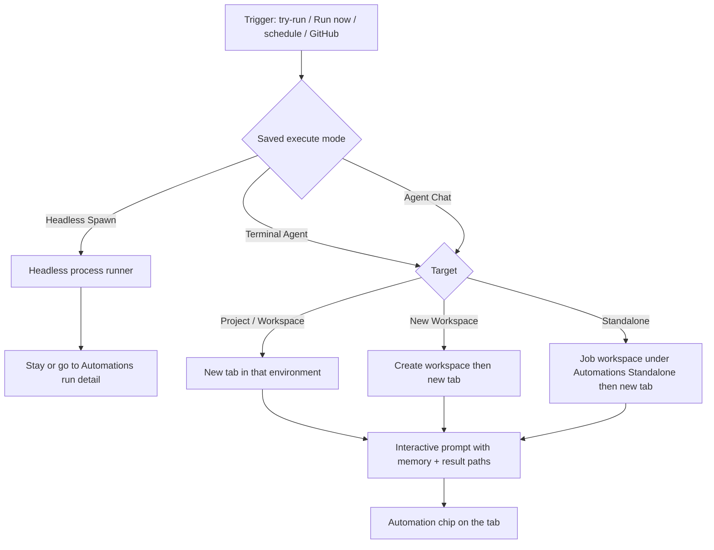
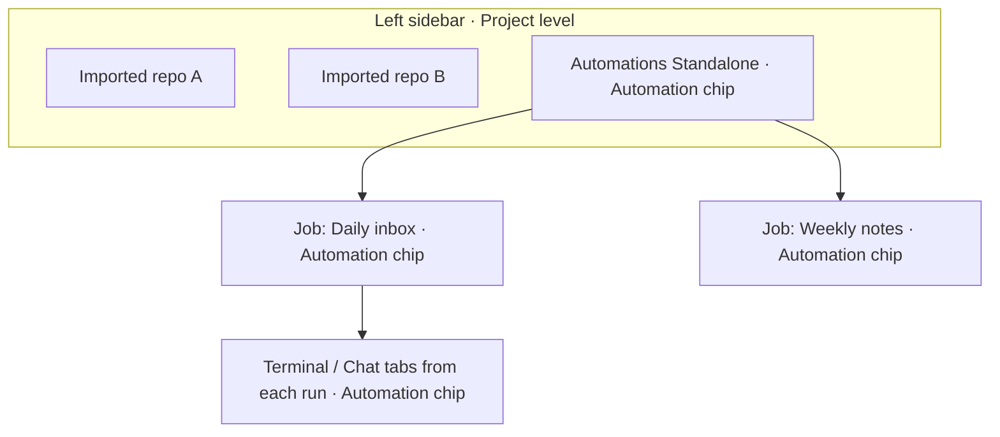

# PRD · APP-072: Automation execute modes

> Product Requirements · WHAT and WHY. Settled direction for choosing how an automation run executes — Headless Spawn, Terminal Agent, or Agent Chat — and making standalone jobs visible in the left sidebar as a project/workspace tree.

## Context

- **Problem**: Every APP-017 / APP-019 run is headless. Users cannot watch, steer, or approve a job in a terminal or Agent Chat tab, and standalone jobs have no home in the left sidebar. “Continue in terminal” is a post-run copy-and-navigate, not the run itself.
- **Why now**: Headless is right for unattended CLI capture, but wrong when the user wants a live surface. Users asked to pick the execute surface at setup time and to reuse it on every trigger, including schedule and GitHub.
- **Related specs**: [APP-017](../APP-017_atmos-automations/PRD.md) (definitions, targets, run history), [APP-019](../APP-019_github-automation-triggers/PRD.md) (GitHub triggers), [APP-024](../APP-024_terminal-agent-run-config/PRD.md) (terminal agent run config), [APP-063](../APP-063_agent-first-product-cli/PRD.md) (CLI as invoke client), [APP-067-chat](../APP-067_atmos_agent_abs/PRD.md) / [APP-068](../APP-068_agent_chat_arch_optimize/PRD.md) (Agent Chat). Explored in [BRAINSTORM.md](./BRAINSTORM.md).

## Settled forks (from BRAINSTORM)

| Fork | Decision |
|------|----------|
| Who starts Terminal / Chat runs | **Server owns the run.** CLI may later expose the same verbs. The runner must **not** exec `atmos`. |
| Scheduled / GitHub + Terminal / Chat | **Same mode as saved on the automation.** Manual, schedule, and GitHub all honor Execute Agent. |
| Standalone + visible surface | **Do not disable.** Left sidebar uses a **virtual group** (not a real Project row): **Automations Standalone** at Project level; each standalone **job** is a Workspace-level row, with an Automation chip. |
| Agent lists | **Two catalogs.** Headless / Terminal use the terminal-agent list. Agent Chat reuses the existing Agent Chat picker. |
| Execute Agent on setup | **Persisted mode + try-run.** Clicking run starts a real run and jumps to the matching page. |
| Tab reuse | **New tab every Terminal / Chat run.** Do not reuse a previous Automations tab. |
| Project terminals | Create a **new Terminal tab under that Project** (same as opening `/project?id=…&tab=terminal` and adding a tab) and run the prompt there. |
| Interactive completion | The agent finishes the Atmos job by following the **`atmos-automation` skill** and calling Atmos CLI (write `final.md`, update memory, mark the run complete). The runner does not parse TTY/chat stdout. |
| Chip visual | Sidebar group + job rows: visible sentence-case **Automation** chip (reuse `create_source = "automation"` chrome). Terminal / Chat tabs: compact **icon + tooltip** (`{job name} · {short run id}`); also show the word `Automation` when tab chrome has room. No ALL CAPS / no CSS `uppercase`. |
| Stale interactive run | After **1 hour** still `running`, **prompt/notify only**. Clicking the prompt **clears the notification** and does **not** change run status. No auto-fail, auto-complete, auto-cancel, or interrupt. Headless stays process-exit. |

## Goals

1. **Primary** — Users pick one execute mode per automation (Headless Spawn / Terminal Agent / Agent Chat) and every later trigger uses that mode.
2. **Primary** — Terminal Agent and Agent Chat runs create a marked live tab in the chosen environment (new workspace first when that target is selected).
3. **Primary** — Standalone jobs appear in the left sidebar as a Project/Workspace tree, clearly marked as automation.
4. **Secondary** — Setup can try-run immediately and land the user on the live surface (or Automations run detail for Headless).

## Users & Scenarios

- **Primary persona**: Agentic Builder who saves a recurring job and sometimes wants it unattended, sometimes wants to sit with a terminal or chat.
- **Secondary persona**: Remote Computer operator who expects a scheduled Terminal / Chat job to exist as a session even if no UI was open at fire time.

### Key scenarios

1. A user creates a daily repo-health job, leaves **Headless Spawn** selected, and later opens run history to read `final.md` — same as today.
2. A user picks **Terminal Agent** on an existing Project, hits run (or the schedule fires), and finds a new terminal tab in that Project with an **Automation** chip, already running the interactive agent.
3. A user picks **Agent Chat** and **New Workspace**. The run creates the worktree, then a new Agent Chat tab inside that workspace, marked as automation.
4. A user picks **Standalone** + Terminal or Chat. The left sidebar shows **Automations Standalone** (Project-level) and this job as a Workspace-level row with an Automation chip. The new tab lives there.
5. A user is still on the setup page, clicks run, and is taken to the Headless run detail, the new terminal tab, or the new chat tab — no extra “save then find it” step.

## User Stories

- As an Atmos user, I want to choose Headless, Terminal Agent, or Agent Chat when I create a job, so that later runs (manual, schedule, or GitHub) use the surface I meant.
- As a builder, I want a Terminal or Chat run to open a **new** tab in the environment I picked, so that I can watch and steer that run without mixing it into an old session.
- As a builder using Standalone, I want the job to show up in the left sidebar like a Project/Workspace, so that I can open its tabs the same way I open any other work.
- As a builder, I want those sidebar rows and run-created tabs to carry an Automation chip, so that I never mistake them for a hand-made workspace or chat.
- As a builder, I want to try the job from setup and land on the live page, so that I can see the first run immediately.
- As a script/agent user, I want the same run capabilities available as CLI verbs later, so that I can orchestrate jobs without teaching a second data plane.

## Functional Requirements

### Must Have

- **M1 · Execute Agent control**: Above Instructions, setup shows **Execute Agent** with three tabs: **Headless Spawn**, **Terminal Agent**, **Agent Chat**. The chosen mode is saved on the automation and shown again on edit.

- **M2 · Headless picker**: Headless Spawn shows the current automation-capable terminal-agent list **inline** (fixed height, scrollable). No popover. Agents without non-interactive flags stay unavailable with the existing reason copy.

- **M3 · Terminal picker**: Terminal Agent uses the terminal-agent catalog and the existing terminal run-config controls (model / reasoning / YOLO as already exposed for automations). Interactive launch flags are used at run time, not headless `--print` / exec flags.

- **M4 · Chat picker**: Agent Chat reuses the **existing Agent Chat agent picker** (same catalog and chrome as a normal new chat). It does not reuse the Headless / Terminal list.

- **M5 · Mode is the runner for every trigger**: Manual Run now, setup try-run, schedule ticks, and GitHub triggers all execute with the saved mode. Users do not get a silent Headless fallback when they chose Terminal or Chat.

- **M6 · Headless run behavior**: Unchanged capture contract — process spawn, piped stdio, `final.md` / `run.json` written by the runner. No new terminal or chat tab.

- **M7 · Terminal run behavior**:
  - **Project** or **existing Workspace**: each run creates a **new terminal tab** in that environment and starts the interactive terminal agent there.
  - **New Workspace**: create the automation workspace first, then create the terminal tab inside it and start the agent.
  - **Standalone**: create or reuse the job’s Standalone workspace (M11), then create the terminal tab there.

- **M8 · Agent Chat run behavior**: Same targeting rules as M7, but each run creates a **new Agent Chat tab** and sends the job prompt as the first turn.

- **M9 · Interactive prompt + `atmos-automation` skill**: Terminal and Chat prompts are not the headless stdout prompt. They tell the agent to read the system skill **`atmos-automation`** and follow it, then do the job instructions. The skill explains what an Atmos automation is, the run flow, the rules, and where process files live (`instructions.md`, `memory.md`, run dir, `final.md`, `run.json`). The agent must use **Atmos CLI** (not ad-hoc file guessing) to write artifacts and mark the run finished. Headless keeps today’s runner-written files and does not require the skill.

- **M10 · Automation mark on run surfaces**: Every terminal tab and Agent Chat tab created by a run shows an **Automation** chip (sentence case, not ALL CAPS). After reload or from another UI on the same Computer, the mark is still there. Tooltip or equivalent may show job name + short run id (TECH).

- **M11 · Automations Standalone in the left sidebar**:
  - **Virtual grouping only** — do not insert a real Project (or git worktree) into the project table.
  - A single **Automations Standalone** row sits at **Project** level beside imported projects.
  - Each **Standalone job** is a **Workspace-level** row under that group (one row per job, not per run).
  - Both the group and each job row show an **Automation** chip.
  - Opening a job opens a center view for that job (files under the automation definition/run home, plus its Terminal / Chat tabs).
  - New-workspace-per-run jobs that belong to a real Project stay under that Project (existing APP-017 `create_source = "automation"` labeling remains).

- **M12 · Try-run from setup**: Setup offers a run action that starts a real run with the current (or just-saved) definition and **navigates to the matching page**:
  - Headless → Automations run detail / history for that run
  - Terminal Agent → the new terminal tab
  - Agent Chat → the new chat tab  
  Unsaved required fields still block run with the existing validation.

- **M13 · Run now navigation**: From the Automations list / history, Run now uses the same landing rule as M12.

- **M14 · No CLI exec from the runner**: Starting a run stays inside the Automations service. Missing session/chat capabilities are added as product actions first; CLI verbs are mirrors the **agent** (and humans) call. The API never `exec`s `atmos` to start a run.

- **M15 · `atmos-automation` system skill**: Ship a dedicated system skill (not folded into `atmos-cli`) covering intro, flow, rules, file locations, and the CLI verbs to complete or fail a run. Terminal / Chat first prompts point at the synced path `~/.atmos/skills/.system/atmos-automation/SKILL.md`. Cross-link from `atmos-cli`: automation completion is this skill.

### Nice to Have

- **N1 · Extra CLI mirrors**: `atmos chat create` / `send` and terminal create with an initial command. **`atmos automation complete` / `status` / `paths` are Must Have** (M15), not optional.
- **N2 · Richer chip copy**: Chip shows job name on hover; optional “Automation” + short run id on the tab itself when space allows.
- **N3 · Jump from run history**: Opening a finished Terminal / Chat run focuses that tab if it still exists.
- **N4 · Collapse / filter**: Sidebar filter already has “automation workspaces”; Standalone project can honor the same hide/show.

## Out of Scope

- **Replacing Headless** — Headless Spawn stays the default capture path; this spec adds modes, it does not delete process-runner runs.
- **Reusing one Automations tab** — rejected; each Terminal / Chat run gets a new tab.
- **Exec-ing the Atmos CLI from the API** — APP-063 client loop; out.
- **Mobile automation setup / sidebar** — Desktop/Web first, same as APP-017.
- **Hosted / cross-Computer scheduler** — still local-per-Computer.
- **Guaranteeing a visible browser at schedule time** — the session/tab is created on the Computer; the UI attaches when someone opens that workspace.
- **Teaching Chat agents terminal `yoloParams`** — Chat uses Chat spawn config only.

## Success Metrics

- **Leading**: A user saves a Terminal or Chat automation, runs it once from setup, and lands on a marked tab in the right environment.
- **Leading**: A Standalone job appears under **Automations Standalone** in the left sidebar with an Automation chip.
- **Leading**: A scheduled or GitHub run with Terminal / Chat mode creates a marked session even if Automations UI was closed.
- **Lagging**: Users keep mixed-mode jobs (some Headless, some Chat) instead of abandoning Automations for Welcome “new workspace + agent”.
- **Qualitative**: Users can say which jobs are “background” vs “I sit with this tab” without opening run JSON.

## Risks & Open Questions

- **Risk**: Interactive agents may ignore the skill / CLI complete step; the run stays `running` until the user cancels or the agent eventually calls complete. Prompt + skill must be explicit.
- **Risk**: Schedule + Terminal/Chat can create many tabs. New-tab-per-run is intentional; clutter is accepted for v1.
- **Risk**: Virtual Standalone rows are not git worktrees. Users must not expect branch/PR chrome there.
- **Locked (TECH)**: Chip visual — sidebar = visible **Automation** chip; tabs = icon + tooltip, plus the word when space allows.
- **Locked (TECH)**: Terminal / Chat may stay `running` indefinitely until complete / `--failed` / cancel. After 1 hour, a dismissible attention prompt is shown; dismiss does not change status.

## Execute flow

## Standalone sidebar

## Milestones

- **Phase 1** — M1–M6 (Execute Agent UI + catalogs; Headless unchanged).
- **Phase 2** — M9, M14, M15 (skill + `atmos automation` complete/status/paths + interactive prompt).
- **Phase 3** — M7, M8, M10, M12, M13 (Terminal / Chat runs, marks, navigation).
- **Phase 4** — M11 (virtual Standalone sidebar) + N4.
