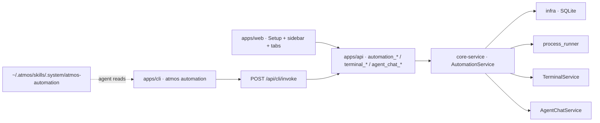

# TECH · APP-072: Automation execute modes

> Technical Design · HOW. Implements PRD APP-072: Automation execute modes.

## Scope summary

Adds a persisted **Execute Agent** mode (`headless` | `terminal` | `chat`) to APP-017 automations, server-owned Terminal/Chat surfaces, CLI complete/status/paths, system skill `atmos-automation`, virtual **Automations Standalone** sidebar, and a **1h dismissible stale prompt** (notify only). Addresses **M1–M15**. N1 (`atmos chat create/send`, `atmos terminal create --command`) and N3 deferred. N2 tooltip copy is included with M10. N4 honors the existing `show_automation_workspaces` filter.

Does not replace Headless, does not insert a Project row, does not create a git worktree for Standalone, does not `exec ~/.atmos/bin/atmos` from the runner, does not parse TTY/chat stdout for completion.

## Frozen decisions

| Decision | Rule |
|----------|------|
| Who starts runs | `AutomationService` owns the run. Calls `TerminalService` / `AgentChatService` directly. Never shells `atmos`. |
| Mode persistence | `automation.execute_mode` = `headless` \| `terminal` \| `chat`. Default `headless`. Every trigger (manual, schedule, GitHub) reads this column (**M5**). |
| Agent catalogs | Headless/Terminal = terminal-agent list (`resources/terminal-agents` + `agents.rs`). Chat = Agent Chat `installedAgents` (**M2–M4**). |
| Chat spawn config | Discriminator in existing `agent_config_json`. Missing `kind` = terminal-agent `AutomationAgentRunConfig` (compat). Chat writes `{ "kind": "chat", "provider_id", model, thinking, mode, permission_mode, fast, context }`. One column already on create/update; no second JSON column. |
| Standalone scope | Synthetic id `automation:{guid}`. Virtual sidebar group id `automation:standalone`. cwd / files home = `~/.atmos/data/automations/definitions/{guid}`. No Project row, no worktree. |
| Project terminal | `workspace_id` = project guid (same as `/project?id=…&tab=terminal`). |
| Terminal inject | Keep the in-process session until launch + prompt are sent, then detach. Do **not** `detach_after_create` then `send_input` (handle is gone). Extend `CreateSessionParams` / `terminal_session_create` with `origin`, `run_guid`, `initial_input`. Follow-up prompt is service-owned after TUI-ready (`resources/terminal-agents/tui_follow_up_agents.json`). |
| Completion | Headless = process exit (**M6**). Terminal/Chat stay `running` until `automation_run_complete` / `--failed` / `automation_cancel_run`. Runner does not parse stdout. |
| Stale >1h | Notify only. Set `stale_prompted_at`, emit event, show persistent in-app banner. Click → `automation_run_stale_dismiss` (clears prompt). **No** status change, no auto-fail/complete/cancel/interrupt. Headless unchanged. |
| Chip | Sidebar group + job: visible sentence-case **Automation** chip (reuse `create_source = "automation"` chrome). Tabs: icon + tooltip `{job name} · {short run id}`; also the word `Automation` when tab chrome has room. |
| Startup recovery | Headless running → existing `process_lost` interrupt. Terminal/Chat → leave `running` if the surface still exists; do not interrupt a live tab. |

## Architecture overview



Touched: `crates/infra`, `crates/core-engine` (tmux metadata only), `crates/core-service`, `apps/api`, `packages/api-types`, `apps/cli`, `apps/web`, `skills/`, `skills/system-skills-manifest.json`. No new crate. No new REST product API — CLI uses existing `/api/cli/invoke`.

## PRD coverage map

| Req | Coverage |
|-----|----------|
| **M1** | `execute_mode` on create/update/detail; Execute Agent tabs in `AutomationSetup.tsx` above Instructions. |
| **M2** | Headless tab renders `AutomationAgentPicker.tsx` inline (`max-h` scroll). Replaces `WelcomeAgentSelector` popover for this tab. Unavailable agents keep `unavailable_reason`. |
| **M3** | Terminal tab: `WelcomeAgentSelector` / `TerminalAgentSelectorWithRunConfig.tsx` + `resolve_interactive_automation_agent_with_config`. Interactive flags, not `--print`. |
| **M4** | Chat tab: `installedAgents` from `use-agent-registry-query` / `AgentChatHistorySidebar.tsx` picker chrome. Not the terminal-agent list. |
| **M5** | `start_run_from_model_claimed` branches on `automation.execute_mode`. Scheduler + GitHub already call this. |
| **M6** | `process_runner.rs` unchanged when mode is headless. `tmux_*` stay `None`. |
| **M7** | New `interactive_runner.rs`. Project → scope = project guid. Workspace / new_workspace → existing `resolve_target` then new terminal. Standalone → `automation:{guid}`, cwd = definition dir. New tab every run. |
| **M8** | Same targeting; `agent_chat_create` + `agent_chat_send`. Standalone: `workspace_id = automation:{guid}` (extend cwd resolve). |
| **M9** | Interactive prompt template below. Headless keeps `runner.rs` prompt. |
| **M10** | Server metadata `origin=automation` + `run_guid` on tmux window and chat meta. Tab chip as frozen chip rule. |
| **M11** | Synthesize group in `left-sidebar-derived.ts` + `LeftSidebar.tsx`. Route `/automation?id={guid}`. |
| **M12 / M13** | `automation_run_now` returns surface fields. Headless → `/automations?run={guid}` (existing `run` nuqs). Terminal/Chat → project/workspace/automation route + tab. |
| **M14** | Service-to-service only. CLI is invoke client. |
| **M15** | `skills/atmos-automation/` + registry. CLI `complete` / `status` / `paths`. |

## Module-by-module design

### crates/infra

Migration `crates/infra/src/db/migration/m20260912_000040_add_automation_execute_mode.rs` (register after `m20260909_000039_add_project_last_visited_at` in `migration/mod.rs`).

```sql
ALTER TABLE automation ADD COLUMN execute_mode TEXT NOT NULL DEFAULT 'headless';

ALTER TABLE automation_run ADD COLUMN execute_mode TEXT NOT NULL DEFAULT 'headless';
ALTER TABLE automation_run ADD COLUMN surface_kind TEXT;           -- none|terminal|chat
ALTER TABLE automation_run ADD COLUMN surface_session_id TEXT;
ALTER TABLE automation_run ADD COLUMN surface_scope_id TEXT;
ALTER TABLE automation_run ADD COLUMN stale_prompted_at DATETIME;
ALTER TABLE automation_run ADD COLUMN stale_prompt_dismissed INTEGER NOT NULL DEFAULT 0;
```

Entities: `crates/infra/src/db/entities/automation.rs`, `automation_run.rs`. Repo: `CreateAutomationRecord` / `UpdateAutomationRecord` / `CreateAutomationRunRecord` in `automation_repo.rs`. Add `list_standalone_automations`, `list_stale_interactive_candidates(older_than)`, `mark_stale_prompted`, `dismiss_stale_prompt`.

### crates/core-engine

Extend `TmuxWindowAtmosMetadata` in `crates/core-engine/src/tmux/types.rs`:

```rust
pub origin: Option<String>,          // "automation"
pub run_guid: Option<String>,
pub automation_guid: Option<String>,
```

Set from `TerminalService` when creating an automation window (`crates/core-service/src/service/terminal.rs` ~`TmuxWindowAtmosMetadata` write).

### crates/core-service

`AutomationService` today drops `TerminalService` (`_terminal_service` in `mod.rs`). Store `Arc<TerminalService>` and `Arc<AgentChatService>`.

New module `crates/core-service/src/service/automation/interactive_runner.rs`.

```rust
pub enum AutomationExecuteMode { Headless, Terminal, Chat }
pub enum AutomationSurfaceKind { None, Terminal, Chat }

impl AutomationService {
    pub async fn complete_run(&self, run_guid: &str, failed: bool, message: Option<String>) -> Result<AutomationRunDetail>;
    pub async fn run_paths(&self, run_guid: &str) -> Result<AutomationRunPaths>;
    pub async fn dismiss_stale_prompt(&self, run_guid: &str) -> Result<AutomationRunDetail>;
    pub async fn scan_stale_interactive_prompts(&self) -> Result<usize>; // scheduler tick
}
```

**Start path** (`lifecycle.rs` `start_run_from_model_claimed`):

1. Claim + `already_running` unchanged.
2. Resolve target. Standalone Terminal/Chat cwd = `artifacts::definition_dir`, not `run_dir` (Headless standalone stays `run_dir`).
3. Prepare run files (`prompt.md` / `final.md` / `run.json`). Interactive prompt written to `prompt.md` (not the headless stdout template).
4. Persist run with `execute_mode` + `surface_*`.
5. Branch:
   - `headless` → `spawn_process_runner` (**M6**).
   - `terminal` → create detached-after-inject session; persist `surface_session_id`.
   - `chat` → `AgentChatService::create` + `send`; persist chat id.

**Terminal inject** (no browser):

1. `CreateSessionParams { workspace_id: scope, cwd, window_name, origin: Some("automation"), run_guid, initial_input: Some(launch_command), detach_after_create: false }`.
2. `send_input(launch)` + `send_enter` if `initial_input` was not applied inside create.
3. If agent id is in `tui_follow_up_agents.json`, poll `capture_pane` until `readyPattern` or 30s.
4. `send_input(prompt)` + `send_enter` (agent submit mode).
5. `close_session` to detach PTY; tmux window remains.
6. Write metadata so reload shows the chip.

**Chat start**:

- Project: `project_id`. Workspace / new_workspace: `workspace_id`. Standalone: `workspace_id = "automation:{guid}"`.
- Extend `resolve_agent_chat_cwd` in `apps/api/src/api/ws/router/agent_chat.rs`: if `workspace_id` starts with `automation:`, cwd = definition dir; do **not** `get_workspace`.
- Add `source: Option<String>` + `automation_run_guid: Option<String>` on `AgentChatMeta` / `CreateAgentChatRequest`. Keep `AgentChatOrigin` as `quick` \| `normal` (do not overload).

**Complete** (`automation_run_complete`):

- Run must be `running`.
- Success: `final.md` must exist at `result_path` unless `--failed`.
- `--failed --message` → `failed` + `error_message`.
- Write `run.json`, emit `RunUpdated`. Do not kill the tab.

**Cancel**: Headless keeps the 5s wait. Interactive: interrupt the live turn (Terminal: tmux named keys per agent — Esc / Esc×2 / Ctrl+C; Chat: `agent_chat.cancel`), then mark `cancelled`. Leave the tab; do not kill the tmux window or chat session.

**1h stale** (scheduler tick in `scheduler_service.rs`):

- Candidates: `status=running`, `execute_mode` in (`terminal`,`chat`), `started_at <= now-1h`, `stale_prompted_at IS NULL`.
- Set `stale_prompted_at = now`. Emit `AutomationEvent::StalePrompt`. Do not change `status`.
- Dismiss: `stale_prompt_dismissed = 1`. Banner gone. Status unchanged. No second prompt for that run.

**Validation**: Headless → existing non-interactive resolver. Terminal → interactive resolver. Chat → `agent_id` is an installed chat `provider_id`; `agent_config.kind == "chat"`. Switching setup tabs resets `agent_id` if it is not in the new catalog.

### apps/api

`WsAction` lives in `apps/api/src/api/ws/message.rs` (not infra). Router: `apps/api/src/api/ws/router/automation.rs`, `terminal.rs`, `agent_chat.rs`.

New actions:

| Action | Input | Output |
|--------|-------|--------|
| `automation_run_complete` | `{ run_guid, failed?: bool, message?: string }` | `AutomationRunDetail` |
| `automation_run_paths` | `{ run_guid }` | `AutomationRunPaths` |
| `automation_run_stale_dismiss` | `{ run_guid }` | `AutomationRunDetail` |

Extend (no new action names): `automation_create` / `update` / `get` / `list` / `run_*` with `execute_mode` + run surface + stale fields. `automation_run_now` already returns `AutomationRunDetail` — add surface ids for navigation.

`terminal_session_create`: optional `initial_input`, `origin`, `run_guid`. Applied **before** detach.

`agent_chat_create`: optional `source`, `automation_run_guid`; synthetic `workspace_id`.

New event `automation_stale_prompt` (payload = run summary + job name). Existing `automation_run_updated` / `automation_notification` stay.

Same-PR `@atmos/api-types`: extract-actions, `src/ws/actions.ts`, `src/ws/dto/automation.ts`, `src/ws/contract/automation.ts`, event catalog.

`POST /api/cli/invoke` already dispatches any `WsAction`. No new REST.

### apps/cli

New group in `apps/cli/src/commands/product.rs` + `apps/cli/src/main.rs`, pattern = `apps/cli/src/commands/simulator.rs` (`server_invoke::invoke`).

```text
atmos automation complete --run <guid> [--failed --message <text>]
atmos automation status --run <guid>          # invoke automation_run_get
atmos automation paths --run <guid>           # invoke automation_run_paths
atmos automation run --id <automation_guid>   # cheap invoke of automation_run_now
```

JSON envelope only. `complete` / `status` / `paths` are **M15**. `run` ships in the same clap group because it is one invoke.

### skills

New `skills/atmos-automation/SKILL.md` + `references/cli.md`.

Register in:

- `crates/infra/src/utils/system_skill_sync.rs` `ALL_SYSTEM_SKILL_NAMES`
- `skills/system-skills-manifest.json`

Cross-link from `skills/atmos-cli/SKILL.md` Related skills: “Automation complete / paths / status → `atmos-automation`. Not this skill.”

Skill sections (impl writes these, do not invent extra verbs):

1. **Intro** — what an Atmos automation is (saved job + run artifacts).
2. **When to use** — you are inside a Terminal/Chat tab created by a run.
3. **Flow** — `paths` → do the job from `instructions.md` → write `final.md` at `result_path` → update `memory.md` only for durable facts → `complete`.
4. **Rules** — never guess paths; never mark complete without `final.md` unless `--failed`; do not treat process/TTY exit as done.
5. **File locations** — definition dir, `instructions.md`, `memory.md`, run dir, `final.md`, `run.json`, this skill path.
6. **CLI verbs** — `complete`, `complete --failed --message`, `status`, `paths`.

Synced path: `~/.atmos/skills/.system/atmos-automation/SKILL.md`. No new `~/.atmos` product dir (`atmos-home-layout.md` already has `data/automations/` + `skills/`).

### apps/web

**Setup (`AutomationSetup.tsx` + `use-automation-setup-form.ts`)**

- Execute Agent tabs **above** Instructions (**M1**).
- Headless: inline `AutomationAgentPicker` (**M2**).
- Terminal: existing run-config selector (**M3**).
- Chat: Agent Chat picker (**M4**).
- Persist `execute_mode` + config on create/update.
- Try-run: validate → save if dirty → `automation_run_now` → `runLandingHref(run)` (**M12**). Inline busy/disabled on the button; no success toast.

**Navigation (`apps/web/src/features/automations/lib/automation-run-landing.ts`)**

| Mode | Route |
|------|--------|
| Headless | `/automations?run={run_guid}` |
| Terminal project | `/project?id={scope}&tab=terminal-tab:auto-{short}` (new extra tab per run, not Term split) |
| Terminal workspace | `/workspace?id={scope}&tab=terminal-tab:auto-{short}` |
| Terminal standalone | `/automation?id={job_guid}&tab=terminal-tab:auto-{short}` |
| Chat | same hosts with `tab=chat` |

**Standalone center**

- New route `/automation?id=` (distinct from `/automations`).
- Files via existing `FsListDir` on definition dir. Hide git/PR chrome.
- Terminal/Chat tabs keyed by `automation:{guid}` (`use-terminal-store.ts` already treats `workspaceId` as an opaque scope).

**Sidebar**

- Synthesize in `apps/web/src/app-shell/left-sidebar-derived.ts` from `automation_list` where `target_kind=standalone`.
- Group display name **Automations Standalone**. Job rows = display_name. Both chips reuse `WorkspaceContent.tsx` / `WorkspaceKanbanCard.tsx` automation chip (sentence case).
- Click job → `/automation?id={guid}`.
- Honor `show_automation_workspaces` (**N4**).
- Do not write a Project row.

**Chip on tabs**

- Read server metadata (`origin === "automation"` / `source === "automation"`).
- Compact: icon + tooltip `{job} · {first 8 of run_guid}`. Wide: icon + `Automation`.
- No CSS `uppercase`. No ALL CAPS source strings.

**1h banner**

- Reuse attention-style persistent chrome, not `toastManager` success toasts.
- New `apps/web/src/features/automations/components/AutomationStalePromptBanner.tsx` mounted from `Footer.tsx` or header stack (same class of persistent card as `TokenUsageCookieConsentBanner.tsx`).
- Hydrate from run list (`stale_prompted_at` set, `stale_prompt_dismissed` false) + `automation_stale_prompt` event.
- Click → `automation_run_stale_dismiss`. Banner disappears. Status stays `running`. Copy tells the user to open the live tab themselves.

**i18n**: `apps/web/messages/en.json` + `zh.json` under `automation.*` and `AppShell.chrome`. Sentence case English. Natural Chinese. No hardcoded copy.

## Data model

```ts
type AutomationExecuteMode = "headless" | "terminal" | "chat";
type AutomationSurfaceKind = "none" | "terminal" | "chat";

type AutomationAgentConfigJson =
  | AutomationAgentRunConfig
  | {
      kind: "chat";
      provider_id: string;
      model?: string;
      thinking?: string;
      mode?: string;
      permission_mode?: string;
      fast?: string;
      context?: string;
    };

type AutomationRunPaths = {
  run_guid: string;
  automation_guid: string;
  definition_dir: string;
  instructions_path: string;
  memory_path: string;
  run_dir: string;
  prompt_path: string;
  result_path: string;      // …/final.md
  run_json_path: string;
  skill_path: string;       // ~/.atmos/skills/.system/atmos-automation/SKILL.md
  cwd: string;
};
```

Scope helper: `automation:{guid}` prefix is required so UUID job ids never collide with project/workspace guids.

## Transport

```ts
// create/update (extend)
{ action: "automation_create", execute_mode: "terminal", agent_id, agent_config, … }

// complete
{ action: "automation_run_complete", run_guid, failed?: false, message?: null }
// failed
{ action: "automation_run_complete", run_guid, failed: true, message: "…" }

{ action: "automation_run_paths", run_guid }
{ action: "automation_run_stale_dismiss", run_guid }

// event
{ event: "automation_stale_prompt", automation_guid, run_guid, display_name, execute_mode, surface_scope_id, surface_session_id }
```

Invariants: complete requires `running`; success requires `final.md` unless `failed`; stale dismiss never writes `status`; runner never execs `atmos`.

REST: only the existing CLI invoke gateway.

## Interactive prompt template (Terminal / Chat)

```text
Read and follow the Atmos automation skill before doing anything else:
~/.atmos/skills/.system/atmos-automation/SKILL.md

You are running Atmos automation "{display_name}" (id {automation_guid}), run {run_guid}.

1. Call: atmos automation paths --run {run_guid}
2. Read instructions.md at the returned instructions_path.
3. Do the job in cwd {cwd}.
4. Write the final result to result_path (final.md). Update memory.md only for a durable fact a later run would miss.
5. Mark the run finished:
   atmos automation complete --run {run_guid}
   On failure:
   atmos automation complete --run {run_guid} --failed --message "<short reason>"

Do not guess file paths. Process or TTY exit does not finish this run.
```

Headless keeps today’s `runner.rs` capture prompt. `continue_in_terminal` stays a post-Headless follow-up, not the execute path.

## Security & permissions

- Same local Computer / loopback (or relay) auth as existing automation WS.
- `complete` / `paths` / `dismiss` are Computer-local; no extra principal.
- Do not log prompt bodies or `final.md` contents at info.
- Standalone files stay under `~/.atmos/data/automations/` (already user-private).
- Synthetic scope must not resolve a real workspace by stripping the prefix.

## Rollout plan

1. Migration `m20260912_000040_*` + entity/repo fields. Existing rows default `headless`.
2. WsAction + DTO + `WsContract` for complete / paths / stale_dismiss + create/update `execute_mode`. Handlers call new service methods (Headless start path unchanged).
3. Interactive runner + AgentChat cwd resolve + tmux/chat metadata. Scheduler/GitHub inherit via `start_run_from_model`. Stale scan on the existing automation tick.
4. CLI L1 `atmos automation *`. Skill package + `ALL_SYSTEM_SKILL_NAMES` + manifest + `atmos-cli` cross-link.
5. Setup Execute Agent UI + try-run / Run now navigation + chips + `/automation?id=` + virtual sidebar + stale banner + i18n.

No feature flag — automations are already experiment-gated (`automationsEnabled`).

## Risks & tradeoffs

- **Risk**: Agent ignores `complete`; run stays `running` and blocks the next tick (`already_running`). Mitigate with an explicit prompt/skill and the 1h banner (user steers or cancels). Do not auto-fail.
- **Tradeoff**: Chat config in `agent_config_json` vs a dedicated column — one blob keeps create/update wire small; `kind` discriminates.
- **Tradeoff**: Synthetic `automation:{guid}` vs a real Workspace row — PRD forbids a Project/worktree; prefix avoids UUID collisions.
- **Tradeoff**: Inject before detach vs `detach_after_create` + later send — later send cannot see the session map.
- **If this breaks**: revert the migration (defaults keep Headless); disable Execute Agent tabs; CLI verbs become unknown actions.

## Dependencies & compatibility

- Depends on APP-017, APP-019, APP-024, APP-063, APP-067/068, APP-071 skill-package pattern.
- Minimum CLI: new L1 verbs; pin like other APP-063 features if Desktop gates on CLI later.
- External: local `tmux`, installed terminal-agent binaries, Chat providers. No new hosted service.

## Open questions

None. Chip and 1h notify-only are locked above.
