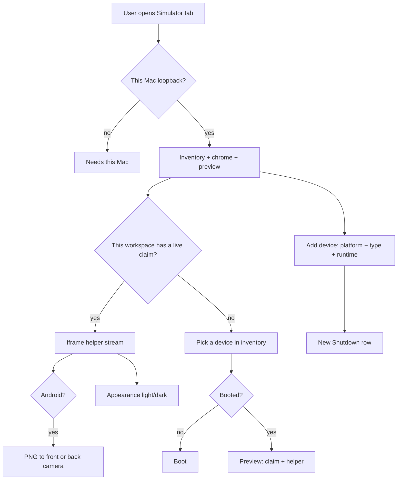

# PRD · APP-073: Device Preview chrome and inventory

> Product Requirements · WHAT and WHY. Settled direction for bumping the iOS helper, moving appearance and Android camera into Atmos Simulator chrome, and letting users add / boot / shut down simulators and emulators from that tab.

## Context

- **Problem**: The Simulator tab can preview a device the Mac already has, but it cannot create one, cannot boot or shut down from Atmos chrome, and hides appearance / Android camera inside the helper iframe. The iOS helper pin is also behind upstream `0.1.48`.
- **Why now**: APP-070 landed dual-platform claims and iframe preview. APP-070 explicitly left “create another simulator or AVD” as a next step on the empty state. Appearance and camera are already possible on the host (`simctl ui`, `adb uimode`, emulator camera) but are not Atmos product controls.
- **Related specs**:
  - **Builds on** [APP-060](../APP-060_vendor-serve-sim/PRD.md) — vendored serve-sim, loopback, iframe, Atmos patches.
  - **Builds on** [APP-070](../APP-070_simulator-optimize-add-android/PRD.md) — iOS + Android, exclusive claim, no steal, helper-per-claim. This spec **promotes** APP-070’s “start/create another device” empty-state next step and **narrows** APP-070 M8: device inventory, appearance, and Android camera become Atmos chrome; Home / rotate / screenshot stay in the helper page.
  - **Builds on** [APP-071](../APP-071_device-preview-agent-control/PRD.md) — claimed-device authorization, `simulator_*` CLI. New verbs follow the same pattern.
  - **Does not replace** the iframe preview. APP-070 N1 (native Device Screen) stays out.
  - **Does not own** Metro, install, or launch.

BRAINSTORM forks resolved here (see [BRAINSTORM.md](./BRAINSTORM.md)):

| Fork | Decision |
|------|----------|
| Who owns create / boot / shutdown | **Atmos.** One inventory API. Input is platform + device type + runtime/image. serve-sim and serve-emu do **not** each implement a catalog. |
| Inventory vs preview | List every Computer simulator/AVD. **Preview stays one exclusive claim + iframe.** |
| Boot vs Preview | **Two verbs.** Boot starts the VM. Preview is existing `simulator_start` (claim + helper, boot if needed). |
| Appearance / camera target | **This workspace’s claimed device**, same as APP-071 HID. |
| Download runtimes / system images | **Out of v1.** Only installed catalogs. Missing → typed error with a next step. |
| Delete | **In.** Create without delete is a disk leak. |
| Helper duplicate tools | Atmos chrome is the product. Hiding helper duplicates is Nice to Have. |

## Goals

1. **Primary** — Vendored serve-sim is `0.1.48-atmos.1` with Atmos patches intact; iOS iframe preview still starts.
2. **Primary** — From the Simulator tab, the user sets light / dark on the phone they are previewing, and (Android) feeds a PNG into the front or back camera, without opening helper tool panels to do it.
3. **Primary** — From the same tab, the user sees host simulators and AVDs, adds one from an installed type, boots, shuts down, and deletes — without Xcode Devices or Android Studio as the required UI.
4. **Secondary** — Agents can call the same lifecycle / appearance / camera verbs through `atmos simulator`, without learning `simctl` / `avdmanager` / helper HTTP.

Non-goals in Out of Scope, not here.

## Users & Scenarios

- **Primary persona**: Agentic Builder on an Apple Silicon Mac, iterating on an Expo / RN / native app in an Atmos workspace.
- **Key scenarios**:
  1. iOS preview still starts after the helper bump. Stop still kills only this workspace’s helper.
  2. User is previewing iPhone 16. They switch Appearance to Dark in Atmos chrome. The simulator UI goes dark. Same control on a Pixel preview sets night mode.
  3. User is previewing Android. They pick Front, choose a PNG, and the app’s camera preview shows that image. Back works the same. iOS preview does not show the camera control.
  4. No free device: inventory is visible. User clicks Add device, picks iOS → iPhone 16 → an installed iOS runtime → creates. The new simulator appears Shutdown. They Boot, then Preview.
  5. User adds an Android AVD from an installed device definition + system image, boots it, previews it. A second workspace cannot shut it down or steal the claim.
  6. User shuts down the device this workspace is previewing: iframe disconnects, claim releases, VM powers off. The other workspace’s preview is untouched.
  7. Relay / remote Computer: inventory and chrome do not start; existing “needs this Mac” card remains.

## User Stories

- As a builder, I want the Simulator tab to keep working after the iOS helper update so preview does not regress.
- As a builder watching a phone, I want light / dark on Atmos chrome so I do not hunt through helper tools.
- As a builder testing an Android camera flow, I want to feed a PNG into the front or back camera from Atmos so I do not wire a host webcam.
- As a builder with no free device, I want to add a simulator or AVD from types already on this Mac so I do not leave Atmos for Xcode or Android Studio.
- As a builder, I want Boot and Shut down on each row so the VM lifecycle is visible and explicit (RAM is not a surprise).
- As a builder with two workspaces, I want inventory to show who claimed a device, and I want Shut down / Preview to refuse someone else’s claim.
- As an agent, I want `atmos simulator` verbs for the same operations so I do not shell `simctl` / `avdmanager` or guess helper ports.

## Functional Requirements

### Must Have

- **M1**: Vendor pin moves to `@expo/serve-sim@0.1.48` packaged as Atmos `0.1.48-atmos.1`. Rebase every current Atmos patch (loopback bind, de-brand, no global `--kill`, `atmos:simulator-stop` / `atmos:simulator-device` / agent copy postMessage, compiled-helper exec path, tools-closed default, phone chrome). iOS probe / start / iframe / stop still work. Pack still omits `simcam`. serve-emu pin is unchanged.
- **M2**: Simulator tab grows **Atmos chrome** around the existing iframe (not a second tab, not a native phone canvas). English sentence case. `en.json` + `zh.json`. No ALL CAPS. No success toasts for these direct controls; the control or nearby row shows the result. Errors use typed reasons.
- **M3**: **Appearance** on Atmos chrome for the current workspace claim: Light / Dark. iOS and Android. Applies only to the claimed device. Requires that device to be booted. Missing claim → same class of `no_claim` guidance as APP-071.
- **M4**: **Android camera** on Atmos chrome when the claim is Android: Front / Back, pick a PNG, inject into that lens; clear restores the placeholder image. Mechanism (TECH): Atmos boots qemu with `-camera-front imagefile:<path>` / `-camera-back imagefile:<path>`; inject rewrites that PNG (max 32 MiB). The emulator re-reads the file the next time the guest **opens** the camera — chrome must say so. If this AVD was not booted by Atmos with those flags → `camera_unavailable` and offer Shut down + Boot from Atmos. iOS claim hides the control. Missing claim or non-Android → typed error, not a silent no-op. Binary is not logged.
- **M5**: **Inventory panel** in the Simulator tab lists Computer iOS simulators and Android AVDs (name, platform, boot state, claim owner). Physical adb devices stay filtered out. Relay still cannot run this UI (APP-070 M12).
- **M6**: **Add device** is one dialog for both platforms. iOS: pick an **installed available iOS runtime**, then a device type from that runtime’s supported types (invalid pairs are not offered). Android: pick an **installed** device profile and an **installed** system image (`system-images;…`). Optional name (Android names: letters, digits, `.` `_` `-` only). Confirm creates a Shutdown device and selects it. Do not auto-boot. Do not auto-claim. Do not download Xcode runtimes or SDK packages.
- **M7**: **Boot** starts an existing Shutdown simulator/AVD. Does not steal. Does not start a helper by itself. Android boots from Atmos are windowless and camera-ready (TECH). RAM-heavy Android boots are user-initiated only (overturns APP-070 “never create”; does **not** overturn “never silent auto-create”).
- **M8**: **Shut down** powers off a Booted simulator/AVD. If **this** workspace claimed it, stop the helper and release the claim first (still no global `--kill`). If **another** workspace claimed it → refuse (`device_already_claimed`). Unclaimed Booted devices may shut down. Already-off is success.
- **M9**: **Delete** refuses another workspace’s claim. Otherwise stops our helper if any, shuts down (already-off is ok), then deletes the simulator/AVD. No recycle bin in v1.
- **M10**: **Preview** remains APP-070 `simulator_start`: exclusive claim, spawn helper, iframe. Inventory Preview on a row passes that `udid` + `platform`. One live preview per workspace. Inventory must not stream two devices in this tab.
- **M11**: Create / boot / shut down / delete / appearance / camera are **Atmos Computer operations** (engine capability + service policy + `simulator_*` WS). They are **not** implemented twice inside serve-sim and serve-emu. Helpers remain stream + HID (+ existing iframe chrome).
- **M12**: `atmos simulator` gains matching verbs for inventory, add, boot, shut down, delete, appearance, and camera (APP-063 invoke, no extra MCP). Skill text must not teach helper URLs, ports, or tokens.
- **M13**: Typed reasons for new failures at least: `device_not_booted`, `runtime_missing`, `system_image_missing`, `device_type_unknown`, `create_failed`, `boot_failed`, `shutdown_failed`, `delete_failed`, `camera_unavailable`, `appearance_unavailable`, `unsupported_on_platform`. Reuse `device_already_claimed` / `no_claim` / `no_device` where they already fit.

### Nice to Have

- **N1**: Hide helper-page duplicates of appearance, camera, and the in-iframe device list once Atmos chrome exists.
- **N2**: Install an Android system image / iOS runtime from the Add device dialog (progress in-panel).
- **N3**: iOS camera injection (would require packing `simcam`; APP-060 omitted it on purpose).
- **N4**: Native Atmos Device Screen (APP-070 N1).
- **N5**: Multi-device live grid (several streams at once).

## Out of Scope

- **Physical devices** — USB / wireless phones stay out (APP-070).
- **Linux / Windows / Intel Macs** — same host gate as APP-070.
- **Cloud / relay helper or inventory** — still needs this Mac’s loopback.
- **Metro / gradle / xcodebuild / install / launch**.
- **Plugin framework / extra platforms** (watchOS, tvOS, Wear).
- **Downloading platform runtimes or SDK images** — v1 catalogs installed only (N2).
- **Teaching agents raw `simctl` / `avdmanager` / helper HTTP**.
- **Changing the tab id** away from `simulator`.
- **Deprecated Tauri `apps/desktop`**.

## Success Metrics

- Leading: after the helper bump, an existing iOS preview still reaches an iframe without leaving Atmos.
- Leading: Add device with an installed iOS type + runtime produces a new row; Boot then Preview shows it.
- Leading: Appearance Light / Dark on a live iOS and Android claim changes the guest UI without opening helper tools.
- Leading: Android claim + PNG on Front updates that emulator camera after the guest reopens the camera; iOS claim does not show the control.
- Qualitative: users can add and boot a device from the Simulator tab instead of Xcode / Android Studio for the common case.

## Risks & Open Questions

- **Risk**: User-created AVDs are RAM-heavy. Mitigation: never auto-create; Boot is explicit; Shut down is obvious on the row.
- **Risk**: 0.1.48 rebase conflicts with Atmos phone chrome patches. Mitigation: patches listed in `ATMOS-PATCHES.md` are the contract; preview stop/device postMessage must not regress.
- **Risk**: Android PNG camera only works on AVDs Atmos booted with `imagefile:` flags. Mitigation: typed `camera_unavailable` + Shut down / Boot from Atmos; never fake success. Guest must reopen the camera app after inject.
- **Risk**: Inventory and helper device list disagree. Mitigation: Atmos claim + inventory are source of truth; helper switch still goes through `atmos:simulator-device` / `simulator_start`.

## Milestones

- Phase 1 — M1: serve-sim `0.1.48-atmos.1` rebase, pack, pin, iOS preview regression.
- Phase 2 — M2, M3, M4, M13 (appearance + Android camera chrome + reasons).
- Phase 3 — M5–M12: inventory, add, boot, shut down, delete, CLI, Preview wiring.
