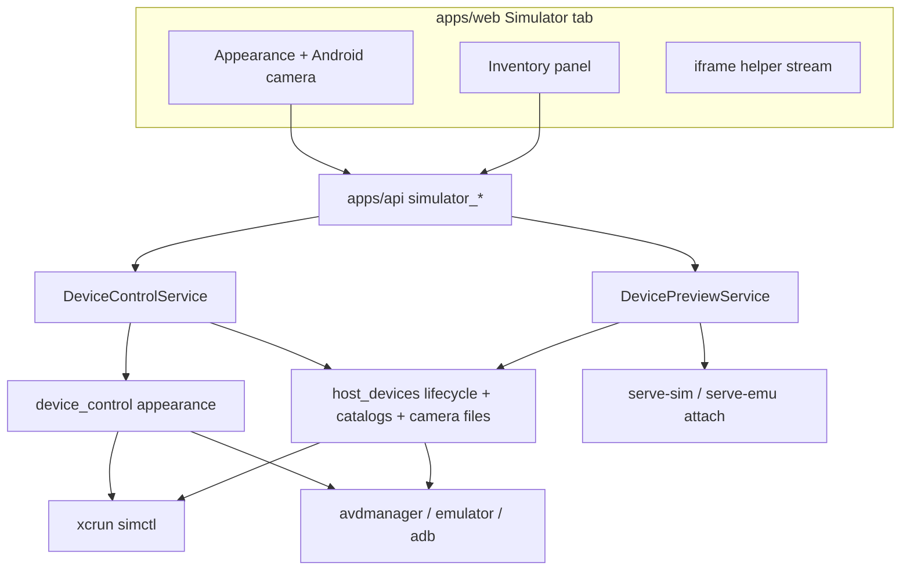

# TECH · APP-073: Device Preview chrome and inventory

> Technical Design · HOW. Implements PRD APP-073: Device Preview chrome and inventory.

## Scope summary

Addresses **M1–M13**. N1–N5 deferred. Three slices: rebase serve-sim to `0.1.48-atmos.1`; first-party appearance + Android camera on Simulator chrome; Computer device inventory (add / boot / shut down / delete) owned by Atmos. Ready to implement: every host command, flag, and file path below is the contract. No spike. No catalog inside serve-sim / serve-emu.

## Frozen decisions

| Decision | Rule |
|----------|------|
| Lifecycle owner | **`core-engine` `host_devices` + `DevicePreviewService`.** `platform` selects `simctl` vs `avdmanager`/`emulator`/`adb`. Helpers do not grow catalog UI or HTTP. |
| Appearance | **`xcrun simctl ui <udid> appearance`** (iOS) and **`adb -s <serial> shell cmd uimode night`** (Android). Not helper `/exec` / `/api/uimode` as the product path. |
| Android camera | **Emulator `imagefile:` cameras.** At Atmos boot: seed per-serial PNG files, then pass `-camera-front imagefile:<path>` and `-camera-back imagefile:<path>`. Inject = atomically rewrite that file. The emulator re-reads it the next time the guest **opens** the camera. No qemu restart, no gRPC, no console poster, no serve-emu `/api/camera`. |
| Preview | One exclusive `DeviceClaim` per workspace, iframe helper. Inventory lists many. |
| Boot vs Preview | `simulator_boot` = power on VM. `simulator_start` = claim + helper (Atmos-boot first if Shutdown). `simulator_stop` = helper + claim only. `simulator_shutdown` = power off VM (stops our claim first). |
| Android qemu owner | Atmos launches `emulator`. serve-emu **attaches** with `-s <serial>`. Never pass `--avd` to serve-emu when we just booted that AVD (that would spawn a second qemu). |
| Create | Does **not** auto-boot or auto-claim. |
| Create catalogs | Installed only. iOS types come from the selected runtime’s `supportedDeviceTypes`. Android: `avdmanager list device` + `sdkmanager --list_installed`. |
| Images on the wire | Camera PNG: `path` (CLI) or `png_base64` (UI), **32 MiB** decoded cap, PNG only. Never log payload. No REST. |
| Wire names | Stay `simulator_*`. New per-verb actions. |
| Delete | If another workspace claimed it → refuse. Else stop our helper if any, shutdown (already-off is ok), then delete. |
| `simcam` | Still omitted from the serve-sim archive. |
| Hosts | macOS 14+ arm64, same as APP-070. |

## Architecture overview



APP-070 M8 delta: inventory, appearance, and Android camera are Atmos chrome. Helper still draws the phone stream and Home/rotate/screenshot.

## Host command contract

These are the only shells `host_devices` / `device_control` run for this spec. Parse stdout in engine tests with fixtures; do not shell in unit tests.

### Catalogs

| Need | Command | Parse |
|------|---------|--------|
| iOS runtimes + valid device types | `xcrun simctl list runtimes --json` | `runtimes[]`. Keep `isAvailable == true` and iOS only (`platform` / `identifier` contains `iOS`, drop watchOS/tvOS). Each runtime’s `supportedDeviceTypes[]` has `identifier` + `name`. Create **must** pair a type that appears on that runtime. |
| iOS devices (existing) | `xcrun simctl list devices -j` | Already in `parse_simctl_devices`. |
| Android device profiles | `avdmanager list device` | After `Available devices definitions:`, split on `---` blocks. `id: <n> or "<id>"` → profile `id` (quoted string, e.g. `pixel_6`). `Name:`, `OEM:`, `Tag:`. Skip blocks with no id. |
| Android system images | `sdkmanager --list_installed` | Rows of `Path \| Version \| Description \| Location`. Keep paths starting `system-images;`. Split path on `;` → `{package, apiLevel, tag, abi}`. That `package` is `avdmanager --package`. |
| Android AVDs (existing) | `emulator -list-avds` + `adb devices -l` | Already in `host_devices`. |

Resolve `avdmanager` / `sdkmanager` / `emulator` / `adb` from `ANDROID_HOME` / `ANDROID_SDK_ROOT` / `~/Library/Android/sdk` (same as `resolve_android_toolchain_from`).

### Create

**iOS** — `xcrun simctl create <name> <deviceType> [<runtime>]`

- `name` and `deviceType` required. `runtime` required in v1 (we only offer installed available iOS runtimes).
- stdout trimmed = new UDID. Empty stdout → `create_failed`.
- Default name when omitted: runtime `name` + type `name` (spaces allowed).

**Android** — `avdmanager create avd --name <name> --package <image> --device <profileId>`

- **`--device` is mandatory.** Omitting it makes `avdmanager` prompt interactively and hang.
- Do **not** pass `--force` in v1. Name collision → `create_failed`.
- `name` must match `^[A-Za-z0-9._-]+$`. Default name: `{profileId}_{apiOrTag}` with unsafe chars → `_`. On collision append `_2`, `_3`.
- Do not auto-boot.

### Boot

**iOS** — `xcrun simctl boot <udid>`

- Non-zero with `Unable to boot device in current state: Booted` → **success**.
- Then existing `hide_ios_simulator_app`.

**Android** — Atmos owns qemu:

1. Allocate the lowest free even console port in **5554..=5682** not used by current `emulator-<port>` serials. None free → `boot_failed`.
2. `serial = emulator-{port}`.
3. `seed_camera_feeds(serial)` (below). If seed fails, still boot **without** camera args and surface the seed error; camera later returns `camera_unavailable`.
4. Spawn detached (own process group, stdio ignored):

```text
<emulator> -avd <avdName> -no-audio -no-window -gpu host -no-boot-anim -port <port> \
  -camera-front imagefile:<cameraDir>/<serial>-front.png \
  -camera-back imagefile:<cameraDir>/<serial>-back.png
```

`-gpu host` is an Atmos overlay on a typical `-gpu auto` boot: APP-070 already saw `auto` fall back to software Vulkan and cap the scrcpy stream. `-no-window` is the Android window-hide path (stronger than APP-070 N4).

5. Wait up to **180s** for `adb -s <serial> get-state` → `device` **and** `adb -s <serial> shell getprop sys.boot_completed` → `1`. **Race** the qemu `exit` event: if the process dies first, fail immediately with exit code + the exact command string (so the user can re-run it). Do not burn the full timeout on a corpse.

If the AVD is already running, boot is success (reuse serial). Do not seed over an already-wired live feed.

### Shutdown

**iOS** — `xcrun simctl shutdown <udid>`. `current state: Shutdown` → success.

**Android** — `adb -s <serial> emu kill`. Then wait up to **30s** for that serial to leave `adb devices`. Timeout → `shutdown_failed`.

### Delete

After policy (below): **iOS** `xcrun simctl delete <udid>`. **Android** `avdmanager delete avd --name <avdName>` (name, not serial).

### Appearance (claimed + booted only)

| | Read | Write Light | Write Dark |
|--|------|-------------|------------|
| iOS | `xcrun simctl ui <udid> appearance` | `… appearance light` | `… appearance dark` |
| Android | `adb -s <serial> shell cmd uimode night` | `… night no` | `… night yes` |

Parse Android stdout `Night mode: yes\|no\|auto`. Map `yes` → dark; `no` and `auto` → light.

### Android camera files

Directory: `~/.atmos/state/simulator/camera/` (`runtime-manager`: `simulator_camera_dir()`).

| Facing | Path |
|--------|------|
| front | `<dir>/<serial>-front.png` |
| back | `<dir>/<serial>-back.png` |

Sanitize serial for the filename: keep `[A-Za-z0-9._-]`, replace other chars with `_`.

**Placeholder:** embed a valid PNG (`include_bytes!` at `crates/core-engine/src/host_devices/assets/camera_placeholder.png`). Checkerboard ~1280×960 is ideal; any valid PNG is fine. An unreadable file renders **solid magenta** in the guest — never leave a partial file.

**Seed** (only when Atmos **spawns** qemu, not on attach):

1. Delete leftover `<feed>.*.tmp` for that serial.
2. Write the placeholder to both facings (atomic).

Serials are recycled (`emulator-5554`). A new spawn must not inherit the previous AVD’s picture.

**Atomic write:** `write(<path>.<uuid>.tmp)` then `rename` onto `<path>`. On error, unlink the tmp. Two concurrent writes must not share a tmp name.

**Validate PNG before write** (guest magenta otherwise):

- Size ≤ **32 × 1024 × 1024** bytes.
- Signature `89 50 4E 47 0D 0A 1A 0A`.
- IHDR at first chunk; width/height ≥ 1.
- Walk chunks: length+type+CRC; require at least one `IDAT` and a terminating `IEND`. Truncation / bad CRC → reject.

**Inject:** validate → atomic write that facing’s file. Guest must **reopen** the camera app to see it (document in chrome helper text).

**Clear:** atomic-write the placeholder to that facing.

**Wired?** Read `adb -s <serial> emu avd path` → `<avdPath>/hardware-qemu.ini`. Require both:

```ini
hw.camera.front=imagefile:<frontPath>
hw.camera.back=imagefile:<backPath>
```

If missing, inject/clear still rewrite files but the verb returns `camera_unavailable` (the running qemu is not an imagefile camera). UI: Shut down, then Boot from Atmos.

Physical adb serials are never camera targets.

## Module-by-module design

### `vendor/serve-sim/` — M1

Replace the tree with `expo/serve-sim` `@expo/serve-sim@0.1.48`. Record the commit in `vendor/serve-sim/UPSTREAM.md` at bump time.

Atmos version: **`0.1.48-atmos.1`**.

Rebase `ATMOS-PATCHES.md` behaviors (paths may move):

1. Loopback bind; refuse global `--kill`.
2. Hide brand + GitHub jump; no `bunx` empty state.
3. Left device panel as floating card.
4. Tools starts closed.
5. Stop → `atmos:simulator-stop`; other device → `atmos:simulator-device` `{ udid, platform: "ios" }`.
6. Compiled helper exec path.
7. `/exec` refuses kill with no device.
8. Agent copy postMessage.

Pack: same layout as APP-060. **Omit `dist/simcam/`.** Update `crates/core-service/pins/serve-sim-requirement.json`. serve-emu pin unchanged (`0.0.5-atmos.1`). Do not add camera routes to serve-emu.

### `crates/core-engine` — `host_devices/`

Split if `mod.rs` stays huge: `catalog.rs`, `lifecycle.rs`, `camera.rs`. **No `workspace_id`.**

```text
list_ios_runtimes() -> Vec<IosRuntime>           # + supportedDeviceTypes
list_android_profiles() -> Vec<AndroidProfile>
list_android_system_images() -> Vec<AndroidImage>
create_ios(name, device_type, runtime) -> udid
create_android(name, package, device_profile) -> ()
boot_ios(udid)
boot_android(avd, camera: bool) -> serial        # port + seed + spawn + wait
shutdown_ios(udid)
shutdown_android(serial)
delete_ios(udid)
delete_android(avd_name)
free_emulator_port(used_serials) -> u16
camera_feed_path(serial, facing) -> PathBuf
seed_camera_feeds(serial)
set_camera_png(serial, facing, bytes)
clear_camera_png(serial, facing)
read_camera_wiring(serial) -> bool               # hardware-qemu.ini
```

`boot_android` records the qemu pid (optional pidfile under state dir) only for diagnostics; shutdown is `adb emu kill`, not SIGTERM of a detached grandchild.

Update `crates/core-engine/AGENTS.md`: `host_devices` is inventory **and** lifecycle + Android camera files. Still no claims.

### `crates/core-engine` — `device_control/`

Keep APP-071 HID. Add appearance only (camera file I/O lives in `host_devices` because it is tied to qemu boot):

```text
ios_appearance_get/set(udid, Light|Dark)
android_appearance_get/set(serial, Light|Dark)
```

### `crates/core-service` — `DevicePreviewService`

```text
inventory() -> SimulatorInventory
create(platform, device_type, runtime, name?) -> SimulatorDevice
boot(workspace_id, udid, platform)
shutdown(workspace_id, udid, platform)
delete(workspace_id, udid, platform)
```

Policy:

- `create`: no claim, no helper. Type/runtime must be in catalog (`device_type_unknown` / `runtime_missing` / `system_image_missing`).
- `boot`: claimed by **other** workspace → `device_already_claimed`. Already Booted → ok (no re-seed).
- `shutdown`: other claim → refuse. Our claim → today’s helper `stop` (our pid only, no `--kill`) then VM shutdown. Unclaimed → VM shutdown only.
- `delete`: other claim → refuse. Else shutdown (above) then engine delete.
- After create/boot/shutdown/delete: event → `simulator_devices_changed`.

**`start` (Preview):** if Android target is Shutdown, `boot_android` first, then spawn serve-emu with `serve_emu_args(port, serial, as_serial=true)`. If already Booted, attach `-s serial` (do not pass `--avd`). iOS: `boot_ios` if Shutdown, then existing serve-sim argv.

### `crates/core-service` — `DeviceControlService`

`appearance_get/set`, `camera_inject/clear`:

1. APP-071 `resolve_target`. No claim → `no_claim`.
2. Not Booted → `device_not_booted`.
3. Appearance → engine simctl/adb.
4. Camera: iOS → `unsupported_on_platform`. Android: if `!read_camera_wiring(serial)` → `camera_unavailable`. Else decode PNG (32 MiB) → `set_camera_png`. Clear → `clear_camera_png`.

Do not auto-start preview.

### `crates/runtime-manager`

- `simulator_camera_dir()` → `~/.atmos/state/simulator/camera/`
- Document in `agents/references/runtime/atmos-home-layout.md`

### `apps/api` / `@atmos/api-types` / `apps/cli`

Thin WS + extract + CLI invoke. Same PR as the Rust enum.

### `apps/web`

`apps/web/src/features/simulator/`:

| Piece | File (indicative) |
|-------|-------------------|
| Inventory + Add / Boot / Shut down / Delete / Preview | `SimulatorInventoryPanel.tsx` |
| Add dialog: iOS runtime → types; Android profile + image | `SimulatorCreateDeviceDialog.tsx` |
| Light / Dark | `SimulatorAppearanceControl.tsx` |
| Front/Back + file picker + “reopen camera to apply” | `SimulatorCameraControl.tsx` |
| iframe | unchanged |

Wrappers in `apps/web/src/api/ws/simulator-api.ts` — `wsRequest("simulator_create", { … })`, no `<T>`. i18n `features.simulator.*` en+zh. Relay: existing needs-this-Mac card.

Chrome copy for camera: sentence case, e.g. “Reopen the camera in the app to see the new image.”

## Data model

```rust
enum Appearance { Light, Dark }
enum CameraLens { Front, Back }

struct DeviceType { id: String, name: String, platform: DevicePlatform }
struct DeviceRuntime {
    id: String,              // iOS runtime identifier OR system-images;…
    name: String,
    platform: DevicePlatform,
    /// iOS only: types valid with this runtime. Empty on Android.
    supported_device_types: Vec<DeviceType>,
}

struct InventoryPlatform {
    devices: Vec<SimulatorDevice>,
    device_types: Vec<DeviceType>,   // Android profiles; iOS unused if runtimes carry types
    runtimes: Vec<DeviceRuntime>,
}
struct SimulatorInventory { ios: InventoryPlatform, android: InventoryPlatform }
```

Extend `SimulatorReason` with PRD M13 (`snake_case`). No SQLite.

## Transport

WebSocket only.

| Action | Input | Output |
|--------|--------|--------|
| `simulator_inventory` | `{ workspace_id? }` | `SimulatorInventory` |
| `simulator_create` | `{ platform, device_type, runtime, name? }` | `{ device: SimulatorDevice }` |
| `simulator_boot` | `{ workspace_id, udid, platform }` | `{ device: SimulatorDevice }` |
| `simulator_shutdown` | `{ workspace_id, udid, platform }` | `{ device: SimulatorDevice }` |
| `simulator_delete` | `{ workspace_id, udid, platform }` | `{ deleted: true, udid }` |
| `simulator_appearance_get` | `{ workspace_id, udid?, platform? }` | `{ appearance, udid, platform }` |
| `simulator_appearance_set` | `{ workspace_id, appearance, udid?, platform? }` | same as get |
| `simulator_camera_inject` | `{ workspace_id, lens, path?, png_base64?, udid?, platform? }` | `{ ok, lens, udid }` |
| `simulator_camera_clear` | `{ workspace_id, lens, udid?, platform? }` | `{ ok, lens, udid }` |

`simulator_camera_inject`: exactly one of `path` or `png_base64`. Existing `simulator_list` stays **live claims** (APP-071). Event `simulator_devices_changed` `{ platform? }` after create/boot/shutdown/delete.

CLI:

```text
atmos simulator inventory
atmos simulator create --platform ios|android --type <id> --runtime <id> [--name <name>]
atmos simulator boot --udid <id>
atmos simulator shutdown --udid <id>
atmos simulator delete --udid <id>
atmos simulator appearance get|set light|dark
atmos simulator camera inject --lens front|back --file <png>
atmos simulator camera clear --lens front|back
```

## Security & permissions

- Helpers, emulator console, and camera files stay on this Mac. Camera paths only under `simulator/camera/`.
- Do not log PNG bytes or base64.
- Foreign-claim boot/shutdown/delete refused in the service.
- Stop/kill only our helper pid. No `serve-sim --kill`.
- `avdmanager create` always has `--device` so it cannot hang on a TTY prompt.

## Rollout plan

1. Engine catalog parsers + fixtures (`simctl` JSON, `avdmanager list device` text, `sdkmanager --list_installed` table).
2. Engine create/boot/shutdown/delete + already-booted/already-shutdown + port allocator + Android argv includes imagefile paths. Fake `Command`.
3. Camera seed / atomic write / PNG validator / wiring ini parse (no qemu).
4. Service policy: no steal, delete shuts down then deletes, `start` boots Android then `-s serial`.
5. Appearance get/set.
6. Rebase serve-sim 0.1.48 + pin + pack (can parallel 1–5).
7. WS + api-types + CLI.
8. Web inventory + chrome + i18n.
9. Manual Mac: iOS iframe after bump; appearance both platforms; Android Boot from Atmos; PNG inject + reopen camera; Add iOS + Add AVD; two-workspace refuse.

No camera spike gate. Phase 2 chrome can ship as soon as file rewrite + wiring check exist; live qemu is manual S-manual.

## Risks & tradeoffs

- **Tradeoff**: lifecycle in Atmos, not helpers. One catalog, one claim policy. Cost: we spawn `emulator` ourselves.
- **Tradeoff**: create does not auto-boot (RAM + claims). Boot is a second click.
- **Tradeoff**: `-gpu host` instead of `auto` to keep the scrcpy stream usable.
- **Risk**: 0.1.48 rebase vs Stop postMessage — ATMOS-PATCHES is the contract.
- **Risk**: AVD started outside Atmos has no imagefile cameras → honest `camera_unavailable`.
- **Risk**: guest keeps a stale camera session until reopen — chrome copy must say so.
- **If this breaks**: keep `0.1.37-atmos.1` until rebase is green; hide new chrome; preview/HID unchanged.

## Dependencies & compatibility

- APP-060 pack, APP-070 claims + serve-emu **attach**, APP-071 `resolve_target` + CLI group, APP-048/064 contract.
- macOS 14+ arm64. Xcode for iOS. Android SDK + at least one installed `system-images;…` for Android create.
- Helpers: serve-sim `0.1.48-atmos.1`, serve-emu `0.0.5-atmos.1` unchanged.

## Open questions

- [x] Lifecycle in Atmos vs helpers — Atmos.
- [x] Android still PNG — `imagefile:` + atomic rewrite; no gRPC.
- [x] Default create name — iOS display-style; AVD `[A-Za-z0-9._-]+` with `_2` suffix.
- [x] Preview of Shutdown Android — Atmos boot (seed + imagefile flags) then helper `-s`.
- [x] 0.1.48 chrome — rebase ATMOS-PATCHES behaviors; do not drop postMessage Stop/device.
