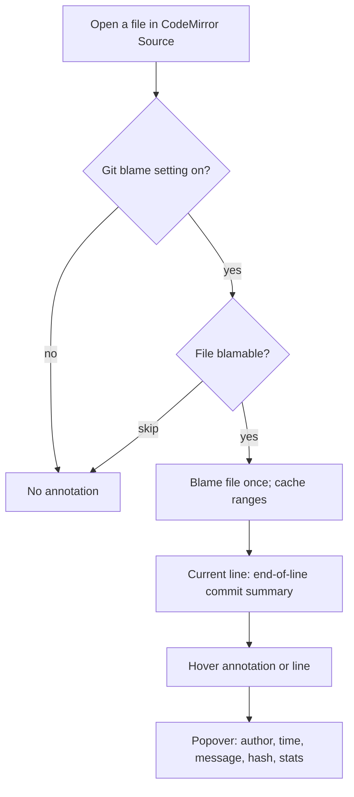

# PRD · APP-074: CodeMirror Git Blame Hover

> Product Requirements · WHAT and WHY. Settled direction for line-level git blame in the CodeMirror file editor: current-line authorship, a hover commit card, and a default-on editor setting.

## Context

- **Problem**: When reading a file in Atmos, the user cannot tell which commit last touched the current line, or why, without leaving the editor for Git History. VS Code / GitLens already make this a one-hover lookup.
- **Why now**: The CodeMirror file tab already has a git *change* gutter (index vs worktree hunks) and a header settings popover. Git log/history WS exists. Blame is the missing “who wrote this line” surface, and the interaction is settled: blame once per file, hover only reads cache, lazy commit stats.
- **Related specs**:
  - Existing git change gutter in `apps/web` (`gitIntegration`) — **distinct**; this spec does not replace it.
  - APP-005 GitHub integration — optional later jump to a remote commit (Nice to Have).
  - APP-067 Document Editor — Live markdown is out of v1; blame is Source / code file tabs only.

This spec has no BRAINSTORM.md (authoring request: PRD + TECH + TEST only).

## Goals

1. **Primary** — In the CodeMirror file editor, the current/selected line shows which commit last changed it.
2. **Primary** — Hovering that annotation (or the blamed line) opens a commit card: author, time, message, short hash, and change stats.
3. **Primary** — The card looks like Atmos (shared controls, generous rounding, **no divider lines**), not a GitLens clone of VS Code chrome.
4. **Primary** — Blame is a **default-on** toggle in the existing CodeMirror header **right-side settings** control, persisted like other editor settings.
5. **Secondary** — The editor stays usable on large or skipped files; hover never re-runs `git blame`.

## Users & Scenarios

- **Primary persona**: Agentic Builder reading a worktree file in a Project / Workspace and asking “who last changed this line, and why?”
- **Secondary persona**: The same user who wants the annotation off while writing.

### Key scenarios

1. Open a tracked source file. Place the caret (or select) a committed line. An end-of-line annotation names the commit. Hover it: a rounded card shows author, relative and absolute time, subject, body, short hash with copy, and files / insertions / deletions.
2. Select a line that exists only in the unsaved or unstaged buffer. The annotation says Not Committed Yet. Hover does not invent a fake commit.
3. Open the CodeMirror header settings (gear, right side). A **Git blame** switch is on by default. Turning it off hides annotations and hover immediately; turning it on restores them. The choice survives reload.
4. Open a binary, huge, or untracked file. No annotation, no error toast; the editor behaves as today.

## User Stories

- As a builder, I want the current line to show its last commit, so I do not have to open Git History for a one-line question.
- As a builder, I want a hover card with the commit message and change stats, so I can judge *why* the line exists.
- As a builder, I want that card to use Atmos controls and spacing, so it matches the rest of the editor chrome.
- As a builder, I want a default-on switch next to the other CodeMirror settings, so I can silence blame without hunting a global page.
- As a builder, I want uncommitted and skipped files to stay quiet, so blame never fights the existing git gutter or blocks editing.

## Functional Requirements

### Must Have

- **M1 · Current-line blame**: In the CodeMirror **Source** file editor (not Live markdown, not Diff, not Wiki), the **current / selected line** shows which commit last changed it. Default presentation is an unobtrusive **end-of-line** annotation (truncated subject, author, relative time) — not a full-file annotate gutter.
- **M2 · Hover commit card**: Hovering the annotation (and the blamed line when the annotation is the hover target) opens a popover with: author name; relative time and absolute timestamp; commit subject; commit body when present; short hash with a copy control; files changed, insertions, and deletions. Stats may appear a moment after the card if they load lazily; the rest of the card must not wait on stats.
- **M3 · Atmos UI**: Use existing Atmos primitives (`Popover` / `Switch` / tooltip / copy control patterns, `@workspace/ui`). Rounded corners per `DESIGN.md` (`rounded-xl` / overlay tokens). **No `Separator`, no hairline divider rules, no boxed “toolbar vs body” split.** Spacing and type hierarchy only. English UI is sentence case (not ALL CAPS). Copy hash uses inline button state, not a success toast.
- **M4 · Header setting, default on**: A **Git blame** switch lives in the existing CodeMirror header **right-side settings** popover (`Settings2` gear), in the same list as Line wrap / Git integration. **Default on** when the key is missing. Persist through the existing editor function-settings path (same store as `gitIntegration`). The Settings → Editor page gets the same row so the two surfaces stay in sync.
- **M5 · Distinct from git change gutter**: Git blame is a **separate** setting from **Git integration** (hunk bars / stage-restore). Either can be on without the other. Blame must not reuse the change-gutter bars as its only UI.
- **M6 · Skip and uncommitted**: Uncommitted / unsaved lines show **Not Committed Yet** (localized). Binary, too-large, untracked, and non-repo files show **no** blame UI and **no** error toast. Hover on those files does not open a commit card.
- **M7 · i18n**: All user-visible strings in `en` and `zh`. Product names (`Git`) may stay English; surrounding words are translated. No hardcoded editor copy.
- **M8 · Performance contract (user-visible)**: Opening or hovering a typical source file must not freeze the editor. After the file’s blame is cached, hover is instant. Blame is **not** re-fetched on every mouse move. Huge / generated files are skipped rather than blocking the tab.

### Nice to Have

- **N1 · Open commit**: Clicking the hash or a card action opens Git History centered on that commit, or the GitHub commit URL when the remote is GitHub.
- **N2 · File-wide annotate gutter**: JetBrains-style left gutter with author/date on every line (toggle). Too noisy for v1.
- **N3 · Heatmap / age color** on the line or gutter.
- **N4 · PR / issue autolinks** inside the commit body.
- **N5 · Status-bar duplicate** of the current-line summary.
- **N6 · Mobile UI**.
- **N7 · Blame inside Live markdown, Diff, or merge views**.

## Out of Scope

- **Full GitLens** — no CodeLens above functions, no heatmap, no file-wide annotate, no blame explorer, no status-bar clone.
- **Replacing the git change gutter** — hunk bars, inline deleted-line widgets, stage/restore stay as they are.
- **Mobile**.
- **Blame on Live markdown, Wiki, GitHub bodies, or patch/diff editors**.
- **REST git APIs** — Computer git stays WebSocket (TECH).
- **Browser-side git** (`isomorphic-git`) — Computer already has `git`.
- **Per-line `git show` on hover** — forbidden by M8.
- **New CodeMirror npm blame plugin** — none exists that fits; this is first-party.

## Success Metrics

- **Leading**: In a tracked source file with blame on, the current committed line shows an annotation; hover shows author + subject + hash without leaving the tab.
- **Leading**: First-run (no saved key) has Git blame **on**; turning it off hides the UI; reload keeps it off.
- **Leading**: Uncommitted lines and skipped files do not toast and do not show a fake commit.
- **Lagging**: Users stop bouncing to Git History for “who wrote this line.”
- **Qualitative**: The card is described as “Atmos,” not “GitLens pasted into the editor.”

## Risks & Open Questions

- **Risk**: Users confuse **Git integration** (uncommitted hunks) with **Git blame** (last commit). Mitigation: separate switches, distinct copy (“Show git changes in the gutter” vs “Show the commit that last changed the current line”).
- **Risk**: Unsaved inserts shift line numbers vs disk blame. Mitigation: TECH maps through the editor change set; unmapped / inserted lines are Not Committed Yet.
- **Risk**: Relay / large-file payload. Mitigation: coalesced ranges, skip too-large, lazy stats.
- **Open for TECH**: Exact skip thresholds (bytes / line count) and the WS action names.

## Milestones

- Phase 1 — M1–M8: blame + hover card + default-on setting + skip/uncommitted.
- Phase 2 — N1 (open commit) if Phase 1 is clean.
- Later — N2–N7 only under a new spec.
