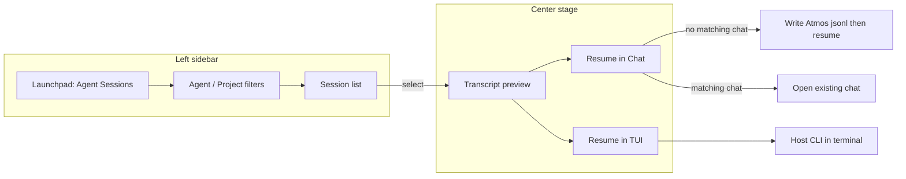

# PRD · APP-075: Agent Sessions

> Product Requirements · WHAT and WHY. Settled direction for a dedicated left-sidebar browser of local coding-agent sessions, with lazy Atmos Chat import and TUI resume.

## Context

- **Problem**: Sessions created by Claude Code, Codex, OpenCode, Pi, Grok, and Cursor Agent live in each CLI’s home directory. Atmos Chat only lists conversations it owns. Builders cannot find, preview, or continue a host session without leaving Atmos.
- **Why now**: Native hosts (APP-068 / APP-069) already know how to **resume** a vendor id via `persistence_handle`. Disk discovery and preview are still missing. Importing every host file into `chats/` would fight APP-067/068 (restore ≠ resume; chat jsonl is Atmos SOT).
- **Related specs**:
  - Builds on [APP-067](../APP-067_atmos_agent_abs/PRD.md) — chat identity, restore without spawn.
  - Builds on [APP-068](../APP-068_agent_chat_arch_optimize/PRD.md) — `AgentEvent` / `AgentMessage`, native hosts.
  - Uses [APP-069](../APP-069_agent_chat_hits_and_session_ops/PRD.md) Grok host and resume honesty.
  - Uses [APP-004](../APP-004_local-agent-integration-acp/PRD.md) Cursor ACP as the Cursor Chat host.
  - Shell pattern: [APP-062](../APP-062_pt-design/PRD.md) left sidebar → center stage.
  - TUI resume uses the existing terminal runtime ([APP-002](../APP-002_terminal-multiplexing/TECH.md), [APP-039](../APP-039_terminal-spawn-command/PRD.md) spawn plumbing).
- **Does not replace** `/agents` Agent Manager or its Atmos chat history list.

## Goals

1. **Primary** — Users open **Agent Sessions** from the left sidebar and see every v1 host session on this machine, filterable by agent or project.
2. **Primary** — Selecting a row **previews** the transcript in the center. Preview does **not** write Atmos chat files.
3. **Primary** — **Resume in Chat** hydrates an Atmos chat only when none already matches that host session, then continues through the existing Chat runtime. **Resume in TUI** runs the host CLI resume command in a terminal.
4. **Secondary** — Rows that already have an Atmos chat show an **Atmos Chat** tag. Scan stays cheap; lists are virtualized.
5. **Primary** — Users search titles and visible transcript text (user + assistant), including CJK, and land on the matching message.

Non-goals below.

## Users & Scenarios

- **Primary persona**: Agentic Builder on Web / Desktop who runs the same CLIs inside Atmos and in terminals.

### Key scenarios

1. **Find a CLI session**: User clicks **Agent Sessions**. The left sidebar lists local sessions (title, agent, project, time). They filter to Codex + one project, click a row, and read the transcript in the center.
2. **Already in Atmos**: A listed session was started from Atmos Chat. It shows an **Atmos Chat** tag. Resume in Chat opens that existing conversation (no second copy).
3. **Continue in Atmos**: A Codex TUI session has no Atmos chat. Resume in Chat creates one Atmos conversation from the host transcript and resumes the vendor session inside Agent Chat.
4. **Continue in TUI**: Same session, Resume in TUI. Atmos opens a terminal at the session cwd running `codex resume <id>` (or the equivalent for that host). No jsonl is written.
5. **Search a remembered sentence**: User types part of a past prompt (English or CJK). Matching sessions appear. Clicking a hit opens the drawer scrolled to that message.

## User Stories

- As a builder, I want a dedicated **Agent Sessions** left sidebar, so that host history is not mixed with the workspace tree or the `/agents` Atmos chat list.
- As a builder, I want to filter by agent or project, so that I can find one session among many.
- As a builder, I want to preview a session without Atmos copying it to disk, so that browsing stays cheap and private.
- As a builder, I want an **Atmos Chat** tag on sessions Atmos already owns, so that I do not import duplicates.
- As a builder, I want Resume in Chat to continue inside Atmos when I choose it, so that tool cards and composer stay native.
- As a builder, I want Resume in TUI to use the host CLI, so that I can pick up a terminal-native session without a format conversion.
- As a builder, I want to search session titles and the visible user/assistant text, so that I can find a conversation by something I said or the agent said, not only by the list title.
- As a builder, I want clicking a search hit to open that session at the matching message, so that I do not scroll a long transcript by hand.
- As an implementer, I want a closed v1 host set plus an adapter slot, so that later CLIs can be added without changing the sidebar.

## Functional Requirements

### Must Have

- **M1 — Dedicated left sidebar**: Launchpad item **Agent Sessions** (sentence-case / product name, not all caps). Opening it replaces the workspace/project tree in the left sidebar with the session list. Launchpad chrome stays. This is not a center-only page that keeps the workspace tree.
- **M2 — List all v1 host sessions**: First paint lists local sessions for **Claude Code, Codex, OpenCode, Pi, Grok, Cursor Agent**. Missing homes are omitted, not errors. Empty state explains that no v1 CLI homes were found.
- **M3 — Filter by agent or project**: User can filter the list by host agent and by project (cwd / project name). Filters compose. Clearing filters restores the full list.
- **M4 — Select to preview**: Clicking a row shows that session’s records in the center. Preview is read-only. Closing or switching rows does not spawn a runtime and does not write `~/.atmos/data/agent/chats/`.
- **M5 — Unified preview model**: Host files are adapted into one Atmos display model so the transcript UI does not branch per vendor. Unknown tool/event shapes still render rather than blank the transcript.
- **M6 — Atmos Chat tag**: If an Atmos chat exists whose `provider_id` (canonical) and `persistence_handle` match the host session’s native id, the row shows an **Atmos Chat** tag and stores that `chat_id` for open.
- **M7 — Resume in Chat, lazy convert**: Resume in Chat is offered when Atmos can host that provider. If a matching chat exists, open it. If not, convert the host transcript into Atmos persistence (`meta.json` + `transcript.jsonl`), set `persistence_handle` to the native id, then resume through the existing Chat path (spawn happens on send / existing resume rules — do not spawn on preview).
- **M8 — Resume in TUI**: Resume in TUI is offered when the host CLI resume command is known. It does **not** convert or write Atmos chat files. It starts a terminal at the session cwd with the host resume argv.
- **M9 — Virtual lists**: Both the sidebar session list and the center transcript use virtualization. Unbounded message counts must not mount one DOM node per record.
- **M10 — Cheap scan**: Listing must not fully parse every transcript. Enumerate files / sqlite metadata first; persist that row metadata in Atmos (`atmos.db` `host_session`); parse a transcript when the user opens it (and when converting for M7). Header refresh incrementally resyncs the index.
- **M11 — Adapter slot**: v1 implements only the hosts in M2. The adapter interface is closed enough that a later host is a new adapter + path table row, not a sidebar rewrite.
- **M12 — Naming honesty**: Product copy is **Agent Sessions**. `/agents` remains Agent Manager + Atmos chat history. Wire/code identifiers for this feature must not collide with `agent_chat_*` and must not cite third-party session-browser product names.
- **M13 — Transcript search**: The Agent Sessions search box queries server-side indexed text, not only already-rendered list titles. Indexed fields: session title, user message text, assistant visible text. CJK and English both match. Tool calls and thinking are not indexed.
- **M14 — Search does not block cheap list**: Opening the view still lists metadata without parsing every jsonl (M10). Transcript indexing runs after that scan and may catch up in the background. Title search works as soon as metadata exists.
- **M15 — Per-message index rows**: Each title is one index row. Each visible user/assistant message is one or more rows, capped at **32KB of text per row** (oversize messages split into chunks that share the same locator).
- **M16 — Jump to message**: A search hit carries a locator. Clicking it opens the session preview and scrolls to that message. Title hits open the session without a message scroll.

### Nice to Have

- **N1**: *(promoted to M13–M16)*
- **N2**: Cursor IDE Composer history (`state.vscdb`) in addition to Cursor Agent CLI transcripts.
- **N3**: Remote/SSH host mirrors.
- **N4**: Usage / cost rollups.
- **N5**: Star / pin / archive in an Atmos-owned overlay (without rewriting host files).
- **N6**: Mobile UI.

## Out of Scope

- **Other CLIs** (Gemini, Antigravity, Hermes, OpenClaw, Copilot CLI, Kimi, DeepSeek Harness, …) — adapter reserved; not v1.
- **Cursor IDE Composer** — v1 is Cursor **Agent** CLI transcripts only (N2).
- **Rewriting or deleting host files** — Atmos is read-only on CLI homes except for whatever the host CLI itself does on resume.
- **Merging this list into `/agents`** — that surface stays Atmos chats.
- **Converting on scan or on preview** — only M7 writes chat jsonl.
- **Cloud sync of host transcripts**.
- **Faking resume** for a host Atmos cannot actually resume.

## Success Metrics

- Leading: Agent Sessions opened; a session previewed; Resume in Chat vs Resume in TUI used.
- Lagging: Duplicate Atmos chats with the same `persistence_handle` after resume (should stay ~0).
- Qualitative: “I found last night’s Codex TUI session and continued it in Atmos without hunting `~/.codex`.”
- Qualitative: “I searched a sentence I typed yesterday and the drawer opened on that turn.”

## Risks & Open Questions

- **Risk**: Host disk formats drift independently of live stdio/ACP mappers. Preview can be lossy; Resume in Chat must still pass a resumeable native id.
- **Risk**: Users confuse Agent Sessions with `/agents` Atmos history. Launchpad labels and empty states must distinguish them.
- **Risk**: Cheap list metadata (title/cwd) can be wrong until parse; show what the cheap path knows, then refine on open.
- **Open (TECH)**: Workspace mosaic vs `/terminals` for TUI resume when cwd maps to a workspace.
- **Open (TECH)**: Durable list cache vs in-memory + watcher. **Settled**: metadata sqlite + header refresh.

## Milestones

- Phase 1 — M1–M6, M9–M12: sidebar, list, filters, preview, tags, virtualization, scan.
- Phase 2 — M7, M8: Resume in Chat (lazy convert) and Resume in TUI.
- Phase 3 — M13–M16: transcript search + jump-to-message.
- Later — N2–N6 as separate specs if needed.
