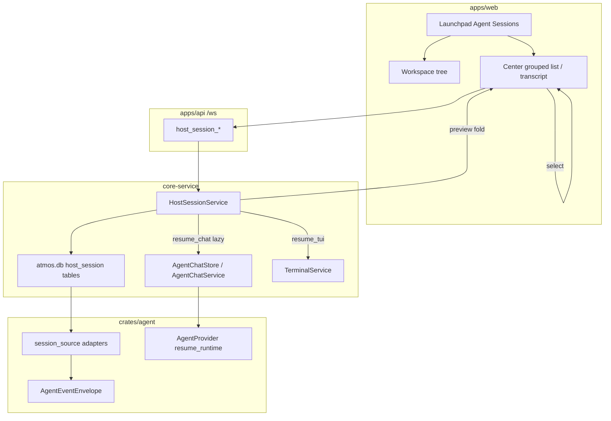
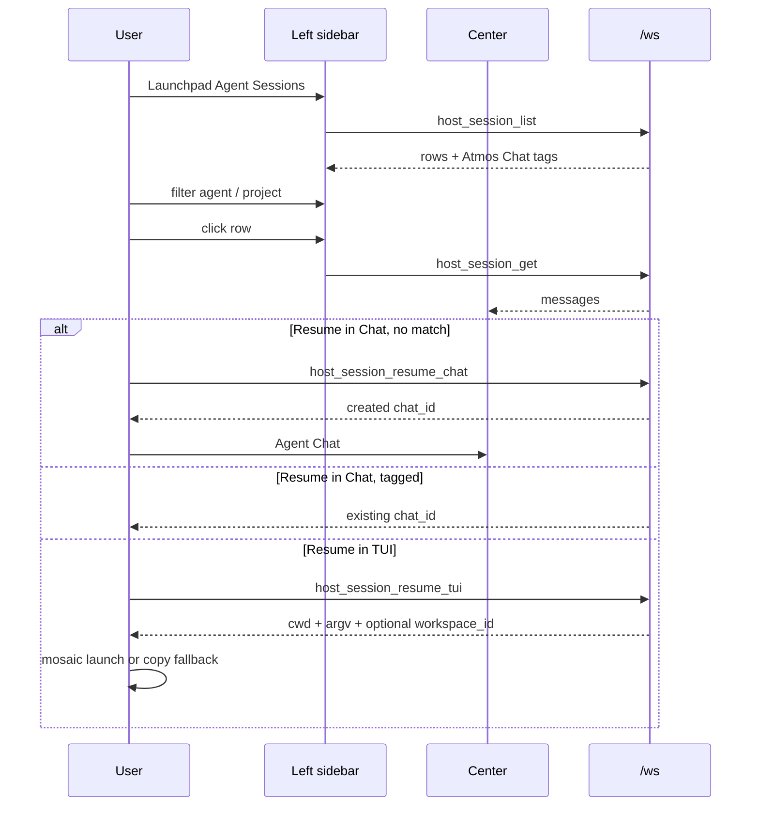

# TECH · APP-075: Agent Sessions

> Technical Design · HOW. Implements PRD APP-075: Agent Sessions. Addresses M1–M16. N2–N6 deferred.

## Scope summary

Add a **host session** subsystem: scan v1 CLI homes, preview via in-memory `AgentEvent` → `AgentMessage` fold, tag rows that already have an Atmos chat, convert to APP-068 jsonl **only** on Resume in Chat when no matching chat exists, and Resume in TUI via the host CLI. UI is a Launchpad item; the left sidebar keeps the workspace tree (same as `/agents` / `/skills`), and the center shows a grouped session list. **M13–M16** add SQLite FTS5 search over title + visible user/assistant text with jump-to-message locators.

Addresses M1–M16. N2–N6 deferred.

## Architecture overview

```
apps/web  Agent Sessions center list + transcript
  → /ws  host_session_list | get | resume_chat | resume_tui
apps/api  WsAction + DTO
  → core-service  HostSessionService
       list/get: HostSessionRepo (atmos.db metadata cache + cheap scan on sync)

       resume_chat: maybe AgentChatStore.create + existing AgentChatService
       resume_tui: TerminalService spawn
  → crates/agent  session_source/  (disk adapters → AgentEventEnvelope)
```



External: read-only access to v1 CLI homes. No new REST. No SQLite chat tables (APP-068).

## Naming

| Surface | Name |
|---------|------|
| UI / i18n | **Agent Sessions** / tag **Atmos Chat** |
| Route / Launchpad id / `CurrentView` | `agent-sessions` |
| Wire actions | `host_session_list`, `host_session_get`, `host_session_resume_chat`, `host_session_resume_tui` |
| Rust | `session_source`, `HostSessionService`, `HostSession` |
| Existing `/agents` | Unchanged Agent Manager + Atmos `AgentChatSessionsView` |

Do **not** put third-party session-browser product names in comments, identifiers, fixtures, or copy. Do **not** reuse `agent_chat_*` action names for this scan API.

## Module-by-module design

### crates/agent — `src/session_source/`

New module next to `providers/`. Disk ingest only.

```
session_source/
  mod.rs            # HostId, HostSessionMeta, SessionSource trait, roster
  paths.rs          # default roots + env overrides
  scan.rs           # cheap enumerate helpers
  fold.rs           # optional: envelopes → display parts if kept in-crate
  adapters/
    claude.rs
    codex.rs
    opencode.rs
    pi.rs
    grok.rs
    cursor.rs
  testdata/         # sanitised fixtures per host (authored here, not vendored)
```

```rust
pub trait SessionSource: Send + Sync {
    fn provider_id(&self) -> &'static str; // canonical: claude, codex, …
    fn data_roots(&self) -> Vec<PathBuf>;
    fn list(&self) -> Vec<HostSessionRef>;           // cheap: stat / sqlite meta
    fn parse(&self, native_id: &str) -> AgentResult<Vec<AgentEventEnvelope>>;
    fn tui_resume(&self, native_id: &str, cwd: &Path) -> Option<TuiResumePlan>;
}
```

- `list` must not fully parse transcripts (M10). Codex/OpenCode may use sqlite metadata (`quick_meta`).
- `parse` emits **Atmos** `AgentEventEnvelope` values. Reuse `map::classify_tool` / extractors. No `native` sidecar on mapped events (APP-068). Unmapped lines → omit or one `Unknown`. Claude `<task-notification>` stays a `UserMessage` (Claude itself injects that user turn); the child's transcript is nested under the Task tool via `{uuid}/subagents/*.jsonl` and `parent_tool_call_id`, not pasted into the parent bubble.
- Live `event_map.rs` files are **not** reused as parsers; input shapes differ (stdio frames vs jsonl/sqlite). Grok `/goal` and `/deep-research` are the exception: disk `updates.jsonl` uses the same `_x.ai/session/update` params as live, so the adapter calls `providers/grok/chrome.rs` `map_xai_ext_events` (not `event_map.rs`).
- Roster is explicit. Unknown `provider_id` is not a v1 source (M11).

### crates/core-service — `HostSessionService`

New `service/host_session/`.

- Owns the metadata cache in `atmos.db` (`host_session` + `host_session_sync`, SeaORM migration on API start), scan gate (one scan at a time), and optional later `notify` watcher on `data_roots()` that exist.
- `list(filter)` joins index rows with Atmos chats: match `canonicalize_chat_provider_id(provider_id)` + `persistence_handle == native_id` → tag `atmos_chat` + `chat_id`.
- `get(key)` calls `source.parse`, folds envelopes with a **pure** fold shared with chat (`fold_envelopes` extracted from `agent_chat/store.rs` `fold_transcript` so preview and disk jsonl paint the same `AgentMessage` / `FoldedTurn` shape). **Does not** create chat dirs. Grok chrome snapshots (`grok_goal` / `grok_workflow`) are folded in memory onto the get payload; they are not written on preview.
- `resume_chat(key)`:
  1. If matching chat: return `{ chat_id }` (no convert).
  2. Else `parse` → `AgentChatStore::create` with `origin: Imported`, `source: "host:{provider}:{native_id}"`, `persistence_handle: native_id`, `cwd` from meta, `provider_id` canonical. Append folded envelopes through the same apply/fold writer used for live events (or write jsonl lines then rely on fold on get). Persist folded Grok chrome onto chat meta (`grok_goal` / `grok_workflow`) so Resume in Chat opens the same Goal / Deep research panels. Return `{ chat_id }`. Frontend opens Agent Chat as it does today (`agent_chat_get`). Runtime spawn still happens on send / existing resume, not on preview.
- `resume_tui(key)`: PATH-check adapter `TuiResumePlan`, match `cwd` onto the longest Atmos workspace path (else project root), return `{ workspace_id?, project_id?, terminal_id?, cwd, bin, args }`. No chat write. Mosaic panes are client-owned, so the service does not call `TerminalService` to spawn.

**TUI spawn (fork 3 from BRAINSTORM)**: if `cwd` matches a workspace path, the web client queues `createAndRunTerminal` on that mosaic (`cd '<cwd>' && <quoted argv>`, `reuseIdlePane: false`) and navigates to `/workspace?id=&tab=terminal`. If only a project root matches, same path on `/project`. Product `/terminals` is a manager, not a spawn mosaic — unmatched cwd stays a copy-command fallback. Missing CLI on PATH → recoverable error, no silent fake resume. `terminal_id` is a correlation UUID on the wire, not a live pane id.

**Index (fork 6)**: metadata-only rows in `atmos.db` (`host_session` / `host_session_sync`, created by the shared SeaORM migrator on every API start — not a sidecar sqlite, not `chats/`). Rows store provider/native id, title, cwd, timestamps, `source_path`, and `parent_native_id` so `get` can parse without walking CLI homes. Transcripts stay on the host disk. First open of the view syncs if `host_session_sync.last_synced_at` is missing; later `host_session_list` reads the table (filter/sort/limit/offset, **roots only**: `parent_native_id` empty). Header refresh sends `sync: true` and replaces the cache from a cheap adapter `list()` (not a full transcript parse). Deleted host files drop out of the cache on that sync. Adapters emit child/subagent rows with `parent_native_id` set (Claude/Grok nested `subagents/` dirs, OpenCode `parent_id`, Codex `thread_source=subagent` + `parent_thread_id`); the list query hides them so they never mix into the main Agent Sessions list. `host_session_get` still resolves a child key. Codex `guardian_review` / `memory_consolidation` threads are skipped entirely.

Scan gate: process-level mutex so overlapping Launchpad opens cannot double-walk trees.

### apps/api

WS only (APP-048/064). Variants on `WsAction` in `apps/api/src/api/ws/message.rs` (or `message/host_session.rs`). Router under `apps/api/src/api/ws/router/`. Extract catalog + `WsContract` rows in `@atmos/api-types`.

### apps/web

| Piece | Path |
|-------|------|
| Feature | `apps/web/src/features/agent-sessions/` (`components/`, `hooks/`, `lib/`) |
| Launchpad id | `agent-sessions` in `features/settings/lib/launchpad-items.ts` + `LeftSidebarLaunchpad.tsx` `ITEM_DEF_BY_ID` |
| Route | `/agent-sessions` (+ optional `?key=`) |
| `CurrentView` | add `"agent-sessions"` in `shared/hooks/use-context-params.ts` |
| Left sidebar | Same as `/agents` / `/skills`: keep the workspace tree. Do not replace `projectTabContent`. |
| Center | `HostSessionCenterView`: grouped list (Agent or cwd project folder) like Agent Chat sessions; `?key=` opens the read-only transcript + resume actions. |
| Virtual list | `@tanstack/react-virtual` — same stack as `AgentChatTranscriptList.tsx` and `GitHistoryPanel.tsx`. Center list + transcript: `measureElement` like chat. |
| Preview render | Reuse Chat `Conversation` + `AgentChatTranscriptList` (folded `AgentMessage[]` from `host_session_get`). Per-turn `SubagentTasksPanel` sits under the assistant message that spawned it (`subagentCardMode: "transcript"`). Grok goal / deep-research stay session-global in `AgentChatAboveComposerOverlays` at the bottom (`grokCardsDefaultOpen={false}`). Subagent overlay still covers the lane. Read-only. |
| i18n | `apps/web/messages/en.json` + `zh.json` (sentence case; product name **Agent Sessions**) |

Do not mount one row per session or per message.

### packages/api-types

New `src/ws/dto/host-session.ts` + `src/ws/contract/host-session.ts`. Merge in `contract.ts`. `extract-actions` / `check-actions`.

### packages/ui

No new primitives required. Use existing `ScrollArea`, filter popover patterns (`WorkspaceKanbanFilterMenu`, `SkillsFilterMenu`, `TaskGithubFilterMenu`).

## Data model

### Host session (list)

```ts
type HostSessionTag = "atmos_chat";

type HostSessionListItem = {
  key: string;                 // "{provider_id}:{native_id}"
  provider_id: string;         // canonical
  native_id: string;           // vendor resume id
  title: string;
  cwd: string;
  project_name: string;
  started_at: string;          // RFC3339
  updated_at: string;
  message_count: number | null; // visible user prompts + assistant text bubbles; not tool_result / thinking-only / tool-only / vendor num_messages. Line-level JSON (or OpenCode text parts), never a full fold in list().
  model: string | null;
  tags: HostSessionTag[];
  atmos_chat_id: string | null;
  resume_chat: "supported" | "unsupported";
  resume_tui: "supported" | "unsupported";
  parent_native_id?: string | null; // child/subagent host session; omitted on roots
};
```

`resume_chat` is `supported` iff `AgentProviderFactory` can host `provider_id` (v1: all six). `resume_tui` is `supported` iff `TuiResumePlan` is known and the binary is on PATH (PATH miss can also be an error at click time).

### Preview / persist

`host_session_get` returns the same `AgentMessage[]` (or folded turns) Agent Chat already paints. Persist on M7 writes APP-068 `AgentEventEnvelope` jsonl. Add `AgentChatOrigin::Imported` (`imported`) next to `normal` / `quick`.

`chat_id` remains an Atmos UUID. `persistence_handle` is the host native id. Never equal (APP-068).

### v1 path table

Env overrides are **candidates**: use them only when they contain real session files; otherwise fall back to the default home.

| Canonical id | Default roots | On-disk shape | Cheap list | TUI resume |
|--------------|---------------|---------------|------------|------------|
| `claude` | `~/.claude/projects/` (`CLAUDE_CONFIG_DIR` re-roots) | `{encodedCwd}/{uuid}.jsonl`; subagents under `{uuid}/subagents/` | directory walk + mtime; cwd from encoded dir / first records | `claude --resume <uuid>` in cwd |
| `codex` | `$CODEX_HOME/sessions` + `archived_sessions` (default `~/.codex`); `state_5.sqlite` | `rollout-*.jsonl`; first line `session_meta` | keep `thread_source=subagent` with `parent_native_id` from `source.subagent.thread_spawn.parent_thread_id`; skip guardian/memory | `codex resume <id>` |
| `opencode` | `~/.local/share/opencode/` (`XDG_DATA_HOME`, `OPENCODE_DIR`) | `opencode.db` and/or `opencode-next.db`, or `storage/` JSON | sqlite session table / storage dir listing | `opencode --session <id>` (`opencode2` if next-channel) |
| `pi` | `~/.pi/agent/sessions/` | `{encodedDir}/{timestamp}_{uuid}.jsonl`; first line `{type:session,cwd,id}` | file walk; native id = uuid suffix | `pi --session <uuid>` |
| `grok` | `~/.grok/sessions/{urlEncodedCwd}/{uuid}/` | `updates.jsonl` (ACP-shaped session/update stream), `summary.json`, optional `chat_history.jsonl` | require `summary.json`; title/cwd/model from summary; **do not** treat `chat_history.jsonl` as the full log | `grok --resume <uuid>` |
| `cursor` | `~/.cursor/projects/{slug}/agent-transcripts/{uuid}/{uuid}.jsonl` | role/message jsonl + `turn_ended`; **snapshot log** (consecutive assistant lines replace the in-flight message — parse keeps finished tool batches, updates the live batch only when names/inputs look like argument streaming, hides `GetDynamicTools`, keeps the last non-empty assistant text, drops duplicate user lines, and assigns a distinct `turn_id` per unique user). Nested `{uuid}/subagents/{child}.jsonl` rows set `parent_native_id`; parse attaches them under the matching Task via `parent_tool_call_id` (unique prompt overlap, then `resume`/`task_id`, then tool id). Skip turn-marker-only shells | file walk; project from slug / sidecar metadata | `cursor-agent --resume <uuid>` |

Grok Build native and `grok-build` ACP share the Grok home. List as `grok`. Match Atmos chats with canonical `grok` / `grok-build` synonyms via existing canonicalize helpers.

**Omit from top-level list**: Codex guardian/memory threads; host sessions whose `parent_native_id` is set (Claude/Grok nested `subagents/` files, OpenCode `parent_id`, Codex subagent threads). Adapters still emit those child rows; `host_session_list` filters `roots_only`. Child transcripts attach under the parent Task via `parent_tool_call_id` / `task_id` on parse, same as live Agent Chat.

**Skip encrypted / empty**: Cursor Agent files that are only `turn_ended`; missing roots.

### TUI argv

```text
claude --resume <id>          # cwd required
codex resume <id>
opencode --session <id>
pi --session <id>
grok --resume <id>
cursor-agent --resume <id>
```

## Transport

WebSocket-first. No REST.

### `host_session_list`

```ts
// input
{
  provider_id?: string | null,
  project?: string | null,
  query?: string | null,
  sort_field?: "started_at" | "updated_at" | null,
  sort_order?: "asc" | "desc" | null,
  limit?: number | null,
  offset?: number | null,
  sync?: boolean | null,
}
// output
{ sessions: HostSessionListItem[], total: number, scanned_at: string }
```

`project` matches `cwd` or `project_name` (case-insensitive substring is enough for v1). `sync: true` rescans CLI homes into the metadata index; omit or `false` reads the index (and syncs once if it has never been written). Grouped UI may still fetch all metadata rows (`limit` unset) because the payload is small; pagination is for the query API, not transcript bodies.

### `host_session_get`

```ts
// input
{ key: string }
// output
{ session: HostSessionListItem, messages: AgentMessage[] }
```

Does not spawn, does not write `chats/`.

### `host_session_resume_chat`

```ts
// input
{ key: string }
// output
{ chat_id: string, created: boolean }
```

`created: false` when an Atmos chat was reused. Frontend routes to the existing Agent Chat surface.

### `host_session_resume_tui`

```ts
// input
{ key: string }
// output
{
  workspace_id?: string | null,
  project_id?: string | null,
  terminal_id?: string | null,
  cwd: string,
  bin: string,
  args: string[],
}
```

### Event

`host_session_index_updated` — `{ scanned_at: string }` after scan/watcher. Client refetches list. Payload may be `RefreshNotification` if that is the house style for refetch-only events.

Call sites: `wsRequest("host_session_list", { ... })` with no `<T>`.

## Scan performance

Copy the **logic**, not a third-party crate:

1. `list()` / sqlite meta is cheap; never parse jsonl for the index card.
2. `parse` only on `get`, convert, and background FTS catchup — not inside Refresh.
3. Persist source mtime+size on `host_session`. Unchanged files skip recount and keep the cached `message_count` / FTS cursor.
4. One scan at a time (`SCAN_GATE`).
5. Watcher on existing `data_roots`; overflow → one incremental rescan. **Deferred** (cheap list + fingerprint skip on Refresh).
6. Adapter failures degrade to empty for that host; the rest of the roster still lists.

Budget: Refresh of a typical machine (hundreds of unchanged sessions) feels immediate (< 500ms p50 local SSD) after the first cheap list. Opening one transcript parses that file only.

## Security & permissions

- Read-only on host homes. Never write credentials (`~/.codex/auth.json`, etc.).
- Do not rsync or upload transcripts.
- Logs: session key + provider + cwd, not full message text.
- Resume in Chat writes under `~/.atmos/data/agent/chats/` only.
- Same Computer / loopback WS auth as other actions.

## UI behavior



Filter chrome lives in the Agent Sessions sidebar footer or a header control on that list — same density as `WorkspaceKanbanFilterMenu`, not a new settings page.

English: **Agent Sessions**, **Atmos Chat**, **Resume in Chat**, **Resume in TUI**. No CSS `uppercase` on those labels.

## Rollout plan

1. `session_source` trait + claude/codex fixtures (`cargo test -p agent`).
2. Remaining v1 adapters + cheap list tests.
3. `HostSessionService` list/get + Atmos chat tag join; no resume yet.
4. `host_session_list` / `host_session_get` WS + api-types contract.
5. Launchpad + `CurrentView` + left sidebar swap + virtual list + center preview.
6. `resume_chat` lazy import (`Imported` origin) + frontend open.
7. `resume_tui` + terminal spawn.
8. Watcher + index_updated event.

Each step is mergeable. Hide the Launchpad item until step 5 if needed (default-on once preview works).

## Risks & tradeoffs

- **Tradeoff**: atmos.db metadata tables vs in-memory — chose SeaORM so list/filter/sort/pagination do not walk CLI homes on every open, and schema rides the existing startup migrator. Preview still parses host files; the tables are not a second transcript SOT. Restart reuses the cache until header refresh.
- **Tradeoff**: grouped UI still virtualizes the full metadata set — session rows are tiny; transcripts stay lazy. Server `limit`/`offset` exist for later flat paging.
- **Tradeoff**: fold to `AgentMessage` vs a slimmer DTO — one transcript component, less UI drift.
- **Tradeoff**: replace left-sidebar body rather than reuse workspace tree — PRD M1.
- **Risk**: disk format ≠ live wire; convert can drop thinking/tool details. Resume still uses native id. Preview honesty: show Unknown rather than invent tools. Grok `/goal` and `/deep-research` are mapped through the live chrome mapper so preview and Chat resume keep those panels.
- **Risk**: `CODEX_HOME` empty dir hiding `~/.codex` — env is a candidate only when it contains sessions (same rule for other env roots).
- **Rollback**: remove Launchpad item and WS arms; no migration. Imported chats remain valid Atmos chats.

## Dependencies & compatibility

- Depends on APP-067, APP-068, APP-069, APP-048/064, APP-004 (Cursor host), APP-036 (Grok home).
- Blocks nothing.
- Desktop and web share the API Computer; scan runs on the Computer, not in the browser.
- Host CLIs must be installed for TUI resume; preview does not require the binary.

## Open questions

- [x] Persist on preview? No.
- [x] Cursor IDE Composer? Not v1.
- [x] Disk index? Metadata tables in `atmos.db` (`host_session`); not transcripts.
- [x] TUI target? Workspace mosaic if cwd matches; else project mosaic; unmatched cwd copies the command (`/terminals` is not a spawn surface).
- [x] Exact OpenCode 2 binary name on PATH (`opencode` vs `opencode2`) — v1 TUI resume uses `opencode --session <id>` (TECH argv table). `opencode2` not observed as required for the installed `opencode.db`.
- [x] File watcher: deferred. Cheap `list()` each request plus mtime peek in adapters satisfies M10 without a `notify` crate.
- [x] Transcript search? Per-message FTS5 trigram in `atmos.db`; locator jump. See **Full-text search (M13–M16)** below.

<!-- updated 2026-09-17: impl — TUI resume PATH-checks argv, maps cwd → workspace/project ids, and mints a correlation `terminal_id`. The web client launches the CLI in that mosaic. Unmatched cwd is copy-command. Watcher deferred. Grok `/goal` and `/deep-research` fold through `map_xai_ext_events` onto preview + imported chat meta. -->

<!-- updated 2026-09-17: search — FTS5 trigram per-message index + jump locator (M13–M16). -->

## Full-text search (M13–M16)

Reuse `atmos.db` SQLite FTS5. Do not add Tantivy, jieba, Meilisearch, or a sidecar index file.

### Why trigram

FTS5 `unicode61` treats a CJK run as one token, so substring search fails. Trigram (`tokenize = 'trigram case_sensitive 0'`) covers CJK and English substrings with the bundled `libsqlite3-sys` already used by sqlx. Query: split on whitespace, quote each term, `AND` them, escape `"`.

### Two-phase scan (M10 + M14)

```
ensure_index (first start and Refresh; watcher still deferred):
  1. cheap SessionSource::list                         # no jsonl parse, no line-count enrich
  2. fingerprint source (file mtime+size; Grok uses updates.jsonl)
  3. unchanged fingerprint → keep message_count + byte_size; skip enrich
  4. sync_index upsert + delete missing keys           # do not replace_all
  5. prune search orphans; upsert kind=title rows; return list
  6. background catchup (own mutex, spawn_blocking parse, concurrency ~4):
       for each session whose (mtime,size) cursor is stale or body_ready=0
       (or host_session_sync.index_revision != HOST_SESSION_INDEX_REVISION):
         parse_at → fold_agent_events → flatten_messages
         stamp host_session.message_count from visible user/assistant Text bubbles
         extract Text parts only (skip Thinking / ToolCall / Plan)
         skip empty text and user payloads that look like <task-notification>
         chunk at 32KiB UTF-8 boundaries
         replace all search rows for that session_key (title + messages)
         mark body_ready=1
       emit host_session_index_updated
```

Bump `HOST_SESSION_INDEX_REVISION` when count or FTS extract rules change so the next Refresh invalidates bodies once. Never parse jsonl inside cheap `list()`. `get` / resume still parse independently.

<!-- updated 2026-09-18: Refresh is incremental — fingerprint skip + upsert, parse only in FTS catchup which stamps gold message_count. -->

### Index document (one FTS row)

| Field | Title row | Message row |
|-------|-----------|-------------|
| `kind` | `title` | `user` \| `assistant` |
| `text` | session title | concatenated `MessagePart::Text` (≤ 32KiB per chunk) |
| `message_id` | NULL | flattened `AgentMessage.id` |
| `seq` | `-1` | flatten index (same order as drawer `messages[]`) |
| `chunk` | `0` | `0..n` sharing the locator |
| `session_key` | indexed session | same |
| `root_session_key` | parent or self | parent or self (list stays roots_only) |

Cursor/Grok adapters mint `Uuid::new_v4()` on parse, so `message_id` may change. Jump prefers `message_id`, then `seq`.

### Tables

Migration `m20260917_000043_create_host_session_search`.

```sql
CREATE TABLE host_session_search (
  id INTEGER PRIMARY KEY AUTOINCREMENT,
  guid TEXT NOT NULL UNIQUE,
  session_key TEXT NOT NULL,
  root_session_key TEXT NOT NULL,
  kind TEXT NOT NULL,
  message_id TEXT,
  seq INTEGER NOT NULL,
  chunk INTEGER NOT NULL DEFAULT 0,
  text TEXT NOT NULL,
  created_at TEXT NOT NULL,
  updated_at TEXT NOT NULL
);
CREATE UNIQUE INDEX idx_host_session_search_loc
  ON host_session_search (session_key, kind, seq, chunk);

CREATE TABLE host_session_search_cursor (
  session_key TEXT PRIMARY KEY NOT NULL,
  source_mtime_ms INTEGER NOT NULL,
  source_size INTEGER NOT NULL,
  body_ready INTEGER NOT NULL DEFAULT 0,
  updated_at TEXT NOT NULL
);

CREATE VIRTUAL TABLE host_session_fts USING fts5(
  text,
  content = 'host_session_search',
  content_rowid = 'id',
  tokenize = 'trigram case_sensitive 0'
);
-- AFTER INSERT/DELETE/UPDATE triggers keep fts in sync with host_session_search.
```

SeaORM owns `host_session_search` / `host_session_search_cursor`. FTS + MATCH stay raw SQL in `HostSessionRepo` (`crates/infra/src/db/repo/host_session_repo.rs`).

### Extract

`crates/core-service/src/service/host_session/search.rs`

- Input: flattened messages from the same fold `get` uses.
- Output: `Vec<HostSessionSearchDoc>`.
- Cap `const SEARCH_TEXT_MAX_BYTES: usize = 32 * 1024`.

### Query (extend existing `host_session_list.query`)

No new WS action. When `query` is non-empty:

1. FTS `MATCH` → ranked search rows (limit 200).
2. `DISTINCT root_session_key` preserves first-hit order, then existing provider/project/sort apply on those keys (`roots_only` still).
3. Response adds `hits: HostSessionSearchHit[]` (one primary hit per returned session — first/best row), `search_status: "indexing" | "ready"`, and `search_progress?: { indexed, total }` while bodies are catching up.
4. If FTS is empty (index still catching up), fall back to metadata `LIKE` on title/cwd/project so the box is never dead.

```ts
type HostSessionSearchHit = {
  session_key: string;       // session that owns the message (may be a child)
  root_session_key: string;
  kind: "title" | "user" | "assistant";
  message_id: string | null;
  seq: number;
  snippet: string;           // ~160 chars around the first term, not the 32KB body
};

type HostSessionSearchProgress = {
  indexed: number;
  total: number;
};

// host_session_list output
{
  sessions, total, scanned_at,
  hits?: HostSessionSearchHit[],
  search_status?: "indexing" | "ready",
  search_progress?: HostSessionSearchProgress
}
```

Background catchup emits `host_session_index_updated` with `search_status: "indexing"` plus `search_progress` (throttled ~200ms, always 0/N and N/N). The web header shows a chip left of Refresh (`Indexing {percent}%`). Completion emits `search_status: "ready"` and the list refetches so message search works. Refresh of fingerprint-stale bodies uses the same progress events even when `search_body_pending` is already false.

Snippet is computed in the service from stored `text` + query terms. Do not send full index text to the client.

### Frontend

- `useHostSessionList` debounce (~300ms) and pass `query` into `host_session_list`.
- Stop using `filterHostSessionsByQuery` for transcript search (keep agent/project client filters on the returned set).
- Click a row while searching: `?key=<session_key>&mid=<message_id>&seq=<n>` (`kind=title` omits mid/seq). Child hits use the child `session_key` (existing `get` resolves it).
- `HostSessionDetailView` after messages load: `findIndex` by `mid`, else `seq`, then existing `scrollToIndexRef`.

### Event

`host_session_index_updated` already exists. Cheap metadata sync emits it without progress (client refetches). Catchup emits the same event with `search_status` + `search_progress` so the chip can move without refetching the list; `search_status: "ready"` refetches so message search works. `apps/api` forwards via the same `spawn_ws_forwarder` pattern as local-services.

### Rollout (search)

9. Migration + repo MATCH tests (`cargo test -p infra --lib host_session`).
10. Extract + catchup + list hits (`cargo test -p core-service --lib host_session`).
11. DTO / contract `hits` + `search_status`; broadcast.
12. Web debounce + locator URL + scroll.

### Risks (search)

- **Tradeoff**: trigram index is larger than unicode61; 32KB/row + external-content FTS keeps `atmos.db` bounded.
- **Risk**: first catchup reads every jsonl. Mitigate: background, mtime+size skip, title rows first.
- **Risk**: unstable Cursor/Grok ids. Mitigate: `seq` fallback.
- **Rollback**: drop search tables; list `query` falls back to metadata LIKE; UI still works.

<!-- updated 2026-09-19: message-index catchup emits `search_progress` on `host_session_index_updated`; Agent Sessions header shows a percent chip left of Refresh. -->
