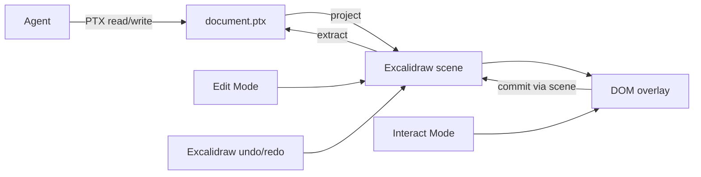

# PRD · APP-075: PT Design Interactive Canvas

> Product Requirements · WHAT and WHY. **Greenfield rewrite** of PT Design: Agent-native interactive canvas. PTX is what Agents and files speak. The live board uses Excalidraw, including **native undo/redo**. No compatibility with APP-062 wireframes, Design IR, or old tools.
>
> Source: [PT Design v2 产品与技术方案](./source/PT-Design-v2.md).

## Context

- **Problem**: Specifying UI in natural language is weak. The current PT Design board is a wireframe: Agents wrestle geometry, humans cannot operate the UI.
- **Why now**: Package, Atmos center-stage embed, collab, and Agent invoke already exist. Rebuild the document model and the board around real controls + one undo system.
- **Product name**: **PT Design**. Package: **`packages/pt-design`** / **`@atmos/pt-design`**.
- **Compatibility**: **None.** New documents, new Agent tools, new persistence. Old designs, IR, MCP/CLI tool names, and scene JSON as the Agent API are dropped. Isolation, embed chrome, collab transport, and invoke dispatch stay as host plumbing.
- **Related specs**:
  - [APP-062](../APP-062_pt-design/PRD.md) — historical wireframe product. Do not implement a migration.
  - [APP-050](../APP-050_shared-package-layering/PRD.md) — isolation.
  - [APP-014](../APP-014_canvas/PRD.md) — different product. Never brand PT Design as Canvas.
- **Settled sentences**:
  - PTX defines **what it is and where it is** (Agent/file).
  - **Edit Mode** uses Excalidraw for space, including **Excalidraw undo/redo**.
  - **Interact Mode** uses real DOM to operate the UI. No canvas layout edits, **no Excalidraw undo/redo**.

## Goals

1. **Primary** — Closed loop: Agent writes PTX → real Select/Button/Input on the board → Interact works → Edit drag → Cmd+Z restores the drag → Agent re-reads PTX and continues.
2. **Primary** — Agents only edit **PTX XML** (`id`, tags, attrs, nested `<option>` / `<on>`). No Excalidraw JSON, no Design IR, no layout engine.
3. **Primary** — Palette-created nodes and Agent-created nodes are the same document nodes.
4. **Secondary** — Keep Atmos left-sidebar → center stage, playground, MCP/CLI on `.ptd`, spatial(+payload) collab via the existing room.

## Users & Scenarios

- **Primary persona**: Agentic Builder in Atmos.
- **Secondary**: Playground / CLI / MCP on a `.ptd`.
- **Secondary**: Collaborator on a shared room.

### Key scenarios

1. Agent creates PTX with a Select and a Button. The board shows a real `<select>`-equivalent and `<button>` at those coordinates.
2. Interact: change the select, type in an input, click Run. Values persist in the document. Layout cannot be dragged.
3. Edit: drag the button. Coordinates update. Cmd+Z / Cmd+Shift+Z use **Excalidraw** undo/redo (Edit Mode only) and the overlay follows.
4. Agent reads PTX, adds an `<option>` in the XML, saves/applies the file. In **Edit Mode**, undo removes that save as one Excalidraw step.
5. User A drags in Edit Mode; User B sees the move (scene collab).

## User Stories

- As a builder, I want real controls, so I can try the UI.
- As a builder, I want Edit vs Interact, so layout and operation do not fight.
- As a builder, I want Cmd+Z in **Edit Mode** to undo the last board change the way Excalidraw already does (drag, palette, Agent apply). Interact is for clicking controls, not undo.
- As an Agent, I want `document.ptx` to behave like a source file I can read, patch, and save.
- As a collaborator, I want to see the shared board update without a reload.

## Functional Requirements

### Must Have

- **M1 · PTX is the Agent source file**: `document.ptx` is XML. Agents **read and edit it like code** (open file → change tags/attrs → save). Same loop on a live board: get the XML text, edit it, apply the **whole file**. They do not read `canvas.json` or Excalidraw JSON.
- **M2 · Live board mapping**: On the open board, each PT node is one Excalidraw handle plus a real DOM overlay. The human-visible document and undo stack are that scene. `pt_ptx_get` **extracts XML**; `pt_ptx_apply` **projects** the Agent’s saved XML back onto the scene (one undo step).
- **M3 · Spatial props**: Nodes carry `x`, `y`, `width`, `height`, `rotation`. No `<layout>` nodes. No `pt_layout_row/column/grid`.
- **M4 · Full existing catalog as real DOM**: Every current PT Design catalog type is a real operable control (or composed tree), not a wireframe drawing. Frozen ids: `SHADCN_BASIC_IDS` plus `REQUIRED_BLOCKS` in `packages/pt-design/src/catalog/shadcn-list.ts` (accordion … typography, and `block.auth-form` / `block.settings-shell` / `block.empty-state` / `block.nav-content`). Overlay/popover types (dialog, sheet, select, menus, tooltip, toast, …) render **in-place on the canvas** (expanded panel / custom list). They must not use OS popups or `document.body` portals that escape the overlay. Blocks are PTX trees of the same node types.
- **M5 · Options contract**: Option-bearing nodes always have `label` + `value`.
- **M6 · Palette = Agent nodes**: Palette insert creates the same PTX node an Agent would type (same tags/attrs). Human and Agent documents are one XML.
- **M7 · `.ptd` bundle**: Directory `document.ptx` + `canvas.json` + `assets/`. `canvas.json` holds freehand/camera/files and handle clones for the embed; it is not the Agent API.
- **M8 · Edit Mode + Excalidraw undo**: Select, drag, resize, rotate, delete, **undo/redo via Excalidraw**. This is the only mode that owns canvas operations and board history. DOM overlay does not steal the pointer. We do **not** ship a second undo stack.
- **M9 · Interact Mode**: Operate real controls only (click, type, select, toggle). **No** drag/resize/rotate, **no** Excalidraw undo/redo. Pan/zoom for viewing is allowed. Overlay owns the pointer. A focused field may still use the browser’s text undo for that field; it must not pop the board history.
- **M10 · Runtime commits through the board**: `value` / `checked` / `options` live on the node. Click/change update the document. Declared `<action type="agent" name="…">` notifies the host (Agent feed / bridge). No parallel runtime store.
- **M11 · Agent loop = edit PTX**: Skill and tools treat PTX as a source file. Headless: read/write `document.ptx` on disk. Live: `pt_ptx_get` returns pretty XML; Agent edits that text; `pt_ptx_apply` takes the **complete** new XML (like saving the file). Invalid XML/schema is a structured error; the previous document is unchanged. Apply on a live board is one Excalidraw undo step, usable in **Edit Mode**.
- **M12 · Screenshot**: Live screenshot of nodes/page so the Agent can see the board after an XML save.
- **M13 · Package isolation**: `@atmos/pt-design` only. Dual exports: embed vs headless (no Excalidraw). Headless has no undo UI; file PTX is truth.
- **M14 · Atmos embed**: Left sidebar → center stage. New persistence key. Host: theme, persistence, Agent bridge, i18n. No catalog/board logic in apps.
- **M15 · Agent surfaces**: Live invoke, MCP, CLI/Skill share the new tool list. Structured errors. **Old tool names are absent** (not aliased).
- **M16 · Collab**: Existing encrypted scene room. Peers see board updates (handles + `customData` payload). Remote updates must not pollute the local undo stack.

### Nice to Have

- **N3 · Extra action types** (`tool`, `api`, `set`).
- **N4 · Variant switcher UX** (inspector/Agent cycling button default/secondary/…). The `variant` attribute itself is in Must Have data (M4); this N is the chrome to switch it.
- **N5 · Multiple pages**.
- **N6 · Handoff payload** for implement-in-code (PTX + instructions + optional image).
- **N7 · Structured node tools** (`pt_node_create` / `update` / `delete`, `below`/`rightOf`, `pt_batch`) as shortcuts. Not required; XML edit is the default Agent path.

## Out of Scope

- **Any APP-062 migration** (IR, wireframe catalog, `.ptdesign.json`, old MCP/CLI names, scene-as-Agent-API).
- **A second undo/redo implementation.**
- **Sketch Engine.**
- **Layout engine** (`layout_row` / `moveRightOf` as a solver). Agents set `x`/`y` in PTX.
- **Orphan XML snippets** as a protocol (a lone `<option>` with no document). That is not how saving a source file works. Surgical edits happen **inside** the full PTX text, then the whole file is applied.
- **Production codegen.**
- **Merging with APP-014.**
- **Main `/ws` PT Document types.**
- **Atmos Rust CLI.**
- **Mobile-first PT Design.**
- **Visual pixel-perfect shadcn / Figma.** Controls are real and recognizable; they need not match production CSS 1:1.

## Success Metrics

- **Leading**: Source §18 closed loop on one machine, plus Cmd+Z after a drag **in Edit Mode** and after an Agent apply **while still in Edit Mode**.
- **Leading**: Agent closed loop is get PTX XML → edit text (e.g. add an `<option>`) → apply full file → board updates.
- **Leading**: PTX round-trip preserves ids, types, spatial props, options, events, values.
- **Leading**: Isolation + headless import graph green.
- **Leading**: Two peers see a drag without reload.
- **Qualitative**: Interactive prototype, not wireframe, not Canvas.

## Risks & Open Questions

- **Risk**: Overlay drift on zoom/rotate — handle stays spatial authority; overlay follows transform.
- **Risk**: Interact vs Edit confusion — chrome **Edit** / **Interact** (sentence case). Interact never looks like it can drag or undo the board.
- **Open (impl try)**: Custom Select list hit-testing inside the overlay.

## Milestones

- **Phase 1** — Protocol (PTX codec + extract/project pure functions) + headless session. No embed yet.
- **Phase 2** — Full catalog renderers + overlay (playground, Interact).
- **Phase 3** — Excalidraw board: project/extract, Edit/Interact, **captureUpdate undo**, pointer rules.
- **Phase 4** — PTX get/apply tools + MCP/CLI/Skill (“edit like source”) + screenshot.
- **Phase 5** — Host persistence key + i18n mode chrome + collab `NEVER` remote.

**Done**: M1–M16. N* optional.

## Resolved product forks

| Fork | Decision |
|------|----------|
| Compat | None; rewrite |
| Live session | Excalidraw scene + mapping |
| File/Agent | PTX |
| Undo | Excalidraw history only |
| Components | Real DOM; **full existing catalog** (all `SHADCN_BASIC_IDS` + `REQUIRED_BLOCKS`) |
| Modes | Edit = canvas ops + undo; Interact = operate UI only, no board undo |
| Agent surface | Edit PTX XML like a source file; structured node tools are N7 |
| Collab | Existing scene room |
| Package | `@atmos/pt-design` modules |
