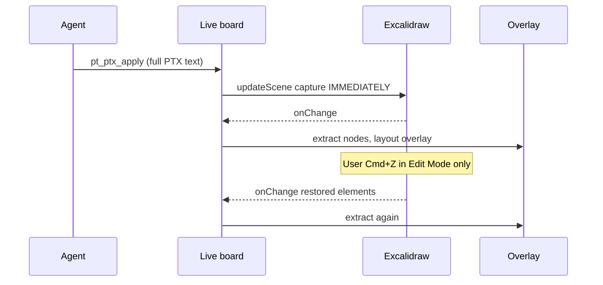

# TECH · APP-075: PT Design Interactive Canvas

> Technical Design · HOW. Implements PRD APP-075. Addresses **M1–M16** including **full existing catalog** (M4). **N3–N7** deferred. N1/N2 (extra types / blocks) are **not** deferred — they are M4.
>
> **Greenfield.** Delete APP-062 IR, wireframe templates, scene-session SoT, `pt_layout_*`, old tool names. Do not migrate documents.

## Scope summary

Rebuild `@atmos/pt-design` around **extract/project**:

| Surface | Truth | Undo |
|---------|--------|------|
| Live board (browser) | Excalidraw **scene** (handle geometry + `customData.pt`) | Excalidraw `History` via `CaptureUpdateAction` |
| File / Agent | **PTX** | n/a |
| Headless CLI/MCP | **PT AST** | n/a (no editor) |

No parallel PT store on the live board. Overlay, inspector, and `pt_ptx_get` **extract** from `getSceneElements()`. Agent/palette/runtime writes **project** with `updateScene`.

## Architecture overview

```text
Agent / CLI / MCP / live invoke
        │  PTX or node commands
        ▼
  protocol (parse / serialize / extract / project)     headless AST session
        │
        ▼  (embed only)
  Excalidraw scene  ←—— captureUpdate IMMEDIATELY (local)
        │               NEVER (load, collab remote)
        ├── handles (rectangle + customData.pt)
        ├── freehand / arrows (unmapped)
        └── History (native undo/redo)
        │
        ▼ extract every onChange
  DOM overlay (real controls) + inspector
```



Keep: `apps/api` collab WS (ciphertext), `pt_design_agent_dispatch` invoke, `apps/web` thin host. No new crates. No new `/ws` document types.

## Decisions locked here

| Topic | Decision |
|-------|----------|
| Live SoT | Excalidraw scene. `PtDesignSession` in embed is a facade over `excalidrawAPI`, not a second element array. |
| File SoT | `document.ptx`. `canvas.json` = full scene dump for embed reopen (freehand + camera + files). Load: restore scene with `NEVER`, then ensure every PTX node has a handle (project missing ones, `NEVER`). If both exist, **scene handles win on reopen** because that is what undo produced; PTX is rewritten on save from extract. Headless open ignores canvas and uses PTX only. |
| Undo | **Edit Mode only**, Excalidraw history. Palette / Agent `pt_ptx_apply`: `IMMEDIATELY`. Interact control commits (`value`/`checked`): `NEVER` (persist, not history). Collab remote + load + theme ink: `NEVER`. |
| Interact | `viewModeEnabled={true}`: pan/zoom, no spatial edit, **no board undo/redo**. Overlay `pointer-events: auto`. Do not lock-handles-to-preserve-Cmd+Z — Interact must not drive Excalidraw history. |
| `customData` | Full PT payload on the handle. Spatial fields stay on the element (`x,y,width,height,angle`). Extract copies spatial into PTX. History snapshots the element, so undo restores payload too. Set `customData` **after** `convertToExcalidrawElements` (upstream can drop it). |
| Overlay | One rectangle handle per **page-level** node. Nested children render inside that overlay. Overlay box = scene → viewport transform of that handle. No HTML embeddable API in 0.18. |
| Apply PTX | Agent sends the **entire** `document.ptx` text after editing it (same as saving a source file). Parse → validate → project mapped nodes. Unmapped freehand kept. Live: one `IMMEDIATELY` (undoable in **Edit Mode**). Pretty-print on `get` with stable tag/attr order so Agent diffs stay small. **Not** a separate “snippet merge” RPC — surgical edits are search/replace **inside** that XML text. |
| Old code | Delete `src/ir`, wireframe `catalog/templates` as Agent API, `pt_layout_*`, Design IR types. New catalog is **every** `SHADCN_BASIC_IDS` id plus `REQUIRED_BLOCKS` (`packages/pt-design/src/catalog/shadcn-list.ts`). Wireframe drawings are not an Agent API. |
| Persistence | New host key (`pt-design/v2/...`). Old localStorage ignored. |

## Module-by-module design

### `packages/pt-design/src/protocol` (M1, M5, M7)

Pure functions, no React, no Excalidraw:

- `schema.ts` — `PtDocument`, `PtNode`, … (below).
- `ptx-parse.ts` / `ptx-serialize.ts` — XML-like subset; reject doctype/entities. **Serialize is pretty, deterministic** (2-space indent, stable attribute order: `id`, `label`, `value`, spatial, then other props) so Agent diffs look like a code review.
- `validate.ts` — unique ids; options need `value` + label.
- `extract.ts` — `elements → PtDocument` (skip `isDeleted`; skip unmapped).
- `project.ts` — `PtDocument + existingElements → elements` (upsert handles by `customData.pt.id`, preserve unmapped, preserve handle `id` when the pt id already exists so undo/collab identity stays stable).
- `bundle.ts` — `.ptd/` IO.

### `packages/pt-design/src/core/headless-session.ts` (M11, M13)

AST + **PTX text** for CLI/MCP/tests. `getPtx(): string` / `applyPtx(xml: string)`. Disk: `document.ptx` is the file Agents open. No history. Node-command helpers only if N7 lands.

### `packages/pt-design/src/embed/live-board.ts` (M2, M8, M11)

Replaces `board-sync.ts` + scene-as-session.

```ts
type Capture = "IMMEDIATELY" | "EVENTUALLY" | "NEVER";

type LiveBoard = {
  extract(): PtDocument;
  extractPtx(): string; // pretty XML, Agent-facing
  applyPtx(xml: string, capture: Capture): void;
  applyDocument(doc: PtDocument, capture: Capture): void; // palette/inspector
  setMode(mode: "edit" | "interact"): void; // viewModeEnabled + overlay pointers, NEVER
};
```

Rules:

- Subscribe to Excalidraw `onChange` → extract → overlay + agent snapshot.
- Never `replaceSession(boardScene)` into a second store (that is today’s bug class).
- Agent live tools: `pt_ptx_get` → Agent edits XML → `pt_ptx_apply(fullText)` → **one** `updateScene` `IMMEDIATELY` → reply (apply-gate ignores echo).

`history.clear()` only on document load, not after each Agent op.

### `packages/pt-design/src/excalidraw-bridge`

Handle factory: `type: "rectangle"`, fill/stroke chosen to sit under the overlay (transparent or hairline). `customData.pt` as below. `angle` = PT `rotation` in radians (Excalidraw) ↔ degrees in PTX (pick degrees in PTX; convert at project/extract).

### `packages/pt-design/src/components` + `renderer` (M4, M6, M10)

One module (or file group) per catalog id in `SHADCN_BASIC_IDS` and `REQUIRED_BLOCKS`. Each exports `defaultNode`, `Renderer`, inspector fields, `agentDescription`. A registry maps **every** frozen id — missing a type is a ship blocker, not a fallback drawing.

- Form-ish primitives (button, input, textarea, checkbox, switch, slider, …): real operable controls.
- **Select / combobox / native-select / dropdown / menus**: custom in-overlay lists, **not** OS `<select>` and **not** `document.body` portals.
- **Dialog, alert-dialog, sheet, drawer, popover, hover-card, tooltip, toast, sonner, command**: **in-place canvas panels** (expanded inside the node’s overlay box). Never portal to `document.body`.
- **Composed types** (card, form, field, tabs, accordion, button-group, blocks, …): PTX **trees**. Nested catalog tags become `node.children`. The parent’s overlay renders the tree.
- Blocks (`block.auth-form`, `block.settings-shell`, `block.empty-state`, `block.nav-content`) are trees of the same node types, not bitmap placeholders.

`variant` (and other non-reserved attrs) live in `props`. Inspector/Agent **variant switcher chrome** is N4; storing `variant="secondary"` in PTX is in scope.

Edit Mode: overlay `pointer-events: none` (+ `inert`). Interact: `pointer-events: auto` on the control.

Renderer reads **extracted** nodes. Interact commits call `applyDocument(..., "NEVER")` so values persist without board undo. Edit-mode inspector/palette use `IMMEDIATELY`.

`<action type="agent">` → existing `AgentBridge` / host feed `{ nodeId, event, action }`. Playground logs; Atmos uses the current activity island.

### `packages/pt-design/src/editor` (M8, M9)

Mode toggle **Edit** / **Interact**. Palette drop → mutate document → `applyDocument` + `IMMEDIATELY`. Inspector patches PT props via the same path (still XML under the hood on save).

### `packages/pt-design/src/agent` (M11, M12, M15)

Agent contract: **PTX is a source file.** Skill: “Read `document.ptx` (or `pt_ptx_get`), edit the XML, write it back (`pt_ptx_apply` or save the file). Do not invent Excalidraw JSON.”

Must-have tools:

| Tool | Notes |
|------|--------|
| `pt_ptx_get` | Pretty XML string (live extract or file) |
| `pt_ptx_apply` | Complete PTX source; parse/validate/project |
| `pt_catalog_list` | Tag names, attrs, examples in XML |
| `pt_screenshot` | Live tab only |
| `pt_doc_open` / `pt_doc_save` / `pt_doc_init` | `.ptd` / `document.ptx` |
| `pt_tools_list` | |

N7 (not in v1 ship): `pt_node_*`, `pt_batch`. Do not register APP-062 names.

`catalog_list` must include a short XML snippet per type so Agents copy tags, not JSON.

### `apps/web/src/features/pt-design` (M14, M16)

- Persistence `{ ptx, canvas, files? }` at a **new** key.
- i18n `ptDesign.mode.edit` / `interact`.
- Collab: incoming scene `updateScene(..., NEVER)`.
- Agent bridge unchanged at the wire (`pt_design_agent_dispatch`); tool strings change.

## Data model

`PtNodeType` is the frozen catalog, not a seven-type subset:

```ts
import type { RequiredBlockId, ShadcnBasicId } from "../catalog/shadcn-list";

type PtNodeType = ShadcnBasicId | RequiredBlockId;
```

There is **no** standalone `"radio"` type; grouping is `radio-group`. XML tags for dotted block ids replace `.` with `-` (see Wave 0).

```ts
type PtOption = { value: string; label: string };
type PtAction = { type: "agent"; name: string };
type PtHandler = { event: "click" | "change"; actions: PtAction[] };

type PtNode = {
  id: string;
  type: PtNodeType;
  props: Record<string, string | number | boolean | null>;
  value?: string;
  checked?: boolean;
  options?: PtOption[];
  events?: PtHandler[];
  children?: PtNode[];
  x: number;
  y: number;
  width: number;
  height: number;
  rotation: number; // degrees
};

type PtDocument = {
  version: "ptx/1";
  pages: [{ id: string; nodes: PtNode[] }]; // MVP: one page
};
```

**Handles (live board):** one Excalidraw rectangle per **page-level** node (`pages[0].nodes[i]`). Nested `children` are **not** separate handles; they ride in `customData.pt.children` and render inside the parent overlay. Nested `x`/`y`/`width`/`height`/`rotation` are **relative to the parent box**. Page-level spatial props are canvas-absolute.

Handle payload:

```ts
element.customData.pt = {
  id: PtNode["id"],
  type: PtNode["type"],
  props: PtNode["props"],
  value: PtNode["value"],
  checked: PtNode["checked"],
  options: PtNode["options"],
  events: PtNode["events"],
  children: PtNode["children"],
};
// x,y,width,height,angle on the element — not duplicated inside customData
```

PTX (canonical):

```xml
<page id="model-config">
  <select id="model" label="Model" value="claude" x="300" y="200" width="240" height="40">
    <option value="gpt-5.6">GPT-5.6</option>
    <option value="claude">Claude</option>
  </select>
  <button id="run" label="Run" x="300" y="260" width="100" height="40">
    <on event="click">
      <action type="agent" name="run"/>
    </on>
  </button>
  <card id="auth" title="Sign in" x="20" y="20" width="360" height="280">
    <input id="email" label="Email" x="16" y="56" width="328" height="40"/>
    <button id="submit" label="Continue" x="16" y="220" width="328" height="40"/>
  </card>
</page>
```

`.ptd/`: `document.ptx`, `canvas.json`, `assets/`.

## Transport

Unchanged invoke:

```text
POST /api/pt-design/agent/invoke → pt_design_agent_dispatch → live board tools → dispatch_result
```

No new REST document API. Collab remains encrypted scene frames. API must not log PTX or scene.

## Security & permissions

- CLI/MCP path jail unchanged.
- PTX parser: no entities/doctype.
- `action type="agent"` only notifies the host; no shell.

## Rollout plan

1. `protocol` + golden PTX + extract/project unit tests (fake elements). Catalog tag map + nested `children`. Every frozen catalog id must parse as a node type.
2. Headless session + CLI: get/apply PTX text against `.ptd` (no embed).
3. Playground overlay + **full catalog** renderers (all `SHADCN_BASIC_IDS` + `REQUIRED_BLOCKS`) + Interact commits through `applyDocument`. Overlay/popover types stay in-canvas.
4. Wire Excalidraw: project on load `NEVER`; user edits native; Agent `pt_ptx_apply` `IMMEDIATELY`; overlay follows `onChange`. Prove Cmd+Z after drag and after XML apply **in Edit Mode**. Page-level nodes only get handles.
5. Interact `viewModeEnabled`; Select (and other overlay lists) custom in-place UI; screenshot. Prove Cmd+Z does **nothing to the board** in Interact (S31).
6. MCP + Skill: “edit `document.ptx` like source”; host v2 key + i18n; collab `NEVER`.
7. Delete leftover IR/wireframe/layout code; update `packages/pt-design/AGENTS.md` and `packages/AGENTS.md`. Keep `catalog/shadcn-list.ts` as the frozen id list.

## Risks & tradeoffs

- **Risk**: Overlay vs zoom/rotate. Follow Excalidraw viewport every frame; handle remains hittable in **Edit**.
- **Risk**: `convertToExcalidrawElements` dropping `customData`. Always assign after convert; test extract round-trip.
- **Tradeoff**: Scene wins on embed reopen vs “PTX always wins.” Chosen so undo/collab what-you-see is what-you-save. Headless/CLI still PTX-only.
- **Tradeoff**: Apply is always the full PTX source (save file), not an orphan-snippet RPC. Agents still do surgical edits — they edit the XML text, then save.
- **Rollback**: revert package; v2 storage keys unused; no migration to undo.

## Dependencies & compatibility

- `@excalidraw/excalidraw` 0.18.x (`CaptureUpdateAction`, `customData`, `history.clear`).
- Existing collab + invoke.
- **Breaks** all APP-062 Agent skills/tools/files.

## Wave 0 contract (lock before any parallel impl)

These are the bits parallel agents would otherwise invent. **Land this module first, on disk, then parallelize.** Public names are frozen.

### Catalog XML tags

Frozen ids: `SHADCN_BASIC_IDS` ∪ `REQUIRED_BLOCKS` from `packages/pt-design/src/catalog/shadcn-list.ts` (import that file; do not fork a second id list).

```ts
catalogIdToXmlTag(id: PtNodeType): string  // every `.` → `-`
xmlTagToCatalogId(tag: string): PtNodeType | null
```

Examples: `button` ↔ `<button>`; `alert-dialog` ↔ `<alert-dialog>`; `block.auth-form` ↔ `<block-auth-form>`. Build a bidirectional map from the frozen arrays. Tag collision is a Wave 0 test failure (must not happen with the current lists).

Unknown tag → `invalid_ptx`. Known id used as `type` with a non-mapped tag is impossible if parse always goes through the map.

### PTX grammar

- Encoding: UTF-8. Reject `<!DOCTYPE`, `<!ENTITY`, and any `%` entity. Optional `<?xml …?>` is ignored.
- Hand-rolled subset parser in `ptx-parse.ts`. **No new npm XML dependency.**
- MVP root: a single `<page id="…">`. Optional `version="ptx/1"` on `<page>` (default `ptx/1`). No wrapper `<pt>`.
- Direct children of `<page>`: only known catalog XML tags. Each becomes a page-level `PtNode`.
- Required attr on every node (page-level and nested): `id` (unique across the **whole tree**).
- Spatial attrs: `x` `y` `width` `height` (numbers, required). `rotation` optional degrees, default `0`. Nested spatial is relative to the parent box (parser stores numbers; it does not convert to canvas-absolute).
- Reserved attrs (not stuffed into `props`): `id`, `x`, `y`, `width`, `height`, `rotation`, `value`, `checked`, `label`.
- `label` → `props.label`. `value` → `node.value`. `checked` → `node.checked` (`"true"`/`"false"` or boolean attr).
- Any other attribute → `props[name]` (string), including `variant` and `name` (radio grouping).
- Children of a node, in any interleaving; parsed into buckets:
  - `<option value="…">label text</option>` — missing `value` → `invalid_option`
  - `<on event="click|change">` containing `<action type="agent" name="…"/>`
  - **Known catalog XML tag** → nested `PtNode` appended to `children` (document order)
  - Unknown child tags → `invalid_ptx`
- `<option>` / `<on>` / `<action>` as a **root** (no `<page>`) → `invalid_ptx` (orphan snippet).
- Self-closing nodes allowed (`<button …/>`).
- Serialize: 2-space indent; attr order `id`, `label`, `value`, `checked`, `x`, `y`, `width`, `height`, `rotation`, then remaining `props` keys sorted. Child order: all `<option>`, then nested catalog tags (`children`), then `<on>` handlers.
- `parsePtx` must call `validatePtx` before returning.

### `HandleElement` (protocol-local; do not import `@excalidraw/excalidraw`)

```ts
type HandleElement = {
  id: string;
  type: "rectangle";
  x: number;
  y: number;
  width: number;
  height: number;
  angle: number; // radians
  isDeleted?: boolean;
  customData?: { pt?: PtNodePayload };
};

type PtNodePayload = Pick<
  PtNode,
  "id" | "type" | "props" | "value" | "checked" | "options" | "events" | "children"
>;
```

`extractDocument`: skip `isDeleted`; skip elements without `customData.pt`; page-level nodes only (payload already contains nested `children`). Spatial on the node = element `x,y,width,height`; `rotation` = `angle` in **degrees** (`angle * 180 / π`). Document `pages[0].id` may be `"page"` when extracting from a scene that has no page id (extract does not invent a second page).

`projectDocument`:

- Upsert one handle per **page-level** node keyed by `customData.pt.id`.
- Nested `children` only in payload — never extra handles.
- If a matching handle exists, **keep** that Excalidraw `element.id`; update geometry + `customData.pt`.
- If none exists, create `id` = `el_` + the pt id (stable, not random).
- Preserve existing elements that have **no** `customData.pt` (freehand).
- Drop mapped handles whose `customData.pt.id` is absent from the new document.
- `angle` = PT `rotation` degrees → radians.
- New handles: `type: "rectangle"`, transparent fill, 1px stroke (tests may assert `backgroundColor` transparent / `strokeWidth` 1). Do not call `convertToExcalidrawElements` in protocol.

### Public functions (`src/protocol/`)

```ts
parsePtx(xml: string): PtDocument        // throws PtDesignError (protocol/error.ts)
serializePtx(doc: PtDocument): string
validatePtx(doc: PtDocument): void       // throws; unique ids; options need value+label
extractDocument(elements: readonly HandleElement[]): PtDocument
projectDocument(doc: PtDocument, existing: readonly HandleElement[]): HandleElement[]
readBundle(dir: string): { ptx: string; canvas?: unknown }
writeBundle(dir: string, input: { ptx: string; canvas?: unknown }): void
```

`protocol/index.ts` re-exports parse/serialize/validate/extract/project, schema types, catalog tag helpers, and `PtDesignError`. **It must not import `node:fs` or re-export bundle** (embed will import this barrel). `protocol/bundle.ts` is the only protocol file allowed to use `node:fs`. `readBundle` missing `document.ptx` → `missing_file`. `writeBundle` writes `document.ptx` and, when `canvas` is provided, `canvas.json`.

`PtDesignError` in `protocol/error.ts` uses the lowercase `code` strings below. **Do not import or edit** `src/agent/errors.ts` in Wave 0 (old APP-062 codes stay until the last wave).

Palette / Agent ids: ids always required in PTX. New palette nodes (later wave): `pt_` + ulid/nanoid (not the Excalidraw element id).

Radio group: `props.name` string; same `name` = one group. Catalog type is `radio-group`, not `radio`.

Handle look: transparent fill, 1px low-contrast stroke (Edit hit target). Overlay maps with `scrollX` / `scrollY` / `zoom.value` from `getAppState()` (later wave).

### Tools (JSON args)

Wave 0 does **not** implement tools. Names and args are frozen for later slices:

| Tool | Args | Result |
|------|------|--------|
| `pt_ptx_get` | `{}` | `{ ptx: string }` |
| `pt_ptx_apply` | `{ ptx: string }` | `{ ok: true }` or error |
| `pt_catalog_list` | `{}` | `{ types: [{ type, xmlExample, agentDescription, defaultBBox }] }` |
| `pt_screenshot` | `{ nodeIds?: string[], maxEdge?: number }` | `{ mime, base64 }` |
| `pt_doc_init` | `{ path: string }` | `{ ok: true }` |
| `pt_doc_open` | `{ path: string }` | `{ ptx: string }` |
| `pt_doc_save` | `{ path?: string }` | `{ ok: true }` |
| `pt_tools_list` | `{}` | `{ tools: […] }` |

Error `code` strings (no APP-062 IR codes): `invalid_ptx` | `invalid_option` | `missing_file` | `unknown_tool` | `unknown_type` | `path_denied`.

`unknown_type` is for later tools (`defaultNode` / palette) given a string not in the frozen catalog. The parser uses `invalid_ptx` for unknown XML tags.

### Persistence adapter (host)

```ts
type PtPersistV2 = { ptx: string; canvas?: unknown; files?: unknown };
type PersistenceAdapter = {
  load(): Promise<PtPersistV2 | null>;
  save(doc: PtPersistV2): Promise<void>;
};
```

New storage key prefix `pt-design/v2/`. Old keys ignored. **Not implemented in Wave 0.**

### What must stay serial (hot files)

Do **not** parallel-edit: `packages/pt-design/src/index.ts`, `headless.ts`, `embed/PtDesignApp.tsx`, `embed/ExcalidrawBoard.tsx`, `agent/tool-defs.ts`, `agent/session-tools.ts`, `host/adapters.ts`, `apps/web/messages/en.json`, `apps/web/messages/zh.json`, `**/AGENTS.md`. Delete IR/old catalog templates only in the **last** wave, after new tools compile. Keep `catalog/shadcn-list.ts`.

## Open questions

- [x] Radio grouping — `props.name` on `radio-group` (above).
- [x] Degrees vs radians — PTX degrees; convert only in extract/project (`angle` radians on the handle).
- [x] Interact vs undo — viewMode; Edit-only history (decisions table).
- [x] Full catalog XML tags — `.` → `-`; nested `children`; one handle per page-level node.
