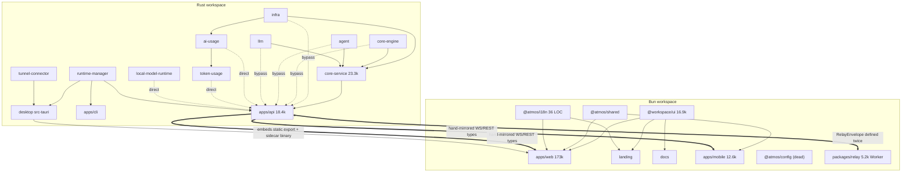

# QUALITY-004 Architecture Review

## Status

- Date: 2026-07-02
- Scope: repository-wide technical architecture — directory layout, workspace/package boundaries, inter-package dependencies, duplicated implementations, public API surfaces, and the build/test/release engineering system
- Type: audit report + improvement roadmap (no product-facing scope; backward compatibility explicitly **not** required — the monorepo is pre-release)
- Method: static analysis of the current tree (LOC counts, dependency graphs, import scans, CI workflow inventory, git churn), with every finding backed by concrete file evidence. No runtime testing performed.

## Audit Commands

```bash
# LOC per crate / package
find crates/<x> -name '*.rs' | xargs wc -l
find apps/<x> \( -name '*.ts' -o -name '*.tsx' \) -not -path '*/node_modules/*' | xargs wc -l

# Layering bypass (api importing below core-service)
rg 'use (infra|core_engine|agent|llm|ai_usage|token_usage|local_model_runtime)' apps/api/src

# Dead workspace deps
rg -c 'ai_usage|local_model_runtime' crates/core-service/src   # → 0

# Contract mirror size
awk '/pub enum WsAction/,/^}/' apps/api/src/api/ws/message.rs | rg -c '^\s+[A-Z][A-Za-z0-9]*,?$'  # → 201

# CI coverage of bun tests
rg -l 'bun test' .github/workflows/    # → no matches

# Unused shared config
rg -l '@atmos/config' apps/*/tsconfig.json packages/*/tsconfig.json   # → no matches

# Doc duplication
diff AGENTS.md CLAUDE.md               # → identical
```

---

# Part 1 · Architecture Map

## 1.1 Top-level directories

| Directory | Responsibility | Health |
|---|---|---|
| `crates/` | Rust backend layers: infra (L1) → core-engine (L2) → core-service (L3) + capability crates (agent, llm, ai-usage, token-usage, local-model-runtime, runtime-manager, tunnel-connector) | Layer story partially followed; see F-01 |
| `apps/` | Deployables: `api` (Axum server), `web` (Next.js), `desktop` (Tauri shell), `mobile` (Expo), `cli`, `docs`, `landing` | `web` is a 173k-LOC monolith; `api` is a second orchestrator |
| `packages/` | Shared TS: `ui`, `shared`, `i18n`, `config`, `relay` | `relay` is actually a deployable app; `config` is dead; `i18n` is 36 LOC |
| `resources/` | Cross-runtime manifests (`terminal-agents/builtin_agents.json`, `local-runtime/version.json`) | Healthy pattern — the only true cross-language shared artifact |
| `vendor/` | Patched `agent-client-protocol-schema` (43.7k LOC), `tokscale-core` (14.4k LOC) | Documented, intentional; ACP patch pending upstream |
| `e2e/` | Playwright harness (10 smoke specs; `tests/specs/` is empty) | Smoke-only |
| `scripts/` | Desktop sidecar, release version checks, Pages deploy, homebrew cask | Overlaps with `.agents/skills/*/scripts` for release orchestration |
| `specs/` `docs/` `agents/` | Planning specs, stable docs, agent references | 45 `AGENTS.md` files; root `AGENTS.md` ≡ `CLAUDE.md` byte-identical |
| `.agents/skills/` | 15 repo skills, four of which contain release/deploy scripts wired into `justfile` | Critical ops tooling in an agent-config directory |

## 1.2 Rust workspace (LOC measured 2026-07-02)

| Crate / app | LOC | Files | Declared role | Path deps |
|---|---:|---:|---|---|
| `crates/infra` | 8,873 | 74 | L1: DB (SeaORM), repos, disk cache | — |
| `crates/core-engine` | 11,161 | 40 | L2: PTY, Git, FS, GitHub, tmux | — |
| `crates/core-service` | 23,336 | 78 | L3: business orchestration | infra, core-engine, agent, llm, ~~ai-usage~~, ~~local-model-runtime~~ (both unused, F-08) |
| `crates/agent` | 4,483 | 15 | ACP client + AgentManager | vendored ACP schema |
| `crates/ai-usage` | 10,692 | 29 | Provider billing/subscription usage | infra |
| `crates/token-usage` | 1,395 | 5 | Local token analytics | ai-usage, vendor/tokscale-core |
| `crates/llm` | 1,583 | 9 | Remote LLM HTTP client | — |
| `crates/local-model-runtime` | 1,828 | 13 | Local model binary manager | — |
| `crates/runtime-manager` | 2,396 | 11 | Manifest, relay identity, supervisor | — |
| `crates/tunnel-connector` | 1,742 | 9 | ngrok/CF tunnel providers (ships its own axum) | — |
| `apps/api` | 18,381 | 82 | HTTP/WS entry (~11k LOC in `api/ws/`) | **all 9 crates** |
| `apps/cli` | 2,526 | 9 | Host CLI | runtime-manager |
| `apps/desktop/src-tauri` | 7,604 | 30 | Tauri shell + appshot/preview bridge | runtime-manager, tunnel-connector |

**Claimed flow:** `infra → core-engine → core-service → apps/api`.
**Observed flow:** the lower layers are clean (core-engine has zero `infra` imports; no crate cycles), but `apps/api` frequently skips core-service and drives L2 engines and capability crates directly (43 `core_service` imports vs 23 direct lower-layer imports).

## 1.3 JS/TS workspace (LOC measured 2026-07-02)

| Package / app | LOC | Files | Actual role | Consumers |
|---|---:|---:|---|---|
| `apps/web` | 173,119 | 728 | Main workbench. `features/` 131k (27 modules; canvas 17.4k, agent 15.3k, terminal 11.1k), `app-shell/` 29.8k, `shared/` 7.3k, `api/` 4.1k | — |
| `apps/mobile` | 12,640 | 127 | Expo remote client with its own WS/relay client layer | — |
| `apps/desktop` | 0 TS | — | Pure Tauri/Rust shell; embeds `apps/web` static export + `api` sidecar binary | — |
| `apps/landing` / `apps/docs` | 3,788 / 2,269 | — | Marketing / Fumadocs | — |
| `packages/ui` (`@workspace/ui`) | 16,919 | 109 | shadcn design system; granular `exports` are on-demand-capable but a root `export *` barrel defeats it (F-20) | web (~307 import sites), landing, docs |
| `packages/shared` (`@atmos/shared`) | 945 (src) | 15 | time/storage utils, terminal protocol, debug logger | web (18 files), mobile (8 files); landing declares but never imports |
| `packages/i18n` (`@atmos/i18n`) | 36 | 5 | next-intl routing/locale wiring only (messages stay per-app) | web, landing |
| `packages/config` (`@atmos/config`) | 0 TS | 2 JSON | TS config presets — **zero consumers** | none |
| `packages/relay` (`@atmos/relay`) | 5,161 | 16 | Cloudflare Worker + D1 + DO — a deployable, **zero TS imports** from any app | consumed over HTTP/WS at runtime |
| `e2e` | 1,366 | 18 | Playwright harness | — |

## 1.4 Dependency graph



## 1.5 Cross-language contract map

| Contract | Rust source of truth | TS copies | Codegen |
|---|---|---|---|
| WS envelope + **201 `WsAction`** + **22 `WsEvent`** | `apps/api/src/api/ws/message.rs` | `apps/web/.../use-websocket.ts` (~200 literals, drift confirmed), `apps/web/src/api/ws-api-types.ts`, `apps/mobile/src/api/{ws-actions,types}.ts` | **None** |
| WS/REST DTOs (~145 pub structs) | `apps/api/src/api/ws/message/*.rs`, `dto.rs` | web 33+ exported types, mobile 28; 12 overlapping type names between web and mobile | **None** |
| Terminal WS sub-protocol | `terminal_handler.rs` (8 variants) | `apps/web/src/features/terminal/types/index.ts` (8 variants) | **None** |
| Agent session WS | `agent_handler.rs` | `agent-runtime-socket.ts` | **None** |
| Relay wire envelope | `apps/api/src/relay/ingest.rs` (`RelayEnvelope`) | `packages/relay/src/server-hub.ts` (`RelayEnvelope`, same shape) | **None** |
| Relay HTTP gateway body | `apps/api/src/relay/http_gateway.rs` | `packages/relay/src/server-hub.ts` | **None** |
| Relay client URLs | issued at registration (`runtime-manager/register.rs`) | `packages/relay/src/client-session.ts` **and** re-derived in `apps/web/.../hydrate-relay-session.ts` | **None** |
| `DEFAULT_RELAY_URL` | `runtime-manager/register.rs`, `apps/cli/src/commands/computer.rs` | `apps/web/.../atmos-computer-local.ts`, `apps/mobile/src/lib/relay-url.ts` | 4 hand copies |
| Terminal agent built-ins | `include_str!` in core-service | JSON import in web + mobile | **Shared JSON** ✅ |

## 1.6 Build / test / release pipeline

- **Local:** `just` + bun workspaces + cargo. No turbo/nx. TS packages are consumed **as source** via tsconfig `paths` (no package has a build script; `bun run build:packages` is a no-op — no `@atmos/*` package defines `build`, and the filter excludes `@workspace/ui` anyway).
- **CI (15 workflows):** all path-filtered — `ci-backend` (fmt/clippy/test/build, excludes desktop crate), `ci-web`, `ci-packages` (typecheck only, lint step is an `echo`), `ci-docs`, `ci-landing`, `ci-e2e` (suite-planned Playwright matrix with gh-pages reports). **No workflow runs `bun test`** despite 67 unit test files (web 42, mobile 18, relay 7). **No workflow covers `apps/mobile` or `apps/cli` at all.** `deploy-relay.yml` deploys on push to main without running relay's tests.
- **Release:** tag-driven (`desktop-*`, `cli-*`, `local-web-runtime-*`, `local-model-runtime-*`, `deploy-web-app-*`), calendar versions, per-line version-check scripts in `scripts/release/`. Post-release `sync-r2` + `sync-homebrew-tap`. Orchestration entry (`just release-desktop`) lives under `.agents/skills/atmos-desktop-release/scripts/`.
- **Format:** `just fmt` calls `bun run prettier` but **prettier is not a dependency anywhere** (not in any package.json or bun.lock) — the command only works with a global install. No `.prettierrc`.
- **Local/CI drift:** CI clippy = `--exclude atmos-desktop --all-targets --all-features -- -D warnings`; local `just lint` = plain `cargo clippy --workspace` (includes desktop, allows warnings).

---

# Part 2 · Findings

Severity: High / Medium / Low. Fix cost: Small (≤1 day) / Medium (days) / Large (week+).

## High severity

### F-01 · `apps/api` is a second orchestration tier, not a thin entry — High / Large

- **Files:** `apps/api/src/api/ws/router/mod.rs` (993 LOC — `WsMessageService` owns `FsEngine`, `GitEngine`, `AppEngine`, `GithubEngine`, `LocalRuntimeManager`, `UsageService` directly), `router/git.rs`, `router/github.rs` (~782 LOC calling `github_engine` directly), `router/workspace_setup.rs` (749 LOC implementing the workspace-setup state machine with its own `portable-pty` dependency in `apps/api/Cargo.toml:44`).
- **Problem:** ~11k LOC of the WS layer orchestrates L2 engines and capability crates directly, so `apps/api/Cargo.toml` depends on **all 9 crates** (23 direct lower-layer imports bypassing core-service). The documented rule "handlers stay thin — call core-service" (`apps/api/AGENTS.md`) is not followed for git/github/fs/workspace-setup/local-model paths.
- **Why it matters:** business logic now has two homes; every new feature must decide (or guess) which tier owns it. Testing WS behavior requires the full API crate rather than a core-service unit. Contributors reading the layering docs get a false map. This is the single biggest driver of future maintenance drag on the backend.
- **Fix:** move git/github/fs/workspace-setup/local-model orchestration into core-service facades (`GitService`, `GithubService`, `WorkspaceSetupService`, `LocalModelService`); `apps/api` keeps only protocol parsing, auth, DTO mapping. Target end state: `apps/api/Cargo.toml` depends on `core-service` + `runtime-manager` + web-framework crates only.
- **Cost:** Large (mechanical but wide; can be done router-module by router-module).

### F-02 · No Rust↔TS contract codegen; WS protocol hand-mirrored in 3+ places with confirmed drift — High / Medium

- **Files:** `apps/api/src/api/ws/message.rs` (201 `WsAction` variants, 22 `WsEvent` variants) vs `apps/web/src/features/connection/hooks/use-websocket.ts` (~200 literals; missing `terminal_workspace_candidates`, duplicated `agent_behaviour_settings_get/update` entries), `apps/web/src/api/ws-api-types.ts`, `apps/mobile/src/api/ws-actions.ts` + `types.ts` (12 type names overlapping with web's copies). No `ts-rs`/`typeshare`/`specta`/openapi anywhere in the workspace; `apps/api/AGENTS.md` explicitly prescribes manual sync.
- **Problem:** the highest-traffic contract in the product (WebSocket-first architecture) is quadruple-maintained by hand, and drift already exists.
- **Why it matters:** every protocol change requires 3–4 coordinated edits with no compiler or CI check. As mobile grows past M1 this becomes the primary source of cross-surface bugs, and it taxes every single feature PR.
- **Fix:** generate TS from the Rust enums/DTOs (`ts-rs` or `typeshare` annotations on `WsAction`, `WsEvent`, and the `message/*.rs` DTO structs) into a `@atmos/protocol` package consumed by web **and** mobile; add a CI job that fails when generated output differs from the committed artifact. Type the `WsEvent` union on the TS side (today it's `event: string`).
- **Cost:** Medium (annotation + one generation script + CI gate; consumers migrate incrementally).

### F-03 · `apps/web` monolith with no enforced internal boundaries — High / Large

- **Files:** `apps/web/src` = 173k LOC / 728 files; `app-shell/` alone is 29.8k LOC (a second monolith beside `features/`: `CenterStage.tsx` 1,239, `header-action-controls.tsx` 1,007, `UsagePopover.tsx` 950, sidebar subtree ~7k); 37 files > 800 lines; `eslint.config.mjs` is 19 lines of stock next config with **no boundary rules**, while 268 files do cross-feature `@/features/...` imports (canvas imports agent, agent-fix, diff, editor, git).
- **Problem:** the "features own their code, shared/ after 2+ consumers" rule exists only in `AGENTS.md` prose. `app-shell/` absorbs domain logic (usage dialogs, git header widgets) that belongs to features. Git churn confirms the god files are also the hottest files (`Preview.tsx`, `use-agent-chat-session.ts`, `AgentChatPanel.tsx` top the churn list).
- **Why it matters:** hot + huge + unguarded is the recipe for merge conflicts, accidental coupling, and fear-driven changes. QUALITY-001 already fought this once (target: <1,000 lines); the structure regressed within weeks because nothing enforces it.
- **Fix:** (1) add eslint `import/no-restricted-paths` (or `boundaries` plugin) encoding the documented rules — feature→feature imports only via public barrels; (2) dissolve domain pieces of `app-shell/` into their owning features; (3) re-run the QUALITY-001 file-size pass on the current top-10 with the lint budget as a ratchet (e.g. warn >600, error >1,000).
- **Cost:** Large overall; the eslint ratchet itself is Small and should land first.

### F-04 · CI does not gate what the repo actually relies on — High / Small–Medium

- **Files:** `.github/workflows/*` (15 workflows, all path-filtered, no unified required check); zero workflows run `bun test` (67 test files: web 42 — which also lacks a `"test"` script, mobile 18, relay 7); `apps/mobile/**` and `apps/cli/**` appear in **no** CI path filter; `deploy-relay.yml` deploys without tests; desktop crate excluded from clippy/test (`--exclude atmos-desktop`); `just fmt`/`fmt-check` invoke a prettier that is not installed; local `just lint` ≠ CI clippy flags.
- **Problem:** the regression gate contributors are told to trust (`just test` runs bun+cargo) is stricter locally than anything CI enforces, and several entire surfaces (mobile, cli, relay tests, TS unit tests) can silently break on main.
- **Why it matters:** for an open-source project about to take external contributions, unreviewed surfaces rot fastest, and "CI green" not meaning "tests passed" destroys contributor trust cheaply.
- **Fix:** add a thin always-on `ci.yml` (typecheck all TS workspaces + `bun test` + conditional cargo jobs); add `apps/cli/**` to backend paths; run relay tests before deploy; add mobile typecheck+test job; either add prettier as a root devDependency with config or delete the `fmt` recipes; align `just lint` flags with CI.
- **Cost:** Small–Medium (pure workflow/config work, no product code).

### F-05 · `core-service` is a 23.3k-LOC god-crate with a fully open API surface — High / Medium

- **Files:** `crates/core-service/src` — `automation/` 7,046 LOC (`agents.rs` 1,645, `mod.rs` 1,121, `github_trigger.rs` 1,014), `review/` 3,247, plus ~20 loosely related modules; `lib.rs` re-exports ~52 service types at crate root.
- **Problem:** everything business-shaped lands here, and everything inside is public, so there is no distinction between the crate's contract and its internals. Combined with F-01, responsibility for a given behavior is genuinely ambiguous.
- **Why it matters:** compile times, review blast radius, and the inability to reason about "what is core-service's API" all degrade as this grows. It is the module most likely to slow the backend down over the next year.
- **Fix:** first narrow `lib.rs` to deliberate facades and make submodule internals `pub(crate)`; split `automation/` god-files along the existing sub-responsibilities. Defer physical crate splitting (see roadmap "not now").
- **Cost:** Medium.

## Medium severity

### F-06 · SeaORM entities leak through the transport boundary — Medium / Medium

- **Files:** `apps/api/src/api/project/handlers.rs:41-45` returns `Vec<project::Model>` directly; `apps/api/src/api/ws/message/workspace.rs:6-16` embeds `infra::db::entities::project` in WS bootstrap DTOs; `crates/infra/src/db/mod.rs` re-exports 10+ entities publicly.
- **Why it matters:** the DB schema **is** the wire format — any migration renames/reshapes the client contract implicitly, and it undermines F-02's codegen story (you can't annotate a clean DTO layer that doesn't exist).
- **Fix:** define response DTOs in `apps/api/src/api/dto.rs` (or core-service `types.rs`) with `From<Model>` impls; stop re-exporting entities from infra's root.
- **Cost:** Medium.

### F-07 · `infra` contains product/host logic; its advertised L1 modules are stubs — Medium / Small–Medium

- **Files:** `crates/infra/src/utils/system_skill_sync.rs` (821 LOC — hardcoded product skill list, GitHub raw fetch, symlink copying), `utils/atmos_cli.rs` (mutates process PATH, manages CLI install); meanwhile `queue/`, `jobs/`, `cache/` are TODO placeholders exactly matching the "L1: DB, Cache, Queue, Jobs" claim in root docs.
- **Why it matters:** the foundational crate everyone depends on carries product knowledge (skill names) and host mutation, inverting the dependency direction conceptually; the stub modules make the documented architecture misleading.
- **Fix:** move skill sync + CLI bootstrap into core-service (or a small `host-setup` module there); delete the empty stub modules and fix the docs to describe infra as "DB + repos + disk cache".
- **Cost:** Small–Medium.

### F-08 · Dead and misplaced Cargo dependencies + minimal workspace.dependencies — Medium / Small

- **Files:** `crates/core-service/Cargo.toml:7-8` declares `ai-usage` and `local-model-runtime` with **zero** source references (`rg -c 'ai_usage|local_model_runtime' crates/core-service/src` → 0). Root `Cargo.toml` defines only serde/tokio/clap in `[workspace.dependencies]`; real drift exists: `dirs` **5.x vs 6.x** split across crates, serde declared inline in 9 crates (core-service without `derive`), tokio feature sets diverge, tokscale vendored with `native-tls-vendored` against the repo's rustls preference.
- **Why it matters:** dead deps distort the mental dependency graph and rebuild graph; version drift produces duplicate compiled artifacts and eventual upgrade pain.
- **Fix:** delete the two dead deps; expand `[workspace.dependencies]` to serde, tokio, reqwest, anyhow, thiserror, uuid, chrono, tracing, dirs, sea-orm, axum and migrate crates to `workspace = true`.
- **Cost:** Small.

### F-09 · Relay protocol defined twice; relay helpers duplicated across four runtimes — Medium / Medium

- **Files:** `RelayEnvelope` in `apps/api/src/relay/ingest.rs:38-51` **and** `packages/relay/src/server-hub.ts:29-38` (same shape); `HttpRelayRequestBody`/`HttpRelayResponseBody` duplicated in `http_gateway.rs:11-23` and `server-hub.ts:40-51`; client URL derivation in `packages/relay/src/client-session.ts` **and** re-derived in `apps/web/.../hydrate-relay-session.ts:39-58`; `DEFAULT_RELAY_URL` hardcoded in 4 places (runtime-manager, cli, web, mobile); web and mobile independently implement relay URL normalization and 32-byte access-token generation.
- **Why it matters:** the relay is the product's remote-access backbone; envelope drift between Worker and daemon fails at runtime only, across a deploy boundary (Worker deploys on main push, daemon ships with releases).
- **Fix:** one schema for the envelope + gateway body (JSON Schema or the F-02 codegen), consumed by Worker TS and Rust; move URL/token helpers into `@atmos/shared`; single source for the default relay URL (e.g. a JSON in `resources/` following the terminal-agents pattern).
- **Cost:** Medium.

### F-10 · Web and mobile each own a full hand-written client layer — Medium / Medium

- **Files:** web `ws-api.ts` (944) + `use-websocket.ts` (754) + `ws-api-types.ts` (271) vs mobile `mobile-ws-client.ts` (232) + `ws-actions.ts` (185) + `types.ts` (267); 12 overlapping exported type names (`FsEntry`, `ProjectModel`, `WorkspaceModel`, `GitStatusResponse`, …); parallel reconnect state machines; `ComputerRow` duplicated between web `connection-ui-prefs.ts` and mobile `types.ts`.
- **Why it matters:** acceptable for mobile M1, but every WS feature added to mobile from here on doubles the contract surface; combined with F-02 there is no compile-time signal when the copies diverge.
- **Fix:** the F-02 `@atmos/protocol` package eliminates the type halves; keep transport implementations (zustand store vs `MobileWsClient`) surface-specific.
- **Cost:** Medium (mostly falls out of F-02).

### F-11 · Dead or unwired workspace machinery in the TS toolchain — Medium / Small

- **Files:** `packages/config` — zero consumers (no tsconfig `extends` it; apps duplicate compiler options inline, contradicting `packages/config/AGENTS.md`); root `package.json` `catalog` — zero `"catalog:"` references (apps pin versions manually: zustand `^5.0.10` vs `^5.0.14`, lucide-react `^0.563.0`/`^0.562.0`/**`^1.8.0`** in ui, motion three versions, typescript `^5` vs `~6.0.3` in mobile); `build:packages` is a no-op; landing declares `@atmos/shared` but never imports it; root `dependencies` carry `@tailwindcss/typography`/`tw-animate-css` that apps also declare themselves; `@workspace/ui` vs `@atmos/*` naming split, and `packages/AGENTS.md` documents package names that don't match `package.json`.
- **Why it matters:** each of these is small, but together they mean the workspace's stated conventions are fiction — a new contributor cannot tell which mechanism is real. Version drift (lucide major split) is already user-visible risk.
- **Fix:** pick one: wire it or delete it. Either adopt `catalog:` refs + `extends: @atmos/config/...` everywhere, or remove the catalog/config package; delete the no-op build script and unused deps; fix the AGENTS tables.
- **Cost:** Small.

### F-12 · `packages/relay` is an app wearing a package costume — Medium / Small

- **Files:** `packages/relay` — 5.2k LOC Worker with `wrangler deploy`, D1 migrations, no `exports` field, zero imports from any workspace.
- **Why it matters:** "packages = shared libraries" is the one rule that makes a monorepo navigable. The misplacement also hides that relay has its own deploy cadence and (per F-04) deploys untested.
- **Fix:** move to `apps/relay` (nothing imports it, so the move is rename + CI path filters + docs). If F-09's shared types materialize, **those** become the `packages/` citizen.
- **Cost:** Small.

### F-13 · Release orchestration split between `scripts/` and `.agents/skills/` — Medium / Small

- **Files:** `justfile:252` → `.agents/skills/atmos-desktop-release/scripts/atmos-desktop-release.mjs`; version verify/bump lives in `scripts/release/*.mjs` (used by CI); skills wrap and partially duplicate the flow for cli/local-web/web-deploy too.
- **Why it matters:** the human-facing release entry point lives in an agent-configuration directory; a contributor auditing "how do releases work" must read skill markdown to find the real scripts. Two homes will drift.
- **Fix:** move orchestration scripts to `scripts/release/`; skills become thin pointers.
- **Cost:** Small.

### F-14 · Documentation sprawl with byte-identical duplication — Medium / Small

- **Files:** 45 `AGENTS.md` files; root `AGENTS.md` ≡ `CLAUDE.md` (byte-identical, 233 lines — confirmed via `diff`); stale content already exists (`apps/desktop/AGENTS.md` documents a React `src/components/` tree that doesn't exist; `packages/AGENTS.md` lists wrong package names; root docs advertise infra Queue/Jobs/Cache that are stubs).
- **Why it matters:** agents and humans both treat these as ground truth; every stale table actively misroutes work (this audit found three instances where docs contradict the tree).
- **Fix:** make `CLAUDE.md` a one-line pointer (or symlink) to `AGENTS.md` with a CI identity check; slim nested AGENTS.md to scoped deltas; fix the three known-stale files.
- **Cost:** Small.

### F-20 · `packages/ui` defeats on-demand imports (root `export *` barrel + heavy deps in the shared graph) — Medium / Medium

- **Files:** `packages/ui/src/index.ts` (~144-LOC root barrel: ~60 named re-exports **plus** `export *` of `lucide-react`, `@dnd-kit/{core,sortable,utilities,modifiers}`, `react-resizable-panels`; `ai-elements` re-exported at lines 97–114); `packages/ui/package.json` (no `"sideEffects"` field; `lucide-react` `^1.8.0`; heavy `three`/`postprocessing`/`ai`/`streamdown` deps); `apps/web/next.config.ts:91` (only `transpilePackages: ["@pierre/diffs"]`, no `optimizePackageImports`); ~200+ files import bare `@workspace/ui`.
- **Problem:** the package is already the shadcn/Turborepo template — its wildcard `exports` (`./components/*`, `./hooks/*`, `./lib/*`) already resolves arbitrarily nested on-demand subpaths — but the root `export *` barrel pulls the whole graph into every bare import. `ai`+`streamdown` reach every consumer (incl. landing/docs) via `ai-elements` in the barrel; `three`+`postprocessing` sit in the dep graph only for `pixel-blast.tsx` (713) / `morph-surface.tsx` (692), which have **zero** consumers repo-wide; `lucide-react` is major-version-split (`^1.8.0` in ui vs `^0.562/0.563` in apps, F-11) and simultaneously `export *`-ed. No `sideEffects` flag + `"use client"` at the barrel top means `export *` disables reliable tree-shaking.
- **Why it matters:** slow dev/HMR and bloated bundles today; and the stated intent is to add more consumers of `@workspace/ui`, each of which would inherit `ai`/`three` it never uses. "All business-agnostic UI in one package" and "pay only for what you import" are the *same* solution (mainstream shadcn/MUI practice), not a trade-off — the barrel is the only thing breaking it.
- **Fix:** keep one `@workspace/ui`, no rename; make subpath imports the enforced contract (`@workspace/ui/components/...`); retire the root `export *` barrel (or slim to named-only, third-party-free, side-effect-safe); add `"sideEffects": ["**/*.css"]`; stop re-exporting third-party libs (consumers import `lucide-react`/`@dnd-kit/*`/`react-resizable-panels` directly); confine heavy tiers to their own subpaths (`components/ai/*`, `components/fx/*`) and delete the unused `three` components + deps; add `optimizePackageImports: ["@workspace/ui"]` to web/landing/docs; add eslint `no-restricted-imports` banning bare `@workspace/ui`. Unify `lucide-react` via the F-11 `catalog:` work.
- **Cost:** Medium (barrel edit + ~25-file subpath codemod — 18 dnd-kit/resizable + 7 ai-elements — plus a lucide codemod; the `sideEffects`/`optimizePackageImports`/eslint-warn guards are Small and land first).

## Low severity

### F-15 · `tunnel-connector` embeds axum — a second transport surface in a capability crate — Low / Small

`crates/tunnel-connector/Cargo.toml:9` pulls axum+ws for a desktop-only consumer. Document it as a desktop transport adapter or feature-gate the server half. (Note: tunnel-connector is *not* the relay protocol — that's `packages/relay` + `apps/api/src/relay/`.)

### F-16 · `agent_hooks` name collision across layers — Low / Small

`core-engine/src/agent_hooks/` (hook script install) vs `core-service/src/service/agent_hooks/` (session state). Rename one (`hook_installer` / `hook_sessions`).

### F-17 · `token-usage` reaches into `ai-usage` for Cursor auth only — Low / Small

`token-usage/src/cursor_sync.rs:48` calls `ai_usage::load_cursor_session_token()`. Fine today; extract a tiny shared auth util if either crate grows.

### F-18 · e2e is smoke-only; `tests/specs/` is an empty planned directory — Low / Small

10 smoke specs; the CI planner has a `specs` suite branch with zero specs behind it. Populate or prune.

### F-19 · Vendored crates need an exit plan — Low / Small

`vendor/agent-client-protocol-schema` (43.7k LOC patch for nullable ACP usage fields — tracked in root `Cargo.toml` comments) and `vendor/tokscale-core` (divergent TLS backend). Track upstream; align TLS features.

---

# Part 3 · Improvement Roadmap

Ordered for best final design; backward compatibility is not a constraint.

## Phase 0 — Truth and gates (Small, ~1–2 days total; do first)

Everything here is config/docs; zero product-code risk. It makes the repo stop lying to contributors before structural work begins.

1. CI: always-on `ci.yml` with TS typecheck + `bun test`; add `apps/cli/**` to backend paths; relay test-before-deploy; mobile typecheck+test job (F-04).
2. Delete dead machinery: core-service's unused `ai-usage`/`local-model-runtime` deps (F-08); `build:packages`; landing's unused `@atmos/shared`; either wire or remove `@atmos/config` and the root `catalog` — **recommendation: wire both** (adopt `catalog:` refs; they solve the observed version drift cheaply) (F-11).
3. Prettier: add as root devDependency with config, or delete the `fmt` recipes (F-04).
4. Docs: `CLAUDE.md` → pointer; fix the three stale AGENTS files; describe infra honestly (F-14, F-07-docs).
5. Move `packages/relay` → `apps/relay` (F-12) and release orchestration → `scripts/release/` (F-13).
6. Land the eslint feature-boundary + file-size ratchet in warn mode (F-03 step 1).
7. `packages/ui` on-demand guards (zero product-code risk): add `"sideEffects": ["**/*.css"]`; add `optimizePackageImports: ["@workspace/ui"]` to web/landing/docs; land eslint `no-restricted-imports` banning bare `@workspace/ui` in warn mode; record a First Load JS baseline for web/landing/docs (F-20 step 1).

## Phase 1 — Contract layer (Medium, ~1 week; highest ROI)

7. Annotate `WsAction`, `WsEvent`, and the `message/*.rs` DTO structs with `ts-rs`/`typeshare`; generate `@atmos/protocol`; CI diff gate (F-02).
8. Migrate web (`use-websocket.ts` union, `ws-api-types.ts`) and mobile (`ws-actions.ts`, `types.ts`) onto the generated package — fixes the known drift and F-10's type duplication in one motion.
9. Extend the same generation to the relay envelope + HTTP gateway body; move relay URL/token helpers into `@atmos/shared`; single `DEFAULT_RELAY_URL` source (F-09).

Prerequisite interlock: F-06 (entity leakage) must be fixed for the DTOs you annotate — do the `From<Model>` DTO layer as part of this phase, not after.

## Phase 2 — Backend layering (Large, incremental over weeks)

10. Router-by-router migration of `apps/api/src/api/ws/router/{git,github,workspace_setup,local_model,skills,settings}.rs` logic into core-service facades; end state: `apps/api` depends on core-service + runtime-manager only (F-01). Start with `workspace_setup.rs` (worst offender, owns a PTY dependency).
11. Relocate `system_skill_sync` and `atmos_cli` out of infra; delete stub modules (F-07).
12. Narrow `core-service/lib.rs` to facades, `pub(crate)` internals; split the three automation god-files (F-05).
13. Expand `[workspace.dependencies]`, unify `dirs`/serde/tokio/reqwest (F-08).

## Phase 3 — Frontend structure (Large, continuous)

14. Promote the Phase-0 boundary lint from warn to error; dissolve `app-shell/` domain widgets into owning features (F-03).
15. QUALITY-001-style pass on the current >1,000-line top-10, prioritized by churn (`Preview.tsx`, `use-agent-chat-session.ts`, `AtmosComputerSection.tsx`, `CenterStage.tsx`).
16. `packages/ui` barrel diet + tier isolation (F-20): drop third-party `export *` and repoint the ~18 dnd-kit/resizable + 7 ai-elements consumers to subpaths; move `ai-elements` → `components/ai/`; delete unused `three` components + deps (or relocate under `components/fx/` if a consumer surfaces); codemod remaining bare `@workspace/ui` imports to subpaths; flip the bare-barrel eslint rule from warn to error. Unify `lucide-react` version alongside the Phase-0 `catalog:` adoption (F-11).

## Explicitly not now

- **Splitting `core-service` into multiple crates** — module-level cleanup (F-05) first; premature crate splits harden today's wrong boundaries. Revisit after Phase 2 shows where the real seams are.
- **Renaming `@workspace/ui` → `@atmos/ui`** — ~307 import sites of churn for zero behavior; only worth batching with some future UI-package restructuring. The F-20 on-demand refactor deliberately keeps the name and only changes the *contract* (subpaths over barrel).
- **Adopting turbo/nx** — the workspace is small enough that bun filters + a correct `ci.yml` suffice; a task graph adds config weight before Phase 0/1 fix the actual gaps. Reconsider if CI wall-time becomes the bottleneck.
- **Unifying web+mobile UI layers** — mobile's isolation (native controls, no `@workspace/ui`) is a deliberate, documented choice; only the *contract* layer should be shared (Phase 1).
- **Rewriting the relay Worker in Rust / merging with tunnel-connector** — they solve different problems (public rendezvous vs local tunnels); shared types (Phase 1) are the right coupling, not shared code.
- **Un-vendoring ACP now** — blocked on upstream accepting nullable usage fields; keep the patch and the tracking comment.

## Risks

- Phase 2 moves live WS behavior; each router migration must keep the existing `cargo test --workspace` + e2e smoke green and ship separately.
- Codegen (Phase 1) changes TS type names/locations; land the generated package alongside the old types first, migrate imports, then delete.
- CI additions (Phase 0) will surface currently-failing tests on uncovered surfaces (mobile, relay); triage failures rather than skipping them.

## Follow-ups

- After Phase 1, update `apps/api/AGENTS.md` (remove "manually sync DTOs" instruction) and `apps/web/AGENTS.md` / `apps/mobile/AGENTS.md` to point at `@atmos/protocol`.
- After Phase 2, update root `AGENTS.md` layer table and `crates/AGENTS.md`.
- Consider a `cargo deny` / `knip`-style dependency audit in CI once Phase 0 lands, to prevent F-08/F-11 recurring.
