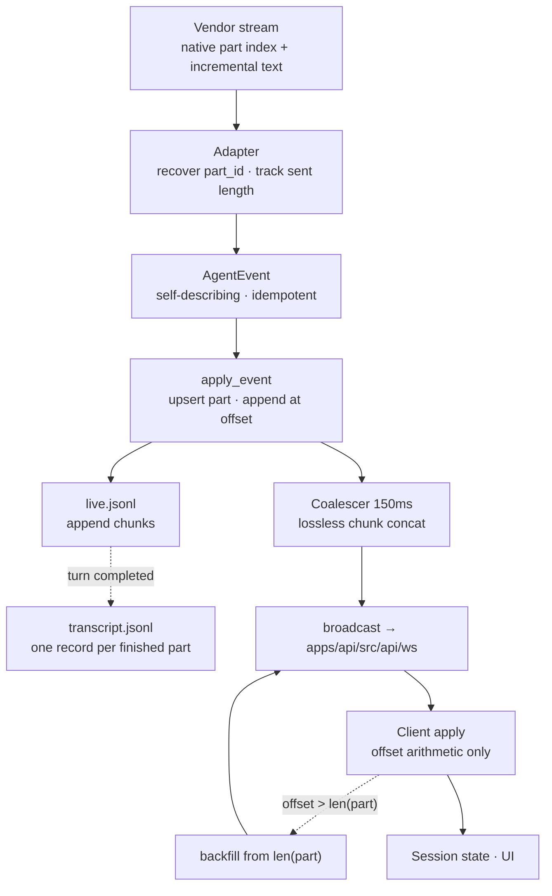

# TECH · QUALITY-006: Idempotent Agent Chat Event Model

> Technical Design · HOW. Ground-up redesign of the Agent Chat event pipeline.
> Supersedes the incremental patch plan in this file's first revision.
> Continues [APP-067](../APP-067_atmos_agent_abs/TECH.md) and [APP-068](../APP-068_agent_chat_arch_optimize/PRD.md).

## Scope summary

Every message-duplication and text-corruption defect in Agent Chat traces to one architectural fact: **the same truth has two representations.** The transcript stores periodic full-text snapshots; the wire sends deltas. Because the two shapes differ, two independent fold implementations exist, neither can tell new content from already-seen content, and both compensate by guessing from string contents.

This design removes the guessing by removing its cause. The governing invariant:

> **Every event is idempotent by construction.** Delivering it twice, out of order, or after a process restart produces the same state.

Once that holds, the client does not deduplicate, because there is nothing to deduplicate. Event sequencing degrades from a correctness mechanism to a bandwidth optimization.

The design rests on three moves:

1. **Text is append-only, addressed by byte offset within a part.** Offsets are content-derived, so they cannot rewind on crash, and repeated chunks are arithmetically identifiable.
2. **Non-text state is a versioned upsert keyed by its natural id, with a monotonic status lattice.** Late or replayed events cannot regress state.
3. **The transcript stores the same events it transmits.** One representation, one fold function, O(n) bytes instead of O(n²).

**Governing constraint: no backward compatibility.** The product has no users and local chat data is disposable, so every shape changes in place. No dual-shape period, no read-side fallback, no version field, no conversion script — code that exists only to tolerate a previous shape is a defect. See Dependencies.

Out of scope: streaming tool-call arguments (no provider sends partial JSON — see Provider reality), moving the transcript to SQLite, and the `/fork` `/rewind` target model, which keys on `checkpoint_id` and is unaffected.

## Why the current model cannot be patched into correctness

### The dual representation

```258:270:crates/core-service/src/service/agent_chat/apply_event.rs
                store.append_record(
                    chat_id,
                    &TranscriptEnvelope::new(
                        turn_id,
                        TranscriptEvent::AssistantSnapshot {
                            message_id: message_id.clone(),
                            text,
```

`text` here is the whole accumulated buffer, appended every 100 ms, while the wire carries `AssistantMessageDelta { delta }`. Three consequences follow mechanically.

**Two fold implementations that must agree and don't.** Rust folds snapshots (`store.rs`), TypeScript folds deltas (`agent-chat-events.ts`). Each has independently grown its own duplicate-id suffix workaround — `push_unique_message` (`types.rs` L1066–1070) and the `:N` / `userBetween` branch (`agent-chat-events.ts` L313–321). That divergence is the drift, already observable.

**Guessing is forced on every consumer.** Given a payload, nothing states whether it is new content or a snapshot containing old content, so both layers infer it from text:

```174:180:apps/web/src/features/agent/lib/agent-chat-events.ts
function mergeStreamDelta(existing: string, delta: string): string {
  if (delta === existing) return existing;
  if (delta.startsWith(existing)) return delta;
  return `${existing}${delta}`;
}
```

Line 3 drops genuinely repeated content: `"hello"` then `"hello"` renders `"hello"`. The same inference exists server-side at `types.rs` L1185–1191.

**O(n²) persistence.** A 10 KB answer streamed over 20 s writes ~200 snapshots averaging 5 KB, roughly 1 MB of disk for 10 KB of content.

### The disease is not text-specific

```25:53:apps/web/src/features/agent/lib/agent-chat-events.ts
function mergeToolPart(
  existing: Extract<AgentPart, { type: "tool_call" }>,
  incoming: Extract<AgentPart, { type: "tool_call" }>,
): Extract<AgentPart, { type: "tool_call" }> {
  return {
    // ...
    name:
      isGenericToolLabel(incoming.name) && existing.name
        ? existing.name
        : incoming.name || existing.name,
    kind: incoming.kind === "other" && existing.kind !== "other" ? existing.kind : incoming.kind,
    status: incoming.status ?? existing.status,
```

The same pathology in a different type: a pile of "which of these two values looks less like a placeholder" heuristics, because the protocol permits sending placeholders. And `status: incoming.status ?? existing.status` is unguarded last-write-wins — a replayed or reordered `running` regresses a `completed` tool back to running.

### And it reaches the optimistic user echo too

```79:86:apps/web/src/features/agent/lib/agent-chat-pending-echo.ts
  for (let index = messages.length - 1; index >= 0; index -= 1) {
    const item = messages[index];
    if (!item || !isPendingUserEcho(item)) continue;
    if (incomingText && echoText(item) !== incomingText) continue;
    pendingIndex = index;
    break;
  }
```

A `pending:`-prefixed optimistic row is matched to its persisted counterpart by string equality, so sending the same prompt twice in a row can settle the wrong echo. Third location, same pathology: an identity question answered by comparing content.

### Why patching is not enough

Adding `epoch` and a replay floor on top of this, as the first revision of this doc proposed, hardens the deduplication layer while leaving every guess in place. It manages symptoms.

## Provider reality

Audited across all six adapter families in `crates/agent/src/providers/`. This determines feasibility, so it is recorded here rather than assumed.

| Provider | Primary text path | Adapter already tracks sent length | Native part index (currently discarded) | Genuine text revision |
|----------|-------------------|-----------------------------------|----------------------------------------|----------------------|
| Claude | `content_block_delta` → `text_delta` / `thinking_delta`, **incremental** | No (`streamed_assistant: bool` only) | **`event.index`** | No evidence |
| Codex | `item/agentMessage/delta`, `item/reasoning/*Delta`, **incremental** | No | **`summaryIndex`** | No evidence |
| OpenCode | `message.part.delta`, **incremental** | **Yes** — `assistant_text` / `thinking_text` maps | **`partID`** | Yes — shorter snapshot |
| Pi | `text_delta` / `thinking_delta`, **incremental** | Partial — `text_by_index` | **`contentIndex`** | Yes — `text_end` overwrite |
| Grok (native) | ACP `AgentMessageChunk`, **incremental** | No | None | No evidence |
| ACP (cursor / gemini / droid / …) | `AgentMessageChunk`, `AgentThoughtChunk`, **incremental** | No | None | No evidence |

Three findings drive the design:

**Append-only is the native shape everywhere.** Every provider's primary path already emits incremental fragments. Append-only normalization is not a translation layer fighting the vendors; it is what the vendors already do, currently being flattened into a lossier shape.

**Part identity already exists upstream and is thrown away.** Four of six families expose a stable per-block index that the adapter reads for routing at most, and never forwards. `part_id` is recovered, not invented. OpenCode's `partID` is directly usable; `event_map.rs` L41–47 already maintains per-message sent text, so byte offsets there are nearly free.

**Tool arguments are never streamed.** Claude, Codex, OpenCode, and Pi deliver complete argument JSON in one event; ACP and Grok send object-level patches merged by `merge_json_values` (`acp/tool_map.rs` L131–133). No provider streams partial JSON, so the offset model must **not** be extended to tool params. Tool state uses the versioned-upsert model instead.

The snapshot fallback paths that exist today (Claude's `assistant` frame, Codex `item/completed`, Pi `message_end`, ACP Think-tool fold) are not obstacles: under append-only they are simply a part that receives its entire content as one chunk at offset 0, which is a legal append.

## Architecture overview



Identity is a single tree, with no parallel coordinate systems:

```
chat_id
└── turn_id
    └── message_id
        └── part_id          (parts nest via parent_part_id)
            └── byte offset  (text parts only)
```

`revision` exists alongside this purely as a resume hint. It carries no correctness weight, so there is no `epoch`, no `runtime_id`, and no replay floor.

## Module-by-module design

### crates/agent

`src/contract/event.rs` — the text contract collapses to one event plus a terminator:

```rust
/// Self-describing on purpose. Carrying part metadata on every chunk is what
/// makes application order-independent: a chunk for an unknown part creates it,
/// so no earlier event is a prerequisite. After coalescing this costs ~40 bytes
/// at ≤7 events/sec/stream.
TextChunk {
    part_id: String,
    message_id: String,
    parent_part_id: Option<String>,
    ordinal: u32,
    kind: TextKind,          // Answer | Thinking
    offset: u64,             // byte offset of `text` within this part
    text: String,            // must start and end on a char boundary
},
PartClosed {
    part_id: String,
    duration_ms: Option<u64>,
},
```

`AssistantMessageDelta`, `AssistantMessageCompleted`, `ThinkingDelta`, and `ThinkingCompleted` are deleted. There is no `Append` / `Replace` mode: **a part's text only ever grows.** A provider that genuinely revises emits `PartClosed` followed by chunks for a new `part_id`.

Each adapter gains a `HashMap<String, u64>` of bytes already emitted per part, and derives `part_id` from the vendor's own index:

| Provider | `part_id` derivation | Work required |
|----------|---------------------|---------------|
| OpenCode | vendor `partID` verbatim | Re-key the existing sent-text maps from `message_id` to `partID` |
| Claude | `{message_id}:{event.index}` | **Start consuming `event.index`** (`claude/event_map.rs` L205–253) |
| Codex | `{itemId}` / `{itemId}:{summaryIndex}` | Add per-item offset counter |
| Pi | `{messageId}:{contentIndex}` | Reuse `text_by_index` as the offset source |
| Grok / ACP | `{message_id}:{ordinal}` synthesized | Add counter; no vendor index available |

OpenCode's shorter-snapshot case (`opencode/event_map.rs` L372–377) and Pi's `text_end` overwrite stop being silently discarded and become an explicit `PartClosed` + new part. That is the only behavior change visible to users, and it surfaces a revision that is currently swallowed.

**Adapter-synthesized content must be counted into the offset.** Adapters sometimes inject text the vendor never sent, for presentation. Codex emits a `"\n\n"` separator when the reasoning part changes (`codex/event_map.rs`), and the snapshot-fallback paths synthesize a whole part body. Any such byte **must** advance the adapter's per-part counter, or every subsequent offset in that part is wrong and the client will see a permanent false gap. This is the single most likely way to get M1 subtly wrong, so each adapter's fixture test must assert that the final reassembled part text equals the concatenation of its emitted chunks at their stated offsets.

### crates/core-service

`src/service/agent_chat/apply_event.rs`

- `TextChunk` handling is an upsert plus an append: look up `part_id`, create it from the chunk's own metadata if absent, then apply the offset rules below. The `text_stream_key` composite and its `\u{1e}` separator (L40–54) are deleted, because `part_id` is already unique and nesting is expressed by `parent_part_id`.
- `state.assistant_text` / `state.thinking_text` (`HashMap<streamKey, (turn, String, parent)>`) collapse into one `HashMap<PartId, Part>`.
- `apply_assistant_text_part_nested` (`types.rs` L1145–1232) is deleted outright — the reverse scan, the chrome skipping, the `break` guard, and the `same_block` prefix test all exist only to guess a position that `part_id` now states.
- Thinking timing is unchanged in mechanism: `mark_thinking` / `close_thinking` (L116–147) still derive `thinking_ms` from host wall clock at **apply** time, and it still travels to the client on the part-closing event. The coalescer sits strictly at the **emit** stage so per-chunk arrival times stay true, which preserves the Droid ACP workaround at L120–122 for the same reason it works today.
- `overlay_live_state` (L1623–1657) becomes trivial: live parts and durable parts are the same shape, so the overlay is a map merge instead of a text splice. Its `last_event_seq` juggling disappears.

`src/service/agent_chat/store.rs` — the transcript splits in two, so the durable file stays append-only while total bytes stay O(n):

| File | Contents | Lifecycle |
|------|----------|-----------|
| `transcript.jsonl` | One record per **finished** part, plus turn and tool records | Append-only, never rewritten |
| `live.jsonl` | `TextChunk` records for the **in-flight turn** only | Truncated when the turn completes |

On `TurnCompleted`, live chunks are materialized into per-part records appended to `transcript.jsonl`, then `live.jsonl` is truncated. Turn boundaries are the natural compaction point: a completed turn never changes again, except via rewind, which discards whole turns anyway. Crash recovery replays `live.jsonl` to rebuild the partial turn. `AssistantSnapshot` and `ThinkingSnapshot` are deleted from `TranscriptEvent`.

`src/service/agent_chat/service.rs`

- `pump_session` (L1868+) becomes a `tokio::select!` over `session.next_event()` and a `tokio::time::interval(150ms)` flush tick. Coalescing two adjacent chunks is lossless concatenation — `(p, 0, "ab")` + `(p, 2, "cd")` → `(p, 0, "abcd")` — so unlike the first revision of this design there is no semantic reconciliation to reason about. Must be timer-driven, not piggybacked on the next chunk, or a provider pausing mid-sentence leaves buffered text unsent.
- `recent_events` no longer retains text. Backfill reads materialized part text directly, because for an append-only part **the state is the log** — a suffix of the current text is exactly the set of chunks the client is missing. `RECENT_EVENT_CAP` and its silent-overflow failure mode disappear for the dominant event class.
- `events_after` keeps a small ring for non-text events, where replay is cheap and idempotent by construction.

### apps/api

`src/api/ws/router/agent_chat.rs` — `handle_agent_chat_subscribe` (L169–192) takes `since_revision` as a best-effort hint. Sending more than the client needs is harmless, so there is no gap signal and no forced rehydrate. One new action handles precise recovery.

`src/api/ws/router/mod.rs` — the broadcast-lag path (L250–300) no longer needs sequence-range replay for text; a lagged connection requests per-part backfill.

### packages/api-types

`src/ws/dto/agent-chat.ts` — `AgentChatPayload`'s `assistant_message_delta`, `assistant_message_completed`, `thinking_delta`, `thinking_completed` members are replaced by `text_chunk` and `part_closed`. `AgentChatEvent` swaps `sequence` for `revision`. `MessagePart` becomes `Part` (see Data model). One new `WsAction`, `agent_chat_backfill`, needs a Rust enum variant, a handler, an extract-catalog entry, and a `WsContract` row in the same PR per [packages/api-types/AGENTS.md](../../../packages/api-types/AGENTS.md).

### The fold ships once, as a shared package

**Requirement, not a preference.** The TypeScript fold has three consumers — `apps/web`, `apps/mobile`, `apps/desktop-electron` — and the Rust host fold is a fourth implementation of the same rules. Today two of them have independently grown the same duplicate-id workaround, which is drift that already happened.

M1 extracts the fold into one module exported from `@atmos/api-client` (it is transport-adjacent, pure, and already a dependency of every TS consumer), and the Rust host fold is pinned to it by a shared fixture corpus: the same event sequence, the same expected `Part` map, asserted on both sides. An earlier draft of this doc argued that an idempotent event model makes the fold trivial enough that duplicating it is harmless. That reasoning is a gamble on future discipline and is withdrawn — the model makes the fold small, which is the reason sharing it is now cheap, not a reason to skip it.

### apps/web

`src/features/agent/lib/agent-chat-events.ts` — the entire heuristic layer is deleted: `mergeStreamDelta`, `mergeGrowingText`, `appendTextPart`'s reverse scan, `isStreamChromePart`, `nthTextPartIndex`, `mergeSameIdMessages`, and `dedupeAgentMessages` with its `:N` and `userBetween` branches. What replaces it is the whole fold for text:

```ts
// Reducer over a draft. The caller owns immutability — see Client commit cadence.
function applyTextChunk(draft: PartStore, e: TextChunk): BackfillRequest | null {
  const part = draft.parts.get(e.part_id) ?? draft.createPart(e);
  const len = byteLength(part.text);
  if (e.offset > len) return { partId: e.part_id, fromOffset: len }; // precise gap
  const skip = len - e.offset;
  if (skip >= byteLength(e.text)) return null;                       // already have it
  draft.appendText(part, sliceBytes(e.text, skip));
  return null;
}
```

There is no branch on content, no comparison against previous text, and no dedupe pass. `"hello"` at offset 0 and `"hello"` at offset 5 both apply, because identity comes from arithmetic rather than from the bytes.

`src/features/agent/hooks/use-agent-chat-session.ts` — the `sequence <= lastSeq` gate (L961–966) is deleted; idempotent application makes it unnecessary. `hydrateAgentChatMessages` stops filtering by sequence. `keepPendingUserEchoes` stays, since optimistic user rows are a separate concern.

`streaming` is derived from `part.closed_at == null` rather than stored. The `setBusy(true)` workaround for content arriving after a premature `turn_completed` (L962–967) becomes unnecessary, because a turn's live-ness is a function of whether its parts are closed rather than separate state that can disagree.

### Client commit cadence

Server-side coalescing bounds **bandwidth**; it does not bound **render cost**, and the first revision of this doc wrongly treated 150 ms as a purely transport-side concern. Two rules close that gap.

**Applied events do not render directly.** Incoming events accumulate in a buffer that flushes to React state on a timer, so the render rate is capped independently of the event rate. Without this, a burst of non-text events — tool state transitions during a fast tool loop, which server-side text coalescing does nothing about — still produces a render per event.

**Every high-frequency event kind must be routed onto the batched schedule.** The failure mode here is specific and worth naming: a single event kind that forgets to mark the buffer dirty falls back to immediate flushing, and the render rate silently becomes the provider's chunk rate. This design is structurally resistant to that particular bug because answer text and thinking text are the *same* event (`TextChunk` with a `kind` field) rather than two variants that must each remember to set the same flags — but tool and activity events are still separate kinds, so the classification needs a test rather than good intentions.

**Immutability strategy must be explicit.** `part.text += chunk` is a mutation; applying it through a naive immutable spread copies the whole message tree per commit. Parts live in a keyed store where appending to one part's text does not rebuild its siblings, and only the touched parts' identities change so that memoized rows re-render selectively. A deep clone per event is viable only under aggressive coalescing and is not the plan here.

## Data model

```rust
// crates/agent/src/contract/event.rs
pub enum TextKind { Answer, Thinking }

// crates/core-service/src/service/agent_chat/types.rs
pub struct Part {
    pub id: String,
    pub message_id: String,
    pub parent_part_id: Option<String>,
    /// Assigned by the host at part creation, monotonic within `message_id`
    /// across **all** part kinds, in arrival order. Renderers sort by it.
    /// Interleaving is therefore a single sequence — thinking, answer text, and
    /// tool calls share one ordinal space, so no anchor structure is needed to
    /// relate them.
    pub ordinal: u32,
    pub body: PartBody,
    /// None while the part may still grow. Derives `streaming` for the UI.
    /// Closed by `PartClosed`, by turn settlement, or by runtime teardown —
    /// see Part lifecycle.
    pub closed_at: Option<DateTime<Utc>>,
}

pub enum PartBody {
    Text { kind: TextKind, text: String },
    ToolCall(ToolCallState),
    Plan { plan: serde_json::Value },
    Attachment { path: String, name: Option<String> },
    Error { message: String },
    SessionChrome(SessionChrome),
}
```

Tool state replaces placeholder-guessing with a lattice and an honest optional:

```rust
/// Monotonic. A merge rejects any incoming status of lower rank, so a replayed
/// or reordered `Running` can never regress a `Completed` tool.
#[derive(PartialOrd, Ord, PartialEq, Eq)]
pub enum ToolStatus { Pending, Running, Completed, Failed }

pub struct ToolCallState {
    pub tool_call_id: String,
    pub status: ToolStatus,
    /// `None` means "no opinion, keep what you have". Senders must never put a
    /// placeholder here — that convention is what `isGenericToolLabel`,
    /// `isPlaceholderToolParams`, `isPlaceholderToolResult`, and the
    /// `kind == "other"` test in mergeToolPart currently exist to undo.
    pub name: Option<String>,
    pub title: Option<String>,
    pub kind: Option<AgentToolKind>,
    pub params: Option<AgentToolParams>,
    pub result: Option<AgentToolResult>,
}
```

Transcript records, with snapshots gone:

```rust
pub enum TranscriptEvent {
    TurnStarted,
    UserMessage { message_id, kind, text, attachments },
    UserCheckpoint { checkpoint_id },     // unchanged — vendor rewind handle
    /// live.jsonl only, for the in-flight turn.
    TextChunk { part_id, message_id, parent_part_id, ordinal, kind, offset, text },
    /// transcript.jsonl, written once when the part closes.
    PartFinished { part_id, message_id, parent_part_id, ordinal, kind, text, duration_ms },
    ToolCall { tool: ToolCallState },
    Plan { plan },
    Permission { request },
    TurnCompleted { status, error, worked_ms, thinking_ms, usage },
    Usage { usage },
    SessionChrome { part_id, chrome: SessionChrome },
}
```

`TranscriptEvent::Unknown { event_type, payload }` is deleted. It exists to tolerate records written by a different build; the product has no users and local chat data is disposable, so an unreadable record is a bug to fix rather than a state to carry forward.

## Part lifecycle and turn edge cases

Deriving `streaming` from `closed_at` only works if every path that ends a stream closes its parts. These rules are normative.

**Closing.** A part closes on its own `PartClosed`, on turn settlement (`TurnCompleted` closes every part of that turn), or on runtime teardown (a detached or crashed runtime closes every open part of its chat on the next load). A part is never closed by the arrival of a different part — that positional coupling is what forces a fold to maintain pairwise "close the other kinds" rules for every event type, and it is the cost this design is paying `part_id` to avoid.

**Turns the provider starts on its own.** Codex goal continuation and Claude Code re-entry after a backgrounded command begin a turn with no user message. A chunk whose `turn_id` has no turn row must **create** the turn rather than be dropped, or the work streams into nothing. The identity tree does not assume a turn originates from a user send.

**Replies that end while background work continues.** A provider can finish its visible reply while work it will later wake the session for is still running. Closing the turn would strand that work; leaving the parts open shows a false spinner forever. The turn therefore has a parked state: its parts close, its status stops being "working", and the turn row stays open for the wake. This is the situation the current `setBusy(true)` workaround (`use-agent-chat-session.ts` L962–967) is approximating.

**Conversation-scoped events bypass turn gating.** Usage, goal, title, and available-command updates apply regardless of whether a turn is open. Gating them behind "is a turn accepting output" silently drops them, and they are precisely the events that arrive between turns.

## Transport

Every event is self-describing and idempotent:

```ts
{
  chat_id: string;
  revision: number;      // resume hint only; carries no correctness weight
  event_id: string;
  turn_id?: string | null;
  payload:
    | { type: "text_chunk"; part_id: string; message_id: string;
        parent_part_id?: string | null; ordinal: number;
        kind: "answer" | "thinking"; offset: number; text: string }
    | { type: "part_closed"; part_id: string; duration_ms?: number | null }
    | { type: "tool_call_state"; /* ToolCallState, optional fields omitted when absent */ }
    // …turn / permission / chrome events, all keyed by natural id
}
```

Precise recovery replaces wholesale rehydration:

```ts
// agent_chat_backfill
// request
{ chat_id: string; parts: Array<{ part_id: string; from_offset: number }> }
// response — server streams the missing suffixes as ordinary text_chunk events
{ accepted: number }
```

The complete client contract is four arithmetic rules per text chunk and one rank comparison per tool event:

1. `offset > len(part)` → a gap exists; request backfill from `len(part)`.
2. `offset + len(text) <= len(part)` → already applied; ignore.
3. `offset < len(part)` → overlapping; append only the tail beyond `len(part)`.
4. `offset == len(part)` → append.

Rule 2 is what makes `epoch` unnecessary. A restarted runtime that replays a part from offset 0 is a no-op, whereas a rewound counter causes valid events to be dropped. Offsets are derived from content; counters are not.

## Alternatives considered

Three designs were weighed and rejected. Each is simpler than this one in some dimension, so the reasons are recorded to keep them from being reintroduced as "simplifications".

**Ordered exactly-once delivery with positional folding.** Stamp each event with `{ runtime_id, epoch, sequence }`, guarantee strictly-ordered exactly-once application, and then carry no content identity at all: a text event is a bare string, and the fold appends to the last message if it is an assistant message still marked streaming, otherwise starts a new one. This is correct — under an exactly-once in-order guarantee, position *is* identity and `part_id` is redundant — and it makes events dramatically smaller.

Rejected for two reasons specific to Atmos. Positional identity forces message ids to be generated on the receiving side, so two clients viewing one session name the same assistant message differently; Atmos needs globally consistent ids for `host_session_search` and `?mid=` deep links. And positional folding pays for its small events with pairwise interaction rules: every event kind must remember to close every other kind's open state, which is O(kinds²) coupling and is the same fight `flush_open_thinking` is losing today. `part_id` buys that away.

**A bigger replay buffer instead of precise backfill.** Tuning `RECENT_EVENT_CAP` upward, or coalescing hard enough that overflow becomes unlikely, both reduce the probability of a silent gap without making it impossible. A bounded ring that evicts from the front with no floor tracking is an easy structure to arrive at and an easy one to reason about wrongly — the client cannot distinguish "nothing was missed" from "the oldest events are gone", which is exactly why M4 replaces range replay with a per-part offset request. Do not re-simplify this into a size constant.

**Persisting only the projection, with no durable event log.** Storing one row per message plus a blob for turn and activity structure removes the dual-representation problem more cheaply than M2's two-file split, and makes session listing a scan over narrow rows. Rejected because a fold bug then has no history to be corrected against, and because turn-granular history is what makes `/rewind` truncation straightforward. M2 keeps the log and bounds its size by compacting at turn boundaries instead.

## Rollout plan

**M1 is atomic and large.** It changes the wire in both Rust and TypeScript, so it cannot be split into separately shippable halves without a translation shim that this design explicitly declines to build. Its internal file groups are listed so review can proceed in slices, but it lands as one change.

1. **M1 · Part model end-to-end** — `crates/agent` contract; all six adapter families with recovered `part_id` and per-part offsets, including synthesized bytes counted into offsets; `apply_event` upsert; part lifecycle rules; `api-types` DTO; the shared fold extracted to `@atmos/api-client` and consumed by web, mobile, and desktop-electron. Deletes `mergeStreamDelta`, `mergeGrowingText`, `apply_assistant_text_part_nested`, `text_stream_key`, `dedupeAgentMessages`, `nthTextPartIndex`, `push_unique_message`, and the `sequence` gate. Each adapter is provable independently first: `crates/agent/src/providers/*/testdata/*.jsonl` fixtures already replay real vendor streams, so per-provider equivalence — and offset/chunk consistency — is checkable before the client is wired.
2. **M2 · Log equals wire** — `live.jsonl` + `transcript.jsonl` split, `PartFinished` compaction at turn boundaries, deletion of `AssistantSnapshot` / `ThinkingSnapshot`. Turns persistence from O(n²) to O(n) and removes the second fold input shape.
3. **M3 · Non-text idempotency** — `ToolStatus` lattice, optional-not-placeholder convention, deletion of `mergeToolPart`'s heuristics and their `isGeneric*` / `isPlaceholder*` helpers. Also fixes the optimistic user echo: the server echoes the client-supplied pending id on the persisted user message so the row reconciles by id, and `settlePendingUserMessage`'s text comparison is deleted.
4. **M4 · Precise backfill** — `agent_chat_backfill` action, text removed from `recent_events`, `since_revision` demoted to a hint.
5. **M5 · Commit cadence** — 150 ms server flush with forced flush on turn-terminal and tool-boundary events, plus the client commit buffer and the test that every high-frequency event kind lands on the batched schedule. Orthogonal to correctness, safe to ship any time after M1.

## Risks & tradeoffs

- **Risk: M1 is a big-bang change across four layers.** Accepted deliberately: the product has no users, so the optimal shape is worth more than a staged one, and no compatibility layer is written to soften it. Mitigation is the adapter fixture corpus — every provider's real stream can be replayed and diffed before the client changes.
- **Tradeoff: per-chunk metadata redundancy.** `TextChunk` repeats `message_id`, `ordinal`, and `kind` on every chunk instead of carrying them once on a part-opened event. Chosen because self-describing events are what make order-independence real — a chunk never depends on an earlier event having survived. After M5's coalescing the overhead is roughly 40 bytes at ≤7 events/sec/stream.
- **Constraint: chunks must be char-aligned.** Rust `String` concatenation requires valid UTF-8, so adapters must not split a multi-byte character across chunks. Offsets remain byte offsets; the alternative — byte arrays decoded only at render — is more invasive for no product gain.
- **Behavior change: Claude multi-block answers.** Consuming `event.index` means multiple content blocks become multiple parts instead of collapsing into one. This is a rendering change, and arguably the fix for a latent defect, but it should be eyeballed before ship.
- **Behavior change: provider text revision becomes visible.** OpenCode's shorter snapshots and Pi's `text_end` overwrites are silently dropped today; they will now close a part and open a new one. Surfacing a real revision is correct, but confirm the UI renders consecutive parts without a visual seam.
- **Risk: an adapter forgets to count synthesized bytes into its offset.** Every subsequent chunk in that part then reports a false gap, and the client backfills in a loop. Mitigation is the per-adapter fixture assertion that reassembled text equals the concatenation of emitted chunks at their offsets; this is the highest-value test in M1.
- **Risk: render cost is not bounded by server coalescing alone.** Non-text event bursts bypass text coalescing entirely. Mitigated by the client commit buffer in M5, with an explicit test that each high-frequency kind marks the buffer rather than flushing immediately: a single unmarked kind is enough to make the render rate equal the provider's chunk rate.
- **Risk: compaction crash window.** A crash between appending `PartFinished` records and truncating `live.jsonl` would replay already-materialized chunks. Harmless by construction — rule 2 ignores contained chunks — which is a direct dividend of the idempotency invariant.
- **Tradeoff: no `epoch`, no `runtime_id`, no replay floor.** All three become unnecessary rather than being rejected on their merits. Note that `connectionEpoch` from [APP-035](../APP-035_tanstack-query-data-layer/PRD.md) is an unrelated Query-cache generation for Computer switching.
- **Rollback path**: git revert per milestone, plus `rm -rf ~/.atmos/data/agent-chat` when the on-disk layout is involved. No reverse migration is written.

## Dependencies

- Builds on [APP-067](../APP-067_atmos_agent_abs/TECH.md) (persistence and reconnect model) and [APP-068](../APP-068_agent_chat_arch_optimize/reference/events.md) (`AgentEventEnvelope`, adapter boundary).
- **No backward compatibility is written anywhere.** The product has no users and local chat data is disposable, so the wire, the jsonl layout, and every in-memory shape change in place. There is no dual-shape period, no read-side fallback for old records, no version field, and no conversion script. Existing local chats are discarded with `rm -rf ~/.atmos/data/agent-chat`. Any code whose only purpose is tolerating a previous shape is a defect in this spec's implementation.
- `message_id` **values** stay as they are — not for continuity, but because `part_id` already answers the identity question that reformatting them would have addressed, and because a mid-turn `message_id` change is load-bearing when a provider opens a new prose block after tools. `host_session_search` (`crates/core-service/src/service/host_session/search.rs` L54–79) therefore needs no change, and append-only parts additionally make incremental indexing possible, which the current full-recompute path cannot do.
- `/rewind` and `/fork` are unaffected: they resolve targets through `checkpoint_id` plus provider-side turn maps (`service.rs` L2201–2225, `crates/agent/src/providers/claude/mod.rs` L440–451), never through `message_id` or part identity.
- `apps/mobile` and `apps/desktop-electron` both consume `agent_chat_event` and need the same client fold replacement in M1.
- No DB migration.

## Audit commands

No heuristic merging or positional guessing may survive M1 and M3:

```bash
rg -n 'mergeStreamDelta|mergeGrowingText|nthTextPartIndex|isStreamChromePart' apps/web/src
rg -n 'isGenericToolLabel|isPlaceholderToolParams|isPlaceholderToolResult' apps/web/src
rg -n 'userBetween|:dup|dedupeAgentMessages' apps/web/src/features/agent
rg -n 'echoText\(item\) !== incomingText' apps/web/src/features/agent
rg -n 'text_stream_key|apply_assistant_text_part_nested|push_unique_message' crates/core-service/src
rg -n 'AssistantSnapshot|ThinkingSnapshot' crates/core-service/src
```

The fold must exist once. These should each return exactly one implementation site:

```bash
rg -n 'applyTextChunk' apps packages
rg -l 'agent-chat-events' apps        # expect: no per-app fold copies
```

Every provider must forward the vendor part index it currently discards:

```bash
rg -n 'event.*index' crates/agent/src/providers/claude/event_map.rs
rg -n 'summaryIndex' crates/agent/src/providers/codex/event_map.rs
rg -n 'partID' crates/agent/src/providers/opencode/event_map.rs
rg -n 'contentIndex' crates/agent/src/providers/pi/event_map.rs
```

## Verification commands

```bash
cargo test -p agent            # adapter fixtures replay real vendor streams
cargo test -p core-service
bun test --filter @atmos/api-types
cd apps/web && bun test
just typecheck
just lint
```
