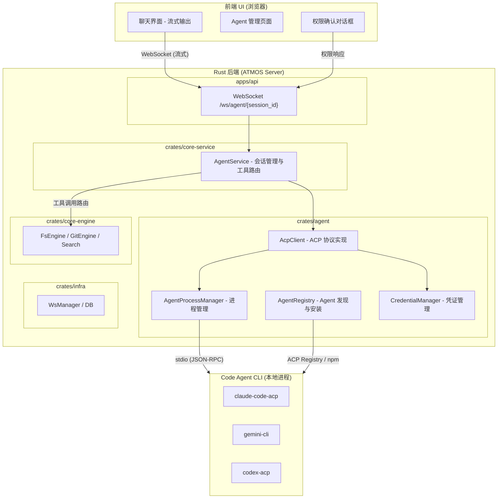
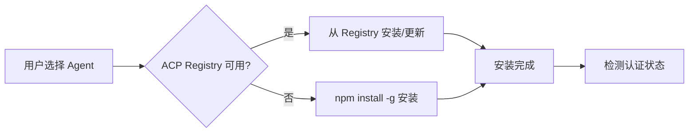
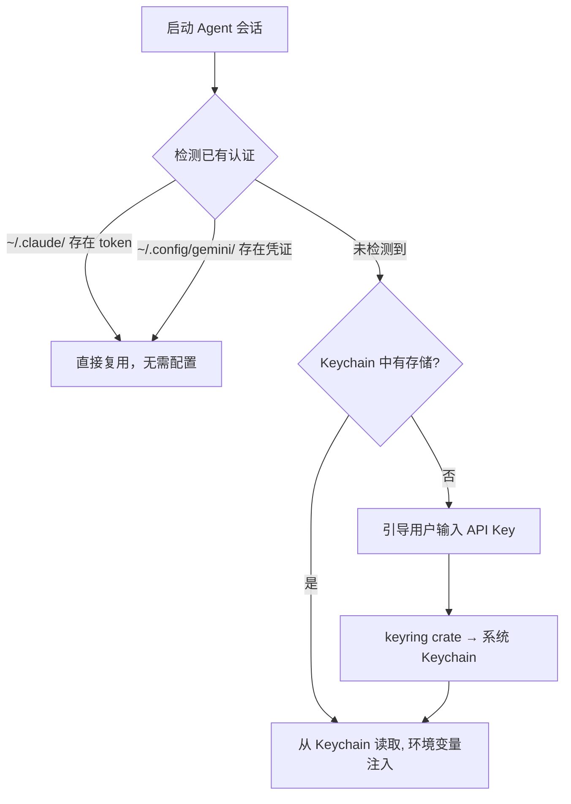

# ATMOS 本地智能 Agent 集成方案

**版本**: 3.0
**日期**: 2026-02-13
**作者**: Manus AI, ATMOS Team

## 1. 项目背景与目标

### 1.1. 需求背景

ATMOS 作为一个面向开发者的本地工作台，其核心工作区域是终端。为了进一步提升开发效率，我们计划引入一个轻量级的本地智能 Agent。用户已经习惯在终端中使用各种 Code Agent（如 Claude Code、Gemini CLI 等），因此新方案应尽可能复用用户已有的配置和习惯，避免重复配置 API Key，降低使用门槛。

### 1.2. 核心目标

1. **轻量级**：避免引入复杂的 Agent 框架，保持 ATMOS 的轻量化特性。
2. **复用配置**：无缝复用用户已有的 Code Agent CLI 及其 API Key 配置。
3. **简单易用**：提供一键安装和配置的良好用户体验。
4. **安全可靠**：妥善管理用户凭证，确保 API Key 不会泄露。Agent 危险操作需经用户确认。
5. **全平台复用**：方案应具备良好的可扩展性，未来能够无缝支持桌面端（Tauri）和独立的 CLI 版本。
6. **可扩展**：`crates/agent` 作为独立 crate，未来可引入 Agent 框架、LLM Provider 等能力。

## 2. 方案演进与对比

在确定最终方案之前，我们探讨了多种可能性，每种方案都有其优缺点。

| 方案 | 核心思想 | 优点 | 缺点 |
| :--- | :--- | :--- | :--- |
| **Node.js (pi-mono)** | 在 Next.js 中集成一个完整的 Agent 框架 | 开发速度快，生态成熟 | 跨平台复用困难，架构复杂 |
| **Rust (Rig 框架)** | 使用 Rust 原生 Agent 框架 | 全平台复用，技术栈统一 | 开发成本高，框架仍在快速迭代 |
| **ACP Client (Rust)** | 作为 ACP 协议的客户端，连接到外部 Agent CLI | **开发成本极低，完美复用，架构简洁** | 依赖外部 CLI 和 Node.js 环境 |

经过综合评估，我们最终选择了 **ACP Client (Rust)** 方案，因为它完美地平衡了开发成本、用户体验和长期可扩展性。

## 3. ACP 工作原理

为了更好地理解最终方案，有必要先了解 Agent Client Protocol (ACP) 的工作原理。ACP 并非简单的消息转发，而是一个标准化的、为 Code Agent 设计的双向通信协议 [1]。

### 3.1. 核心流程

1. **Client 启动 Agent**：ATMOS（作为 Client）启动一个本地的 Agent CLI 进程（如 `claude-code-acp`）。
2. **建立通信**：通过 stdio（标准输入/输出）建立一个双向通信管道（JSON-RPC 2.0）。
3. **Agent 发送工具调用请求**：当 Agent 需要与外部世界交互时（如读取文件），它会向 Client 发送一个标准化的工具调用请求。
4. **Client 权限控制**：对于危险操作（`edit`、`delete`、`execute`），Client 通过 `session/request_permission` 向用户请求授权。
5. **Client 执行工具调用**：用户授权后，ATMOS 在本地安全地执行文件读写、Git 操作或终端命令，并将结果返回给 Agent。
6. **Agent 生成最终响应**：Agent 根据工具调用的结果，生成最终的自然语言或代码响应，通过流式推送返回给前端。

### 3.2. 职责划分

- **Agent CLI**：负责 LLM 推理、Prompt 工程和决策，是"大脑"。
- **ATMOS (Client)**：负责执行具体操作，是"手和脚"，确保所有操作都在用户的控制之下。

这种架构的精妙之处在于，ATMOS 无需关心 Agent 内部的 LLM 调用细节，只需响应其工具调用请求即可，极大地降低了开发和维护成本。

### 3.3. ACP 协议成熟度

| 指标 | 状态 |
| :--- | :--- |
| **Rust SDK 版本** | `agent-client-protocol` v0.9.4 (2026-02-04) |
| **协议规范** | JSON-RPC 2.0, methods + notifications |
| **已集成的编辑器** | Zed (原生)、JetBrains (内置)、Neovim、Emacs |
| **已适配的 Agent** | Claude Code、Gemini CLI、Codex CLI、Copilot CLI、Cline、Goose |
| **ACP Registry** | 2026-01 上线, 统一的 Agent 发现与分发平台 [4] |

### 3.4. ACP 工具调用类型

ACP 定义了以下标准工具调用类型，Agent 通过 `session/update` 通知 Client 工具执行状态：

| 工具类型 | 说明 | ATMOS 现有能力 | 复用难度 |
| :--- | :--- | :--- | :--- |
| `read` | 读取文件内容 | `core-engine::fs` | 低 |
| `edit` | 编辑文件内容 | `core-engine::fs` | 低 |
| `delete` | 删除文件 | `core-engine::fs` | 低 |
| `move` | 移动/重命名文件 | `core-engine::fs` | 低 |
| `search` | 搜索文件内容 | `core-engine::search` | 低 |
| `execute` | 执行 Shell 命令 | `core-service::TerminalService` | 中 |
| `think` | Agent 内部思考 (无需执行) | — | 无 |
| `fetch` | 网络请求 | 需新增 | 中 |

此外，ACP 还支持终端相关方法 [5]：

| 方法 | 说明 |
| :--- | :--- |
| `terminal/create` | 创建终端实例 |
| `terminal/output` | 实时流式输出 |
| `terminal/wait_for_exit` | 等待命令执行完成 |

## 4. 最终技术方案

### 4.1. 架构设计



### 4.2. 代码分层

```
atmos/
├── crates/
│   ├── agent/                    # 🧠 NEW: 独立 Agent crate
│   │   ├── Cargo.toml
│   │   └── src/
│   │       ├── lib.rs
│   │       ├── acp_client/       # ACP 协议客户端实现
│   │       │   ├── mod.rs
│   │       │   ├── client.rs     # AcpClient: 封装 agent-client-protocol SDK
│   │       │   ├── process.rs    # AgentProcessManager: 子进程生命周期
│   │       │   ├── tools.rs      # ACP 工具调用类型定义与路由 trait
│   │       │   └── types.rs      # ACP 消息类型、会话状态
│   │       ├── registry/         # Agent 发现与安装
│   │       │   ├── mod.rs
│   │       │   ├── acp_registry.rs   # ACP Registry 客户端
│   │       │   └── npm_fallback.rs   # npm install -g 兜底方案
│   │       ├── credential/       # 凭证管理
│   │       │   ├── mod.rs
│   │       │   ├── detector.rs   # 检测已有 Agent CLI 认证
│   │       │   └── keyring.rs    # 系统 Keychain 存储
│   │       └── config.rs         # Agent 配置 (支持的 Agent 列表等)
│   │
│   ├── infra/                    # L1: 不变
│   ├── core-engine/              # L2: 不变 (提供 FS/Git/Search 能力)
│   └── core-service/             # L3: 新增 AgentService
│       └── src/service/
│           └── agent.rs          # AgentService: 会话管理、工具调用路由
│
├── apps/
│   ├── api/                      # 新增 /ws/agent/{session_id} endpoint
│   └── web/                      # 新增 Chat UI、Agent 管理页、权限确认组件
```

**分层职责说明**:

| 层级 | 模块 | 职责 | 依赖 |
| :--- | :--- | :--- | :--- |
| **crates/agent** | `acp_client` | ACP 协议通信、Agent 子进程管理 | `agent-client-protocol`, `tokio` |
| | `registry` | Agent 发现、安装、版本管理 | `reqwest` (ACP Registry API) |
| | `credential` | 凭证检测、存储、注入 | `keyring`, `dirs` |
| **crates/core-service** | `AgentService` | 会话生命周期、工具调用路由到 core-engine | `agent`, `core-engine`, `infra` |
| **apps/api** | WS handler | `/ws/agent/{session_id}` 流式 WebSocket | `core-service` |
| **apps/web** | Chat UI | 聊天界面、权限确认、Agent 管理 | WebSocket |

### 4.3. Agent 发现与安装

我们采用 **ACP Registry 优先、npm 兜底** 的分层安装策略：



1. **ACP Registry（首选）**：2026 年 1 月上线的 ACP 统一分发平台 [4]。Zed 和 JetBrains 已内置 Registry 支持。通过 Registry，用户可浏览所有兼容的 Agent，一键安装并自动管理版本。ATMOS 只需对接 Registry API。
2. **npm install -g（兜底）**：当 Registry 不可用或某些 Agent 尚未注册时，回退到直接 npm 安装。
3. **本地检测**：安装前先检测用户系统中是否已安装对应的 Agent CLI（`which claude-code-acp`），避免重复安装。

### 4.4. 凭证管理（分层策略）

传统方案要求用户手动输入 API Key，但很多 Agent CLI 已自带认证机制。我们采用**检测优先、兜底存储**的分层策略，追求"零配置"体验：



**三层凭证策略**:

| 优先级 | 策略 | 说明 | 用户操作 |
| :--- | :--- | :--- | :--- |
| 1 | **检测已有认证** | 扫描 `~/.claude/`, `~/.config/gemini/` 等 CLI 自身的认证文件 | 无 (零配置) |
| 2 | **系统 Keychain** | 使用 `keyring` crate 存储/读取 API Key (macOS Keychain, Windows Credential Manager, Linux Secret Service) | 首次输入一次 |
| 3 | **环境变量注入** | 从 Keychain 读取后，以环境变量形式注入 Agent 子进程 | 无 |

**安全保障**:
- API Key **绝不**以明文形式存储在配置文件中
- 启动 Agent 进程时通过进程级环境变量注入，不污染全局环境
- 前端传输 API Key 时走 WebSocket 加密通道

### 4.5. 权限控制

ACP 协议支持 `session/request_permission` 方法——Agent 在执行危险操作前，必须向 Client 请求用户授权。ATMOS 需要完整实现此机制，确保用户对 Agent 行为拥有最终控制权。

**权限分级**:

| 操作类型 | 风险等级 | 默认策略 |
| :--- | :--- | :--- |
| `read`, `search`, `think` | 低 | 自动允许 |
| `edit`, `move` | 中 | 首次确认，可设为"本次会话自动允许" |
| `delete`, `execute` | 高 | 每次确认 |
| `fetch` (网络请求) | 中 | 首次确认 |

**前端交互**:

当 Agent 请求高风险操作权限时，Chat UI 中内联显示权限确认卡片：

```
┌─────────────────────────────────────────┐
│ 🔐 Agent 请求执行以下操作:               │
│                                         │
│   rm -rf ./dist                         │
│                                         │
│ ☐ 本次会话自动允许此类操作                 │
│                                         │
│         [拒绝]        [允许]             │
└─────────────────────────────────────────┘
```

### 4.6. 流式通信协议

Agent 的响应通常是长文本，需要流式推送到前端。我们为 Agent 会话新增一个**独立的 WebSocket 连接** `/ws/agent/{session_id}`（类似现有的 `/ws/terminal/{session_id}` 模式），专门处理 Agent 会话的双向通信。

**消息协议定义**:

```jsonc
// --- Client → Server (前端 → 后端) ---

// 发送用户提示
{
  "type": "prompt",
  "payload": {
    "message": "帮我重构这个函数",
    "context": {                      // 可选: 附加上下文
      "files": ["src/lib.rs"],
      "selection": "fn foo() { ... }"
    }
  }
}

// 权限响应
{
  "type": "permission_response",
  "payload": {
    "request_id": "perm_001",
    "allowed": true,
    "remember_for_session": true      // 本次会话自动允许
  }
}

// 会话控制
{
  "type": "control",
  "payload": {
    "action": "cancel"                // 取消当前生成 / "stop" 停止会话
  }
}

// --- Server → Client (后端 → 前端) ---

// 流式文本输出
{
  "type": "stream",
  "payload": {
    "delta": "这是一段流式输出的文本...",
    "done": false
  }
}

// 流式结束
{
  "type": "stream",
  "payload": {
    "delta": "",
    "done": true,
    "usage": {                        // 可选: token 使用统计
      "input_tokens": 1200,
      "output_tokens": 450
    }
  }
}

// 工具调用通知 (展示给用户)
{
  "type": "tool_call",
  "payload": {
    "tool": "edit",
    "description": "编辑 src/lib.rs",
    "status": "running",              // "running" | "completed" | "failed"
    "detail": { "file": "src/lib.rs", "lines": "12-15" }
  }
}

// 权限请求
{
  "type": "permission_request",
  "payload": {
    "request_id": "perm_001",
    "tool": "execute",
    "description": "执行命令: rm -rf ./dist",
    "risk_level": "high"
  }
}

// 错误
{
  "type": "error",
  "payload": {
    "code": "AGENT_PROCESS_CRASHED",
    "message": "Agent 进程异常退出",
    "recoverable": true
  }
}
```

### 4.7. 技术栈

| 层级 | 技术栈 | 说明 |
| :--- | :--- | :--- |
| **crates/agent (Rust)** | `agent-client-protocol` v0.9, `keyring`, `tokio`, `reqwest` | ACP SDK、凭证管理、Registry 客户端 |
| **crates/core-service (Rust)** | `agent` crate, `core-engine`, `infra` | Agent 会话管理、工具调用路由 |
| **apps/api (Rust)** | `axum` (ws), `tokio` | Agent WebSocket endpoint |
| **apps/web (React)** | WebSocket, Zustand | Chat UI、Agent 管理、权限确认 |
| **外部依赖** | Node.js, npm, ACP Agent CLI | 可通过 ACP Registry 或 npm 安装 |

### 4.8. 错误处理与恢复

| 错误场景 | 处理策略 |
| :--- | :--- |
| Agent 进程崩溃 | 自动检测退出码，通知前端，提供"重新启动"按钮 |
| WebSocket 断连 | 前端自动重连，恢复会话上下文（Agent 进程仍存活） |
| ACP 通信超时 | 30s 超时后通知用户，可选择等待或取消 |
| API Key 无效/过期 | 捕获 Agent 认证错误，引导用户重新配置凭证 |
| Agent 安装失败 | 显示详细错误信息，提供手动安装指引 |

### 4.9. 未来扩展性

`crates/agent` 作为独立 crate，预留了清晰的扩展路径：

```
crates/agent/
├── src/
│   ├── acp_client/       # ✅ M1: ACP 协议客户端 (当前实现)
│   ├── registry/         # ✅ M1: Agent 发现与安装
│   ├── credential/       # ✅ M1: 凭证管理
│   ├── runtime/          # 🔮 未来: Agent Runtime (自定义 Agent 执行)
│   ├── llm_provider/     # 🔮 未来: LLM Provider 抽象层 (OpenAI/Anthropic/本地模型)
│   └── mcp_server/       # 🔮 未来: 将 ATMOS 暴露为 MCP Server
```

- **Agent Runtime**: 当不仅仅使用 ACP 外部 Agent 时，可引入轻量级 Agent 框架（如 Rig），在 ATMOS 内部直接运行 Agent。
- **LLM Provider**: 统一的 LLM 调用抽象，支持 OpenAI、Anthropic、Ollama 等多种 Provider，为内置 Agent 功能提供 LLM 能力。
- **MCP Server**: 将 ATMOS 的项目管理、Wiki、终端等能力暴露为 MCP Server，让用户在 Cursor/VS Code 等外部工具中也能调用 ATMOS 的能力。

### 4.10. Install Manifest、ACP Registry 缓存与启动命令

- **acp_servers.json**（`~/.atmos/agent/acp_servers.json`）：仅记录已安装的 registry_id、install_method、binary_path。package、launch_args、launch_env 等从 ACP registry 读取，不重复存储。

| 字段 | 说明 |
| :--- | :--- |
| `registry_id` | ACP Registry 中的 Agent ID |
| `install_method` | `npx` 或 `binary` |
| `binary_path` | binary 时：可执行文件绝对路径（npx 时为空） |

- **acp_registry.json**（`~/.atmos/agent/acp_registry.json`）：ACP Registry 的本地缓存，服务启动时从 CDN 拉取并写入，读取时优先使用缓存避免频繁请求。

- **binary 安装路径**：`~/.local/bin`，使用 registry 中的 `cmd` 文件名（如 `kimi`、`opencode`）。

启动时通过 `AgentManager::get_registry_agent_launch_spec(registry_id)`（async）获取 `AgentLaunchSpec`（`program` + `args` + `env`），package/args/env 从 acp_registry 派生，用于 spawn 子进程。

## 5. 开发路线图

| 里程碑 | 核心任务 | 预期产出 | 预估工期 |
| :--- | :--- | :--- | :--- |
| **M1: 核心框架** | `crates/agent` 搭建、ACP Client 实现、Agent 安装/凭证管理、`/ws/agent` endpoint、基础 Chat UI | Agent 进程管理、基础对话功能、权限控制 | 2 周 |
| **M2: Wiki 智能问答** | 集成 Wiki 搜索工具、上下文注入、前端问答 UI | 基于项目 Wiki 的智能问答 | 1 周 |
| **M3: 智能 Commit** | 集成 Git 工具、Commit Message 生成工作流 | 一键生成语义化 Commit Message | 1 周 |
| **M4: 通用 AI 助手** | 可悬浮聊天窗口、多会话管理、上下文感知 | 随处可用的全局 AI 助手 | 2 周 |

## 6. 结论

采用 ACP Client (Rust) 方案，ATMOS 可以用极低的开发成本，快速、安全、可靠地集成一个功能强大且可扩展的本地智能 Agent。该方案的核心优势：

1. **完美复用生态**：直接对接 ACP Registry 和主流 Code Agent，无需自建 LLM 调用链。
2. **零配置体验**：分层凭证策略自动检测已有认证，绝大多数用户无需手动配置。
3. **安全可控**：完整的权限控制机制，用户对 Agent 行为拥有最终决定权。
4. **架构清晰**：独立的 `crates/agent` crate，当前聚焦 ACP，未来可扩展为完整的 Agent 平台。
5. **全平台就绪**：Rust 实现天然支持 Web、桌面 (Tauri)、CLI 的统一体验。

## 7. 参考文献

[1] Agent Client Protocol. (2026). *ACP Official Website*. [https://agentclientprotocol.com/](https://agentclientprotocol.com/)
[2] Zed. (2026). *Claude Code - ACP Agent*. [https://zed.dev/acp/agent/claude-code](https://zed.dev/acp/agent/claude-code)
[3] Claude Help Center. (2026). *Managing API key environment variables in Claude Code*. [https://support.claude.com/en/articles/12304248-managing-api-key-environment-variables-in-claude-code](https://support.claude.com/en/articles/12304248-managing-api-key-environment-variables-in-claude-code)
[4] Zed. (2026). *The ACP Registry is Live*. [https://zed.dev/blog/acp-registry](https://zed.dev/blog/acp-registry)
[5] Agent Client Protocol. (2026). *Terminals*. [https://agentclientprotocol.com/protocol/terminals](https://agentclientprotocol.com/protocol/terminals)
[6] Agent Client Protocol. (2026). *Tool Calls*. [https://agentclientprotocol.com/protocol/tool-calls](https://agentclientprotocol.com/protocol/tool-calls)
[7] Agent Client Protocol. (2026). *Rust SDK*. [https://github.com/agentclientprotocol/rust-sdk](https://github.com/agentclientprotocol/rust-sdk)
